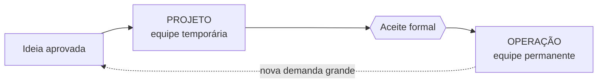

# Aula 01 — Por que gerir um projeto de software

> 🎯 Objetivos: distinguir projeto de operação, reconhecer as causas reais de fracasso de um projeto de software e montar uma matriz de responsabilidades que faça alguém responder por cada decisão.
> 🎬 Slides da aula: [apresentacao-01-por-que-gerir-um-projeto.pdf](apresentacao/apresentacao-01-por-que-gerir-um-projeto.pdf)

## 1. O projeto que ninguém gerenciou

O setor de audiovisual da faculdade empresta câmeras, tripés, microfones e notebooks. Hoje isso é uma planilha, e a planilha não resolve mais: equipamento some, atraso não gera penalidade porque o servidor esquece de aplicar, e duas vezes por semestre alguém reserva um projetor que já estava emprestado.

A Pró-Reitoria aprovou um sistema. Quatro pessoas foram designadas, em tempo parcial. Combinaram assim: *"a gente começa e vai vendo"*.

Cinco meses depois, no início do semestre — quando o sistema precisava estar em uso —, existia uma tela de cadastro bonita, nenhuma tela de devolução, e uma discussão sobre qual banco de dados usar. Ninguém tinha mentido, ninguém tinha faltado. **O projeto simplesmente nunca foi conduzido.**

Gerir um projeto não é preencher documento. É garantir que três perguntas tenham resposta o tempo todo:

- **O que estamos entregando** — e o que decidimos não entregar;
- **Quando**, e o que acontece se a data não for cumprida;
- **Quem decide** quando as duas primeiras entrarem em conflito.

O time do audiovisual não tinha resposta para nenhuma das três. E a terceira é a que mais dói, porque sem ela **a discussão sobre o banco de dados podia durar para sempre** — e durou.

> 💡 **A gestão aparece quando algo dá errado, e é por isso que ela parece desnecessária quando tudo vai bem.** O projeto que termina no prazo e ninguém comenta costuma ser o mais bem gerido, não o mais fácil.

## 2. Projeto × operação

Nem todo trabalho é projeto, e tratar operação como projeto — ou o contrário — produz cobrança injusta dos dois lados.

| | Projeto | Operação |
|---|---|---|
| **Duração** | temporário: tem início e fim | contínua |
| **Resultado** | único: nunca foi feito exatamente assim | repetitivo |
| **Equipe** | reunida para aquilo, e depois desfeita | permanente |
| **Termina quando** | o resultado é aceito | não termina |

Construir o sistema de empréstimo é **projeto**. Manter o sistema no ar, atender chamado e aplicar correção pelos próximos cinco anos é **operação** — e vai custar mais que o projeto inteiro.

A pergunta que separa os dois em cinco segundos: **existe um dia em que isso acaba e alguém assina o aceite?**

O aceite é a fronteira, e ela tem nome e data:



O laço tracejado é o que confunde: uma demanda grande que chega durante a operação **abre um projeto novo**, com escopo, prazo e aceite próprios. Ela não é "continuação" do projeto anterior, e tratá-la assim é como o projeto de dois anos que nunca acaba.

> ⚠️ **O erro clássico é o projeto que virou operação sem ninguém notar.** A equipe continua reunida, o "projeto" segue no relatório, e há dois anos ninguém entrega nada novo — porque o trabalho virou manutenção. Cobrar encerramento de uma operação é cobrar algo que não vai acontecer nunca.

## 3. Por que projetos de software falham

Falha quase nunca é uma catástrofe única. É acúmulo. Os quatro padrões abaixo respondem pela maioria dos casos, e nenhum deles é técnico:

**Escopo que cresce sem replanejar.** Cada pedido novo é pequeno e razoável. Nenhum deles, sozinho, justifica mexer no prazo — e é exatamente por isso que o prazo estoura. O problema não é aceitar mudança: é aceitar sem recalcular.

**Prazo definido antes do escopo.** *"Precisa estar pronto no início do semestre"* é uma restrição legítima. Vira problema quando ninguém pergunta **o que cabe** nesse tempo, e a resposta implícita passa a ser "tudo".

**Interessado que aparece no fim.** O supervisor de estágio, o auditor, o setor jurídico. Ele não foi ouvido porque não era óbvio que precisava ser — e o que ele diz na véspera da entrega às vezes invalida meses de trabalho.

**Decisão que ninguém toma.** Duas alternativas defensáveis, nenhuma autoridade definida, e a equipe alternando entre as duas por semanas. É a mais barata de evitar e a mais comum de encontrar.

As quatro têm custo crescente conforme demoram a aparecer:

| Causa | Quando costuma aparecer | Custo de corrigir naquele momento |
|---|---|---|
| Decisão que ninguém toma | primeira semana | uma tarde, se alguém perguntar "quem decide?" |
| Prazo antes do escopo | primeiro mês | recortar escopo, com desgaste |
| Escopo que cresce | do segundo mês em diante | replanejar prazo, ou entregar menos |
| Interessado que aparece no fim | homologação | refazer o que ele vetou |

> 💡 **Repare que nenhuma das quatro é "a equipe não sabia programar".** Competência técnica é necessária e não é suficiente — e é por isso que existe uma disciplina de gestão em volta do código.

As quatro têm um sintoma em comum, e é ele que se aprende a enxergar: **a informação existia e não chegou a quem decidia.** O pedido novo foi combinado no corredor; o auditor estava no organograma e não na lista de quem ouvir; as duas alternativas foram discutidas entre quem não podia escolher.

> ⚠️ **A mais barata de evitar é a quarta.** Escopo e prazo exigem negociação com terceiros; "quem decide" é uma pergunta que a equipe responde sozinha, numa tarde, antes de o problema aparecer. A seção 6 é sobre isso.

## 4. Os conflitos que todo projeto tem

Conflito num projeto não é sinal de time ruim. É sinal de que existem interesses legítimos e incompatíveis, o que acontece em todo projeto com mais de um interessado.

Na **Ouvidoria municipal** — o cidadão registra reclamações, cada uma com prazo legal de resposta — os conflitos são visíveis:

- A **operação** quer prazo folgado, porque responde pela fila; a **lei** fixa o prazo e não negocia;
- A **transparência** é obrigatória; o **secretário** cujo órgão sempre atrasa preferiria que os números não fossem publicados;
- O **jurídico** quer registro de tudo; a **ouvidoria** precisa aceitar denúncia anônima.

O erro de gestão aqui é atravessar isso como se fosse temperamento: *"o pessoal da secretaria é difícil"*. Não é. São metas diferentes, e **metas diferentes não se resolvem com conversa — resolvem-se com decisão**.

A distinção que muda o encaminhamento:

| | Conflito de objetivo | Conflito de pessoa |
|---|---|---|
| **Origem** | metas legítimas e incompatíveis | relação, estilo, histórico |
| **Sinal** | as duas partes têm razão dentro do próprio papel | uma das partes não sustenta o argumento fora da emoção |
| **Resolve com** | decisão de quem tem autoridade, registrada | conversa, mediação |

> ⚠️ **Tratar conflito de objetivo como conflito de pessoa produz reunião infinita.** Ninguém cede, porque ceder significa falhar na própria função. O que destrava é alguém com autoridade decidir — e o que a decisão custa ficar escrito.

## 5. A equipe e seus papéis

Uma equipe de projeto de software costuma ter, em algum grau, estes papéis. **Papel não é pessoa:** num projeto de quatro pessoas, uma acumula três papéis, e isso é normal — o que não pode é o papel não existir.

| Papel | Responde por | Pergunta que ele responde |
|---|---|---|
| **Patrocinador** | o projeto existir e ter recurso | *"vale a pena fazer isto?"* |
| **Gerente de projeto** | prazo, custo, risco e comunicação | *"como está, e o que trava?"* |
| **Analista** | entender o problema e escrever o que se espera | *"o que exatamente é para fazer?"* |
| **Time de desenvolvimento** | construir e testar | *"como isto vai funcionar?"* |
| **Usuário-chave** | dizer se a solução serve | *"isto resolve meu dia?"* |

No projeto do audiovisual, três desses papéis existiam. Faltava o **usuário-chave** — ninguém do balcão foi ouvido —, e é por isso que existia tela de cadastro e não existia tela de devolução: a devolução é o trabalho de quem atende, e quem atende nunca foi perguntado.

> 🧩 **Ponte com POO:** o mesmo raciocínio de responsabilidade única que você vê em classes vale aqui. Papel que responde por tudo não responde por nada, e a primeira pergunta é sempre *"do que exatamente este papel presta contas?"*.

## 6. Matriz de responsabilidades (RACI)

Quando os papéis existem mas a decisão continua travando, o instrumento é a **matriz de responsabilidades**. Ela cruza **decisões** com **pessoas**, e para cada cruzamento diz o tipo de envolvimento:

- **R** — *Responsável*: quem faz o trabalho. Pode ser mais de um;
- **A** — *Aprovador*: quem responde pela decisão e assina. **Exatamente um**;
- **C** — *Consultado*: quem opina antes, em mão dupla;
- **I** — *Informado*: quem fica sabendo depois, em mão única.

Para o sistema de empréstimo de equipamentos:

| Decisão | Pró-Reitoria | Coord. do audiovisual | Gerente do projeto | Atendente do balcão |
|---|:---:|:---:|:---:|:---:|
| Aprovar o orçamento | **A** | C | R | I |
| Definir o que entra na 1ª entrega | I | **A** | R | C |
| Escolher a tecnologia | I | I | **A** | — |
| Aceitar o sistema no fim | C | **A** | R | C |

A matriz não é enfeite: ela responde, **antes de o conflito acontecer**, quem decide o que. A linha "definir o que entra na 1ª entrega" é a que salvaria o projeto do audiovisual — com ela, a discussão sobre o banco de dados teria durado uma tarde, porque a decisão tinha dono.

> ⚠️ **Um A por linha, sempre.** Colocar dois aprovadores parece diplomacia e é o defeito mais comum: quando os dois discordam, a decisão trava, e na prática **não é ninguém** que responde. Vários podem ser consultados; um responde.

> 💡 **Traço na célula é informação.** O atendente não participa da escolha de tecnologia, e dizer isso explicitamente evita a reunião de dez pessoas em que oito não têm o que fazer.

Repare em duas linhas que costumam surpreender quem monta a primeira matriz:

**Quem paga não decide tudo.** A Pró-Reitoria é **A** do orçamento e apenas **I** do escopo da primeira entrega. Faz sentido: ela sabe quanto pode gastar e não sabe o que o balcão precisa em março. Uma matriz em que o patrocinador é **A** de todas as linhas não organizou nada — apenas escreveu "quem manda é quem paga", que já se sabia.

**Quem executa raramente aprova.** O gerente do projeto é **R** em quase tudo e **A** só na escolha de tecnologia — a decisão que é dele por competência. Confundir "faz o trabalho" com "responde pela decisão" é o que produz o gerente que decide escopo sozinho e depois é cobrado por um resultado que o cliente não queria.

Uma matriz é lida **por linha**, nunca por pessoa. A pergunta que ela responde é sempre *"quando esta decisão aparecer, quem assina?"* — e ela precisa estar preenchida **antes** de a decisão aparecer, porque no dia da discussão já é tarde para combinar quem decide.

> ⚠️ **Matriz que ninguém revisita é papel.** Ela muda quando o projeto muda: um interessado novo entra, um papel se acumula, uma decisão que parecia técnica vira política. Reveja a cada marco — e se em três meses ela continuar idêntica, provavelmente ninguém a está usando.

> 📖 O Sommerville abre o livro discutindo por que a engenharia de software existe e o que diferencia projeto de programa. A parte de gerenciamento de projeto trata de equipe, papéis e das causas recorrentes de fracasso.

## 🏋️ Exercícios da aula

Na pasta `aula-01/` do seu repositório:

1. **`ex01.md`** — classifique cada item em **projeto** ou **operação**, aplicando o teste do aceite: (a) construir o portal de matrícula; (b) atender chamados do portal de matrícula; (c) migrar o e-mail institucional para outro provedor; (d) manter o backup diário; (e) implantar a Ouvidoria em três secretarias novas; (f) responder às manifestações que chegam pela Ouvidoria. *Confere assim: três de cada, e o critério que decide é sempre a existência de um fim com aceite — não o tamanho nem a dificuldade.*

2. **`ex02.md`** — leia os quatro relatos de fracasso abaixo e classifique cada um numa das causas da seção 3, justificando em uma frase: (a) *"aceitamos 14 pedidos pequenos e entregamos com 3 meses de atraso"*; (b) *"o auditor só foi ouvido na homologação e vetou o formato do relatório"*; (c) *"passamos cinco semanas alternando entre duas soluções"*; (d) *"a diretoria anunciou a data numa reunião e depois perguntamos o que cabia"*. *Confere assim: cada relato mapeia numa causa diferente, e a (c) é a única que não tem nada a ver com escopo nem com prazo.*

3. **`ex03.md`** — no projeto da **Ouvidoria municipal** ([catálogo](../../recursos/projetos-para-praticar.md#8-ouvidoria-municipal)), identifique **três conflitos**, e para cada um: diga se é de objetivo ou de pessoa, escreva as duas metas em jogo e indique quem deveria decidir. *Confere assim: os três são de objetivo — se você classificou algum como conflito de pessoa, releia procurando a meta legítima do lado que pareceu difícil.*

4. **`ex04.md`** — monte a matriz RACI do projeto de **empréstimo de equipamentos** para estas cinco decisões: aprovar orçamento, definir o escopo da primeira entrega, escolher a tecnologia, definir a política de penalidade por atraso, aceitar o sistema. Use os quatro envolvidos da seção 6 e justifique em uma frase **cada A** que você atribuiu. *Confere assim: exatamente um A por linha, e ao menos uma linha em que o A não é a Pró-Reitoria — quem paga não decide tudo.*

5. **`ex05.md`** — 🌶️ **Desafio.** No projeto do audiovisual, a data do início do semestre é imóvel e o escopo pedido não cabe nela. Você é o gerente. **Escreva a decisão**: o que entra na primeira entrega, o que fica para depois, e por quê. Sua resposta precisa conter, explicitamente: (i) o critério que você usou para cortar; (ii) quem é o **A** dessa decisão e por quê; (iii) **o que se perde** com o corte, e como você comunica isso a quem vai sentir a falta. *Confere assim: se o item (iii) estiver vazio ou disser "nada relevante", você não cortou nada de verdade — reveja.*

## 🧠 Revisão

[8 questões de múltipla escolha](revisao/README.md) para conferir se os conceitos ficaram sólidos. Responda sem consultar a aula — depois volte e corrija.

## ✅ Entrega

```bash
git add aula-01/
git commit -m "Resolve exercícios da aula 01 (por que gerir um projeto)"
git push
```

---

🏠 [Início](../../README.md) | ➡️ [Aula 02 — Ciclos de vida](../aula-02-ciclos-de-vida/README.md)
