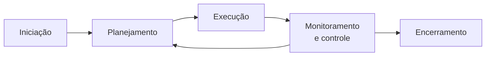
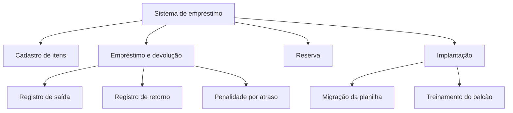

# Aula 03 — Os processos de um projeto

> 🎯 Objetivos: situar as atividades de um projeto nos cinco grupos de processo, escrever um termo de abertura e uma EAP, e reconhecer o desvio comparando o andamento com a linha de base.
> 🎬 Slides da aula: [apresentacao-03-os-processos-de-um-projeto.pdf](apresentacao/apresentacao-03-os-processos-de-um-projeto.pdf)

## 1. Os cinco grupos de processo

A Aula 02 decidiu **em que ordem** o trabalho acontece. Esta aula trata do que acontece em volta dele — e que existe em qualquer ciclo, preditivo ou adaptativo.

São cinco grupos de processo. Eles **não são fases**: acontecem em paralelo e se repetem a cada ciclo do projeto.



| Grupo | Pergunta que ele responde |
|---|---|
| **Iniciação** | este projeto deve existir, e quem está envolvido? |
| **Planejamento** | o que vamos fazer, quando, e com o quê? |
| **Execução** | fazer o trabalho combinado |
| **Monitoramento e controle** | onde estamos em relação ao que foi combinado? |
| **Encerramento** | o resultado foi aceito, e o que aprendemos? |

O laço de volta entre controle e planejamento é o que mais importa: **replanejar não é fracasso do plano, é o uso previsto dele**. Um projeto adaptativo passa por esse laço a cada duas semanas; um preditivo, a cada marco.

E os cinco grupos existem nos dois regimes, com pesos diferentes. Num projeto preditivo, o planejamento é grande e acontece cedo; num adaptativo, ele é pequeno e acontece muitas vezes. **O que nenhum dos dois dispensa é a iniciação e o encerramento** — saber por que o projeto existe e declarar que ele acabou não são práticas de um método, são condições para haver projeto.

> ⚠️ **Confundir grupo de processo com fase do ciclo de vida é o erro mais comum aqui.** "Iniciação" não é o primeiro mês do projeto: toda vez que uma fase nova começa, há iniciação de novo — inclusive o registro de quem passa a ser interessado.

## 2. Iniciação: o termo de abertura

A iniciação produz um documento curto que **autoriza o projeto a existir** e nomeia quem responde por ele. Ele é curto de propósito — uma página basta, e a versão longa não é lida.

Para o sistema de empréstimo de equipamentos:

| | |
|---|---|
| **Projeto** | Sistema de empréstimo de equipamentos do audiovisual |
| **Problema** | controle em planilha; equipamento sem rastreio, penalidade não aplicada, reserva em conflito |
| **Resultado esperado** | empréstimo, devolução e reserva registrados, com penalidade automática |
| **Fora do escopo** | compra de equipamento, integração com o patrimônio da instituição |
| **Prazo** | em uso no início do período letivo — data de calendário |
| **Patrocinador** | Pró-Reitoria de Administração |
| **Gerente do projeto** | designado, com autoridade sobre escopo e cronograma |
| **Premissas** | verba do exercício aprovada; equipe de 4 pessoas em tempo parcial |
| **Restrições** | verba expira no fim do exercício; nenhuma compra de servidor |

Duas linhas costumam ser puladas e são as que mais salvam projeto:

**Fora do escopo.** Escrever o que **não** será feito é mais útil que escrever o que será — porque é ali que nasce o pedido de outubro. *"Ah, mas eu achei que a integração com o patrimônio estava incluída"* é uma conversa que não acontece se estiver escrito.

**Premissas.** Uma premissa é algo que você **assume verdadeiro sem ter certeza**. Se cair, o plano cai junto. A premissa "equipe de 4 pessoas em tempo parcial" é exatamente o tipo de coisa que muda em agosto sem ninguém avisar o projeto.

> 💡 **Iniciação também é quando os interessados são identificados** — inclusive os que ninguém convidaria. Na Aula 01, o projeto do audiovisual esqueceu o atendente do balcão; a iniciação é o momento barato de não esquecer.

O termo de abertura é assinado pelo **patrocinador**, e é essa assinatura que dá ao gerente autoridade sobre escopo e cronograma. Sem ela, o gerente negocia cada decisão do zero, com quem aparecer — que é a quarta causa de fracasso da Aula 01 com outra roupa.

## 3. Planejamento: escopo, EAP e cronograma

Planejar é responder *o que*, *quando* e *com o quê*. A ferramenta que sustenta as três é a **EAP** — estrutura analítica do projeto —, que decompõe o resultado em partes cada vez menores:



Três regras que fazem a EAP servir para alguma coisa:

- **Decompõe-se entregável, não atividade.** "Registro de saída" é um resultado; "reunir com o cliente" não é;
- **A soma das partes é o todo.** Se algo não está na EAP, não está no projeto — e é por isso que o treinamento do balcão precisa aparecer, ou ninguém aloca tempo para ele;
- **Para de decompor quando o pedaço é estimável e atribuível.** Se você consegue dizer quanto tempo leva e quem faz, parou no nível certo.

A terceira regra é a que evita os dois extremos. Uma EAP com quatro caixas não ajuda a estimar nada; uma com duzentas vira lista de tarefas e ninguém a mantém. **Duas ou três camadas costumam bastar** num projeto do tamanho dos deste curso.

O cronograma vem depois, e vem **da EAP**: cada folha vira uma tarefa com duração e responsável.

| Folha da EAP | Duração | Depende de | Responsável |
|---|:---:|---|---|
| Cadastro de itens | 3 sem | — | dupla A |
| Registro de saída | 2 sem | cadastro | dupla A |
| Registro de retorno | 2 sem | registro de saída | dupla B |
| Penalidade por atraso | 1 sem | registro de retorno | dupla B |
| Migração da planilha | 1 sem | cadastro | dupla A |
| Treinamento do balcão | 1 sem | tudo acima | gerente |

A coluna **depende de** é a que transforma uma lista em cronograma: ela mostra que a penalidade não pode começar antes da devolução, o que já tinha aparecido no recorte incremental da Aula 02 — e agora com data.

Fazer o caminho inverso — cronograma primeiro, escopo depois — produz o prazo que não cabe, que é a segunda causa de fracasso da Aula 01.

> ⚠️ **EAP não é organograma nem lista de fases.** Se os nós de segundo nível forem "levantamento, desenho, construção, testes", você desenhou o ciclo de vida, não o produto — e perdeu a única pergunta que a EAP responde bem: *o que exatamente vamos entregar?*

## 4. Execução e controle: a linha de base

Quando o planejamento é aprovado, ele vira **linha de base** — a fotografia do que foi combinado em escopo, prazo e custo. A partir daí, controlar é comparar o real com essa fotografia.

Sem linha de base não existe desvio, só opinião. Com ela:

| Entrega | Linha de base | Real | Desvio |
|---|---|---|---|
| Cadastro de itens | 15/03 | 14/03 | −1 dia |
| Empréstimo e devolução | 30/04 | 12/05 | **+12 dias** |
| Reserva | 31/05 | — | em andamento |
| Implantação | 30/06 | — | previsto 12/07 |

O atraso de 12 dias em uma entrega não é o problema — o problema é o que ele **projeta**: se a causa persistir, a implantação cai para 12/07, e a data é imóvel. Controlar é enxergar isso em maio, não em julho.

É por isso que a coluna "real" da terceira linha está vazia e a quarta tem uma previsão. **Controle não é registro do passado**: metade da tabela olha para trás e a outra metade para a frente, e é a segunda metade que permite decidir enquanto ainda há o que decidir.

E o desvio dispara uma decisão, não um relatório. São três, e só três:

| Decisão | O que custa | Quando faz sentido |
|---|---|---|
| **Recuperar o prazo** | horas extras, mais gente, qualidade | a causa do atraso já passou e não vai se repetir |
| **Cortar escopo** | funcionalidade que alguém esperava | há escopo cortável sem inviabilizar o uso |
| **Mover a data** | credibilidade, e às vezes contrato | a data não é imóvel, e as outras duas custam mais |

**As três são legítimas; nenhuma é "seguir tentando"** — que é o que acontece quando o desvio é registrado e ninguém decide. No projeto do audiovisual, a data é de calendário: mover não é opção, e a escolha real fica entre as duas primeiras.

Repare que a decisão exige saber **por que** houve desvio. Doze dias porque uma pessoa ficou doente é diferente de doze dias porque a estimativa era otimista — no primeiro caso recuperar é plausível, no segundo o mesmo erro vai se repetir nas entregas seguintes.

> 💡 **Mudança aprovada muda a linha de base.** Se o cliente acrescenta escopo e a linha de base continua a mesma, o projeto passa a estar "atrasado" por decisão dele, e a equipe carrega a culpa. Replanejar é o que impede isso.

## 5. Encerramento: aceite, arquivo e lições aprendidas

Encerrar tem três partes, e as três costumam ser puladas:

- **Aceite formal.** Alguém com autoridade — o **A** da linha "aceitar o sistema", na matriz da Aula 01 — declara que o resultado atende ao combinado. Sem isso, o projeto não termina: apenas para;
- **Arquivo.** O que se produziu fica onde a próxima pessoa encontra: decisões, versões, o que ficou fora do escopo e por quê;
- **Lições aprendidas.** O que funcionou, o que não funcionou, e o que se faria diferente. É o único dos três que serve a **outro** projeto, e por isso o mais fácil de justificar cortar — e o mais caro de não ter.

O encerramento é a primeira coisa a ser cortada quando o prazo aperta, e é justamente por isso que **a organização repete os mesmos erros a cada projeto**. O custo de não encerrar não aparece neste projeto: aparece no próximo, e por isso ninguém o atribui à decisão que o causou.

Há ainda um encerramento que ninguém quer fazer e é o mais importante: o do **projeto cancelado**. Um projeto interrompido no meio precisa de aceite do que foi feito até ali, arquivo do que se produziu e registro do motivo — senão, dois anos depois, alguém propõe exatamente a mesma coisa sem saber que já se tentou.

> ⚠️ **Lição aprendida não é lista de culpados.** O registro útil descreve a **situação** e a **decisão** — *"a integração com o legado foi deixada para o último mês, e o único conhecedor do sistema saiu de férias"* —, não quem errou. Um registro que acusa pessoas garante que o próximo projeto não escreva nenhum.

> 📖 O Guia PMBOK organiza-se justamente nesses cinco grupos de processo, e detalha o termo de abertura na área de integração, a EAP na área de escopo e a linha de base nas áreas de escopo, cronograma e custos. O Sommerville trata de planejamento e acompanhamento no capítulo sobre gerenciamento de projeto.

## 🏋️ Exercícios da aula

Na pasta `aula-03/` do seu repositório:

1. **`ex01.md`** — encaixe cada atividade no grupo de processo correspondente: (a) identificar quem serão os interessados; (b) comparar o gasto com o orçado; (c) decompor o escopo em EAP; (d) obter a assinatura de aceite; (e) treinar os atendentes; (f) registrar o que se faria diferente; (g) aprovar formalmente uma mudança de escopo; (h) redigir o termo de abertura. *Confere assim: os cinco grupos aparecem, e monitoramento e controle recebe duas — a comparação e a aprovação da mudança.*

2. **`ex02.md`** — escreva o **termo de abertura** do projeto de [rede de doação de alimentos](../../recursos/projetos-para-praticar.md#6-rede-de-doação-de-alimentos), com todas as linhas do modelo da seção 2. As linhas "fora do escopo" e "premissas" precisam ter **ao menos duas entradas cada**. *Confere assim: se alguma premissa sua não puder cair — se for um fato conhecido —, ela não é premissa; troque.*

3. **`ex03.md`** — monte a **EAP** do projeto de [empréstimo de equipamentos](../../recursos/projetos-para-praticar.md#2-empréstimo-de-equipamentos) em Mermaid, com dois níveis abaixo do produto, incluindo ao menos um entregável que não seja software. *Confere assim: nenhum nó do segundo nível pode ser o nome de uma fase do ciclo de vida — se aparecer "testes", você desenhou o processo, não o produto.*

4. **`ex04.md`** — a partir da tabela de linha de base da seção 4, um projeto tem +12 dias de desvio na segunda entrega e data final imóvel. Escreva as **três decisões possíveis**, e para cada uma: o que ela custa, quem é o **A** dela, e a quem ela precisa ser comunicada. *Confere assim: "seguir tentando" não é uma das três — se ela apareceu, releia a seção.*

5. **`ex05.md`** — 🌶️ **Desafio.** O projeto da [Ouvidoria municipal](../../recursos/projetos-para-praticar.md#8-ouvidoria-municipal) terminou: o sistema está no ar há um mês, e a fornecedora quer emitir a última medição. O secretário cujo órgão sempre atrasa se recusa a assinar o aceite, alegando que o sistema "expõe indevidamente" os prazos do setor dele. **Escreva o encerramento do projeto** contendo: (i) o que você faz diante da recusa, e com que fundamento; (ii) o registro de lições aprendidas com três entradas, nenhuma delas nomeando pessoas; (iii) **o que se perde** se o projeto for encerrado sem esse aceite. *Confere assim: o item (i) precisa distinguir "o sistema não atende ao contratado" de "o sistema atende e eu não gostei do resultado" — são coisas diferentes, e só uma delas justifica recusar o aceite.*

### 📤 Entrega

Estes exercícios são feitos em sala e vão para o **seu repositório** `exercicios-projeto-software`:

```bash
cd ..                 # da pasta da aula para a raiz do repositório
git add aula-03/
git commit -m "Resolve exercícios da aula 03"
git push
```

Confira no navegador que a pasta apareceu em `github.com/SEU-USUARIO/exercicios-projeto-software`.

## 🧠 Revisão

[8 questões de múltipla escolha](revisao/README.md) para conferir se os conceitos ficaram sólidos. Responda sem consultar a aula — depois volte e corrija.

**A entrega é pelo formulário:** [responder a revisão da Aula 03](https://docs.google.com/forms/d/e/1FAIpQLSc-jP2H14Kjim9CG1IwNhOZ7gxwdZXoR0VhIQ578cigxSxhwQ/viewform)

Entre com uma conta Google, selecione seu nome na lista e informe seu usuário do GitHub — só o usuário, não o endereço do perfil. Se o seu nome ainda não estiver na lista, marque a última opção e escreva o nome completo no campo seguinte. É **uma resposta por aluno** e não dá para editar depois de enviar, então confira antes. A nota é liberada no AVA depois da revisão em sala e da divulgação do gabarito.

---

⬅️ [Aula 02 — Ciclos de vida](../aula-02-ciclos-de-vida/README.md) | ➡️ [Aula 04 — Arquitetura como decisão de projeto](../aula-04-arquitetura-como-decisao/README.md)
