<!-- _class: capa -->

⚙️

# Os Processos de um Projeto

## Aula 03 · Bloco 1 — Fundamentos de Projetos

Replanejar não é fracasso do plano. É o uso previsto dele.

---

## 🎯 Nesta aula

A Aula 02 decidiu *em que ordem* o trabalho acontece. Esta trata do que acontece **em volta** dele — e que existe em qualquer ciclo, preditivo ou adaptativo.

1. Os **cinco grupos** de processo — e por que não são fases
2. **Iniciação** — o termo de abertura, o fora do escopo e as premissas
3. **Planejamento** — a EAP e o cronograma que nasce dela
4. **Execução e controle** — a linha de base e as três decisões
5. **Encerramento** — aceite, arquivo, lições aprendidas

---

## Os cinco grupos de processo

Eles **acontecem em paralelo**: enquanto a equipe **executa** a entrega desta semana, alguém **controla** o prazo da anterior e **replaneja** a próxima.

O laço vermelho — **controle de volta para planejamento** — é o que faz disto um sistema, e não uma fila.

---

## ⚠️ Grupo de processo não é fase

Este é **o erro mais comum** desta aula.

"Iniciação" **não é o primeiro mês** do projeto. Toda vez que uma **fase nova** começa, há iniciação de novo — inclusive o registro de quem passa a ser interessado a partir dali.

> ⚠️ Fase é um **pedaço do tempo** do projeto. Grupo de processo é um **tipo de trabalho**. Dentro de uma única fase acontecem os cinco.

---

<!-- _class: lead -->

## O laço de volta é o que importa

Replanejar não é fracasso do plano:
é **o uso previsto dele**.

Um plano que nunca é revisto
não é um plano bom —
é um plano que ninguém está usando.

---

<!-- _class: tabela-densa -->

## Os cinco grupos nos dois regimes

| Grupo | Num projeto preditivo | Num projeto adaptativo |
|---|---|---|
| **Iniciação** | uma vez, no começo | uma vez, e revisita a cada fase |
| **Planejamento** | **grande e cedo** | **pequeno e muitas vezes** |
| **Execução** | blocos longos | blocos curtos, com entrega ao fim |
| **Controle** | por marco | contínuo, à vista de todos |
| **Encerramento** | uma vez, no fim | por incremento **e** no fim |

Os cinco existem nos dois: **muda o peso, não a existência**. E **iniciação e encerramento** não são práticas de um método — são condições para haver projeto.

---

## O termo de abertura

A iniciação produz **um documento curto** que:

- **autoriza o projeto a existir** — antes dele, não há projeto, há intenção;
- **nomeia quem responde** por ele — o patrocinador e o gerente;
- **registra o que se sabe** no dia zero: prazo, premissas, restrições.

> 💡 **Uma página basta**, e isso é decisão de projeto, não preguiça: a versão de vinte páginas é assinada sem leitura — e documento assinado sem leitura não autoriza nada de verdade.

---

<!-- _class: tabela-densa -->

## O termo de abertura — o que o projeto é

| | |
|---|---|
| **Projeto** | Sistema de empréstimo de equipamentos do audiovisual |
| **Problema** | controle em planilha; equipamento sem rastreio, penalidade não aplicada, reserva em conflito |
| **Resultado esperado** | empréstimo, devolução e reserva registrados, com penalidade automática |
| **Fora do escopo** | compra de equipamento, integração com o patrimônio |

Estas quatro linhas respondem **por que o projeto existe** — e param aí.

---

<!-- _class: tabela-densa -->

## O termo de abertura — quem responde e o que limita

| | |
|---|---|
| **Prazo** | em uso no início do período letivo — data de calendário |
| **Patrocinador** | Pró-Reitoria de Administração |
| **Gerente do projeto** | designado, com autoridade sobre escopo e cronograma |
| **Premissas** | verba do exercício aprovada; equipe de 4 pessoas em tempo parcial |
| **Restrições** | verba expira no fim do exercício; nenhuma compra de servidor |

Nenhuma dessas linhas diz **como** o sistema será feito. Isso é planejamento, e vem depois.

---

## As duas linhas que salvam projeto

**Fora do escopo.** Escrever o que **não** será feito é mais útil que escrever o que será — é ali que nasce o pedido de outubro. Escrito, ele vira **pedido de mudança**, com custo e prazo; não escrito, vira cobrança.

**Premissas.** Algo que se assume verdadeiro **sem ter certeza**, e sobre o qual o plano se apoia: se cai, o plano cai junto. *"Equipe de 4 em tempo parcial"* muda em agosto sem avisar o projeto.

> 💡 O teste: **se a frase não pode ser falsa, não é premissa** — é fato conhecido, e não precisa estar ali.

---

## Por que a assinatura importa

O termo de abertura é assinado pelo **patrocinador** — e é essa assinatura que dá ao gerente **autoridade sobre escopo e cronograma**.

Sem ela, o gerente **negocia cada decisão do zero**, com quem aparecer: com o chefe que passou na mesa, com o usuário que ligou, com o fornecedor que insistiu.

> ⚠️ Isso é a **quarta causa de fracasso da Aula 01** com outra roupa: ninguém com autoridade para decidir.

---

## A EAP — a fronteira do projeto, desenhada

Planejar é responder **o quê**, **quando** e **com o quê** — e as três descem da mesma ferramenta.

A **EAP** (*estrutura analítica do projeto*, em inglês **WBS**) decompõe o **resultado** do projeto em partes cada vez menores, até que cada pedaço possa ser **estimado e atribuído** a alguém.

> 💡 O que está na EAP está no projeto. O que não está, não está — nem no cronograma, nem no orçamento, nem na cabeça de ninguém.

---

<!-- _class: diagrama -->

## A EAP do sistema de empréstimo

---

## As três regras da EAP

**1. Decompõe-se entregável, não atividade.** Cada nó é um resultado: *"registro de saída"*, e não *"programar o back-end"*. O teste: dá para dizer "está pronto" olhando para aquilo?

**2. A soma das partes é o todo.** Os filhos, juntos, dão exatamente o pai. É por isso que o **treinamento do balcão** precisa aparecer — senão ninguém aloca tempo nem pessoa para ele.

**3. Pare quando for estimável e atribuível.** Se você diz quanto tempo leva e quem faz, parou no nível certo. Quatro caixas não estimam nada; duzentas ninguém mantém — **duas ou três camadas bastam**.

---

## ⚠️ A EAP que virou ciclo de vida

Se o segundo nível for *levantamento, desenho, construção, testes*, você desenhou **o processo**, não o produto. O sintoma é fácil: *"testes"* aparece na EAP de qualquer projeto — *"penalidade por atraso"* só aparece **neste**.

---

<!-- _class: tabela-densa -->

## Da folha da EAP ao cronograma

| Folha da EAP | Duração | Depende de | Responsável |
|---|:---:|---|---|
| Cadastro de itens | 3 sem | — | dupla A |
| Registro de saída | 2 sem | cadastro | dupla A |
| Registro de retorno | 2 sem | registro de saída | dupla B |
| Penalidade por atraso | 1 sem | registro de retorno | dupla B |
| Migração da planilha | 1 sem | cadastro | dupla A |
| Treinamento do balcão | 1 sem | tudo acima | gerente |

A coluna **depende de** transforma uma **lista** em **cronograma** — e o caminho inverso, prazo antes do escopo, produz **o prazo que não cabe**.

---

## A coluna "depende de", desenhada

**O caminho mais longo manda:** cadastro → saída → retorno → penalidade → treinamento soma **9 semanas**, e atrasar qualquer tarefa *dele* atrasa o projeto inteiro.

---

## Executar, controlar, e a linha de base

**Executar** é fazer o trabalho combinado. **Controlar** é comparar o que está acontecendo com **o que foi combinado** — não é o mesmo trabalho, nem o mesmo momento.

Quando o planejamento é aprovado, ele vira **linha de base**: a **fotografia** do combinado em escopo, prazo e custo. Ela só muda por decisão formal.

> ⚠️ **Sem linha de base não existe desvio — existe opinião.** Todo mundo lembra do combinado de um jeito diferente, e quem lembra mais alto ganha.

---

## Com linha de base

| Entrega | Linha de base | Real | Desvio |
|---|---|---|---|
| Cadastro de itens | 15/03 | 14/03 | −1 dia |
| Empréstimo e devolução | 30/04 | 12/05 | **+12 dias** |
| Reserva | 31/05 | — | em andamento |
| Implantação | 30/06 | — | previsto **12/07** |

O desvio deixa de ser discussão e vira **número**. E número cabe numa reunião de dez minutos.

---

## Metade olha para trás, metade para a frente

A terceira linha tem "real" **vazio** e a quarta tem uma **previsão**. Isso não é falha de preenchimento — é o ponto da tabela.

**Controle não é registro do passado.** Se fosse, só confirmaria o que já não dá para mudar.

Os 12 dias não são o problema: o problema é o que eles **projetam**. Se a causa persistir, a implantação cai de 30/06 para **12/07** — e a data é de calendário. **Controlar é enxergar isso em maio**, não em julho.

---

<!-- _class: diagrama -->

## O desvio dispara uma decisão

---

## As três decisões — e o custo de cada uma

| Decisão | O que custa | Quando faz sentido |
|---|---|---|
| **Recuperar o prazo** | horas extras, mais gente, qualidade | a causa já passou e não se repete |
| **Cortar escopo** | funcionalidade que alguém esperava | há escopo cortável sem inviabilizar o uso |
| **Mover a data** | credibilidade, e às vezes contrato | a data não é imóvel, e as outras custam mais |

**As três são legítimas — e nenhuma é "seguir tentando"**, que é o que acontece quando ninguém decide. Aqui a data é de calendário: a escolha fica entre as duas primeiras.

---

## A causa muda a decisão

| Causa dos 12 dias | O que ela indica |
|---|---|
| uma pessoa ficou **doente** | evento pontual; **recuperar é plausível** |
| a estimativa era **otimista** | o mesmo erro **vai se repetir** nas próximas |

No segundo caso, "recuperar o prazo" só adia o problema: todas as entregas seguintes já estão atrasadas, ainda que ninguém tenha percebido.

> 💡 **Mudança aprovada muda a linha de base.** Se o cliente acrescenta escopo e a linha de base fica a mesma, a equipe carrega a culpa por um atraso que não causou.

---

<!-- _class: diagrama -->

## Encerrar tem três partes

---

## Aceite formal — e o projeto cancelado

Alguém **com autoridade** declara que o resultado atende ao combinado — o **A** da matriz da Aula 01. Sem isso, **o projeto não termina: apenas para**.

A diferença é prática: projeto encerrado libera equipe, encerra contrato e fecha orçamento. Projeto que só parou sempre volta com *"só falta uma coisinha"*.

> ⚠️ O encerramento mais importante é o do **projeto cancelado**: sem aceite do que foi feito, arquivo e **registro do motivo**, dois anos depois alguém propõe exatamente a mesma coisa.

---

## Lição aprendida não é lista de culpados

Lições aprendidas são o **único dos três que serve a outro projeto** — por isso o mais fácil de justificar cortar, e o mais caro de não ter.

O registro útil descreve **situação** e **decisão**:

> *"A integração com o legado foi deixada para o último mês, e o único conhecedor do sistema saiu de férias."*

**Nenhum nome** — e mesmo assim está claro o que fazer diferente.

---

<!-- _class: lead -->

## ⚠️ O custo de não encerrar

não aparece neste projeto.

Aparece no próximo —
e por isso ninguém o atribui
à decisão que o causou.

---

<!-- _class: tabela-densa -->

## A aula inteira numa tela

| Grupo | Ferramenta | O erro clássico |
|---|---|---|
| **Iniciação** | termo de abertura | pular "fora do escopo" e "premissas" |
| **Planejamento** | EAP → cronograma | EAP com nome de fase; prazo antes do escopo |
| **Execução** | as entregas | executar sem controlar |
| **Controle** | linha de base | registrar o desvio e não decidir |
| **Encerramento** | aceite, arquivo, lições | parar em vez de encerrar |

---

<!-- _class: checkpoint -->

## 🏋️ Exercícios da aula

Na pasta `aula-03/`:

1. **`ex01.md`** — oito atividades nos cinco grupos de processo;
2. **`ex02.md`** — termo de abertura da rede de doação, com premissas;
3. **`ex03.md`** — EAP em Mermaid, com um entregável que não é software;
4. **`ex04.md`** — as três decisões possíveis diante de +12 dias;
5. **`ex05.md`** 🌶️ — encerrar com um aceite recusado, e sem culpar ninguém.

---

<!-- _class: lead -->

## ➡️ Próxima aula

**Aula 04 — Arquitetura como decisão de projeto**

A decisão mais cara de reverter
não é técnica por acaso:
ela consome orçamento
e exige disponibilidade da operação.
