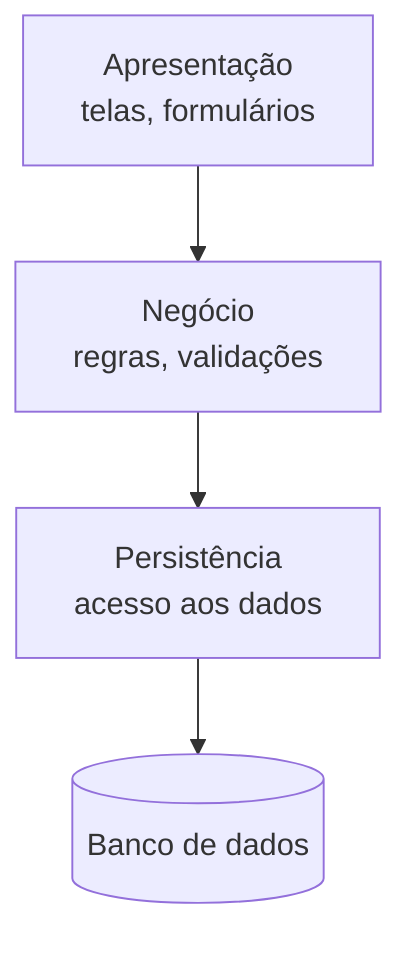

# Aula 04 — Arquitetura como decisão de projeto

> 🎯 Objetivos: distinguir decisão arquitetural de escolha de ferramenta, reconhecer os estilos arquitetônicos mais comuns e registrar uma decisão de arquitetura com as alternativas descartadas.
> 🎬 Slides da aula: [apresentacao-04-arquitetura-como-decisao.pdf](apresentacao/apresentacao-04-arquitetura-como-decisao.pdf)

## 1. Por que isto é assunto de gestão

*"Arquitetura é coisa de desenvolvedor."* É a frase que precede o problema.

No projeto da transportadora — 60 veículos, manutenção preventiva, integração com um ERP legado —, a equipe decidiu processar a telemetria em tempo real. A decisão foi tomada numa conversa técnica, em vinte minutos, e ninguém de fora participou.

Seis meses depois o projeto está atrasado, e o motivo é que **processar em tempo real exigiu uma infraestrutura que ninguém orçou**, uma disponibilidade que a operação não sabia que precisaria sustentar, e um conhecimento que o time não tinha. A alternativa — processar em lote, de hora em hora — atenderia a regra de negócio, que precisa avisar sobre manutenção com dias de antecedência.

**Arquitetura entra numa aula de gestão porque ela é a decisão mais cara de reverter.** Trocar uma biblioteca custa uma semana; trocar a forma como o sistema se divide custa o projeto.

A conversa técnica de vinte minutos não foi o problema — decisão técnica se toma em conversa técnica. O problema foi ela ter sido **a última palavra** sobre algo que consumiria orçamento e exigiria disponibilidade da operação, sem que orçamento e operação estivessem representados ali.

Repare no encadeamento com as três aulas anteriores. A decisão foi tomada em vinte minutos porque **ninguém tinha marcado quem era o A dela** (Aula 01); o custo não apareceu no plano porque **a premissa de infraestrutura não estava escrita** (Aula 03); e quando o desvio surgiu, o projeto já tinha construído meses em cima da escolha, o que é a **curva de custo da descoberta tardia** (Aula 02).

> 💡 **A pergunta que separa o que é arquitetural:** *se decidirmos errado, quanto custa mudar de ideia daqui a seis meses?* Se a resposta for "uma semana", não é arquitetura — é escolha de ferramenta, e pode ser delegada.

## 2. O que é arquitetura de software

Arquitetura é o conjunto de decisões sobre **como o sistema se divide, quem conversa com quem, e o que acontece quando uma parte falha**.

O que é arquitetural e o que não é:

| É arquitetural | Não é |
|---|---|
| dividir o sistema em camadas, e proibir que uma pule a outra | qual biblioteca de gráficos usar |
| processar a telemetria em lote ou em tempo real | o nome das variáveis do módulo |
| guardar o prontuário no mesmo banco dos dados administrativos | o formato de data exibido na tela |
| o sistema continuar operando quando o ERP legado cai | qual editor a equipe usa |

Repare que **nenhuma das quatro é o nome de uma tecnologia**. Dizer *"a arquitetura é React com Node e Postgres"* é confundir a lista de ferramentas com as decisões que estruturam o sistema — e a lista de ferramentas é, quase sempre, a parte mais fácil de trocar.

Repare também que as quatro da coluna esquerda podem ser enunciadas **sem citar nenhuma tecnologia**. Esse é um bom teste de redação: se você não consegue escrever a decisão sem dizer o nome de um produto, provavelmente ainda não a formulou — só escolheu a ferramenta primeiro e foi procurar a justificativa depois.

> ⚠️ **O sintoma de que a discussão saiu da arquitetura:** ela virou uma comparação de tecnologias antes de alguém enunciar a restrição que a decisão precisa atender. Sem *"precisa continuar funcionando quando o ERP cair"*, qualquer opção parece boa.

E as restrições que mais decidem arquitetura raramente são técnicas. No projeto da clínica-escola, o que determina onde o prontuário é guardado é **a auditoria externa e o dado de saúde protegido por lei** — não a preferência do banco. No delivery, é o restaurante **não poder parar**. Em ambos, quem conhece a restrição não é quem escreve o código, e é por isso que a decisão precisa sair da conversa técnica antes de ser fechada.

## 3. Estilos arquitetônicos: camadas

Um **estilo arquitetônico** é um arranjo já conhecido, com vantagens e custos mapeados. Não se inventa arquitetura do zero — escolhe-se entre estilos e se adapta.

Isso é uma boa notícia de gestão: significa que a decisão pode ser tomada **comparando opções documentadas**, e não avaliando a criatividade de quem propôs. Um estilo conhecido vem com a lista dos seus próprios defeitos, e essa lista é o que permite discutir a escolha com quem não escreve código.

O mais comum é o de **camadas**: o sistema se divide em faixas horizontais, e cada uma só conversa com a vizinha.



A regra que dá valor ao estilo é a proibição: **a apresentação não fala com a persistência**. Sem ela, a regra de negócio acaba escrita em três lugares, e mudá-la exige encontrar os três.

A violação típica não é um ato de rebeldia — é um atalho razoável sob pressão. No delivery, alguém precisa mostrar na tela do entregador quantos pedidos há na fila. Buscar isso direto no banco, pulando a camada de negócio, funciona e é mais rápido de escrever.

O problema aparece dois meses depois, quando a regra muda: pedido cancelado não conta na fila. A camada de negócio é ajustada, e **a tela do entregador continua contando errado** — porque ela nunca passou por lá. Ninguém lembra que existe aquele atalho, e o defeito vira lenda.

O custo do estilo é real e precisa ser dito: cada camada acrescenta indireção, e uma alteração simples atravessa três arquivos. Em sistemas pequenos, isso é peso morto — e é por isso que a decisão é de projeto, não de dogma.

> 💡 **Cliente-servidor e MVC são parentes de camadas.** O primeiro separa quem pede de quem responde; o segundo separa a tela, o modelo e quem coordena os dois. Os três resolvem a mesma família de problema: **onde a mudança dói menos**.

Vale conhecer mais dois estilos, porque eles aparecem nos projetos do catálogo:

| Estilo | Como funciona | Onde ele aparece aqui |
|---|---|---|
| **Repositório** | os módulos não conversam entre si; todos leem e escrevem numa base central | o sistema de frota, em que telemetria, oficina e viagens compartilham o cadastro dos veículos |
| **Orientado a eventos** | um módulo anuncia que algo aconteceu, e quem se interessa reage | o delivery, em que "pedido confirmado" precisa acionar cozinha, entregador e cliente ao mesmo tempo |

Nenhum é melhor que o outro. O repositório simplifica o compartilhamento e concentra o risco num ponto só; o orientado a eventos desacopla quem anuncia de quem reage, e em troca **torna difícil responder "o que aconteceu com este pedido?"** sem uma boa instrumentação — assunto da Aula 14.

## 4. Monolito × microsserviços, com honestidade

O **monolito** é um sistema único, implantado de uma vez. Os **microsserviços** dividem o sistema em serviços independentes, cada um implantado por conta própria.

| | Monolito | Microsserviços |
|---|---|---|
| **Implantação** | uma, simples | várias, coordenadas |
| **Falha** | derruba tudo | isolada — se o resto tolerar a ausência |
| **Equipe** | uma, no mesmo código | várias, independentes |
| **Custo operacional** | baixo | alto: rede, monitoramento, versões |
| **Exige** | pouco | equipe de operação madura |

O ponto que a literatura de mercado costuma omitir: **microsserviços resolvem um problema de organização, não de tecnologia.** Eles existem para que times independentes entreguem sem esperar uns pelos outros. Num projeto de três pessoas, não há times independentes para desacoplar — e o que resta é só o custo.

A linha "falha isolada" da tabela merece a ressalva que quase nunca aparece: ela só vale **se o resto do sistema souber funcionar sem aquele serviço**. Se o serviço de pagamento cai e o de pedidos simplesmente para de responder, a falha não foi isolada — foi espalhada por uma rede, que é a pior versão do problema.

> ⚠️ **Microsserviço para três usuários é o exemplo canônico de decisão tomada por moda.** O teste é perguntar qual problema concreto do projeto ele resolve. Se a resposta for *"escalabilidade"* sem um número de carga esperado ao lado, a decisão não tem fundamento — e vai custar meses.

Três perguntas resolvem a escolha, e nenhuma é técnica:

1. **Quantos times independentes vão mexer nisso?** Se for um, o monolito ganha por eliminação;
2. **Quem vai operar isso depois?** Microsserviços transferem complexidade do código para a operação, e alguém precisa estar lá às três da manhã;
3. **Qual parte precisa escalar sozinha, e com que número?** Sem carga esperada, "escalabilidade" é palavra, não requisito.

O caminho barato, quando há dúvida, é começar monolito **com fronteiras internas bem marcadas**. Dividir depois é trabalhoso; juntar depois é pior.

## 5. Registrar a decisão: o ADR

Uma decisão de arquitetura que não está escrita é uma decisão que vai ser refeita — geralmente por alguém que não conhece o motivo da primeira. O registro cabe em meia página, e o formato mais usado é o **ADR** (*Architecture Decision Record*).

Para a transportadora:

| | |
|---|---|
| **Título** | ADR-003 — Processamento da telemetria em lote |
| **Situação** | 60 veículos, sendo 22 com telemetria automática; o restante depende do hodômetro digitado pelo motorista. A regra de manutenção precisa avisar com 3 dias de antecedência |
| **Decisão** | processar a telemetria em **lote, de hora em hora** |
| **Alternativas descartadas** | **tempo real** — atenderia a regra com folga, mas exige infraestrutura não orçada e disponibilidade que a operação não sustenta hoje; **lote diário** — mais barato, mas perde a janela de aviso quando o veículo roda muito num só dia |
| **Consequências** | a informação pode estar até 1 h desatualizada, o que é irrelevante para uma janela de 3 dias; a infraestrutura cabe no orçado |
| **Revisar se** | passar a existir regra que exija reação em minutos, como bloqueio de veículo com falha crítica |

Repare que a linha **situação** carrega os números — 60 veículos, 22 com telemetria, janela de 3 dias. São eles que tornam a decisão discutível: sem a janela de 3 dias, "tempo real" e "de hora em hora" viram preferência pessoal, e a discussão não fecha.

**A linha das alternativas descartadas é o ADR.** Sem ela, o documento diz "decidimos processar em lote", que qualquer um descobre lendo o código. Com ela, quem chegar em dois anos sabe **sob quais premissas** aquilo foi decidido — e se a premissa mudou, a decisão pode ser revista com segurança em vez de por palpite.

> 🧩 **Ponte com POO:** a mesma ideia de "programar para a interface, não para a implementação" aparece aqui em escala maior. Um ADR registra o compromisso; o código o cumpre.

Três regras de uso, que fazem a diferença entre um ADR vivo e uma pasta de documentos mortos:

- **Um ADR por decisão**, numerado e nunca apagado. Decisão revista ganha ADR novo que **supera** o anterior, e o antigo fica — porque o histórico é o que impede refazer o mesmo debate;
- **Escrito quando a decisão é tomada**, não no fim do projeto. Reconstituir o motivo três meses depois produz uma justificativa plausível, que não é a mesma coisa que a verdadeira;
- **Meia página.** Se passar disso, virou documento de arquitetura, que é outra coisa e ninguém lê.

## 6. A decisão arquitetural é do projeto, não do time técnico

Volte à Aula 01: toda decisão precisa de um **A**. Decisão arquitetural também.

Isso não significa que o patrocinador escolha o estilo — ele não tem como, e forçá-lo a opinar sobre camadas produz uma aprovação sem conteúdo, que não protege ninguém.

Significa que a decisão precisa:

- **ser tomada com as restrições do projeto na mesa** — orçamento, prazo, o que a operação consegue sustentar;
- **ter dono declarado**, que costuma ser o gerente ou o arquiteto, e não "o time";
- **ser comunicada a quem ela afeta**, com a consequência traduzida: *"isso significa que a informação pode ficar 1 hora desatualizada"* é uma frase que o gestor de frota entende e pode contestar.

A tradução é a parte que costuma faltar. *"Optamos por processamento em lote com janela horária"* não é comunicação: é a mesma decisão escrita em vocabulário que o destinatário não usa. Se ele não consegue discordar do que você escreveu, você não comunicou — apenas registrou.

O erro do projeto da transportadora não foi escolher tempo real. Foi **escolher sem que o custo aparecesse para quem pagava** — e descobrir a conta seis meses depois, quando reverter já custava o projeto.

Este é o fecho do Bloco 1, e as quatro aulas contam a mesma história por ângulos diferentes: **decisão sem dono trava, decisão sem registro se perde, e decisão sem o custo declarado é aceita por engano.** A matriz da Aula 01, o registro de ciclo de vida da Aula 02, a linha de base da Aula 03 e o ADR desta aula são quatro formatos do mesmo hábito.

> 💡 **O que muda do Bloco 1 para o Bloco 2:** aqui as decisões foram tomadas por alguém com autoridade formal. A partir da Aula 05, entram os métodos que distribuem essa autoridade — e a pergunta *"quem decide?"* fica mais interessante, não menos.

> 📖 O Sommerville dedica um capítulo a projeto de arquitetura, com os padrões arquiteturais clássicos — camadas, repositório, cliente-servidor e *pipe and filter* — e a discussão de quando cada um se aplica. O Guia PMBOK trata do registro de decisões e premissas na área de integração.

## 🏋️ Exercícios da aula

Na pasta `aula-04/` do seu repositório:

1. **`ex01.md`** — classifique cada decisão em **arquitetural** ou **não**, aplicando o teste do custo de reverter: (a) usar o mesmo banco para prontuário e dados administrativos; (b) adotar a biblioteca X para gerar PDF; (c) o sistema continuar operando com o ERP fora do ar; (d) padronizar o nome dos arquivos de log; (e) dividir o sistema em dois serviços implantados separadamente; (f) trocar a fonte da interface. *Confere assim: três de cada, e nenhuma das arquiteturais é o nome de uma tecnologia.*

2. **`ex02.md`** — desenhe em Mermaid a arquitetura em **camadas** do sistema de [delivery de restaurante](../../recursos/projetos-para-praticar.md#5-delivery-de-restaurante-do-bairro), com as três camadas e o banco. Abaixo do diagrama, escreva a regra que o estilo impõe e **um exemplo concreto de violação** que apareceria nesse sistema. *Confere assim: a violação precisa ser algo que alguém faria por atalho — se ela parecer absurda, você não achou a tentação real.*

3. **`ex03.md`** — uma equipe de 3 pessoas propõe microsserviços para o [marketplace de serviços autônomos](../../recursos/projetos-para-praticar.md#9-marketplace-de-serviços-autônomos), alegando escalabilidade. Escreva a resposta que você daria como gerente, contendo: a pergunta que você faria antes de decidir, o custo que a proposta traz e a condição em que ela passaria a fazer sentido. *Confere assim: sua resposta não pode ser "não" — precisa nomear o que faltou na proposta para que ela pudesse ser avaliada.*

4. **`ex04.md`** — escreva o **ADR** da decisão sobre onde guardar o prontuário da [clínica-escola](../../recursos/projetos-para-praticar.md#10-prontuário-de-clínica-escola): no mesmo banco dos dados administrativos ou em um separado. Use as seis linhas do modelo da seção 5, com **ao menos duas alternativas descartadas**. *Confere assim: a linha "revisar se" precisa nomear uma mudança de premissa verificável, e a linha "consequências" precisa conter ao menos uma consequência ruim — decisão sem custo é decisão mal analisada.*

5. **`ex05.md`** — 🌶️ **Desafio.** Você é o gerente do projeto da transportadora. A equipe técnica insiste no processamento em tempo real; o gestor de frota não entende a diferença; a diretoria só quer o número da economia. **Escreva a comunicação da decisão** — meia página, endereçada aos três — contendo: (i) a decisão e a restrição do projeto que a determinou; (ii) a consequência traduzida para cada um dos três públicos, na linguagem de cada um; (iii) **o que se perde** com a escolha, dito antes que alguém descubra. *Confere assim: se o mesmo parágrafo servir para os três leitores, você escreveu um comunicado e não uma comunicação — o gestor de frota e a diretoria não precisam saber as mesmas coisas.*

## 🧠 Revisão

[8 questões de múltipla escolha](revisao/README.md) para conferir se os conceitos ficaram sólidos. Responda sem consultar a aula — depois volte e corrija.

## ✅ Entrega

```bash
git add aula-04/
git commit -m "Resolve exercícios da aula 04 (arquitetura como decisão)"
git push
```

---

⬅️ [Aula 03 — Os processos de um projeto](../aula-03-os-processos-de-um-projeto/README.md) | ➡️ [Aula 05 — O Manifesto Ágil, lido devagar](../../bloco-2-metodologias-de-gestao/aula-05-manifesto-agil/README.md)
