<!-- _class: capa -->

🏛️

# Arquitetura como Decisão de Projeto

## Aula 04 · Bloco 1 — Fundamentos de Projetos

A decisão mais cara de reverter

---

## 🎯 Nesta aula

Esta fecha o Bloco 1. Depois da matriz, do ciclo de vida e da linha de base, a decisão que custa mais caro errar.

1. Por que isto é **assunto de gestão**
2. O que **é** arquitetura de software
3. **Atributos de qualidade** — o que decide a escolha
4. **Estilos** — camadas, cliente-servidor, MVC, repositório, eventos
5. **Monolito × microsserviços**, com honestidade
6. Registrar a decisão — o **ADR**

---

## Vinte minutos que custaram seis meses

Na transportadora — 60 veículos, manutenção preventiva, ERP legado — a equipe decidiu processar a telemetria **em tempo real**. Conversa técnica, vinte minutos, ninguém de fora.

Seis meses depois: **infraestrutura que ninguém orçou**, disponibilidade que a operação não sabia que precisaria sustentar, conhecimento que o time não tinha.

A alternativa — **lote, de hora em hora** — atenderia a regra, que precisa avisar com **três dias** de antecedência.

---

<!-- _class: lead -->

## A pergunta que separa

*Se decidirmos errado,
quanto custa mudar de ideia
daqui a seis meses?*

Se a resposta for "uma semana",
não é arquitetura — é ferramenta,
e **pode ser delegada**.

---

## O que é arquitetural, e o que não é

| É arquitetural | Não é |
|---|---|
| dividir o sistema em camadas | qual biblioteca de gráficos usar |
| processar em lote ou em tempo real | o nome das variáveis |
| prontuário no banco do administrativo | o formato de data na tela |
| operar com o ERP legado fora do ar | qual editor a equipe usa |

**Nenhuma das quatro é o nome de uma tecnologia** — e todas podem ser enunciadas sem citar nenhuma. Se você não consegue, ainda não formulou a decisão.

---

## O problema não foi a conversa técnica

Decisão técnica **se toma** em conversa técnica. O problema foi ela ter sido **a última palavra** sobre algo que consumiria orçamento e exigiria disponibilidade — sem que orçamento e operação estivessem ali.

E as restrições que mais decidem arquitetura **raramente são técnicas**: na clínica é a auditoria e a lei; no delivery, o restaurante não poder parar.

> ⚠️ Quem conhece a restrição **não é quem escreve o código**.

---

## Função × atributo de qualidade

Essas restrições têm nome: são **atributos de qualidade** — as propriedades que o sistema precisa **ter**, e não as coisas que ele precisa **fazer**.

*"Registrar o empréstimo de um equipamento"* é uma **função**: determina o que se programa.

*"Continuar registrando quando o ERP estiver fora do ar"* é um **atributo**: determina **como o sistema se divide** — e por isso é a matéria-prima da arquitetura.

---

<!-- _class: tabela-densa -->

## Os atributos que mais decidem

| Atributo | A pergunta que ele responde | Quem conhece a restrição |
|---|---|---|
| **Desempenho** | em quanto tempo precisa responder? | quem usa, no ritmo real |
| **Disponibilidade** | quanto tempo fora do ar dá? | a operação |
| **Segurança** | quem pode ver o quê? | o jurídico, a auditoria |
| **Manutenibilidade** | quanto custa mudar uma regra? | quem vai sustentar |
| **Escalabilidade** | até que carga, com que número? | quem projeta o negócio |
| **Custo operacional** | quanto custa manter ligado? | quem paga a conta |

Na terceira coluna, **em nenhuma linha a resposta é "a equipe de desenvolvimento"**.

---

## Atributos brigam entre si

Melhorar um atributo quase sempre **piora outro**. É isso que faz de arquitetura uma decisão de gestão.

**Segurança custa desempenho** — cifrar e auditar deixa o sistema mais lento, e é obrigatório assim mesmo.

**Disponibilidade custa dinheiro** — funcionar com o ERP fora exige cópia local, sincronizar e resolver conflito.

**Manutenibilidade custa prazo agora** — camadas atrasam a primeira entrega para baratear a décima.

Como não existe a opção que ganha em tudo, **alguém precisa dizer qual atributo vale o sacrifício**.

---

## ⚠️ Atributo sem número é adjetivo

*"O sistema precisa ser rápido"* não decide nada — **qualquer** arquitetura atende.

*"A tela do entregador precisa abrir em menos de 2 segundos numa rede 4G"* elimina metade das opções na hora.

> ⚠️ Sempre que alguém disser **"escalável"**, **"seguro"** ou **"robusto"**, a pergunta seguinte é uma só: **quanto?**

---

## A transportadora, relida

*"Avisar sobre manutenção com 3 dias de antecedência"* é um requisito de **desempenho** — e um requisito **folgado**: três dias toleram informação com uma hora de atraso.

A equipe otimizou um atributo que **ninguém tinha pedido**, e pagou com **custo operacional** e **disponibilidade** — que eram justamente os apertados.

> 🧩 Os atributos apertados são a lista de onde procurar **risco** (Aula 09).

---

## Da restrição ao registro

**Cada caixa tem um dono diferente** — e a terceira é a única que a equipe técnica costuma decidir sozinha.

Pular a segunda produz a comparação de tecnologias sem restrição; pular a quarta produz a decisão que vai ser refeita em dois anos.

---

## O que é um estilo arquitetônico

Um **arranjo já conhecido**, com vantagens e custos **mapeados**. Não se inventa arquitetura do zero: escolhe-se entre estilos e se adapta.

Isso é uma boa notícia de gestão — significa que a decisão pode ser tomada **comparando opções documentadas**, e não avaliando a criatividade de quem propôs.

> 💡 Um estilo conhecido vem com **a lista dos seus próprios defeitos**, e é ela que permite discutir a escolha com quem não escreve código.

---

<!-- _class: diagrama -->

## Estilo 1 — Camadas

---

## A regra, e a violação que parece razoável

**A apresentação não fala com a persistência.** Sem essa proibição, a regra de negócio acaba escrita em três lugares.

No delivery, mostrar a fila de pedidos buscando **direto no banco** funciona e é mais rápido de escrever. Não é rebeldia — é atalho sob pressão.

Dois meses depois a regra muda: pedido cancelado não conta. A camada de negócio é ajustada, e **a tela do entregador continua errada** — porque nunca passou por lá.

---

## Estilo 2 — Cliente-servidor

A regra vive **num lugar só**, ainda que as telas sejam três. Em troca, o servidor é **ponto único de falha**, e o app na moto precisa decidir o que fazer quando o sinal cai.

---

## Estilo 3 — MVC

Organiza a **apresentação** — mora dentro da camada de cima, e não substitui as camadas.

A mesma informação aparece de duas formas — a lista do atendente e o painel da cozinha — **sem duplicar a regra**. O custo: três arquivos onde caberia um.

---

## Estilo 4 — Repositório

Os módulos **não conversam entre si** — a base os integra. Em troca, **todo o risco se concentra num ponto**, e o formato dela vira um contrato que ninguém muda sozinho.

---

## Estilo 5 — Orientado a eventos

Quem anuncia **não sabe quem escuta**: acrescentar o financeiro à lista não mexe no código do pedido. Em troca, *"o que aconteceu com este pedido?"* fica difícil de responder.

---

<!-- _class: tabela-densa -->

## O que cada estilo compra, e com o que paga

| Estilo | Favorece | Paga com |
|---|---|---|
| **Camadas** | manutenibilidade | indireção; simples fica caro |
| **Cliente-servidor** | regra num lugar só | ponto único de falha |
| **MVC** | reúso da apresentação | peças demais para tela simples |
| **Repositório** | integração simples | risco concentrado |
| **Orientado a eventos** | evolução barata | rastrear fica difícil |
| **Pipe and filter** | etapas trocáveis | não serve a interativo |

Escolher estilo é escolher **qual atributo você prefere ter**, sabendo o preço. E eles **se combinam**: o delivery é cliente-servidor por fora, camadas por dentro e eventos na confirmação.

---

## Monolito × microsserviços

| | Monolito | Microsserviços |
|---|---|---|
| **Implantação** | uma, simples | várias, coordenadas |
| **Falha** | derruba tudo | isolada *(se o resto tolerar)* |
| **Custo operacional** | baixo | alto: rede, versões, monitoramento |
| **Exige** | pouco | equipe de operação madura |

**Microsserviços resolvem um problema de organização, não de tecnologia** — existem para times independentes entregarem sem esperar uns pelos outros.

---

<!-- _class: lead -->

## ⚠️ Microsserviço para três usuários

é o exemplo canônico
de decisão tomada por moda.

Num projeto de três pessoas
não há times para desacoplar,
e **o que resta é só o custo**.

---

## Três perguntas, nenhuma técnica

1. **Quantos times independentes** vão mexer nisso? Se for um, o monolito ganha por eliminação;
2. **Quem vai operar** isso depois, às três da manhã?
3. **Qual parte precisa escalar sozinha**, e com que número?

Na dúvida: **monolito com fronteiras internas bem marcadas**. Dividir depois é trabalhoso; juntar depois é pior.

---

<!-- _class: tabela-densa -->

## O ADR da transportadora

| | |
|---|---|
| **Situação** | 60 veículos, 22 com telemetria; a regra avisa com 3 dias |
| **Decisão** | processar em **lote, de hora em hora** |
| **Descartadas** | *tempo real* — infra não orçada, disponibilidade insustentável; *lote diário* — perde a janela |
| **Consequências** | informação até 1 h desatualizada — irrelevante numa janela de 3 dias |
| **Revisar se** | surgir regra que exija reação em minutos |

A linha **situação** carrega os números. É o atributo de qualidade entrando no documento **com quantidade**.

---

<!-- _class: lead -->

## A linha das alternativas é o ADR

Sem ela, o documento diz
"decidimos processar em lote" —
que qualquer um descobre lendo o código.

Com ela, quem chegar em dois anos
sabe **sob quais premissas**.

---

## Três regras de uso do ADR

**Um ADR por decisão**, numerado e nunca apagado. Decisão revista ganha ADR novo que **supera** o anterior — o histórico é o que impede refazer o mesmo debate.

**Escrito quando a decisão é tomada.** Reconstituir três meses depois produz uma justificativa plausível, que não é a mesma coisa que a verdadeira.

**Meia página.** Se passar disso, virou documento de arquitetura, que é outra coisa e ninguém lê.

---

## A tradução é a parte que falta

A decisão precisa **ter dono declarado** — o gerente ou o arquiteto, não "o time" — e **ser comunicada a quem ela afeta**, com a consequência traduzida.

*"Optamos por processamento em lote com janela horária"* não é comunicação: é a mesma decisão em vocabulário que o destinatário não usa.

> ⚠️ Se ele não consegue **discordar** do que você escreveu, você não comunicou — apenas registrou.

---

## O que fechou o Bloco 1

O erro da transportadora não foi escolher tempo real. Foi **escolher sem que o custo aparecesse para quem pagava**.

**Decisão sem dono trava. Decisão sem registro se perde. Decisão sem o custo declarado é aceita por engano.**

A matriz da Aula 01, o registro de ciclo da 02, a linha de base da 03 e o ADR desta aula são **quatro formatos do mesmo hábito**.

---

<!-- _class: checkpoint -->

## 🏋️ Exercícios da aula

Na pasta `aula-04/`:

1. **`ex01.md`** — oito decisões: arquiteturais ou não, e qual atributo está em jogo;
2. **`ex02.md`** — camadas do delivery, com a violação real;
3. **`ex03.md`** — resposta à proposta de microsserviços para três pessoas;
4. **`ex04.md`** — ADR do prontuário, com duas alternativas descartadas;
5. **`ex05.md`** 🌶️ — comunicar a decisão a três públicos diferentes.

---

<!-- _class: lead -->

## ➡️ Próxima aula

**Aula 05 — O Manifesto Ágil, lido devagar**

Até aqui, decisões tomadas
por quem tinha autoridade formal.

A partir de agora, entram os métodos
que **distribuem** essa autoridade.
