<!-- _class: capa -->

<div class="emoji">🏗️</div>

# Por Que Engenharia de Software Existe

## Aula 01 · Bloco 1 — Software e processos

<div class="meta">A distância entre um programa que funciona e um produto que serve</div>

---

## 🎯 Nesta aula

1. O programa do **fim de semana**
2. Programa × **produto** de software
3. Por que projetos **falham**
4. O **custo da mudança** ao longo do tempo
5. Atributos de **qualidade** — e quem faz software

---

## O programa do fim de semana

```
programa reserva_salas
  lê o arquivo salas.txt
  mostra as salas livres
  pergunta qual sala e qual horário
  grava a linha no arquivo
```

Na segunda-feira ele **funciona**. E está certo: isso é um programa que funciona.

---

<!-- _class: lead -->

## ⚠️ Aí a secretaria quer usar de verdade

E se **duas pessoas** reservarem a mesma sala no mesmo segundo?
E se **faltar luz** no meio da gravação?
**Quem** pode cancelar a reserva de quem?
**Onde** isso roda quando ele se formar e levar o notebook?

Nenhuma dessas perguntas é sobre programação.
**Todas são sobre engenharia.**

---

<!-- _class: tabela-densa -->

## Programa × produto de software

| | Programa | Produto |
|---|---|---|
| Usuários | quem escreveu | gente que você não conhece |
| Entrada | a que o autor imaginou | qualquer uma, inclusive maliciosa |
| Erro | o autor conserta | tratado, registrado, explicado |
| Testes | "rodei e funcionou" | repetíveis, a cada mudança |
| Vida útil | até resolver o problema | anos, mudando o tempo todo |

---

<!-- _class: lead -->

## 💡 Quanto custa esse "muito mais"?

Brooks, em *O Mítico Homem-Mês*:
programa → **produto** custa ~**3×**;
produto → **sistema integrado**, outras **3×**.

O produto de sistema sai por volta de **9×**
o programa que funcionava no sábado.

*"Isso eu faço num fim de semana"* geralmente está certo
sobre o fim de semana. E o fim de semana é **11%** do trabalho.

---

## Por que projetos falham

- 📋 **Requisitos** — construiu-se direito a coisa errada. É a causa nº 1;
- 📈 **Escopo que cresce sem negociação** — cada pedido parece pequeno;
- 🗣️ **Comunicação** — 4 pessoas trocam 6 pares; 10 pessoas, 45;
- 📅 **Prazo decidido antes do trabalho** — o que cede é a qualidade;
- ⏳ **Qualidade adiada** — tudo que é adiado chega junto, na pior semana.

---

<!-- _class: lead -->

## ⚠️ Nenhuma delas é "não sabiam programar"

A competência técnica individual é a parte do problema
que a indústria **mais resolveu**
e **menos usa** como explicação.

O que falha é o que acontece **entre** as pessoas.

---

<!-- _class: diagrama -->

## O custo de consertar, por onde o erro apareceu



---

<!-- _class: lead -->

## 💡 A curva é a razão de ser do curso

Todo esforço lá na esquerda — perguntar, modelar,
revisar, escrever a decisão — é comprado **com desconto**.

Não é burocracia: é o mesmo trabalho, **pago mais barato**.

⚠️ Mas ela **não** diz "planeje tudo antes".
Diz **descubra cedo** — e descobrir cedo às vezes
exige construir um pedaço e mostrar.

---

<!-- _class: tabela-densa -->

## Qualidade não é uma coisa — são várias

| Atributo | A pergunta que ele responde |
|---|---|
| **Correção** | faz o que foi especificado? |
| **Confiabilidade** | continua funcionando sob uso real? |
| **Desempenho** | responde rápido, com a carga esperada? |
| **Usabilidade** | usa-se sem treinamento heroico? |
| **Segurança** | resiste a quem age de má-fé? |
| **Manutenibilidade** | outra pessoa muda isso em dois anos? |
| **Acessibilidade** | serve a leitor de tela, teclado, alto contraste? |

---

<!-- _class: lead -->

## 💡 E eles **competem** entre si

Mais segurança custa usabilidade.
Mais desempenho custa manutenibilidade.
Mais portabilidade custa desempenho.

Por isso a pergunta profissional nunca é
*"como faço isso ficar bom?"*, e sim:

**quais atributos importam mais aqui,
e o que estou disposto a perder nos outros?**

---

<!-- _class: lista-limpa -->

## Quem faz software

- 🔍 **Analista de requisitos** — descobre e escreve o que o sistema precisa fazer;
- 🏛️ **Arquiteto** — decide a estrutura e responde pelo que é caro reverter;
- 🧱 **Projetista / desenvolvedor** — organiza cada parte por dentro e constrói;
- 🧪 **QA** — projeta como se prova que funciona, e onde vai quebrar;
- 🎯 **Gerente / Product Owner** — decide o que **não** será feito agora;
- 🚀 **DevOps** — põe no ar, monitora, responde às três da manhã;
- 🙋 **Usuário e interessados** — para quem tudo isso existe.

---

## Responsabilidade profissional

Software decide coisas **sobre pessoas**: quem consegue a sala, quem entra na fila, quem é sinalizado como suspeito.

- **Dado dos outros não é seu** — no Brasil isso tem nome e força de lei: **LGPD**;
- **Excluir alguém é uma decisão**, mesmo sem intenção. Quem exige internet rápida e tela grande escolheu seus usuários sem dizer;
- **Competência inclui dizer o que você não sabe.**

---

<!-- _class: checkpoint -->

## 🏋️ Exercícios da aula

Na pasta `aula-01/`:

1. **`ex01.md`** — transforme o programa da seção 1 em produto, no papel, e chegue a um múltiplo do esforço;
2. **`ex02.md`** — três fracassos reais e a causa que melhor explica cada um;
3. **`ex03.md`** — narre a história do 50× no sistema-guia;
4. **`ex04.md`** — os sete papéis neste projeto, e uma decisão que só cada um toma;
5. **Desafio 🌶️ `ex05.md`** — responda a *"um estagiário faz num fim de semana"*.

---

<!-- _class: lead -->

## ➡️ Próxima aula

**Aula 02 — Ciclo de vida e modelos de processo**

As quatro atividades que todo projeto faz —
e as maneiras de ordená-las.
