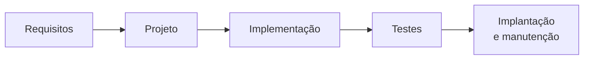
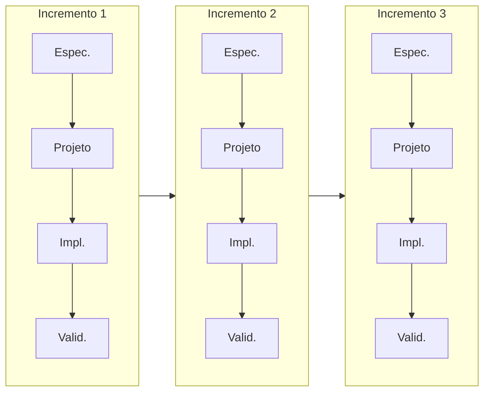

# Aula 02 — Ciclo de Vida e Modelos de Processo

> 🎯 Objetivos: reconhecer as quatro atividades presentes em qualquer projeto de software, comparar os principais modelos de processo e justificar a escolha de um modelo para um contexto concreto.
> 🎬 Slides da aula: [apresentacao-02-ciclo-de-vida-e-processos.pdf](apresentacao/apresentacao-02-ciclo-de-vida-e-processos.pdf)

## 1. As quatro atividades que sempre acontecem

A secretaria aprovou o sistema de reserva de espaços. Você tem seis meses e três pessoas. **Por onde se começa?**

A resposta que todo mundo dá primeiro — "começa programando" — é a que mais atrasa projeto. Antes de decidir a ordem, vale notar que existem apenas quatro tipos de trabalho, e que **todo projeto de software faz os quatro**, sempre, quer alguém tenha planejado ou não:

| Atividade | A pergunta | Produz |
|---|---|---|
| **Especificação** | o que o sistema deve fazer e sob quais restrições? | requisitos, regras, critérios de aceite |
| **Projeto e implementação** | como ele é construído? | arquitetura, diagramas, código |
| **Validação** | ele faz o que precisava, e faz certo? | testes, revisões, demonstração ao cliente |
| **Evolução** | como ele muda depois de pronto? | novas versões, correções, adaptações |

Um **modelo de processo** não inventa atividades novas. Ele só responde a duas perguntas sobre estas quatro: **em que ordem** e **quantas vezes**.

> 💡 Se você fizer as quatro na cabeça, em cinco minutos e sem escrever nada, ainda assim fez as quatro. A diferença entre projeto sério e improviso não é a existência das atividades — é elas serem **visíveis**, para que alguém possa discordar a tempo.

> 📖 Sommerville organiza o livro inteiro em torno dessas quatro atividades fundamentais, no capítulo sobre processos de software.

## 2. Cascata: a ordem óbvia, e o que ela acertou

Se são quatro atividades, a ordem mais natural é uma depois da outra: especifica tudo, projeta tudo, constrói tudo, testa tudo, entrega. Isso é o **modelo cascata**, e ele foi o primeiro porque é o que qualquer pessoa proporia num guardanapo.



Ele acertou coisas que sobreviveram a todas as críticas:

- **Nomear as fases.** Antes disso, "fazer software" era uma coisa só e indivisível;
- **Exigir artefato antes de avançar.** Cada fase termina com algo que outra pessoa pode ler e conferir;
- **Tornar o processo auditável.** Em contrato público e em software certificado, isso não é burocracia: é requisito legal.

O problema também é evidente: **ele assume que os requisitos estão certos e não mudam.** Quando a secretaria vê o sistema pela primeira vez no mês cinco e diz *"ah, mas reserva e uso são coisas diferentes"*, o custo é aquele 50× da Aula 01.

> ⚠️ **Cascata não é o vilão da história, e responder "cascata" não é automaticamente errado.** Ela vence quando os requisitos são realmente estáveis e a mudança é cara ou proibida: software embarcado que vai gravado na fábrica, sistema com certificação regulatória, contrato de escopo fechado com órgão público. O erro histórico nunca foi o modelo — foi aplicá-lo onde o requisito muda toda semana.

> 💡 Curiosidade que quase ninguém conta: o artigo de Winston Royce (1970), citado como a origem do cascata, **descreve o modelo sequencial puro para dizer que ele é arriscado** e recomenda, na sequência, fazer duas vezes e envolver o cliente. A indústria copiou o primeiro desenho e ignorou o texto ao lado.

## 3. Incremental e iterativo: duas palavras diferentes

O cliente não sabe direito o que quer até ver alguma coisa. Essa frase não é uma queixa sobre clientes — é uma constatação sobre problemas complexos, e vale para você também.

Se é assim, a saída é mostrar algo cedo. Existem duas formas de fazer isso, e elas **não são sinônimos**:

- **Incremental** — entregar o produto em **fatias completas**. Primeiro só consultar disponibilidade; depois reservar; depois cancelar. Cada fatia funciona de ponta a ponta e pode ir ao ar;
- **Iterativo** — **voltar ao mesmo pedaço** e melhorá-lo. A primeira versão da busca ignora recursos; a segunda filtra por projetor; a terceira ordena por proximidade.



Repare no desenho: **as quatro atividades acontecem em cada ciclo**, sobre uma fatia menor. É isso, e só isso, que separa "iterativo" de "cascata com nomes novos".

> ⚠️ O teste que desmascara a imitação: **ao final de cada ciclo existe algo funcionando que o cliente consegue usar e criticar?** Se a resposta é não — se o ciclo 1 foi "levantar requisitos" e o ciclo 2 foi "modelar" —, aquilo é uma fase com nome de iteração. O erro tem entrada própria em [erros comuns](../../recursos/erros-comuns.md).

Na prática, projetos sérios são **as duas coisas**: entregam fatias novas e voltam para melhorar as antigas.

## 4. Processo unificado: o meio-termo estruturado

Entre "planeja tudo antes" e "descobre no caminho" existe um território ocupado por décadas pelo **Processo Unificado** (UP, e sua versão comercial RUP). Ele é iterativo, mas mantém a previsibilidade que uma organização grande exige.

Duas ideias suas valem para sempre:

**As quatro fases não são as quatro atividades.** Cada fase contém iterações, e cada iteração faz todas as atividades — muda é a **ênfase**:

| Fase | Pergunta que ela fecha | Ênfase |
|---|---|---|
| **Concepção** | vale a pena fazer isso? | escopo e viabilidade |
| **Elaboração** | qual é a arquitetura e onde estão os riscos? | requisitos e arquitetura |
| **Construção** | como construir o resto? | implementação |
| **Transição** | como colocar na mão do usuário? | implantação e ajuste |

**Atacar risco primeiro.** A elaboração existe para construir logo o pedaço mais perigoso — a integração com o Sistema Acadêmico legado, no nosso caso. Deixar o difícil para o fim é a receita clássica do projeto que atrasa 90% no último 10%.

> 💡 O UP é **dirigido por casos de uso**: os requisitos entram como casos de uso e atravessam projeto, implementação e teste. Não é coincidência que a UML e o UP tenham nascido das mesmas pessoas. A Aula 10 volta a isso.

> ⚠️ O UP na sua forma completa é pesado: dezenas de artefatos, papéis e modelos. Quem o adota hoje adota **um recorte**. Adotar tudo, num time de três pessoas, é ter mais gente escrevendo sobre o trabalho do que fazendo o trabalho.

## 5. Dirigido a plano × ágil: um eixo, não dois campos

A pergunta "vocês são ágeis ou tradicionais?" é mal formulada. Todo processo real fica em algum ponto entre dois extremos, e o ponto certo depende do projeto:

| | Dirigido a plano | Ágil |
|---|---|---|
| Requisitos | levantados e congelados cedo | descobertos ao longo do caminho |
| Mudança | tratada como exceção, com controle formal | tratada como o normal |
| Documentação | artefato de contrato | o suficiente para o time e para quem vem depois |
| Entrega | poucas, grandes | muitas, pequenas |
| Cliente | participa nos marcos | participa continuamente |
| Custa caro quando | o requisito muda | ninguém sabe dizer o que "pronto" significa |

**Escolha dirigida a plano quando:** o requisito é estável, o contrato é de escopo fechado, há exigência regulatória ou de certificação, o sistema é crítico para a vida, o cliente não tem disponibilidade para participar toda semana, ou o time está distribuído em fusos incompatíveis.

**Escolha ágil quando:** o requisito é incerto ou vai mudar, o cliente está acessível, o time é pequeno e co-localizado (ou bem conectado), e é possível entregar valor em pedaços.

> 💡 Note que o critério quase nunca é "qual é mais moderno". É **quanto de incerteza existe** e **quanto custa errar**. Um marca-passo e um aplicativo de reserva de salas não merecem o mesmo processo, e isso não é uma opinião sobre agilidade.

## 6. Escolher o processo é decisão de projeto

Escolher processo é como escolher arquitetura: não existe resposta universal, existe resposta **justificada**. Cinco perguntas resolvem a maioria dos casos:

1. **Os requisitos vão mudar?** Se sim, qualquer coisa que os congele vai custar caro;
2. **Quanto custa um erro em produção?** Vida humana, dinheiro alheio e processo judicial pedem mais verificação — sempre;
3. **O cliente está disponível?** Ágil sem cliente presente vira o time inventando requisito;
4. **Dá para entregar em pedaços úteis?** Nem todo sistema aceita: metade de um marca-passo não serve;
5. **Existe exigência externa de processo?** Contrato, auditoria, certificação. Isso não se negocia com argumento técnico.

Aplicando ao sistema-guia: os requisitos estão longe de fechados — cinco perguntas continuam em aberto no [documento do cliente](../../recursos/sistema-guia.md#9-o-que-está-em-aberto); a secretaria está no prédio ao lado; um erro custa uma sala trocada, não uma vida; e dá perfeitamente para entregar *consultar disponibilidade* antes de *reservar*. **Iterativo e incremental, com forte participação do cliente.** Note que a decisão saiu das características do projeto, não da preferência de quem decide.

> ⚠️ E existe uma restrição que atropela tudo: o **calendário letivo**. Não adianta o processo ser lindo se a entrega cai na semana de provas — a Aula 04 volta a esse ponto quando falarmos de janela de implantação.

> 🧩 **Ponte com POO:** a fase de **elaboração** do UP é onde nasce o primeiro diagrama de classes de verdade — aquele que já sustenta decisões, não o rascunho. É o mesmo artefato que você vai desenhar na Aula 11.

## 🏋️ Exercícios da aula

Na pasta `aula-02/` do seu repositório:

1. **`ex01.md`** — a lista abaixo tem 12 tarefas de um projeto real. Classifique cada uma nas **quatro atividades** da seção 1 e justifique as três que você achou mais difíceis de encaixar: escrever o manual do usuário · descobrir com a secretaria o que é "sala ocupada" · consertar um erro reportado por usuário · desenhar o diagrama de classes · escrever teste automatizado · negociar prazo com a coordenação · migrar dados da planilha antiga · revisar o código de um colega · escolher o banco de dados · apresentar o protótipo · atualizar o sistema para uma nova versão do navegador · numerar os requisitos;
2. **`ex02.md`** — para os três contextos a seguir, escolha um modelo de processo e **justifique com as cinco perguntas da seção 6**: (a) o firmware da catraca de acesso aos laboratórios, que vai gravado no equipamento; (b) o próprio sistema de reserva de espaços; (c) um sistema de matrícula que precisa estar no ar na data da matrícula, sem adiamento possível. Uma justificativa que sirva para os três está errada;
3. **`ex03.md`** — leia este relato e **encontre o erro de processo**: *"O projeto usou cascata. Os requisitos foram fechados em março com a diretoria. Em julho, na primeira demonstração, os atendentes disseram que o fluxo não correspondia ao trabalho deles. A entrega foi adiada em quatro meses."* Aponte em que momento exato o projeto poderia ter descoberto o problema, quanto teria custado ali, e **qual mudança mínima** de processo teria bastado — sem trocar de modelo;
4. **`ex04.md`** — monte uma tabela comparando **cascata** e **incremental** em seis critérios: tratamento de mudança · momento do primeiro retorno do cliente · previsibilidade de prazo · custo de errar o requisito · adequação a contrato de escopo fechado · exigência de disponibilidade do cliente. Depois escreva um parágrafo dizendo **em que situação você escolheria cada um** — e um segundo parágrafo com a situação em que os dois seriam ruins e você faria outra coisa;
5. **Desafio 🌶️ `ex05.md`** — **defenda a cascata.** Descreva um projeto real e específico (contexto, cliente, restrições, consequência de erro) em que o cascata é a escolha **certa** e o ágil seria irresponsável. Não vale generalidade: dê o setor, o tipo de sistema, a exigência externa que existe e o que exatamente se perderia ao iterar. Depois, para provar que você não está apenas invertendo o clichê, aponte **um risco** que a sua escolha assume e como você o mitigaria.

## 🧠 Revisão

[8 questões de múltipla escolha](revisao/README.md) para conferir se os conceitos ficaram sólidos. Responda sem consultar a aula — depois volte e corrija.

## ✅ Entrega

```bash
git add aula-02/
git commit -m "Resolve exercícios da aula 02 (ciclo de vida e processos)"
git push
```

---

⬅️ [Aula 01 — Por que engenharia de software existe](../aula-01-por-que-engenharia-de-software/README.md) | ➡️ [Aula 03 — Desenvolvimento ágil](../aula-03-desenvolvimento-agil/README.md)
