<!-- _class: capa -->

🔄

# Ciclo de Vida e Modelos de Processo

## Aula 02 · Bloco 1 — Software e processos

Não que atividades existem — em que ordem, e quantas vezes

---

## 🎯 Nesta aula

1. As **quatro atividades** que sempre acontecem
2. **Cascata** — a ordem óbvia, e o que ela acertou
3. **Incremental × iterativo** — não são sinônimos
4. **Processo unificado** — o meio-termo estruturado
5. Escolher o processo é **decisão de projeto**

---

## As quatro atividades

| Atividade | A pergunta | Produz |
|---|---|---|
| **Especificação** | o que fazer, sob que restrições? | requisitos, critérios de aceite |
| **Projeto e implementação** | como é construído? | arquitetura, diagramas, código |
| **Validação** | faz o que precisava, e faz certo? | testes, revisões, demonstração |
| **Evolução** | como muda depois de pronto? | novas versões e correções |

Um modelo de processo **não inventa atividades novas**.

---

<!-- _class: lead -->

## 💡 Ele só responde a duas perguntas

**Em que ordem?** e **quantas vezes?**

Se você fizer as quatro na cabeça, em cinco minutos,
sem escrever nada — ainda assim fez as quatro.

A diferença entre projeto sério e improviso
não é a existência das atividades:
é elas serem **visíveis**, para alguém poder
discordar **a tempo**.

---

<!-- _class: diagrama -->

## Cascata: a ordem que qualquer um proporia

---

## O que a cascata acertou

- **Nomear as fases** — antes disso, "fazer software" era indivisível;
- **Exigir artefato antes de avançar** — cada fase termina com algo conferível;
- **Tornar o processo auditável** — em contrato público, isso é requisito legal.

O problema é evidente: ela **assume que os requisitos não mudam**. Quando o cliente vê o sistema no mês cinco, o custo é o **50×** da Aula 01.

---

<!-- _class: lead -->

## ⚠️ Cascata não é o vilão da história

Ela vence quando a mudança é **cara ou proibida**:
firmware que vai gravado na fábrica,
sistema com certificação regulatória,
contrato de escopo fechado.

O erro histórico nunca foi o modelo —
foi aplicá-lo onde o requisito muda toda semana.

💡 Royce (1970) descreve o cascata puro **para dizer que é arriscado**.
A indústria copiou o desenho e ignorou o texto ao lado.

---

## Incremental × iterativo

Duas palavras diferentes, e não são sinônimos:

- **Incremental** — entregar em **fatias completas**. Primeiro consultar disponibilidade; depois reservar; depois cancelar. Cada fatia vai ao ar;
- **Iterativo** — **voltar ao mesmo pedaço** e melhorá-lo. A busca ignora recursos; depois filtra por projetor; depois ordena por proximidade.

Projetos sérios são **as duas coisas**.

---

<!-- _class: diagrama -->

## As quatro atividades, em cada ciclo

---

<!-- _class: lead -->

## ⚠️ O teste que desmascara a imitação

Ao final de cada ciclo existe **algo funcionando
que o cliente consegue usar e criticar**?

Se o ciclo 1 foi "levantar requisitos"
e o ciclo 2 foi "modelar",
aquilo é uma **fase com nome de iteração**.

---

## Processo unificado: as fases não são as atividades

Cada fase contém iterações, e cada iteração faz **todas** as atividades. O que muda é a **ênfase**:

| Fase | Pergunta que ela fecha | Ênfase |
|---|---|---|
| **Concepção** | vale a pena fazer isso? | escopo e viabilidade |
| **Elaboração** | qual é a arquitetura, e os riscos? | requisitos e arquitetura |
| **Construção** | como construir o resto? | implementação |
| **Transição** | como colocar na mão do usuário? | implantação e ajuste |

---

<!-- _class: lead -->

## 💡 Atacar o risco primeiro

A **elaboração** existe para construir logo
o pedaço mais perigoso — no nosso caso,
a integração com o Sistema Acadêmico legado.

Deixar o difícil para o fim é a receita clássica
do projeto que atrasa **90% no último 10%**.

---

<!-- _class: tabela-densa -->

## Dirigido a plano × ágil: um eixo, não dois campos

| | Dirigido a plano | Ágil |
|---|---|---|
| Requisitos | congelados cedo | descobertos no caminho |
| Mudança | exceção, com controle formal | o normal |
| Documentação | artefato de contrato | o que alguém vai ler |
| Entrega | poucas, grandes | muitas, pequenas |
| Cliente | participa nos marcos | participa continuamente |
| Custa caro quando | o requisito muda | ninguém sabe o que é "pronto" |

---

<!-- _class: lista-limpa -->

## As cinco perguntas que escolhem o processo

- 🔀 **Os requisitos vão mudar?** Congelá-los vai custar caro;
- 💥 **Quanto custa um erro em produção?** Vida e dinheiro alheio pedem mais verificação;
- 🙋 **O cliente está disponível?** Ágil sem cliente é o time inventando requisito;
- 🍰 **Dá para entregar em pedaços úteis?** Metade de um marca-passo não serve;
- 📜 **Existe exigência externa?** Contrato e auditoria não se negociam com argumento técnico.

---

<!-- _class: lead -->

## 💡 Aplicando ao sistema-guia

Requisitos longe de fechados — **cinco perguntas em aberto**.
Secretaria no prédio ao lado. Erro custa uma sala trocada.
E dá para entregar *consultar* antes de *reservar*.

**→ Iterativo e incremental, com o cliente por perto.**

A decisão saiu das **características do projeto**,
não da preferência de quem decide.

---

<!-- _class: checkpoint -->

## 🏋️ Exercícios da aula

Na pasta `aula-02/`:

1. **`ex01.md`** — classifique 12 tarefas reais nas quatro atividades;
2. **`ex02.md`** — escolha o processo de três contextos com as cinco perguntas;
3. **`ex03.md`** — ache o erro de processo num relato, e a **mudança mínima**;
4. **`ex04.md`** — cascata × incremental em seis critérios;
5. **Desafio 🌶️ `ex05.md`** — **defenda a cascata** num caso real e específico.

---

<!-- _class: lead -->

## ➡️ Próxima aula

**Aula 03 — Desenvolvimento ágil**

O Manifesto lido devagar, Scrum, Kanban, XP —
e como reconhecer a casca sem o conteúdo.
