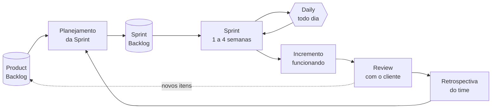

# Aula 03 — Desenvolvimento Ágil

> 🎯 Objetivos: interpretar os quatro valores do Manifesto Ágil sem os slogans, descrever como Scrum e Kanban organizam o trabalho e reconhecer as imitações que usam o vocabulário sem a prática.
> 🎬 Slides da aula: [apresentacao-03-desenvolvimento-agil.pdf](apresentacao/apresentacao-03-desenvolvimento-agil.pdf)

## 1. O Manifesto, lido devagar

Fim dos anos 1990. Projetos seguiam processos que exigiam centenas de páginas de documento antes da primeira linha de código — e mesmo assim entregavam tarde e errado. Em 2001, dezessete pessoas que vinham experimentando alternativas se reuniram e escreveram quatro frases. Elas cabem aqui inteiras:

> **Indivíduos e interações** mais que processos e ferramentas
> **Software em funcionamento** mais que documentação abrangente
> **Colaboração com o cliente** mais que negociação de contratos
> **Responder a mudanças** mais que seguir um plano

E, logo abaixo, a frase que quase todo mundo esquece de citar:

> *"Ou seja, mesmo havendo valor nos itens à direita, valorizamos mais os itens à esquerda."*

Isso muda tudo. O Manifesto **não diz** que processo é ruim, que documentação é desperdício ou que plano não serve. Diz que, **quando os dois competirem**, o da esquerda decide.

| O valor | O que ele *não* diz | O que ele decide na prática |
|---|---|---|
| Indivíduos e interações | "não use ferramenta" | quando a ferramenta atrapalha a conversa, mude a ferramenta |
| Software em funcionamento | "não documente" | mostre software rodando antes de discutir a página 40 do documento |
| Colaboração com o cliente | "não faça contrato" | quando o contrato impede resolver o problema do cliente, renegocie |
| Responder a mudanças | "não planeje" | plano é hipótese; quando a realidade discorda, quem muda é o plano |

> ⚠️ **"Ágil quer dizer que não documentamos"** é a leitura errada mais cara que existe, e ela nasce de ler quatro comparações como quatro negações. A pergunta certa nunca é *"documentamos ou não?"* — é **"qual documento alguém vai ler depois?"**.

> 📖 Sommerville dedica um capítulo inteiro a desenvolvimento ágil, com a discussão de quando ele não se aplica.

## 2. Scrum: os valores viram segunda-feira

Os quatro valores não dizem o que fazer às nove da manhã de segunda. O **Scrum** é a resposta mais adotada para isso: um arcabouço de organização do trabalho em ciclos curtos, chamados **Sprints**.



**Três responsabilidades** (papéis, não cargos):

- **Product Owner** — responde por *o quê* e em que ordem. É dono da lista de pendências e das prioridades;
- **Scrum Master** — responde por remover impedimento e proteger o processo. **Não** decide escopo, **não** manda em ninguém;
- **Desenvolvedores** — respondem por *como* e por quanto cabe na Sprint.

**Três artefatos**, cada um com um compromisso:

| Artefato | O que é | Compromisso |
|---|---|---|
| Product Backlog | tudo que se quer fazer, priorizado | a Meta do Produto |
| Sprint Backlog | o que o time puxou para esta Sprint | a Meta da Sprint |
| Incremento | o que ficou pronto e utilizável | a Definição de Pronto |

**Cinco eventos:** a Sprint (que contém os outros), o Planejamento, a Daily (15 minutos, para o time sincronizar — não para prestar contas a um chefe), a Review (mostrar o incremento ao cliente e coletar retorno) e a Retrospectiva (falar do **processo**, não do produto).

> 💡 A **Definição de Pronto** é o artefato mais subestimado do Scrum. Sem ela, "terminei" significa coisas diferentes para cada pessoa, e a soma de cinco "terminados" não dá um incremento entregável. Escrever a Definição de Pronto é escrever o critério de qualidade do time — e é decisão de engenharia, não de gestão.

> ⚠️ **Velocidade não é meta.** Ela serve para prever quanto cabe na próxima Sprint. Usada para cobrar ou comparar times, é trivialmente inflacionável: basta estimar tudo mais alto. Métrica que vira meta deixa de ser métrica.

## 3. Kanban e o limite de trabalho em andamento

Outro problema, outra resposta. Imagine o quadro do time na sexta-feira: catorze cartões em "Em andamento" e nenhum em "Concluído" há três dias. Todo mundo está ocupadíssimo, e nada foi entregue.

Isso acontece porque **começar é grátis e terminar é caro**. O **Kanban** ataca exatamente esse ponto com três regras:

1. **Visualize o fluxo** — um quadro com as colunas do seu processo real, não do processo ideal;
2. **Limite o trabalho em andamento (WIP)** — um número máximo de cartões por coluna;
3. **Gerencie o fluxo** — meça quanto tempo um cartão leva do início ao fim e ataque onde ele fica parado.

O limite de WIP é a parte que dói, e é a que funciona. Ele traz junto uma regra de comportamento: **quando a coluna bate o limite, você não começa outro cartão — você ajuda a terminar um.**

Há uma aritmética simples por trás disso (a Lei de Little):

```
tempo de ciclo  =  trabalho em andamento  ÷  vazão
```

Dobre o trabalho em andamento sem aumentar a capacidade do time e você **dobra o tempo até cada item ficar pronto**. Nada foi entregue mais rápido; tudo ficou mais tempo pela metade.

> 💡 Kanban não tem papéis, não tem iteração de tamanho fixo e não exige reorganizar o time. Por isso ele costuma ser a porta de entrada mais barata — e é a escolha natural para trabalho que **chega quando chega**, como sustentação e correção de defeitos.

## 4. XP: o que Scrum e Kanban não dizem

Repare numa lacuna: nem Scrum nem Kanban dizem **uma palavra sobre como escrever código**. Os dois organizam o fluxo do trabalho e param aí.

Quem preencheu essa lacuna foi a **Programação Extrema** (XP), e as práticas dela são as que mais sobreviveram:

| Prática | O problema que ela resolve |
|---|---|
| **Integração contínua** | integrar no fim é descobrir todos os conflitos de uma vez, na pior hora |
| **Desenvolvimento guiado por testes** | teste escrito depois testa o que o código faz, não o que ele deveria fazer |
| **Refatoração** | projeto envelhece; melhorar a estrutura sem mudar o comportamento é manutenção, não luxo |
| **Programação em par** | revisão contínua, em vez de revisão no fim (quando mudar já é caro) |
| **Propriedade coletiva do código** | "só o Pedro mexe nisso" é um risco de projeto com nome de especialização |
| **Projeto simples** | resolver o problema de hoje; o de amanhã pode não existir |
| **Entregas pequenas e frequentes** | quanto menor a entrega, menor o estrago quando ela dá errado |
| **Ritmo sustentável** | time cansado produz defeito, e defeito custa mais que a hora extra economizou |

> 💡 Estas práticas se sustentam **umas às outras**: refatorar sem teste automatizado é apostar; integrar continuamente sem teste é integrar defeito mais rápido. Adotar uma isolada costuma decepcionar, e a culpa vai injustamente para a prática.

> 🧩 **Ponte com POO:** "projeto simples" e "refatoração" são exatamente o que você exercita ao decidir se uma classe deve ser dividida. As Aulas 13 e 16 voltam a isso com critério — coesão, acoplamento e dívida técnica.

## 5. Ágil não é ausência de processo

Ágil tem, geralmente, **mais** cerimônia visível que um projeto tradicional mal conduzido: reunião diária, planejamento, revisão, retrospectiva, definição de pronto, limite de WIP. A diferença não é a quantidade de regras — é **de onde elas vêm e com que frequência mudam**.

| | Processo pesado | Ágil | Ausência de processo |
|---|---|---|---|
| Quem define as regras | uma instância externa ao time | o time, na retrospectiva | ninguém |
| Com que frequência mudam | raramente, por comitê | a cada ciclo, se atrapalharem | não existem para mudar |
| Documentação | por exigência formal | pela utilidade a quem vai ler | inexistente |
| Como se sabe se vai bem | pelo cronograma | pelo software funcionando | pela sensação |

E documentação em projeto ágil existe, sim. Ela só passa por um filtro: **quem vai ler, e quando?** Um documento de 80 páginas que ninguém abre é desperdício em qualquer processo do mundo. Um registro de decisão de meia página, explicando por que a integração com o Sistema Acadêmico foi feita por consulta agendada e não em tempo real, é barato e salva o time do ano que vem. A Aula 14 dá nome a esse registro: **ADR**.

## 6. O ágil teatral

Como os nomes são bonitos e as práticas são caras, é comum aparecer a casca sem o conteúdo. Reconheça pelos sintomas:

| O que se vê | O que denuncia | O que estaria certo |
|---|---|---|
| Sprint 1 "requisitos", Sprint 2 "modelagem", Sprint 3 "código" | cascata com nomes novos | cada Sprint entrega uma fatia utilizável |
| A Daily virou relatório de status para o gerente | o evento mudou de dono | o time sincroniza entre si, em 15 minutos |
| Retrospectiva que sempre termina sem nenhuma ação | ritual sem consequência | uma ação concreta, com responsável, por retrospectiva |
| "Não temos tempo para teste nesta Sprint" | a Definição de Pronto é decorativa | pronto é pronto; se não cabe, o escopo da Sprint é que estava errado |
| Backlog priorizado por quem grita mais alto | não há Product Owner de fato | uma pessoa responde pela ordem, e defende a ordem |
| Estimativa vira compromisso contratual | estimativa transformada em promessa | estimativa é previsão, e previsão erra |
| Nada é documentado, e o Manifesto é citado como defesa | leitura seletiva do texto | escreve-se o que alguém vai ler depois |

> ⚠️ O sintoma mais confiável de todos: **pergunte quando foi a última vez que o time mudou o próprio processo por causa de uma retrospectiva.** Se a resposta for "nunca", o processo não é adaptativo — é só um processo pesado com vocabulário novo.

## 🏋️ Exercícios da aula

Na pasta `aula-03/` do seu repositório:

1. **`ex01.md`** — traduza cada um dos **quatro valores** em uma **decisão concreta** que você tomaria no projeto de reserva de espaços. Formato obrigatório: *"Como valorizamos X mais que Y, quando acontecer ⟨situação específica⟩, nós vamos ⟨ação⟩ em vez de ⟨alternativa⟩."* Nada de frase genérica — cada situação precisa ser reconhecível por quem conhece o projeto;
2. **`ex02.md`** — monte o fluxo de uma Sprint de duas semanas para o sistema-guia: escolha uma Meta de Sprint, liste 4 a 6 itens do backlog que sustentam essa meta, escreva a **Definição de Pronto** do time (mínimo 5 critérios) e marque em que dia cada evento do Scrum acontece. Feche explicando **por que** os itens que você deixou de fora ficaram de fora;
3. **`ex03.md`** — um quadro Kanban tem as colunas `A fazer (∞) · Desenvolvendo (5) · Revisão (∞) · Testando (2) · Pronto`, e hoje há 3 cartões em Desenvolvendo, **11 em Revisão** e 2 em Testando. Diagnostique: onde está o gargalo, por que ele se formou, o que a Lei de Little prevê sobre o tempo de ciclo, e **quais duas mudanças** você proporia. Uma delas precisa ser um limite de WIP com número justificado;
4. **`ex04.md`** — para cada situação, diga **qual valor do Manifesto foi violado** e o que deveria ter sido feito: (a) o time descobre na semana 8 que o cliente queria outra coisa, porque a primeira demonstração ficou marcada para a semana 9; (b) o Product Owner recusa uma mudança dizendo "não está no contrato"; (c) o time gasta três dias configurando a ferramenta de gestão antes de escrever qualquer coisa; (d) ninguém documenta a decisão de arquitetura porque "ágil não documenta"; (e) a Daily dura 50 minutos e vira discussão técnica;
5. **Desafio 🌶️ `ex05.md`** — **audite um time que se diz ágil.** Escreva um roteiro de auditoria com **10 perguntas** que você faria — perguntas cujas respostas distingam prática de teatro. Para cada uma, escreva a resposta que indicaria saúde e a que indicaria imitação. Depois aplique o roteiro a um caso: invente (ou relate, sem identificar ninguém) um time plausível, responda às 10 perguntas por ele e escreva um parecer de 10 linhas dizendo o que consertaria **primeiro**, e por quê essa é a primeira coisa.

## 🧠 Revisão

[8 questões de múltipla escolha](revisao/README.md) para conferir se os conceitos ficaram sólidos. Responda sem consultar a aula — depois volte e corrija.

## ✅ Entrega

```bash
git add aula-03/
git commit -m "Resolve exercícios da aula 03 (desenvolvimento ágil)"
git push
```

---

⬅️ [Aula 02 — Ciclo de vida e modelos de processo](../aula-02-ciclo-de-vida-e-processos/README.md) | ➡️ [Aula 04 — Como o software chega ao usuário](../aula-04-entrega-continua-e-devops/README.md)
