<!-- _class: capa -->

<div class="emoji">🏃</div>

# Desenvolvimento Ágil

## Aula 03 · Bloco 1 — Software e processos

<div class="meta">Quatro frases de 2001 — e o que se faz com elas na segunda-feira</div>

---

## 🎯 Nesta aula

1. O **Manifesto**, lido devagar
2. **Scrum** — os valores viram segunda-feira
3. **Kanban** e o limite de trabalho em andamento
4. **XP** — o que Scrum e Kanban não dizem
5. O **ágil teatral**: casca sem conteúdo

---

<!-- _class: lista-limpa -->

## O Manifesto, inteiro

- **Indivíduos e interações** — mais que processos e ferramentas;
- **Software em funcionamento** — mais que documentação abrangente;
- **Colaboração com o cliente** — mais que negociação de contratos;
- **Responder a mudanças** — mais que seguir um plano.

> E a frase que quase ninguém cita: *"mesmo havendo valor nos itens à direita, valorizamos mais os itens à esquerda."*

---

<!-- _class: lead -->

## ⚠️ Isso muda tudo

O Manifesto **não diz** que processo é ruim,
que documentação é desperdício,
nem que plano não serve.

Diz que, **quando os dois competirem**,
o da esquerda decide.

*"Ágil quer dizer que não documentamos"* é a leitura errada
mais cara que existe — quatro comparações lidas
como quatro **negações**.

---

<!-- _class: tabela-densa -->

## O que cada valor decide na prática

| O valor | O que ele *não* diz | O que ele decide |
|---|---|---|
| Indivíduos e interações | "não use ferramenta" | ferramenta que atrapalha a conversa, troque |
| Software funcionando | "não documente" | mostre rodando antes da página 40 |
| Colaboração | "não faça contrato" | contrato que impede resolver, renegocie |
| Responder a mudanças | "não planeje" | plano é hipótese; quem muda é o plano |

---

<!-- _class: diagrama -->

## Scrum: o ciclo



---

## Scrum: três responsabilidades

Papéis, **não cargos**:

- **Product Owner** — responde por *o quê* e em que ordem. Dono da lista e das prioridades;
- **Scrum Master** — remove impedimento e protege o processo. **Não** decide escopo, **não** manda em ninguém;
- **Desenvolvedores** — respondem por *como*, e por quanto cabe na Sprint.

**Cinco eventos:** a Sprint, o Planejamento, a Daily (15 min, entre o time), a Review (com o cliente) e a Retrospectiva (sobre o **processo**).

---

<!-- _class: lead -->

## 💡 O artefato mais subestimado

A **Definição de Pronto**.

Sem ela, "terminei" significa coisas diferentes
para cada pessoa — e a soma de cinco "terminados"
não dá um incremento entregável.

Escrever a Definição de Pronto é escrever
o critério de qualidade do time:
decisão de **engenharia**, não de gestão.

---

## Kanban: começar é grátis, terminar é caro

Sexta-feira: catorze cartões em "Em andamento", nada em "Concluído" há três dias. Todo mundo ocupadíssimo, nada entregue.

1. **Visualize o fluxo** — as colunas do processo real, não do ideal;
2. **Limite o trabalho em andamento (WIP)** — um máximo por coluna;
3. **Gerencie o fluxo** — meça onde o cartão fica parado.

A regra que dói e funciona: **bateu o limite, você não começa outro cartão — ajuda a terminar um.**

---

<!-- _class: lead -->

## 💡 A Lei de Little

```
tempo de ciclo = trabalho em andamento ÷ vazão
```

Dobre o trabalho em andamento sem aumentar
a capacidade do time e você **dobra o tempo**
até cada item ficar pronto.

Nada foi entregue mais rápido;
tudo ficou **mais tempo pela metade**.

---

<!-- _class: tabela-densa -->

## XP: nem Scrum nem Kanban falam de código

| Prática | O problema que ela resolve |
|---|---|
| **Integração contínua** | integrar no fim = todos os conflitos de uma vez |
| **Testes primeiro** | teste escrito depois testa o que o código faz |
| **Refatoração** | projeto envelhece; melhorar é manutenção, não luxo |
| **Programação em par** | revisão contínua em vez de revisão no fim |
| **Propriedade coletiva** | "só o Pedro mexe nisso" é risco com nome bonito |
| **Projeto simples** | resolver o de hoje; o de amanhã pode não existir |
| **Ritmo sustentável** | time cansado produz defeito |

---

<!-- _class: lead -->

## 💡 Elas se sustentam umas às outras

Refatorar **sem teste automatizado** é apostar.
Integrar continuamente **sem teste**
é integrar defeito mais rápido.

Adotar uma isolada costuma decepcionar —
e a culpa vai injustamente para a prática.

---

## Ágil não é ausência de processo

Ágil tem, em geral, **mais** cerimônia visível que um projeto tradicional mal conduzido.

A diferença não é a quantidade de regras — é **de onde elas vêm** e **com que frequência mudam**:

| | Processo pesado | Ágil | Sem processo |
|---|---|---|---|
| Quem define | instância externa | o time, na retrospectiva | ninguém |
| Mudam quando | por comitê | a cada ciclo, se atrapalharem | não existem |
| Sabe-se pelo | cronograma | software funcionando | pela sensação |

---

<!-- _class: tabela-densa -->

## O ágil teatral

| O que se vê | O que denuncia |
|---|---|
| Sprint 1 "requisitos", Sprint 2 "modelagem" | cascata com nomes novos |
| A Daily virou relatório para o gerente | o evento mudou de dono |
| Retrospectiva que nunca gera ação | ritual sem consequência |
| "Não temos tempo para teste nesta Sprint" | Definição de Pronto decorativa |
| Backlog priorizado por quem grita mais alto | não há Product Owner de fato |
| Nada documentado, e o Manifesto como defesa | leitura seletiva do texto |

---

<!-- _class: lead -->

## ⚠️ O sintoma mais confiável

Pergunte quando foi a **última vez**
que o time mudou o próprio processo
por causa de uma retrospectiva.

Se a resposta for *"nunca"*,
aquilo não é um processo adaptativo —
é um processo pesado com **vocabulário novo**.

---

<!-- _class: checkpoint -->

## 🏋️ Exercícios da aula

Na pasta `aula-03/`:

1. **`ex01.md`** — traduza os quatro valores em decisões concretas do projeto;
2. **`ex02.md`** — monte uma Sprint de duas semanas, com Definição de Pronto;
3. **`ex03.md`** — diagnostique o gargalo de um quadro Kanban travado;
4. **`ex04.md`** — que valor foi violado em cada uma de cinco situações;
5. **Desafio 🌶️ `ex05.md`** — **audite um time que se diz ágil**: 10 perguntas e um parecer.

---

<!-- _class: lead -->

## ➡️ Próxima aula

**Aula 04 — Como o software chega ao usuário**

Do commit à produção: esteira, ambientes,
DevOps e as quatro métricas DORA.
