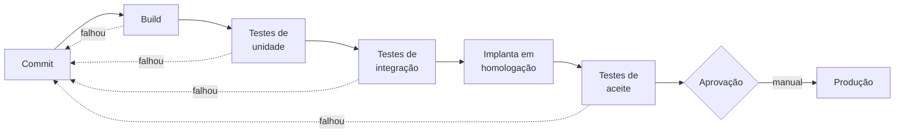

# Aula 04 — Como o Software Chega ao Usuário

> 🎯 Objetivos: explicar o caminho que uma mudança percorre até a produção, distinguir integração, entrega e implantação contínuas e avaliar a saúde de um time pelas métricas DORA.
> 🎬 Slides da aula: [apresentacao-04-entrega-continua-e-devops.pdf](apresentacao/apresentacao-04-entrega-continua-e-devops.pdf)

## 1. Versionar é decisão de engenharia

Você já sabe usar Git — é pré-requisito deste curso. O que ninguém conta é que **como o time usa Git é uma decisão de projeto**, com consequências que aparecem meses depois.

Duas pessoas trabalham no sistema de reserva. Uma cria um branch na segunda e integra na sexta. A outra cria um branch e fica três semanas nele, "para não quebrar nada". Na hora de integrar, a segunda pessoa enfrenta 40 conflitos, alguns em código que nem existia quando ela começou.

O nome disso é **inferno de integração**, e ele não tem nada a ver com habilidade: é uma consequência aritmética. Quanto mais tempo dois trabalhos ficam separados, mais eles divergem.

| Estratégia | Como funciona | Custa caro quando |
|---|---|---|
| **Branch por funcionalidade, curta** | branch vive horas ou 1–2 dias, integra rápido | quase nunca — é o padrão recomendado hoje |
| **Branch por funcionalidade, longa** | branch vive semanas | sempre; o conflito cresce com o tempo |
| **Fluxo com branches permanentes** (`main`, `develop`, `release`) | várias linhas de vida longa | times pequenos: cerimônia demais para o tamanho do problema |

> 💡 A regra prática que resolve 90% dos casos: **integre pelo menos uma vez por dia**. Se a sua funcionalidade não fica pronta em um dia, integre-a incompleta e desligada — a seção 7 mostra como.

## 2. Integração contínua

Da regra acima nasce a primeira prática: **integração contínua (CI)** é integrar o trabalho de todos várias vezes ao dia, e **a cada integração rodar automaticamente** a compilação e a bateria de testes.

Repare no que ela é e no que ela não é:

- **É** um hábito do time, sustentado por automação;
- **Não é** ter uma ferramenta instalada. *"Temos um servidor de CI"* e ninguém integra por duas semanas: não há integração contínua ali, há uma ferramenta ligada.

O que a CI compra:

| Sem CI | Com CI |
|---|---|
| O defeito aparece semanas depois, misturado a outros | aparece em minutos, isolado na mudança que o causou |
| "Na minha máquina funciona" | há uma máquina neutra que decide |
| Integrar é um evento tenso, agendado | integrar é rotina invisível |
| Ninguém sabe se `main` está saudável | o estado de `main` é público e sempre conhecido |

> ⚠️ CI só funciona com uma regra inegociável: **quando a esteira quebra, consertá-la é a prioridade do time** — antes de qualquer funcionalidade nova. Esteira vermelha tolerada por dois dias deixa de ser sinal e vira ruído, e a partir daí a CI está desligada na prática.

> 📖 Sommerville trata de integração contínua, gestão de versões e implantação no capítulo sobre gerenciamento de configuração.

## 3. Ambientes e a esteira

Uma mudança não pula do computador de quem escreveu para a mão do usuário. Ela passa por ambientes, e cada um responde a uma pergunta diferente:

| Ambiente | Pergunta que ele responde | Quem usa |
|---|---|---|
| **Desenvolvimento** | isso funciona isolado? | quem escreveu |
| **Integração / CI** | isso funciona junto com o resto? | ninguém; é automático |
| **Homologação** | o cliente concorda que é isso? | cliente e QA |
| **Produção** | o usuário real consegue usar? | o usuário |

A **esteira** (*pipeline*) é a sequência automatizada que leva a mudança de um ambiente ao seguinte:



Duas propriedades importam mais que os nomes das etapas:

- **As etapas baratas vêm primeiro.** Compilação em segundos, unidade em minutos, aceite em dezenas de minutos. Falhar cedo é falhar barato;
- **Qualquer falha volta para quem fez o commit**, imediatamente, com a informação do que quebrou.

> 💡 Homologação existe para uma pergunta que teste automatizado nunca responde: **"é isto que você queria?"**. Essa é a diferença entre verificação e validação, e a Aula 16 volta a ela com todas as letras.

## 4. Entrega contínua × implantação contínua

Os dois se abreviam CD e significam coisas diferentes:

| | **Entrega** contínua (*continuous delivery*) | **Implantação** contínua (*continuous deployment*) |
|---|---|---|
| O que garante | o sistema está **sempre pronto** para ir à produção | tudo que passa nos testes **vai** à produção |
| Quem decide subir | uma pessoa, quando o negócio quiser | ninguém; é automático |
| Exige | esteira confiável | esteira confiável **e** muita confiança nos testes |
| Cabe em | praticamente todo projeto | produtos maduros, com boa observabilidade |

A palavra-chave da entrega contínua é **prontidão**: a decisão de subir passa a ser do negócio, não uma operação técnica arriscada de fim de semana.

> ⚠️ **Poder subir a qualquer momento não significa subir a qualquer momento.** No sistema-guia, a janela ruim está no calendário: não se implanta versão nova na semana de provas, quando o uso multiplica. A capacidade técnica é contínua; a decisão continua sendo humana e contextual.

## 5. DevOps em uma tela

Existia — e ainda existe em muitos lugares — um muro. De um lado, quem desenvolve, avaliado por **entregar mudanças**. Do outro, quem opera, avaliado por **manter estabilidade**. Mudança é exatamente o que ameaça estabilidade, então os dois lados são pagos para brigar.

**DevOps** é o conjunto de práticas e, principalmente, de mudanças de responsabilidade que derruba esse muro:

- **Responsabilidade compartilhada** pelo software em produção. A frase que resume: *"you build it, you run it"* — quem constrói, opera;
- **Automação** de tudo que é repetitivo: build, teste, implantação, criação de ambiente;
- **Infraestrutura como código** — o ambiente descrito em arquivo versionado, não em passos manuais na memória de alguém;
- **Observabilidade** — registro, métrica e alerta que permitem saber o que o sistema está fazendo sem adivinhação;
- **Retrospectiva de incidente sem caça às bruxas.** Falha é propriedade do sistema, não defeito de caráter de quem apertou o botão.

> 💡 Note que só um desses cinco itens é sobre ferramenta. DevOps é majoritariamente sobre **quem responde pelo quê** — ou seja, é uma decisão organizacional que tem consequências de arquitetura. A Aula 14 mostra a mais famosa delas: sistemas que se implantam de forma independente exigem times que decidem de forma independente.

## 6. As quatro métricas DORA

Como saber se tudo isso está funcionando? O programa de pesquisa **DORA** acompanha times de software há mais de uma década e chegou a quatro métricas que, juntas, descrevem o desempenho de entrega:

| Métrica | Pergunta | Eixo |
|---|---|---|
| **Frequência de implantação** | com que frequência vocês colocam mudança em produção? | velocidade |
| **Tempo de espera da mudança** | do commit até estar em produção, quanto tempo? | velocidade |
| **Taxa de falha em mudanças** | que fração das implantações causa problema? | estabilidade |
| **Tempo para restaurar** | quando quebra, em quanto tempo volta ao normal? | estabilidade |

O resultado mais importante da pesquisa é contraintuitivo e vale memorizar: **velocidade e estabilidade não são opostos.** Os times que implantam com mais frequência são também os que falham menos e se recuperam mais rápido. A explicação é simples quando se enxerga: quem implanta todo dia implanta **mudanças pequenas** — fáceis de testar, fáceis de entender quando quebram e fáceis de reverter.

> ⚠️ As quatro só fazem sentido **em conjunto**. Frequência alta com taxa de falha alta não é maturidade, é pressa. E, como toda métrica, elas viram lixo quando são transformadas em meta de desempenho individual: dá para inflar frequência de implantação subindo mudanças vazias.

## 7. Chave de funcionalidade

Ficou uma pergunta em aberto na seção 1: como integrar todo dia uma funcionalidade que leva duas semanas para ficar pronta?

A resposta é separar duas coisas que costumam vir juntas:

- **Implantar** (*deploy*) — o código está na produção;
- **Liberar** (*release*) — o usuário consegue usar.

A **chave de funcionalidade** (*feature flag*) é uma condição que liga e desliga um recurso sem nova implantação. Com ela, o código incompleto vai à produção **desligado**: integra todo dia, não incomoda ninguém, e no dia da liberação alguém vira a chave.

O que isso permite:

- **Liberar para poucos primeiro** — só a secretaria vê a nova busca de espaços; se der errado, o estrago é pequeno;
- **Desligar em segundos** em vez de reverter uma implantação;
- **Separar a decisão de negócio da decisão técnica** — a funcionalidade sobe quando estiver pronta e é liberada quando o calendário permitir.

> ⚠️ Chave de funcionalidade é **dívida com prazo**. Cada uma acrescenta um caminho a mais no sistema, e duas chaves geram quatro combinações para testar. Toda chave nasce com data de remoção; as que ficam esquecidas por dois anos são um clássico da [dívida técnica](../../recursos/erros-comuns.md) que a Aula 16 discute.

## 🏋️ Exercícios da aula

Na pasta `aula-04/` do seu repositório:

1. **`ex01.md`** — desenhe em Mermaid a **esteira completa** do sistema de reserva de espaços, do commit à produção. Para cada etapa, escreva em uma linha: o que ela verifica, quanto tempo você espera que ela leve e **o que acontece quando ela falha**. Inclua pelo menos um portão de aprovação humana e justifique por que ele está onde está;
2. **`ex02.md`** — descreva **quatro problemas concretos** que aparecem num time sem integração contínua, em ordem do mais frequente ao mais grave. Para cada um, narre uma cena de meia dúzia de linhas (quem faz o quê, e o que dá errado) e diga **qual prática** da aula o teria evitado. Cenas genéricas não contam: use o sistema-guia;
3. **`ex03.md`** — classifique os quatro times abaixo pelas métricas DORA, do melhor ao pior desempenho de entrega, e **defenda a ordem**: (a) implanta 1× por trimestre, 5% de falha, restaura em 2 dias; (b) implanta 12× por dia, 30% de falha, restaura em 20 minutos; (c) implanta 1× por semana, 8% de falha, restaura em 3 horas; (d) implanta 3× por dia, 4% de falha, restaura em 1 hora. Depois responda: **qual deles você não consegue classificar com segurança e que informação faltou?**;
4. **`ex04.md`** — proponha a **estratégia de liberação** do sistema-guia para o primeiro período de uso real. Diga: em que momento do calendário a primeira versão sobe e por quê; quais funcionalidades entram na primeira liberação e quais ficam desligadas atrás de chave; quem pode aprovar uma implantação; e qual é o plano quando algo quebrar às 22h de uma véspera de entrega de trabalho;
5. **Desafio 🌶️ `ex05.md`** — a coordenação decidiu que **a partir do próximo período a reserva do auditório passa a exigir aprovação da direção** — uma mudança que altera o fluxo de todos os usuários e não pode dar errado, porque o auditório tem eventos contratados. Planeje o lançamento: como você implanta sem liberar, para quem libera primeiro, que sinal observado autoriza ampliar, que sinal manda desligar a chave, quanto tempo dura cada etapa e como o usuário é avisado. Feche com **o que você faria se o sinal for ambíguo** — nem claramente bom, nem claramente ruim. É a situação mais comum, e a que separa plano de torcida.

## 🧠 Revisão

[8 questões de múltipla escolha](revisao/README.md) para conferir se os conceitos ficaram sólidos. Responda sem consultar a aula — depois volte e corrija.

## ✅ Entrega

```bash
git add aula-04/
git commit -m "Resolve exercícios da aula 04 (entrega contínua e DevOps)"
git push
```

---

⬅️ [Aula 03 — Desenvolvimento ágil](../aula-03-desenvolvimento-agil/README.md) | ➡️ [Aula 05 — O que é um requisito](../../bloco-2-requisitos/aula-05-o-que-e-um-requisito/README.md)
