<!-- _class: capa -->

🚀

# Como o Software Chega ao Usuário

## Aula 04 · Bloco 1 — Software e processos

Do commit à produção — e por que velocidade e estabilidade andam juntas

---

## 🎯 Nesta aula

1. **Versionar** é decisão de engenharia
2. **Integração contínua** — hábito, não ferramenta
3. **Ambientes** e a esteira
4. Entrega × implantação contínua, e **DevOps**
5. As quatro métricas **DORA** e a chave de funcionalidade

---

## O inferno de integração

Uma pessoa cria um branch na segunda e integra na sexta. A outra fica **três semanas** no branch, "para não quebrar nada" — e enfrenta 40 conflitos, alguns em código que nem existia quando ela começou.

Não tem a ver com habilidade. É **aritmética**: quanto mais tempo dois trabalhos ficam separados, mais eles divergem.

> 💡 A regra que resolve 90% dos casos: **integre pelo menos uma vez por dia.**

---

## Integração contínua

Integrar o trabalho de todos várias vezes ao dia, e **a cada integração** rodar compilação e testes automaticamente.

| Sem CI | Com CI |
|---|---|
| O defeito aparece semanas depois, misturado | aparece em minutos, isolado |
| "Na minha máquina funciona" | há uma máquina neutra que decide |
| Integrar é um evento tenso, agendado | integrar é rotina invisível |
| Ninguém sabe se `main` está saudável | o estado de `main` é público |

---

<!-- _class: lead -->

## ⚠️ CI é hábito, não ferramenta

*"Temos um servidor de CI"* — e ninguém integra
por duas semanas. Não há integração contínua ali:
há uma **ferramenta ligada**.

E há uma regra inegociável:
**quando a esteira quebra, consertá-la é a prioridade do time.**

Esteira vermelha tolerada por dois dias
deixa de ser sinal e vira ruído.

---

## Cada ambiente responde a uma pergunta

| Ambiente | Pergunta | Quem usa |
|---|---|---|
| **Desenvolvimento** | isso funciona isolado? | quem escreveu |
| **Integração / CI** | funciona junto com o resto? | ninguém; é automático |
| **Homologação** | o cliente concorda que é isso? | cliente e QA |
| **Produção** | o usuário real consegue usar? | o usuário |

---

<!-- _class: diagrama -->

## A esteira

---

<!-- _class: lead -->

## 💡 Duas propriedades valem mais que os nomes

**As etapas baratas vêm primeiro.**
Compilação em segundos, unidade em minutos,
aceite em dezenas de minutos.
Falhar cedo é falhar barato.

**Qualquer falha volta para quem fez o commit** —
imediatamente, dizendo o que quebrou.

---

## Entrega × implantação contínua

Os dois se abreviam CD, e não são a mesma coisa:

| | **Entrega** contínua | **Implantação** contínua |
|---|---|---|
| Garante | está **sempre pronto** para subir | tudo que passa **vai** à produção |
| Quem decide | uma pessoa, quando o negócio quiser | ninguém; é automático |
| Exige | esteira confiável | esteira **e** muita confiança nos testes |
| Cabe em | quase todo projeto | produtos maduros, bem observados |

---

<!-- _class: lead -->

## ⚠️ Poder subir sempre ≠ subir sempre

No sistema-guia a janela ruim está no calendário:
**não se implanta versão nova na semana de provas**,
quando o uso multiplica.

A capacidade técnica é contínua;
a decisão continua **humana e contextual**.

---

<!-- _class: lista-limpa -->

## DevOps derruba um muro

De um lado, quem é avaliado por **entregar mudanças**. Do outro, quem é avaliado por **manter estabilidade**. Os dois lados são pagos para brigar.

- 🤝 **Responsabilidade compartilhada** — *you build it, you run it*;
- 🤖 **Automação** de tudo que é repetitivo;
- 📜 **Infraestrutura como código** — ambiente em arquivo versionado;
- 🔭 **Observabilidade** — saber o que o sistema faz sem adivinhar;
- 🕊️ **Incidente sem caça às bruxas** — falha é propriedade do sistema.

---

<!-- _class: lead -->

## 💡 Só um dos cinco é sobre ferramenta

DevOps é majoritariamente sobre
**quem responde pelo quê**.

Ou seja: é uma decisão **organizacional**
com consequências de **arquitetura**.

A Aula 14 mostra a mais famosa delas — sistemas que se
implantam sozinhos exigem times que decidem sozinhos.

---

## As quatro métricas DORA

| Métrica | Pergunta | Eixo |
|---|---|---|
| **Frequência de implantação** | com que frequência sobe mudança? | velocidade |
| **Tempo de espera da mudança** | do commit à produção, quanto tempo? | velocidade |
| **Taxa de falha em mudanças** | que fração causa problema? | estabilidade |
| **Tempo para restaurar** | quando quebra, em quanto volta? | estabilidade |

---

<!-- _class: lead -->

## 💡 O resultado contraintuitivo

**Velocidade e estabilidade não são opostos.**

Os times que implantam com mais frequência
são também os que falham menos
e se recuperam mais rápido.

Quem implanta todo dia implanta **mudanças pequenas** —
fáceis de testar, de entender quando quebram, de reverter.

⚠️ As quatro só valem **em conjunto**.

---

## Chave de funcionalidade

Como integrar todo dia algo que leva duas semanas? Separando o que costuma vir junto:

- **Implantar** — o código está na produção;
- **Liberar** — o usuário consegue usar.

A **chave de funcionalidade** liga e desliga um recurso sem nova implantação. O código incompleto sobe **desligado**.

> ⚠️ Toda chave é **dívida com prazo**: duas chaves geram quatro combinações para testar. Toda chave nasce com data de remoção.

---

<!-- _class: checkpoint -->

## 🏋️ Exercícios da aula

Na pasta `aula-04/`:

1. **`ex01.md`** — desenhe a esteira completa do sistema-guia, em Mermaid;
2. **`ex02.md`** — quatro problemas de um time sem CI, narrados como cena;
3. **`ex03.md`** — ordene quatro times pelas métricas DORA e **defenda a ordem**;
4. **`ex04.md`** — a estratégia de liberação do primeiro período de uso real;
5. **Desafio 🌶️ `ex05.md`** — lance a aprovação da direção para o auditório, sem quebrar ninguém.

---

<!-- _class: lead -->

## ➡️ Próximo bloco

**Bloco 2 — Requisitos**

**Aula 05 — O que é um requisito**

A causa número um de fracasso, atacada de frente.
