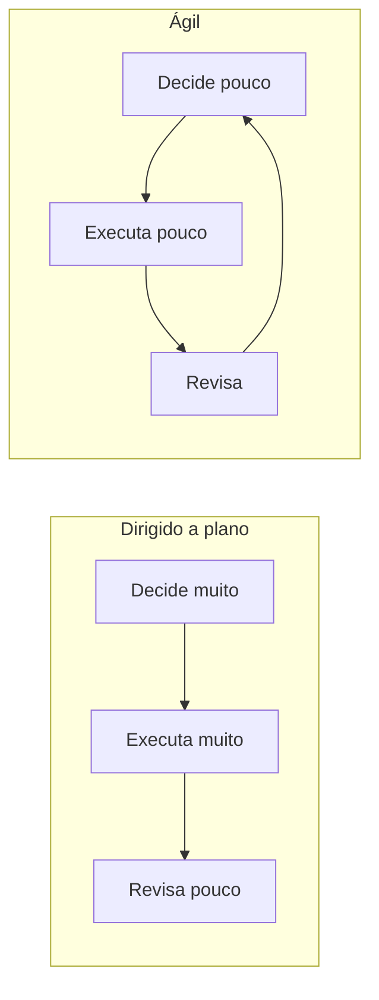

# Aula 05 — O Manifesto Ágil, lido devagar

> 🎯 Objetivos: interpretar os quatro valores do Manifesto sem os slogans, agrupar os doze princípios pelo que eles decidem, e reconhecer o time que usa o vocabulário ágil sem ter mudado nada.
> 🎬 Slides da aula: [apresentacao-05-manifesto-agil.pdf](apresentacao/apresentacao-05-manifesto-agil.pdf)

## 1. De onde veio o Manifesto

Em 2001, dezessete pessoas se reuniram numa estação de esqui em Utah. Nenhuma delas queria criar um método — todas já tinham o seu, e concorriam entre si. O que procuravam era o que os métodos tinham **em comum**.

O que saiu de lá tem **68 palavras**. Não é um método, não é um processo e não tem instruções. É uma declaração de preferência entre coisas que continuam todas valendo.

O contexto importa: naquele momento, projetos de software eram conduzidos com meses de levantamento antes de qualquer linha de código, e a taxa de fracasso era pública e alta. **O Manifesto é uma reação a isso** — e ler os quatro valores fora desse contexto é o que produz as interpretações mais estranhas.

Vinte e cinco anos depois, o contexto mudou de novo: hoje é raro encontrar quem defenda meses de levantamento antecipado, e o excesso oposto — nenhum planejamento, nenhum registro — ficou comum. **Um documento escrito contra um exagero costuma ser usado para justificar o exagero contrário**, e é por isso que vale ler o original em vez da versão que circula em apresentação.

> 💡 **Leia o original antes de aceitar qualquer interpretação.** São 68 palavras: [agilemanifesto.org/iso/ptbr](https://agilemanifesto.org/iso/ptbr/manifesto.html). Praticamente tudo que se atribui ao Manifesto não está escrito nele.

## 2. Os quatro valores, um a um

> **Indivíduos e interações** *mais que* processos e ferramentas
> **Software em funcionamento** *mais que* documentação abrangente
> **Colaboração com o cliente** *mais que* negociação de contratos
> **Responder a mudanças** *mais que* seguir um plano

E logo abaixo, a frase que quase ninguém cita:

> *"Ou seja, mesmo havendo valor nos itens à direita, valorizamos mais os itens à esquerda."*

Essa frase muda tudo. Os quatro valores **não são negações** — são preferências para quando os dois lados competem. Traduzindo cada um para uma decisão de segunda-feira:

| Valor | O que ele decide na prática |
|---|---|
| Indivíduos e interações | quando o processo atrapalha a conversa que resolveria o problema, muda-se o processo |
| Software em funcionamento | quando é preciso escolher entre documentar mais e entregar algo utilizável, entrega-se |
| Colaboração com o cliente | quando o contrato permite dizer "não estava no escopo", conversa-se antes de invocá-lo |
| Responder a mudanças | quando a realidade contradiz o plano, o plano cede — e é replanejado, não abandonado |

> ⚠️ **O item da direita continua valendo.** Processo, documentação, contrato e plano não são inimigos: o Manifesto diz que eles servem ao resultado, e não o contrário. Um time que não escreve nada e cita o Manifesto está citando um documento que ele não leu.

Repare que os quatro valores só se aplicam **quando os dois lados competem**. Na maior parte do tempo eles não competem: documentar a decisão de arquitetura da Aula 04 não atrasa nada e não disputa com software funcionando. O valor entra em cena no momento da escolha, e fora dele não diz nada.

## 3. O que o Manifesto não diz

Vale listar, porque é o que mais se atribui a ele:

- **Não diz que documentação é desperdício.** Diz que software funcionando vale mais quando os dois competem;
- **Não diz que não se planeja.** Diz que responder à mudança vale mais que seguir um plano que a realidade já contradisse;
- **Não diz que contrato não importa.** Diz que a colaboração resolve mais que a cláusula;
- **Não menciona Scrum, Kanban, sprint, story point nem reunião diária.** Nada disso está nas 68 palavras;
- **Não diz que serve para todo projeto.** Isso é uma afirmação de quem vende método, não do documento;
- **Não diz nada sobre estimativa, prazo ou orçamento.** As três continuam existindo, e continuam sendo responsabilidade de alguém.

A última merece atenção porque é a origem de um mal-entendido caro: times que concluem, do Manifesto, que não devem estimar. O documento simplesmente **não trata do assunto** — e o cliente que paga continua precisando saber, com alguma margem, quando terá o que pediu.

> 💡 **O teste do "mais que".** Quando alguém disser *"o ágil diz que X"*, procure X nos quatro valores. Se X não aparecer de um dos lados de um "mais que", **não é o Manifesto** — é a interpretação de alguém, que pode até estar certa, mas não tem a mesma autoridade.

## 4. Os doze princípios, agrupados

Os princípios são mais úteis que os valores, porque dizem o que fazer. São doze, e decoram-se mal; agrupados por **o que eles decidem**, cabem na cabeça:

| Grupo | O que os princípios desse grupo pedem |
|---|---|
| **Entrega** (1, 3, 7) | entregar cedo, com frequência, e medir progresso por software funcionando |
| **Mudança** (2) | aceitar mudança de requisito mesmo tarde, tratando-a como vantagem competitiva |
| **Pessoas** (4, 5, 6, 11) | negócio e desenvolvimento juntos, time motivado e confiável, conversa cara a cara, times auto-organizáveis |
| **Sustentabilidade** (8, 9, 10) | ritmo constante, excelência técnica contínua, e simplicidade — maximizar o trabalho **não** feito |
| **Melhoria** (12) | o time reflete e se ajusta em intervalos regulares |

Agrupar assim tem uma vantagem prática: quando um time diz que "é ágil", dá para perguntar por **grupo** em vez de por princípio. Um time que entrega com frequência e nunca se ajusta cumpre o primeiro grupo e ignora o último.

Os doze, na íntegra e na ordem original, para consulta:

| # | Princípio |
|:---:|---|
| 1 | Satisfazer o cliente com entrega **contínua e adiantada** de software de valor |
| 2 | **Aceitar mudanças** de requisitos, mesmo tarde, em favor da vantagem competitiva do cliente |
| 3 | Entregar software funcionando **com frequência**, da quinzena ao mês, preferindo a escala menor |
| 4 | Pessoas de **negócio e desenvolvimento** trabalhando juntas, diariamente, durante o projeto |
| 5 | Construir projetos em torno de **indivíduos motivados**: dê a eles ambiente, suporte e **confie** |
| 6 | A **conversa cara a cara** é o meio mais eficiente de transmitir informação dentro do time |
| 7 | **Software funcionando** é a medida primária de progresso |
| 8 | Promover **desenvolvimento sustentável**: manter indefinidamente um ritmo constante |
| 9 | Atenção contínua à **excelência técnica** e a bom projeto aumenta a agilidade |
| 10 | **Simplicidade** — a arte de maximizar a quantidade de trabalho **não** realizado |
| 11 | As melhores arquiteturas e requisitos emergem de **times auto-organizáveis** |
| 12 | Em intervalos regulares, o time **reflete** sobre como ficar mais efetivo e **se ajusta** |

Dois deles são os mais ignorados e os mais úteis:

**O 10 — simplicidade, a arte de maximizar o trabalho não realizado.** É o princípio que autoriza cortar escopo, e é o único que fala explicitamente em **não fazer**. Numa reunião em que todos propõem acréscimos, ele é a única frase do Manifesto que ampara quem propõe tirar.

**O 8 — ritmo constante e sustentável.** Ele diz que o time deve manter indefinidamente o mesmo ritmo. Um time que entrega em regime de esforço extra três iterações seguidas está violando um princípio ágil, ainda que use todas as cerimônias.

E há um par que se contradiz na prática, o que é uma boa notícia: o princípio **1** pede entrega adiantada e contínua; o **9** pede atenção contínua à excelência técnica. Sob pressão, os dois competem — entregar mais rápido custa qualidade interna, e cuidar da qualidade interna custa velocidade agora.

O Manifesto não resolve essa tensão, e não deveria. Ela é uma **decisão de projeto**, tomada caso a caso, e é exatamente o tipo de coisa que o Desafio 🌶️ deste curso pede para você defender por escrito.

> ⚠️ **Princípio 2 é o mais citado fora de contexto.** *"Aceitar mudanças de requisitos, mesmo tarde"* não significa aceitar sem replanejar — a Aula 01 mostrou que é exatamente isso que estoura prazo. Aceitar mudança é uma **decisão consciente com custo declarado**, não um reflexo.

## 5. Ágil não é ausência de processo

Um time ágil tem processo. Ele é diferente: curto, revisado com frequência e definido pelo próprio time. Mas existe, é explícito e é seguido.

O que muda é **quando as decisões são tomadas**:



O ciclo da direita não decide menos no total — decide **em pedaços menores e mais vezes**. Isso exige mais rigor, não menos: alguém precisa estar disponível para priorizar toda semana, e o time precisa terminar o que começou.

E há um custo que o entusiasmo esconde: **decidir muitas vezes cansa**. Um ciclo de duas semanas obriga a repriorizar 26 vezes por ano, e cada repriorização exige alguém informado e com autoridade. Onde essa pessoa não existe, o ciclo curto não produz adaptação — produz um backlog que ninguém ordena, que é o terceiro sinal da seção 6.

> ⚠️ **A pergunta que decide se o ágil é executável:** existe alguém disponível toda semana, com autoridade para dizer o que entra e o que sai? Se a resposta for não, a adoção vai parar na parte visível — e é a Aula 07 que trata de quem é essa pessoa.

> 💡 **É a mesma discussão da Aula 02, com outro nome.** O eixo preditivo–adaptativo é o mesmo eixo; o Manifesto é a defesa argumentada da ponta adaptativa.

## 6. O ágil teatral

O sintoma mais comum na prática profissional não é o time que rejeita o ágil — é o que adota o vocabulário sem mudar nada. Quatro sinais que denunciam:

| Sinal | O que está acontecendo de verdade |
|---|---|
| Sprints que são fases: levantar, desenhar, construir, testar | cascata com nomes novos, e o risco continua no fim |
| Reunião diária em que cada um presta contas ao gerente | reunião de status, não sincronização do time |
| Backlog que ninguém prioriza, e tudo é urgente | não há quem responda pelo valor — ver Aula 07 |
| Retrospectiva que nunca muda nada | ritual de desabafo; o princípio 12 pede ajuste, não conversa |
| Time "auto-organizável" que não pode decidir nada | o princípio 11 sem a autoridade que o torna possível |

Nenhum desses times está agindo de má-fé. Todos adotaram a parte visível — que é barata — e não a parte que exige mudar contrato, expectativa da diretoria e disponibilidade do cliente, que é cara.

O diagnóstico honesto costuma ser este: **a organização quer o resultado do ágil e não pode pagar as condições dele.** E há casos em que ela tem razão para não pagar — um contrato público com escopo em edital não vira adaptativo por decisão do time. Nesse caso, a resposta profissional não é fingir: é dizer o que **dá** para adotar sob aquelas condições, e o que não dá.

Práticas que funcionam mesmo em projeto preditivo, porque não dependem de escopo aberto:

- **entregar em incrementos utilizáveis**, ainda que o escopo total esteja fechado;
- **reunião curta e diária de sincronização**, desde que seja do time e não para o chefe;
- **retrospectiva a cada marco**, com ao menos uma mudança concreta saindo dela;
- **limite de trabalho em andamento**, que independe de metodologia.

> ⚠️ **Adotar ágil sem poder mudar escopo, prazo e orçamento é o teatro mais caro.** O time recebe a promessa de adaptação e a cobrança de previsibilidade ao mesmo tempo — e vai descobrir isso na primeira vez que tentar renegociar.

> 📖 O Cruz abre o livro justamente pelos valores e princípios, com a leitura de cada um aplicada ao dia a dia de um time. O Guia PMBOK trata do ambiente adaptativo na introdução, ao apresentar os tipos de ciclo de vida.

## 🏋️ Exercícios da aula

Na pasta `aula-05/` do seu repositório:

1. **`ex01.md`** — traduza cada um dos quatro valores numa **decisão concreta** que um gerente tomaria numa segunda-feira, no projeto de [achados e perdidos do campus](../../recursos/projetos-para-praticar.md#1-achados-e-perdidos-do-campus). Cada tradução precisa citar o que ficou do lado direito e continua valendo. *Confere assim: se alguma tradução sua eliminar o item da direita — "não vamos documentar" —, você negou o valor em vez de traduzi-lo.*

2. **`ex02.md`** — para cada afirmação, diga se ela **está** no Manifesto, e se não estiver, escreva o que ele de fato diz sobre o assunto: (a) "documentação é desperdício"; (b) "o time deve entregar software funcionando com frequência"; (c) "reunião diária de 15 minutos"; (d) "aceitar mudança de requisito mesmo tarde no desenvolvimento"; (e) "o ágil serve para qualquer projeto". *Confere assim: duas estão, três não — e uma das três que não estão é a que mais aparece em apresentação corporativa.*

3. **`ex03.md`** — agrupe os doze princípios nos cinco grupos da seção 4, e para **cada grupo** escreva uma frase dizendo que decisão ele orienta. Depois aponte **qual grupo** o projeto de [marketplace de serviços autônomos](../../recursos/projetos-para-praticar.md#9-marketplace-de-serviços-autônomos) mais precisa, e por quê. *Confere assim: o grupo que você escolher precisa se justificar pela restrição do projeto — seis meses de reserva financeira —, não pela preferência do time.*

4. **`ex04.md`** — diagnostique os quatro times descritos na seção 6 e, para cada um, escreva: o sinal observado, o que está acontecendo de verdade e **uma** mudança concreta que o faria deixar de ser teatro. *Confere assim: pelo menos uma das suas mudanças precisa esbarrar em algo fora do time — contrato, diretoria, disponibilidade do cliente —, senão você tratou só o sintoma barato.*

5. **`ex05.md`** — 🌶️ **Desafio.** Uma diretoria determinou que todos os projetos passem a ser ágeis. O seu tem escopo fechado em contrato, prazo com multa e um cliente que só aparece nas reuniões de medição — é a [Ouvidoria municipal](../../recursos/projetos-para-praticar.md#8-ouvidoria-municipal). **Escreva a resposta à diretoria**, contendo: (i) o que dá para adotar de verdade nesse contexto, e por quê; (ii) o que **não** dá, e a condição contratual ou organizacional que precisaria mudar; (iii) **o que se perde** se a determinação for cumprida só na forma. *Confere assim: se a sua resposta for "não dá" ou "dá tudo", releia — há práticas que funcionam sob contrato fechado e há promessas que não se sustentam sem mudar o contrato.*

## 🧠 Revisão

[8 questões de múltipla escolha](revisao/README.md) para conferir se os conceitos ficaram sólidos. Responda sem consultar a aula — depois volte e corrija.

## ✅ Entrega

```bash
git add aula-05/
git commit -m "Resolve exercícios da aula 05 (Manifesto Ágil)"
git push
```

---

⬅️ [Aula 04 — Arquitetura como decisão](../../bloco-1-fundamentos-de-projetos/aula-04-arquitetura-como-decisao/README.md) | ➡️ [Aula 06 — Scrum](../aula-06-scrum/README.md)
