<!-- _class: capa -->

📜

# O Manifesto Ágil, Lido Devagar

## Aula 05 · Bloco 2 — Metodologias de Gestão

68 palavras, e quase tudo que se atribui a elas não está lá

---

## 🎯 Nesta aula

Abre o Bloco 2. Até aqui, decisões tomadas por quem tinha autoridade formal; a partir de agora, os métodos que **distribuem** essa autoridade.

1. De onde **veio** o Manifesto
2. Os quatro **valores**, um a um
3. O que o Manifesto **não diz**
4. Os doze **princípios**, agrupados
5. Ágil **não é ausência de processo**
6. O **ágil teatral**

---

## Utah, 2001

Dezessete pessoas numa estação de esqui. **Nenhuma queria criar um método** — todas já tinham o seu, e concorriam entre si.

O que procuravam era o que os métodos tinham **em comum**.

O que saiu de lá tem **68 palavras**. Não é método, não é processo, não tem instruções: é uma **declaração de preferência** entre coisas que continuam todas valendo.

---

## Uma reação a um contexto

Em 2001, projetos de software eram conduzidos com **meses de levantamento antes da primeira linha de código**, e a taxa de fracasso era pública e alta.

Vinte e cinco anos depois o contexto mudou de novo: hoje é raro alguém defender meses de levantamento, e o excesso oposto — **nenhum planejamento, nenhum registro** — ficou comum.

> ⚠️ Um documento escrito **contra um exagero** costuma ser usado para justificar **o exagero contrário**.

---

<!-- _class: lead -->

## São 68 palavras

Leia o original antes de aceitar
qualquer interpretação:

**agilemanifesto.org/iso/ptbr**

Praticamente tudo que se atribui
ao Manifesto **não está escrito nele**.

---

## Os quatro valores

Os da esquerda são os **preferidos**. Os da direita **continuam valendo** — e é a frase seguinte do documento que deixa isso explícito.

---

## A frase que quase ninguém cita

> *"Ou seja, mesmo havendo valor nos itens à direita, valorizamos mais os itens à esquerda."*

Essa frase muda tudo. Os quatro valores **não são negações**: são **preferências para quando os dois lados competem**.

E na maior parte do tempo eles **não competem**.

---

## Quando o valor entra em cena

Documentar a decisão de arquitetura da Aula 04 **não atrasa nada** e não disputa com software funcionando. Ali o valor simplesmente não opina.

---

<!-- _class: tabela-densa -->

## Traduzindo para segunda-feira

| Valor | O que ele decide na prática |
|---|---|
| **Indivíduos e interações** | quando o processo atrapalha a conversa que resolveria o problema, muda-se o processo |
| **Software em funcionamento** | entre documentar mais e entregar algo utilizável, entrega-se |
| **Colaboração com o cliente** | quando o contrato permite dizer "não estava no escopo", conversa-se antes de invocá-lo |
| **Responder a mudanças** | quando a realidade contradiz o plano, o plano cede — e é **replanejado**, não abandonado |

---

## ⚠️ O item da direita continua valendo

Processo, documentação, contrato e plano **não são inimigos**. O Manifesto diz que eles **servem ao resultado**, e não o contrário.

Os quatro valores só entram **no momento da escolha**. Fora dele, não dizem nada.

> ⚠️ Um time que não escreve nada e cita o Manifesto está citando **um documento que ele não leu**.

---

## O que o Manifesto NÃO diz

- **não** diz que documentação é desperdício;
- **não** diz que não se planeja;
- **não** diz que contrato não importa;
- **não** menciona Scrum, Kanban, sprint, *story point* nem reunião diária;
- **não** diz que serve para todo projeto;
- **não** diz nada sobre estimativa, prazo ou orçamento.

Tudo isso é atribuído a ele. **Nada disso está nas 68 palavras.**

---

## O mal-entendido mais caro

A última da lista merece atenção, porque custa dinheiro: times que concluem, do Manifesto, que **não devem estimar**.

O documento simplesmente **não trata do assunto**.

E o cliente que paga continua precisando saber, **com alguma margem, quando terá o que pediu**. Isso continua sendo responsabilidade de alguém, com ou sem Manifesto.

---

<!-- _class: lead -->

## O teste do "mais que"

Quando alguém disser
*"o ágil diz que X"*,
procure X nos quatro valores.

Se X não aparecer de um dos lados
de um "mais que", **não é o Manifesto** —
é a interpretação de alguém.

---

## Doze princípios decoram-se mal

Os princípios são **mais úteis que os valores**, porque dizem o que fazer. Mas são doze, e ninguém guarda doze.

Agrupados por **o que eles decidem**, cabem na cabeça — e a vantagem é prática: dá para perguntar a um time **por grupo**, em vez de por princípio.

Um time que entrega com frequência e **nunca se ajusta** cumpre o primeiro grupo e ignora o último.

---

## Os cinco grupos

Cinco perguntas em vez de doze frases. É esse agrupamento que o `ex03` cobra: escolher **o grupo de que o marketplace mais precisa**, e justificar.

---

<!-- _class: tabela-densa -->

## Os doze, na íntegra — 1 a 6

| # | Princípio |
|:---:|---|
| 1 | Satisfazer o cliente com entrega **contínua e adiantada** de software de valor |
| 2 | **Aceitar mudanças** de requisitos, mesmo tarde, em favor da vantagem competitiva |
| 3 | Entregar software funcionando **com frequência**, da quinzena ao mês |
| 4 | Pessoas de **negócio e desenvolvimento** trabalhando juntas, diariamente |
| 5 | Construir projetos em torno de **indivíduos motivados** — e **confiar** neles |
| 6 | A **conversa cara a cara** é o meio mais eficiente de transmitir informação |

---

<!-- _class: tabela-densa -->

## Os doze, na íntegra — 7 a 12

| # | Princípio |
|:---:|---|
| 7 | **Software funcionando** é a medida primária de progresso |
| 8 | Promover **desenvolvimento sustentável**: manter indefinidamente um ritmo constante |
| 9 | Atenção contínua à **excelência técnica** e a bom projeto aumenta a agilidade |
| 10 | **Simplicidade** — a arte de maximizar a quantidade de trabalho **não** realizado |
| 11 | As melhores arquiteturas e requisitos emergem de **times auto-organizáveis** |
| 12 | Em intervalos regulares, o time **reflete** sobre como ficar mais efetivo e **se ajusta** |

---

## Princípio 10 — o único que fala em não fazer

> *"Simplicidade — a arte de maximizar a quantidade de trabalho **não** realizado."*

É o princípio que **autoriza cortar escopo**.

Numa reunião em que todo mundo propõe acréscimos, ele é **a única frase do Manifesto que ampara quem propõe tirar**.

---

## Princípio 8 — ritmo constante

> *"Promover desenvolvimento sustentável: manter **indefinidamente** um ritmo constante."*

A palavra que carrega o princípio é *indefinidamente*.

Um time que entrega em **regime de esforço extra três iterações seguidas** está violando um princípio ágil — ainda que cumpra todas as cerimônias.

---

## E dois deles se contradizem

Entregar mais rápido custa qualidade interna; cuidar da qualidade interna custa velocidade agora. O Manifesto **não resolve, e não deveria**.

---

## ⚠️ O princípio 2 é o mais citado fora de contexto

*"Aceitar mudanças de requisitos, mesmo tarde"* **não significa aceitar sem replanejar**.

A Aula 01 mostrou que é exatamente isso que estoura prazo: a mudança entra, e nada sai nem se move.

> ⚠️ Aceitar mudança é uma **decisão consciente com custo declarado**, não um reflexo.

---

## Ágil não é ausência de processo

Um time ágil **tem processo**. Ele é diferente — **curto, revisado com frequência e definido pelo próprio time** —, mas existe, é explícito e é seguido.

O que muda não é a **quantidade** de processo. É **quando as decisões são tomadas**.

---

## Onde as decisões são tomadas

O ciclo de baixo **não decide menos no total** — decide em pedaços menores e mais vezes. Isso exige **mais** rigor, não menos.

---

## Decidir muitas vezes cansa

É o custo que o entusiasmo esconde. Um ciclo de duas semanas obriga a **repriorizar 26 vezes por ano**, e cada repriorização exige alguém informado e com autoridade.

Onde essa pessoa não existe, o ciclo curto **não produz adaptação** — produz um backlog que ninguém ordena.

> 💡 É a mesma discussão da Aula 02 com outro nome: o Manifesto é a **defesa argumentada da ponta adaptativa**.

---

<!-- _class: lead -->

## ⚠️ A pergunta que decide

se o ágil é executável:

**existe alguém disponível toda semana,
com autoridade para dizer
o que entra e o que sai?**

Se não, a adoção vai parar
na parte visível.

---

<!-- _class: tabela-densa -->

## O ágil teatral

| Sinal | O que está acontecendo de verdade |
|---|---|
| Sprints que são fases: levantar, desenhar, construir, testar | cascata com nomes novos, e o risco continua no fim |
| Reunião diária em que cada um presta contas ao gerente | reunião de status, não sincronização do time |
| Backlog que ninguém prioriza, e tudo é urgente | não há quem responda pelo valor — ver Aula 07 |
| Retrospectiva que nunca muda nada | ritual de desabafo; o princípio 12 pede ajuste |
| Time "auto-organizável" que não pode decidir nada | o princípio 11 sem a autoridade que o torna possível |

---

## O barato e o caro

**Nenhum desses times age de má-fé.** Todos adotaram a parte visível — e não a que exige mudar contrato, expectativa da diretoria e disponibilidade do cliente.

---

## O que dá para adotar sob contrato fechado

**A organização quer o resultado do ágil e não pode pagar as condições dele.** A resposta profissional não é fingir — é dizer o que dá, porque nem tudo depende de escopo aberto:

- **entregar em incrementos utilizáveis**, mesmo com o escopo total fechado;
- **reunião curta e diária de sincronização** — do time, não para o chefe;
- **retrospectiva a cada marco**, com uma mudança concreta saindo dela;
- **limite de trabalho em andamento**, que independe de metodologia.

> ⚠️ Um contrato público com escopo em edital **não vira adaptativo por decisão do time** — e prometer adaptação cobrando previsibilidade é o teatro mais caro.

---

<!-- _class: checkpoint -->

## 🏋️ Exercícios da aula

Na pasta `aula-05/`:

1. **`ex01.md`** — traduzir os quatro valores em decisões concretas;
2. **`ex02.md`** — cinco afirmações: estão no Manifesto?
3. **`ex03.md`** — agrupar os doze princípios e escolher o grupo que o marketplace precisa;
4. **`ex04.md`** — diagnosticar os quatro times do ágil teatral;
5. **`ex05.md`** 🌶️ — resposta à diretoria que determinou "ser ágil" sob contrato fechado.

---

<!-- _class: lead -->

## ➡️ Próxima aula

**Aula 06 — Scrum**

A resposta mais adotada
à pergunta desta aula.

E ela começa pelos **papéis**,
não pelas reuniões.
