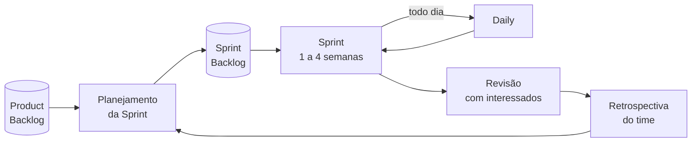

# Aula 06 — Scrum

> 🎯 Objetivos: descrever as três responsabilidades do Scrum e o que cada uma decide, situar os cinco eventos no ciclo da Sprint e ligar cada artefato ao compromisso que ele carrega.
> 🎬 Slides da aula: [apresentacao-06-scrum.pdf](apresentacao/apresentacao-06-scrum.pdf)

## 1. O que o Scrum é, e o que ele não é

A Aula 05 terminou numa pergunta: *existe alguém disponível toda semana, com autoridade para dizer o que entra e o que sai?* O Scrum é a resposta mais adotada a essa pergunta — e é por isso que ele começa pelos papéis, e não pelas reuniões.

**Scrum é um arcabouço**, não um método. Ele define **três responsabilidades, cinco eventos e três artefatos**, e para de definir. Não diz como estimar, como testar, como escrever requisito nem como organizar o código.

Isso é deliberado, e tem uma consequência incômoda: **o Scrum torna os problemas visíveis sem resolvê-los.** Se a equipe não consegue terminar nada em duas semanas, a Sprint vai expor isso na primeira revisão. O arcabouço não conserta; ele só impede que o problema fique escondido por seis meses.

| O Scrum define | O Scrum **não** define |
|---|---|
| quem responde por quê | como estimar |
| quando o time se reúne, e para quê | como escrever requisito |
| o que existe de artefato, e o compromisso de cada um | como testar, integrar ou implantar |
| que a Sprint tem tamanho fixo | qual é o tamanho |

> 💡 **O guia oficial tem 13 páginas.** Tudo o mais que existe sobre Scrum é comentário sobre elas — e vale ler o original, pelo mesmo motivo da Aula 05. Está em [scrumguides.org](https://scrumguides.org/download.html), com tradução para o português.

## 2. As três responsabilidades

| Responsabilidade | Responde por | Decide |
|---|---|---|
| **Product Owner** | o **valor** do produto | o que se faz e em que ordem |
| **Scrum Master** | a **eficácia** do processo | como o time trabalha; remove impedimento |
| **Desenvolvedores** | a **entrega** do incremento | como se faz e quanto cabe na Sprint |

Três fronteiras que quase todo time atravessa por engano:

**O Product Owner não decide como.** Ele diz que o balcão precisa registrar devolução; não diz em que tela nem com que tecnologia.

**O Scrum Master não decide o quê.** Ele não repriorizza o backlog, não define escopo da Sprint e não manda em ninguém. Quando ele decide escopo, o Product Owner vira decorativo — e é o defeito mais comum na adoção.

**Os desenvolvedores decidem quanto cabe.** O Product Owner ordena a lista; quem diz o que consegue puxar para a Sprint é quem vai construir. Uma Sprint com escopo imposto de fora deixa de ser compromisso e vira meta.

Essas três fronteiras são a mesma coisa que a matriz da Aula 01, escrita de outro jeito: **cada tipo de decisão tem exatamente um dono**. A diferença é que aqui os donos vêm nomeados de fábrica, e a organização não precisa negociá-los projeto a projeto.

> 💡 **É por isso que o Scrum incomoda.** Ele torna explícito quem decide o quê — e em muitas organizações essa era justamente a ambiguidade confortável que permitia a todos opinarem sobre tudo sem responder por nada.

> ⚠️ **"Responsabilidade" não é "pessoa".** Num time de quatro, uma pessoa pode acumular Scrum Master e desenvolvedora. O que não pode é acumular **Product Owner e Scrum Master**: um puxa por escopo, o outro protege o processo, e a mesma pessoa nos dois papéis sempre cede para o lado que a pressiona mais.

## 3. Os cinco eventos

A **Sprint** é o evento que contém os outros quatro. Tem tamanho fixo — uma a quatro semanas — e não se prorroga.



| Evento | Duração típica | Pergunta que ele responde |
|---|---|---|
| **Planejamento** | até 8 h numa Sprint de 1 mês | por que esta Sprint tem valor, o que entra e como será feito |
| **Daily** | 15 min, todo dia | o que muda no plano do time para as próximas 24 h |
| **Revisão** | até 4 h | o que foi feito, e o que isso muda no produto — **com os interessados** |
| **Retrospectiva** | até 3 h | como o time trabalha, e o que ele muda a partir de amanhã |
| **Sprint** | 1 a 4 semanas | contém os quatro acima |

Duas distinções que decidem se os eventos funcionam:

**Revisão ≠ Retrospectiva.** A primeira olha para o **produto** e é aberta a quem se interessa; a segunda olha para o **processo do time** e é do time. Fundir as duas é comum, e o que se perde é sempre a segunda: com interessados na sala, ninguém levanta o que não está funcionando.

**A Daily é do time, não para o chefe.** Ela existe para os desenvolvedores replanejarem o próprio dia. Quando vira prestação de contas — cada um relatando o que fez ao gerente —, ela consome 15 minutos diários e não replaneja nada.

O teste que separa as duas em dez segundos: **numa Daily de verdade, o plano do dia muda por causa do que alguém disse.** Se ninguém ajusta nada e todos saem fazendo o que já iam fazer, foi relatório em pé.

Os eventos têm **duração máxima**, não obrigatória. Uma retrospectiva de 40 minutos que produz um ajuste vale mais que uma de três horas que produz uma lista de reclamações — o teto existe para impedir a reunião que não acaba, não para ser preenchido.

> ⚠️ **Evento cancelado "porque não havia o que discutir" é sintoma, não economia.** Uma retrospectiva sem pauta costuma significar que o time não se sente à vontade para trazer pauta.

## 4. Os três artefatos e seus compromissos

Cada artefato carrega um **compromisso** — a parte que torna o artefato verificável em vez de decorativo:

| Artefato | O que é | Compromisso |
|---|---|---|
| **Product Backlog** | tudo o que se quer fazer no produto, ordenado | **Meta do Produto** — o objetivo de longo prazo |
| **Sprint Backlog** | o que o time puxou para esta Sprint, mais o plano | **Meta da Sprint** — o porquê desta Sprint |
| **Incremento** | o resultado utilizável produzido | **Definição de Pronto** — o que "terminado" significa |

A **Definição de Pronto** é a mais ignorada e a mais útil. Ela é uma lista curta, acordada pelo time, do que precisa estar verdadeiro para um item ser considerado terminado. Para o projeto de achados e perdidos:

- [ ] revisado por outra pessoa;
- [ ] testado com os três casos de exceção acordados;
- [ ] texto de tela revisado por quem atende na portaria;
- [ ] publicado no ambiente de homologação.

Sem ela, "pronto" significa coisas diferentes para cada pessoa, e o incremento da revisão vira uma discussão sobre o que conta como entregue.

Repare que **todos os quatro itens podem ser respondidos com sim ou não** por alguém que não escreveu o código. É esse o teste: *"código de qualidade"* e *"bem testado"* não passam nele, porque dependem de julgamento de quem fez.

E há uma consequência de gestão: a Definição de Pronto **muda a velocidade do time**. Um time que acrescenta "revisado por outra pessoa" à lista vai entregar menos itens por Sprint — e isso não é piora, é o mesmo trabalho medido com régua mais honesta. Quem não sabe disso lê a queda como queda de desempenho.

O **Product Backlog** também tem uma regra que se ignora: ele é **ordenado**, não priorizado por categorias. Não existem dez itens "alta prioridade" — existe o primeiro, o segundo, o terceiro. É o que obriga a decisão que a Aula 01 chama de escolher entre alternativas.

> 💡 **A Meta da Sprint é o que permite negociar dentro dela.** Se a meta é *"o atendente consegue registrar um item encontrado e localizá-lo depois"*, o time pode cortar um campo do formulário sem trair o combinado. Sem meta, cortar qualquer coisa parece falhar.

## 5. A Sprint em uma tela

Aplicado ao projeto de [achados e perdidos](../../recursos/projetos-para-praticar.md#1-achados-e-perdidos-do-campus), com Sprint de duas semanas:

| Momento | O que acontece | Quem conduz |
|---|---|---|
| Segunda, dia 1 | **Planejamento**: a meta é registrar e localizar item; o time puxa 6 itens do topo do backlog | PO propõe, devs escolhem quanto |
| Todo dia, 15 min | **Daily**: o time replaneja as 24 h seguintes | desenvolvedores |
| Ao longo | trabalho, com o backlog da Sprint sendo ajustado pelo próprio time | desenvolvedores |
| Sexta, dia 10 | **Revisão**: demonstra-se o registro funcionando; a portaria diz que falta buscar por data | todos + interessados |
| Sexta, dia 10 | **Retrospectiva**: o time nota que dois itens ficaram parados esperando revisão | time |
| Segunda, dia 11 | nova Sprint, já com o ajuste da retrospectiva em vigor | — |

Repare no que a retrospectiva produziu: **um ajuste concreto**, e não uma conversa. Se ao fim dela nada muda no modo de trabalhar, o princípio 12 da Aula 05 não foi cumprido.

E repare no que a revisão produziu: a portaria disse que falta buscar por data. Isso **não vira** um item na Sprint atual — vai para o Product Backlog, e o Product Owner decide onde ele entra. A Sprint é protegida de escopo novo justamente para que o time consiga terminar o que combinou.

> ⚠️ **A única coisa que interrompe uma Sprint é a meta perder sentido**, e quem pode cancelá-la é o **Product Owner**. Não é o Scrum Master, não é o gerente, não é a diretoria. É uma decisão rara e cara, e ter um dono declarado evita que ela seja tomada de fato por acúmulo de pedidos de fora.

Um detalhe do quadro acima que costuma passar batido: o ajuste da retrospectiva entra em vigor **na Sprint seguinte**, e não "quando der". É isso que transforma reflexão em prática — e é a diferença entre o princípio 12 cumprido e o ritual de desabafo da Aula 05.

## 6. Velocidade não é meta

A **velocidade** é quanto o time entregou por Sprint, medida em qualquer unidade que ele use. Ela serve para **prever** o que cabe na próxima.

Usada para cobrar, ela é trivialmente inflacionável: basta estimar mais alto. O time entrega o mesmo, o número sobe, e o gráfico melhora enquanto o produto não anda. É o exemplo mais limpo de **métrica que virou meta** — assunto da Aula 10.

Três usos legítimos e três indevidos:

| Legítimo | Indevido |
|---|---|
| prever quanto cabe na próxima Sprint | comparar dois times |
| perceber que o time desacelerou e perguntar por quê | compor avaliação individual |
| dimensionar expectativa com o cliente | fixar como meta a ser batida |

> ⚠️ **Comparar velocidade entre times é sempre inválido**, mesmo com boa intenção: a unidade é uma convenção interna de cada time, e não existe conversão. Dois times com velocidade 30 podem estar entregando quantidades completamente diferentes.

Por trás do pedido de comparação costuma haver uma pergunta legítima — *"estamos entregando o suficiente?"* ou *"onde está o gargalo?"* —, e ela merece resposta. O que não serve é a velocidade. Servem, por exemplo, o tempo entre um item entrar no backlog e chegar ao usuário, ou a quantidade de itens que voltaram por não estarem prontos.

**Recusar uma métrica sem oferecer outra é meio trabalho.** Quem pediu continua com a pergunta, e vai obter o número de algum jeito — geralmente de um jeito pior.

> 📖 O Cruz dedica a maior parte do livro ao Scrum, com um capítulo por responsabilidade, por evento e por artefato, e um bom tratamento da Definição de Pronto. O guia oficial do Scrum, em português, é a fonte primária e cabe numa hora de leitura.

## 🏋️ Exercícios da aula

Na pasta `aula-06/` do seu repositório:

1. **`ex01.md`** — atribua cada decisão à responsabilidade correta — Product Owner, Scrum Master ou desenvolvedores: (a) qual item entra primeiro no backlog; (b) quantos itens cabem nesta Sprint; (c) mudar o horário da Daily; (d) que o item só é "pronto" depois de revisado por outra pessoa; (e) adiar a entrega do relatório para a Sprint seguinte; (f) qual banco de dados usar; (g) chamar o gestor da portaria para a revisão; (h) interromper a Sprint porque a meta perdeu sentido. *Confere assim: a (h) é a única em que a responsabilidade formal não é a que a maioria chuta — procure no guia quem pode cancelar uma Sprint.*

2. **`ex02.md`** — monte o cronograma de uma Sprint de duas semanas do projeto de [marketplace de serviços autônomos](../../recursos/projetos-para-praticar.md#9-marketplace-de-serviços-autônomos), no formato da tabela da seção 5, com os cinco eventos, quem conduz cada um e a duração. *Confere assim: revisão e retrospectiva precisam aparecer separadas e com públicos diferentes — se ficaram na mesma linha, releia a seção 3.*

3. **`ex03.md`** — escreva a **Definição de Pronto** do projeto de [achados e perdidos](../../recursos/projetos-para-praticar.md#1-achados-e-perdidos-do-campus), com no mínimo cinco itens verificáveis, e explique em uma frase por que cada um está lá. *Confere assim: todo item precisa poder ser respondido com sim ou não por alguém que não escreveu o código. "Código de qualidade" não passa nesse teste.*

4. **`ex04.md`** — diagnostique quatro Sprints com defeito, dizendo qual evento ou artefato está ausente ou desvirtuado: (a) a Daily dura 40 minutos e cada um relata ao gerente o que fez; (b) a revisão acontece sem nenhum interessado externo; (c) o time descobre no dia 9 que a meta era impossível desde o dia 2; (d) três Sprints seguidas terminam com itens "quase prontos" que voltam para a seguinte. *Confere assim: a (d) não é problema de evento — é de artefato, e o nome dele está na seção 4.*

5. **`ex05.md`** — 🌶️ **Desafio.** A diretoria pediu um painel comparando a velocidade dos três times da empresa, para "identificar o time de maior desempenho". Você é o Scrum Master de um deles. **Escreva a resposta**, contendo: (i) por que a comparação é inválida, com o argumento que sustenta isso; (ii) **o que você oferece no lugar** — uma medida que responda à pergunta legítima por trás do pedido; (iii) **o que se perde** com a sua proposta em relação ao que foi pedido. *Confere assim: recusar sem oferecer alternativa não resolve — a diretoria tem uma pergunta legítima, e o item (ii) é a parte difícil do exercício.*

## 🧠 Revisão

[8 questões de múltipla escolha](revisao/README.md) para conferir se os conceitos ficaram sólidos. Responda sem consultar a aula — depois volte e corrija.

## ✅ Entrega

```bash
git add aula-06/
git commit -m "Resolve exercícios da aula 06 (Scrum)"
git push
```

---

⬅️ [Aula 05 — O Manifesto Ágil, lido devagar](../aula-05-manifesto-agil/README.md) | ➡️ [Aula 07 — Quem responde pelo quê](../aula-07-quem-responde-pelo-que/README.md)
