<!-- _class: capa -->

🔄

# Scrum

## Aula 06 · Bloco 2 — Metodologias de Gestão

Ele torna os problemas visíveis sem resolvê-los

---

## 🎯 Nesta aula

1. O que o Scrum **é**, e o que ele não é
2. As três **responsabilidades** — e as fronteiras entre elas
3. Os cinco **eventos**
4. Os três **artefatos** e seus compromissos
5. A **Sprint** em uma tela
6. **Velocidade não é meta**

---

## De onde viemos

A Aula 05 terminou numa pergunta:

> *Existe alguém disponível toda semana, com autoridade para dizer o que entra e o que sai?*

O Scrum é **a resposta mais adotada** a essa pergunta — e é por isso que ele **começa pelos papéis**, e não pelas reuniões.

---

## Um arcabouço, não um método

O Scrum define **três responsabilidades, cinco eventos e três artefatos** — e **para de definir**.

Não diz como estimar, como testar, como escrever requisito nem como organizar o código. Isso é deliberado: o arcabouço dá a **forma**, e o time preenche com as práticas que escolher.

> 💡 **O guia oficial tem 13 páginas**, com tradução em *scrumguides.org*. Tudo o mais que existe sobre Scrum é comentário sobre elas.

---

## O que ele define — e o que deixa em aberto

| O Scrum define | O Scrum **não** define |
|---|---|
| quem responde por quê | como estimar |
| quando o time se reúne, e para quê | como escrever requisito |
| que artefatos existem, e o compromisso de cada um | como testar, integrar ou implantar |
| que a Sprint tem tamanho fixo | qual é o tamanho |

A coluna da direita não é esquecimento: é **escolha do time**.

---

<!-- _class: lead -->

## Ele torna os problemas visíveis

sem resolvê-los.

Se a equipe não termina nada
em duas semanas, **a primeira revisão**
expõe isso.

O arcabouço não conserta —
impede que o problema fique escondido
**por seis meses**.

---

## As três responsabilidades

A última linha de cada caixa é **a fronteira** — e é ela que quase todo time atravessa por engano.

---

## Quem responde por quê

| Responsabilidade | Responde por | Decide |
|---|---|---|
| **Product Owner** | o **valor** do produto | o que se faz e em que ordem |
| **Scrum Master** | a **eficácia** do processo | como o time trabalha; remove impedimento |
| **Desenvolvedores** | a **entrega** do incremento | como se faz e quanto cabe na Sprint |

**O PO decide o quê. O time decide o como e o quanto. Ninguém decide os dois.**

---

## Três fronteiras atravessadas por engano

**O Product Owner não decide como.** Ele diz que o balcão precisa registrar devolução; não diz em que tela nem com que tecnologia.

**O Scrum Master não decide o quê.** Não reprioriza o backlog nem define escopo. Quando ele decide escopo, o PO vira decorativo — **o defeito mais comum na adoção**.

**Os desenvolvedores decidem quanto cabe.** Sprint com escopo imposto de fora **deixa de ser compromisso e vira meta**.

---

## Um dono por decisão

As três fronteiras são **a matriz da Aula 01 escrita de outro jeito**: cada tipo de decisão tem **exatamente um dono**.

A diferença é que aqui os donos vêm **nomeados de fábrica** — a organização não precisa negociá-los projeto a projeto.

> 💡 **É por isso que o Scrum incomoda.** Ele torna explícito quem decide o quê — e em muitas organizações essa era a ambiguidade confortável que deixava todos opinarem sobre tudo sem responder por nada.

---

<!-- _class: lead -->

## ⚠️ Responsabilidade não é pessoa

Num time de quatro, uma pessoa pode
acumular **Scrum Master e desenvolvedora**.

O que não pode é acumular
**Product Owner e Scrum Master**:

um puxa por escopo, o outro protege o processo —
e a mesma pessoa sempre cede
para quem pressiona mais.

---

## O ciclo da Sprint

A **Sprint** é o evento que **contém os outros quatro**. Tem tamanho fixo — uma a quatro semanas — e **não se prorroga**. A seta vermelha é o que faz disto um ciclo.

---

<!-- _class: tabela-densa -->

## Os cinco eventos

| Evento | Duração máxima | Pergunta que ele responde |
|---|---|---|
| **Planejamento** | 8 h, numa Sprint de 1 mês | por que esta Sprint tem valor, o que entra e como será feito |
| **Daily** | 15 min, todo dia | o que muda no plano do time para as próximas 24 h |
| **Revisão** | 4 h | o que foi feito, e o que isso muda no produto — **com os interessados** |
| **Retrospectiva** | 3 h | como o time trabalha, e o que ele muda a partir de amanhã |
| **Sprint** | 1 a 4 semanas | contém os quatro acima |

---

## Revisão ≠ Retrospectiva

Fundir as duas é comum, e **o que se perde é sempre a segunda**: com interessados na sala, ninguém levanta o que não está funcionando.

---

## A Daily é do time, não para o chefe

Ela existe para os **desenvolvedores replanejarem o próprio dia**.

Quando vira prestação de contas — cada um relatando ao gerente o que fez —, ela consome 15 minutos diários e **não replaneja nada**.

> 💡 **O teste, em dez segundos:** numa Daily de verdade, **o plano do dia muda** por causa do que alguém disse. Se todos saem fazendo o que já iam fazer, foi relatório em pé.

---

## O teto não é meta

Os eventos têm **duração máxima**, não obrigatória.

Uma retrospectiva de **40 minutos que produz um ajuste** vale mais que uma de três horas que produz uma lista de reclamações. O teto existe para impedir a reunião que não acaba — **não para ser preenchido**.

> ⚠️ **Evento cancelado "porque não havia o que discutir" é sintoma, não economia.** Retrospectiva sem pauta costuma significar que o time não se sente à vontade para trazer pauta.

---

## Três artefatos, três compromissos

O **compromisso** é a parte que torna o artefato **verificável**, em vez de decorativo.

---

## A Definição de Pronto

Uma **lista curta, acordada pelo time**, do que precisa ser verdade para um item contar como terminado. No achados e perdidos:

- [ ] revisado por outra pessoa;
- [ ] testado com os três casos de exceção acordados;
- [ ] texto de tela revisado por quem atende na portaria;
- [ ] publicado no ambiente de homologação.

Sem ela, "pronto" significa uma coisa diferente para cada pessoa.

---

## O teste do sim ou não

Os quatro itens podem ser respondidos com **sim ou não** — por alguém que **não escreveu o código**. É esse o teste de um bom item.

| ❌ Não passa | ✅ Passa |
|---|---|
| "código de qualidade" | "revisado por outra pessoa" |
| "bem testado" | "testado com os três casos de exceção" |

Os da esquerda **dependem do julgamento de quem fez**.

---

<!-- _class: lead -->

## A Definição de Pronto muda a velocidade

Um time que acrescenta
"revisado por outra pessoa"
vai entregar **menos** itens por Sprint.

Isso não é piora: é o mesmo trabalho
medido com **régua mais honesta**.

Quem não sabe disso lê a queda
como queda de desempenho.

---

## Ordenado, e com uma meta que dá margem

O **Product Backlog** é **ordenado**, não priorizado por categorias. Não existem dez itens "alta prioridade": existe **o primeiro, o segundo, o terceiro**.

A **Meta da Sprint** é o que permite negociar dentro dela. Se a meta é *"o atendente registra um item e o localiza depois"*, o time pode **cortar um campo do formulário sem trair o combinado**.

> 💡 Sem meta, cortar qualquer coisa parece falhar.

---

<!-- _class: tabela-densa -->

## A Sprint em uma tela

| Quando | O que acontece | Quem conduz |
|---|---|---|
| Seg, dia 1 | **Planejamento**: meta definida; o time puxa 6 itens | PO propõe, time escolhe |
| Todo dia | **Daily**, 15 min: o time replaneja as próximas 24 h | desenvolvedores |
| Ao longo | trabalho, com o backlog da Sprint ajustado pelo time | desenvolvedores |
| Sex, dia 10 | **Revisão**: a portaria diz que falta buscar por data | todos + interessados |
| Sex, dia 10 | **Retrospectiva**: dois itens parados esperando revisão | só o time |
| Seg, dia 11 | nova Sprint, **com o ajuste já em vigor** | — |

---

## Para onde vai cada ajuste

A Sprint é protegida de escopo novo **para que o time consiga terminar o que combinou**. E o ajuste da retrospectiva entra **na Sprint seguinte**, não "quando der".

---

<!-- _class: lead -->

## ⚠️ Quem pode cancelar uma Sprint?

Só o **Product Owner** —
e só quando **a meta perde sentido**.

Não é o Scrum Master,
não é o gerente, não é a diretoria.

Um dono declarado evita que a decisão
seja tomada **por acúmulo de pedidos de fora**.

---

## Velocidade: para que ela serve

A **velocidade** é quanto o time entregou por Sprint, medida em qualquer unidade que ele use.

Ela serve para uma coisa: **prever o que cabe na próxima Sprint**.

Usada para **cobrar**, ela é trivialmente inflacionável — e é o exemplo mais limpo de **métrica que virou meta**, assunto da Aula 10.

---

## A métrica que virou meta

Basta estimar mais alto. O time **entrega o mesmo**, o número sobe, e o gráfico melhora **enquanto o produto não anda**.

---

## Usos legítimos, e usos indevidos

| ✅ Legítimo | ❌ Indevido |
|---|---|
| prever quanto cabe na próxima Sprint | comparar dois times |
| perceber que o time desacelerou, e perguntar por quê | compor avaliação individual |
| dimensionar expectativa com o cliente | fixar como meta a ser batida |

> ⚠️ **Comparar velocidade entre times é sempre inválido.** A unidade é convenção interna de cada time — dois times com velocidade 30 podem entregar quantidades completamente diferentes.

---

## Recusar sem oferecer outra é meio trabalho

Por trás do pedido de comparação há quase sempre **uma pergunta legítima**: *"estamos entregando o suficiente?"*, ou *"onde está o gargalo?"*.

Ela merece resposta — só não com a velocidade. Servem, por exemplo:

- o **tempo entre um item entrar no backlog e chegar ao usuário**;
- a **quantidade de itens que voltaram** por não estarem prontos.

Sem alternativa, quem pediu vai obter o número **de um jeito pior**.

---

<!-- _class: checkpoint -->

## 🏋️ Exercícios da aula

Na pasta `aula-06/`:

1. **`ex01.md`** — oito decisões para as três responsabilidades;
2. **`ex02.md`** — cronograma de uma Sprint de duas semanas;
3. **`ex03.md`** — Definição de Pronto com cinco itens verificáveis;
4. **`ex04.md`** — diagnosticar quatro Sprints com defeito;
5. **`ex05.md`** 🌶️ — a diretoria quer comparar a velocidade de três times.

---

<!-- _class: lead -->

## ➡️ Próxima aula

**Aula 07 — Quem responde pelo quê**

O Scrum nomeia os donos de fábrica.

Falta o papel que ele não descreve —
e que continua existindo:
contrato, prazo, risco e diretoria.
