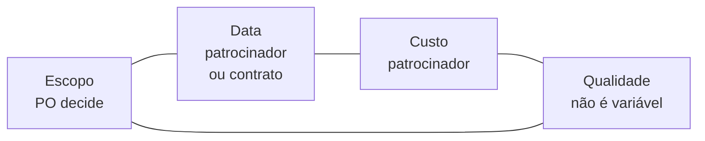

# Aula 07 — Quem responde pelo quê

> 🎯 Objetivos: separar o que decide o gerente de projeto do que decide o Product Owner, definir o que se cobra de um stakeholder e posicionar os interessados numa matriz poder × interesse.
> 🎬 Slides da aula: [apresentacao-07-quem-responde-pelo-que.pdf](apresentacao/apresentacao-07-quem-responde-pelo-que.pdf)

## 1. Duas pessoas, duas perguntas, um projeto

No marketplace de serviços autônomos, duas decisões precisam ser tomadas na mesma segunda-feira.

A primeira: **o fluxo de disputa entra antes ou depois do pagamento retido?** As duas ordens são defensáveis, e a escolha muda o que os primeiros usuários vão poder fazer.

A segunda: **a reserva financeira acaba em quatro meses — o que se faz com essa informação?** Contratar mais alguém, cortar escopo, ou avisar os fundadores de que a data não fecha.

São perguntas de naturezas diferentes. A primeira é sobre **valor**: o que vale mais a pena construir agora. A segunda é sobre **entrega**: prazo, custo, risco e quem precisa saber.

Num projeto pequeno as duas caem na mesma pessoa; num projeto maior, em duas. O problema não é a acumulação — é ninguém ter dito **qual pergunta está sendo respondida** no momento da decisão. Quem responde às duas de uma vez tende a deixar a de prazo atropelar a de valor, porque prazo tem data e valor não tem.

> 💡 **A Aula 01 disse que toda decisão precisa de um A.** Esta aula diz quem costuma ser esse A, por tipo de decisão — e por que dois papéis que parecem concorrentes na verdade respondem por coisas diferentes.

## 2. O gerente de projeto: o que ele decide

O gerente de projeto responde por **entregar o combinado**: prazo, custo, risco, comunicação e a relação com quem está fora do time.

| Decide | Não decide |
|---|---|
| replanejar quando há desvio | o que é mais valioso para o produto |
| escalar um risco à diretoria | qual funcionalidade entra primeiro |
| pedir aditivo, prorrogação ou mais gente | como o time organiza o trabalho interno |
| o que se comunica, a quem e quando | a solução técnica |

O trabalho dele é, em boa medida, **antecipar**: enxergar em maio o atraso que apareceria em julho, e trazer a decisão para quando ainda há três opções em vez de uma. É por isso que boa gestão de projeto é quase invisível — o problema que foi evitado não aparece em relatório nenhum.

E há uma assimetria que vale conhecer cedo na carreira: **o gerente é cobrado pelo que apareceu, não pelo que não aconteceu.** Quem tomou uma decisão em maio que evitou dois meses de atraso não tem como provar isso — o projeto simplesmente entregou no prazo, e parece que foi fácil.

Num contexto ágil o papel não desaparece — muda de forma. As decisões de escopo migram para o Product Owner, e o gerente concentra-se em prazo, custo, risco, contrato e o que atravessa a fronteira do time. Em projeto pequeno, o Scrum Master absorve parte disso; em projeto com contrato, multa e fornecedor, quase nunca dá.

> ⚠️ **"Gerente de projeto não existe no Scrum" é meia verdade.** O guia do Scrum não descreve o papel porque descreve um time de produto, não uma organização inteira. Contrato, aditivo, orçamento e comunicação com a diretoria continuam existindo, e alguém responde por eles.

## 3. O Product Owner: o que ele decide

O Product Owner responde por **maximizar o valor** do produto. Concretamente, ele decide o que se faz e em que ordem — e, por consequência, o que **não** se faz.

O que o papel exige, e que quase nunca vem junto:

- **Disponibilidade.** Ordenar backlog toda semana, responder dúvida em dois dias, comparecer à revisão;
- **Autoridade.** Poder dizer "isto fica para depois" sem precisar consultar três diretores;
- **Conhecimento do negócio.** Saber por que a portaria precisa buscar por data, e o que custa não ter isso.

Falta qualquer uma das três e o papel não funciona, e cada ausência tem um sintoma próprio:

| Falta | Sintoma no time |
|---|---|
| **disponibilidade** | dúvidas se acumulam; o time decide sozinho e erra o que o negócio queria |
| **autoridade** | toda decisão sobe uma instância; o time espera uma semana por cada resposta |
| **conhecimento do negócio** | o backlog é ordenado por quem grita mais alto, não por valor |

O caso mais comum é o **PO sem autoridade**: uma pessoa disponível e bem-intencionada que leva toda decisão para uma instância superior. O time percebe rápido e para de perguntar — e passa a decidir por conta própria coisas que não deveria.

> ⚠️ **PO por procuração não é PO.** Se quem ordena o backlog precisa validar cada ordenação com um comitê, o Product Owner de fato é o comitê — e o comitê não está disponível toda semana. Nesse caso, é mais honesto reconhecer que o projeto não tem as condições do ágil, como na Aula 05, do que manter a ficção.

> 💡 **O PO decide o quê e o porquê; o time decide o como; o gerente responde pelo quando e por quanto.** É a frase mais curta que separa os três, e ela resolve a maioria das discussões de fronteira.

## 4. Quando os dois papéis colidem

A colisão clássica: falta um mês para a data contratada, e o backlog tem quinze itens. O gerente quer cortar sete para caber; o PO diz que quatro deles são o que dá sentido ao produto.

**Os dois estão certos dentro do próprio papel.** É conflito de objetivo, exatamente como na Aula 01 — e como lá, ele não se resolve com conversa, e sim com decisão de quem tem autoridade sobre a variável que vai ceder.

O que precisa estar decidido **antes** da colisão:

| Se ceder… | Quem decide |
|---|---|
| o **escopo** | Product Owner |
| a **data** | patrocinador, ou o contrato |
| o **custo** (mais gente, horas extras) | patrocinador |
| a **qualidade** | ninguém — não é variável negociável |

A última linha é a que mais se viola na prática, e ela não aparece por acaso: quando escopo, data e custo estão todos travados, a única folga que sobra é a qualidade — e ela cede **em silêncio**, sem que ninguém tenha decidido nada.

> ⚠️ **Qualidade não é variável de ajuste, é o que a Definição de Pronto protege.** Se o time começa a entregar itens que não passam na própria lista, o projeto está usando a única folga que ninguém autorizou.

O nome disso, quando acontece de propósito e com registro, é **dívida técnica** — e aí é uma decisão legítima, que a Aula 14 trata. Quando acontece por omissão, não tem nome nenhum: é só um projeto que parecia ter cabido no prazo.

As quatro variáveis, desenhadas:



Quando três lados estão travados, o quarto cede. Se os quatro estão travados, alguém está prometendo algo que não vai acontecer — e a única questão em aberto é **quando** isso vai ficar visível.

> 💡 **É por isso que a colisão entre GP e PO é saudável.** Ela torna a pressão explícita antes de a qualidade ceder sozinha. Um projeto em que gerente e PO nunca discordam costuma ser um projeto em que um dos dois papéis não está sendo exercido.

## 5. Stakeholder: quem é, e o que se cobra dele

**Parte interessada** é quem afeta o projeto ou é afetado por ele. A definição é ampla de propósito — e é por isso que a lista precisa ser feita, não intuída.

O que costuma faltar na lista: quem **audita**, quem **opera depois**, quem **perde** algo com o projeto, e quem não usa o sistema mas impõe requisito. Os quatro têm algo em comum — **nenhum deles pede para ser incluído**, e todos aparecem depois, quando incluí-los já custa caro.

E stakeholder tem responsabilidade, não só direito. O que se cobra:

| Do stakeholder | Exemplo concreto |
|---|---|
| estar disponível quando o projeto precisar da informação que só ele tem | o supervisor de estágio que precisa validar o formato do relatório |
| decidir dentro do prazo combinado | o comitê de ética da clínica-escola, que se reúne uma vez por mês |
| assumir a consequência do que pediu | quem exigiu o relatório extra e precisa aceitar o replanejamento |
| comunicar mudança no próprio contexto | a secretaria que muda de sistema e não avisa a integração |

> ⚠️ **O stakeholder ausente é risco, não detalhe.** No controle de estágio, o supervisor da empresa não é da instituição, não cria conta e não vai a reunião. Planejar validação com ele e descobrir no meio que ele nunca aparecerá é o tipo de coisa que a Aula 09 chama de risco com dono e gatilho.

Diante de um stakeholder que não vai aparecer, há três saídas — e escolher é do projeto, não dele:

- **Substituir a fonte**: alguém dentro da instituição que conheça o que ele sabe, ainda que com menos precisão;
- **Reduzir o que se pede dele**: um clique num link de e-mail, em vez de acesso ao sistema;
- **Assumir e registrar**: decidir sem ele, com a premissa escrita, e prever retrabalho se ela cair.

As três são legítimas. **Continuar planejando reuniões que ele não vai atender não é uma delas.**

## 6. A matriz poder × interesse

Listar interessados é fácil; **decidir quanto de atenção cada um recebe** é o trabalho. A matriz cruza o **poder** de afetar o projeto com o **interesse** no resultado:

| | Interesse baixo | Interesse alto |
|---|---|---|
| **Poder alto** | manter satisfeito | **gerenciar de perto** |
| **Poder baixo** | monitorar | manter informado |

Aplicada à [Ouvidoria municipal](../../recursos/projetos-para-praticar.md#8-ouvidoria-municipal):

| Interessado | Poder | Interesse | Estratégia |
|---|:---:|:---:|---|
| Secretário de Governo (patrocina) | alto | alto | gerenciar de perto: reunião quinzenal, decisões registradas |
| Ouvidor-geral (opera) | médio | alto | manter informado e consultar: é quem conhece o fluxo real |
| Secretário do órgão que sempre atrasa | alto | **contra** | gerenciar de perto: ele não quer que dê certo |
| Cidadão que registra manifestação | baixo | alto | manter informado: é o usuário, e não tem voz na governança |
| Controladoria (audita) | alto | baixo | manter satisfeito: cobra conformidade, não acompanha o dia a dia |

Repare na terceira linha. **Interesse não é o mesmo que estar a favor** — o secretário tem alto interesse e joga contra. Tratá-lo como stakeholder distraído seria erro de leitura; ele precisa da mesma atenção que o patrocinador, por motivo oposto.

Com ele, "gerenciar de perto" significa coisas específicas: envolvê-lo cedo, dar-lhe voz sobre **como** os números serão apresentados — já que sobre **se** serão a lei não deixa escolha —, e registrar cada acordo. Um opositor surpreendido é muito mais caro que um opositor consultado.

> ⚠️ **A matriz muda ao longo do projeto.** Quem tinha interesse baixo passa a ter quando o sistema encosta na área dele; quem tinha poder o perde numa troca de gestão. Revisar a cada marco custa dez minutos, e não revisar custa a reunião em que alguém pergunta *"por que ninguém me consultou?"*.

> 💡 **A matriz não é para arquivar, é para decidir agenda.** Quem está no quadrante "gerenciar de perto" entra na sua semana; quem está em "monitorar" entra no seu relatório mensal. Se todos recebem a mesma coisa, você não usou a matriz.

> 📖 O Guia PMBOK trata das partes interessadas numa área de conhecimento própria, com o processo de identificação e as estratégias de engajamento, e a matriz poder × interesse aparece ali. O Cruz trata do Product Owner e de suas atribuições no capítulo sobre responsabilidades do Scrum.

## 🏋️ Exercícios da aula

Na pasta `aula-07/` do seu repositório:

1. **`ex01.md`** — separe cada decisão entre **gerente de projeto**, **Product Owner** e **time**: (a) qual item entra na próxima entrega; (b) pedir prorrogação ao cliente; (c) quantos itens cabem na iteração; (d) escalar um risco à diretoria; (e) descartar uma funcionalidade que ninguém usou; (f) como dividir o sistema em módulos; (g) contratar mais uma pessoa; (h) adiar a integração com o legado por causa de risco técnico. *Confere assim: a (h) parece do time e não é só dele — envolve risco e prazo, e a resposta certa nomeia dois papéis conversando, não um decidindo sozinho.*

2. **`ex02.md`** — no projeto de [marketplace de serviços autônomos](../../recursos/projetos-para-praticar.md#9-marketplace-de-serviços-autônomos), os dois fundadores acumulam GP e PO. Escreva **três situações concretas** em que essa acumulação produz decisão ruim, e para cada uma diga qual chapéu deveria ter prevalecido. *Confere assim: pelo menos uma das suas situações precisa ser daquelas em que o chapéu de prazo atropela o de valor — é o caso mais comum quando o dinheiro está acabando.*

3. **`ex03.md`** — liste os interessados do [controle de estágio supervisionado](../../recursos/projetos-para-praticar.md#4-controle-de-estágio-supervisionado) e, para cada um, escreva **o que se cobra dele** e **o que acontece se ele não entregar isso**. *Confere assim: um dos interessados não é da instituição e não vai cumprir o que se cobra — a sua resposta precisa dizer o que o projeto faz diante disso, e não só constatar.*

4. **`ex04.md`** — monte a matriz poder × interesse do [prontuário de clínica-escola](../../recursos/projetos-para-praticar.md#10-prontuário-de-clínica-escola), com no mínimo cinco interessados, e escreva a **estratégia de comunicação** de cada quadrante: o que recebe, com que frequência. *Confere assim: se todos os cinco caírem no mesmo quadrante, releia o projeto — o comitê de ética e o paciente não têm o mesmo poder nem o mesmo interesse.*

5. **`ex05.md`** — 🌶️ **Desafio.** Falta um mês para a data contratada da Ouvidoria e o backlog tem quinze itens. Você é o gerente; o PO diz que quatro dos sete que você quer cortar são o que dá sentido ao produto. **Escreva a decisão**, contendo: (i) qual variável vai ceder — escopo, data, custo — e **quem tem autoridade** para decidir isso; (ii) como você leva a decisão a essa pessoa, com que informação; (iii) **o que se perde**, e por que a qualidade não está na lista de variáveis que você considerou. *Confere assim: se a sua resposta cortar os quinze itens sem envolver ninguém de fora do projeto, você decidiu no lugar de quem tinha autoridade — que é o erro que a seção 4 descreve.*

## 🧠 Revisão

[8 questões de múltipla escolha](revisao/README.md) para conferir se os conceitos ficaram sólidos. Responda sem consultar a aula — depois volte e corrija.

## ✅ Entrega

```bash
git add aula-07/
git commit -m "Resolve exercícios da aula 07 (quem responde pelo quê)"
git push
```

---

⬅️ [Aula 06 — Scrum](../aula-06-scrum/README.md) | ➡️ [Aula 08 — Descobrir, enxugar, melhorar](../aula-08-design-thinking-mvp-lean/README.md)
