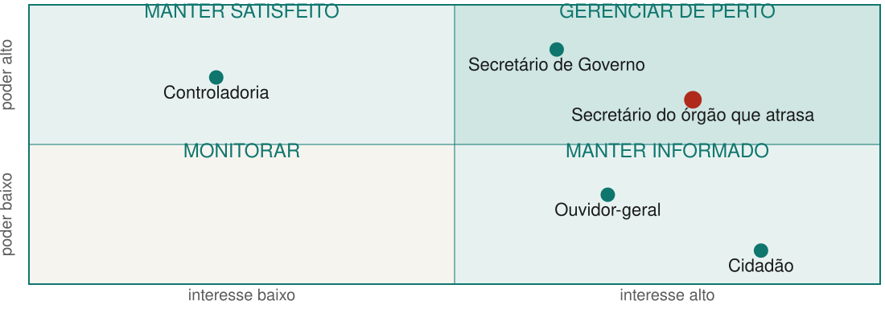

<!-- _class: capa -->

⚖️

# Quem Responde pelo Quê

## Aula 07 · Bloco 2 — Metodologias de Gestão

Quando escopo, data e custo travam, a qualidade cede em silêncio

---

## 🎯 Nesta aula

1. Duas perguntas, **duas naturezas**
2. O **gerente de projeto**: o que ele decide
3. O **Product Owner**: o que ele decide
4. Quando os dois **colidem** — e a variável que ninguém autoriza
5. **Stakeholder**: o que se cobra dele
6. A matriz **poder × interesse**

---

## Duas decisões na mesma segunda-feira

No **marketplace de serviços autônomos**, as duas precisam de resposta na mesma semana — e não são o mesmo tipo de pergunta.

---

## Valor e entrega não se misturam bem

A primeira pergunta é sobre **valor**: o que vale mais a pena construir agora. A segunda é sobre **entrega**: prazo, custo, risco e quem precisa saber.

Num projeto pequeno as duas caem na mesma pessoa. O problema não é a acumulação — é ninguém ter dito **qual pergunta está sendo respondida**.

Quem responde às duas de uma vez tende a deixar **o prazo atropelar o valor**, porque prazo tem data e valor não tem.

> 💡 **A Aula 01 disse que toda decisão precisa de um A.** Esta aula diz quem costuma ser esse A, por tipo de decisão.

---

## Quem responde pelo quê

É a frase mais curta que separa os três, e ela **resolve a maioria das discussões de fronteira**. O gerente é o papel que o guia do Scrum não descreve — e que continua existindo.

---

## O gerente de projeto

Responde por **entregar o combinado**: prazo, custo, risco, comunicação e a relação com quem está fora do time.

| Decide | Não decide |
|---|---|
| replanejar quando há desvio | o que é mais valioso para o produto |
| escalar um risco à diretoria | qual funcionalidade entra primeiro |
| pedir aditivo, prorrogação ou mais gente | como o time organiza o trabalho |
| o que se comunica, a quem e quando | a solução técnica |

---

<!-- _class: lead -->

## O trabalho dele é antecipar

Ver **em maio** o atraso que apareceria em julho,
quando ainda há três opções, e não uma.

Daí a assimetria da carreira: ele é cobrado
**pelo que apareceu**, não pelo que não aconteceu.

O projeto entregou no prazo —
e parece que foi fácil.

---

## No ágil, o papel muda de forma

O papel **não desaparece**. As decisões de escopo migram para o Product Owner, e o gerente concentra-se em **prazo, custo, risco, contrato** e no que atravessa a fronteira do time.

Em projeto pequeno, o Scrum Master absorve parte disso. Em projeto com **contrato, multa e fornecedor**, quase nunca dá.

> ⚠️ **"Gerente de projeto não existe no Scrum" é meia verdade.** O guia descreve um time de produto, não uma organização inteira. Contrato, aditivo, orçamento e diretoria continuam existindo — e alguém responde por eles.

---

## O Product Owner

Responde por **maximizar o valor** do produto: decide o que se faz e em que ordem — e, por consequência, o que **não** se faz.

O papel exige três coisas que quase nunca vêm juntas:

- **Disponibilidade** — ordenar o backlog toda semana, responder dúvida em dois dias, comparecer à revisão;
- **Autoridade** — poder dizer "isto fica para depois" sem consultar três diretores;
- **Conhecimento do negócio** — saber por que a portaria precisa buscar por data, e o que custa não ter isso.

---

## Falta uma, e o papel para de funcionar

Cada ausência tem **um sintoma próprio** no time — e é pelo sintoma que se descobre qual das três está faltando.

---

## O caso mais comum: PO sem autoridade

Uma pessoa disponível e bem-intencionada que **leva toda decisão para uma instância superior**. O time percebe rápido e para de perguntar — e passa a decidir por conta própria coisas que não deveria.

> ⚠️ **PO por procuração não é PO.** Se quem ordena o backlog valida cada ordenação com um comitê, o Product Owner de fato é o comitê — e o comitê não está disponível toda semana.

Nesse caso, é mais honesto reconhecer, como na Aula 05, que o projeto **não tem as condições do ágil** do que manter a ficção.

---

## Quando os dois colidem

Falta **um mês** para a data contratada, e o backlog tem **quinze itens**. O gerente quer cortar sete para caber; o PO diz que quatro deles são o que dá sentido ao produto.

**Os dois estão certos dentro do próprio papel.** É conflito de objetivo, como na Aula 01.

E, como lá, ele **não se resolve com conversa**: resolve-se com a decisão de **quem tem autoridade sobre a variável que vai ceder**.

---

## O que cede, e quem decide

Isso precisa estar decidido **antes** da colisão. A última linha ninguém escolhe.

---

<!-- _class: lead -->

## ⚠️ Qualidade não é folga

Quando escopo, data e custo
estão todos travados,

a única folga que sobra
é a qualidade —

e ela cede **sem que ninguém
tenha decidido nada**.

---

## Com registro, ou por omissão

Qualidade é **o que a Definição de Pronto protege**. Item que não passa na lista é o projeto usando a única folga que ninguém autorizou.

---

## E se os quatro estiverem travados?

Quando três lados estão travados, o quarto cede. Se **os quatro** estão, alguém está prometendo algo que não vai acontecer — e a única questão em aberto é **quando** isso vai ficar visível.

> 💡 **Por isso a colisão entre GP e PO é saudável.** Ela torna a pressão explícita antes de a qualidade ceder sozinha.

Um projeto em que gerente e PO **nunca discordam** costuma ser um projeto em que um dos dois papéis não está sendo exercido.

---

## Parte interessada: quem é

**Parte interessada** é quem afeta o projeto ou é afetado por ele. A definição é ampla de propósito — e é por isso que a lista precisa ser **feita, não intuída**.

O que costuma faltar: quem **audita**, quem **opera depois**, quem **perde** algo com o projeto, e quem não usa o sistema mas **impõe requisito**.

> 💡 Os quatro têm algo em comum: **nenhum pede para ser incluído** — e todos aparecem depois, quando incluí-los já custa caro.

---

## O que se cobra do stakeholder

Stakeholder tem **responsabilidade**, não só direito:

| Do stakeholder | Exemplo |
|---|---|
| estar disponível quando só ele tem a informação | o supervisor que valida o formato do relatório |
| decidir dentro do prazo combinado | o comitê de ética, que se reúne uma vez por mês |
| assumir a consequência do que pediu | quem exigiu o relatório extra |
| comunicar mudança no próprio contexto | a secretaria que troca de sistema e não avisa |

---

## Quando ele não vai aparecer

O stakeholder ausente é **risco, não detalhe** — e quem escolhe a saída é o projeto.

---

## A matriz poder × interesse

Listar interessados é fácil; **decidir quanto de atenção cada um recebe** é o trabalho. A matriz cruza o **poder** de afetar o projeto com o **interesse** no resultado.

| | Interesse baixo | Interesse alto |
|---|---|---|
| **Poder alto** | manter satisfeito | **gerenciar de perto** |
| **Poder baixo** | monitorar | manter informado |

---

## Aplicada à Ouvidoria municipal

O ponto vermelho tem interesse **alto** — e joga contra o projeto.

---

<!-- _class: lead -->

## Interesse não é estar a favor

O secretário do órgão que atrasa
tem interesse **alto** e joga contra.

Ele precisa da mesma atenção
que o patrocinador — por motivo oposto.

Opositor surpreendido é muito
mais caro que opositor consultado.

---

## A matriz decide agenda — e muda

Quem está em **gerenciar de perto** entra na sua semana; quem está em **monitorar** entra no seu relatório mensal. **Se todos recebem a mesma coisa, você não usou a matriz.**

> ⚠️ **A matriz muda ao longo do projeto.** Quem tinha interesse baixo passa a ter quando o sistema encosta na área dele; quem tinha poder o perde numa troca de gestão.

Revisar a cada marco custa dez minutos. Não revisar custa a reunião em que alguém pergunta *"por que ninguém me consultou?"*

---

<!-- _class: lead -->

## ➡️ Próxima aula

**Aula 08 — Descobrir, enxugar, melhorar**

Design Thinking, MVP e Lean
não são sinônimos de "trabalhar melhor".

Cada um responde
a uma pergunta diferente.
