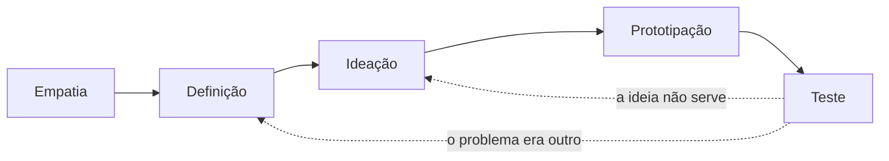
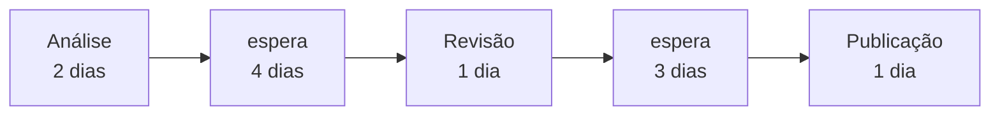

# Aula 08 — Descobrir, enxugar, melhorar

> 🎯 Objetivos: distinguir as perguntas que Design Thinking, MVP e Lean respondem, recortar um MVP com hipótese e critério de decisão, e reconhecer o desperdício num fluxo de trabalho.
> 🎬 Slides da aula: [apresentacao-08-design-thinking-mvp-lean.pdf](apresentacao/apresentacao-08-design-thinking-mvp-lean.pdf)

## 1. Três respostas para três perguntas diferentes

Os três nomes desta aula costumam aparecer juntos em apresentação corporativa, como se fossem sinônimos de "trabalhar melhor". Não são. Cada um responde a uma pergunta específica, e usar o errado é caro:

| Abordagem | A pergunta que ela responde |
|---|---|
| **Design Thinking** | *não sabemos qual é o problema certo* |
| **MVP** | *não sabemos se alguém quer isto* |
| **Lean / Six Sigma** | *sabemos o que fazer, e fazemos mal* |

No **marketplace de serviços autônomos** — dois fundadores, seis meses de reserva —, a pergunta é a segunda: ninguém sabe ainda se há demanda. Aplicar Six Sigma ali seria otimizar um processo que talvez não deva existir.

Na **Ouvidoria municipal**, é a terceira: o problema está definido em lei, o escopo está no edital, e o que sobra é executar bem — dentro de um prazo com multa.

E há projetos que passam pelas três em sequência, nessa ordem. É o caso comum de um produto novo que dá certo: descobre-se o problema, testa-se se alguém o tem, e depois de anos de operação o gargalo passa a ser o processo. Usar a terceira antes das duas primeiras é que não funciona.

> ⚠️ **O erro mais caro é usar Lean onde a pergunta era MVP.** Otimizar a construção de algo que ninguém quer produz desperdício com excelente indicador de eficiência.

## 2. Design Thinking: as cinco etapas

O Design Thinking parte de uma suspeita desconfortável: **o problema que o cliente enuncia raramente é o problema dele.** Ele já traduziu a dor numa solução antes de falar com você.

As cinco etapas:

| Etapa | O que se faz | O que sai |
|---|---|---|
| **Empatia** | observar e ouvir quem vive o problema, sem propor nada | o que as pessoas fazem, não o que dizem que fazem |
| **Definição** | escrever o problema numa frase, do ponto de vista do usuário | uma definição que ninguém tinha enunciado |
| **Ideação** | gerar muitas alternativas, sem julgar durante a geração | opções que não apareceriam na primeira conversa |
| **Prototipação** | construir a versão mais barata que permita testar | algo que se possa mostrar, e jogar fora |
| **Teste** | pôr o protótipo na frente de quem vive o problema | o que estava errado na definição |

O fluxo não é linear: o teste costuma mandar de volta para a definição, e é justamente isso que o torna útil.



No projeto de **achados e perdidos**, a empatia mudaria a definição do problema. O pedido chegou como *"queremos um sistema para cadastrar itens perdidos"*. Observando a portaria por uma manhã, aparece outra coisa: o item quase sempre está lá, e quem procura **não sabe descrever** o que perdeu de um jeito que case com a descrição de quem achou.

O problema não é cadastro — é **pareamento sob descrição ambígua**. São dois projetos diferentes, e só um resolve a dor.

A diferença aparece no que cada definição faz o time construir: a primeira produz um formulário e uma listagem; a segunda produz busca por características parciais, foto do item e uma forma de a portaria sugerir candidatos. Mesmo orçamento, resultados incomparáveis.

> 💡 **A etapa de empatia é a única que não se pode pular.** As outras quatro se fazem em sala, com quem já conhece o problema. Essa exige sair da sala e observar — e é justamente a que some quando a oficina é marcada para caber numa tarde.

> ⚠️ **Design Thinking não é dinâmica de post-it.** Se depois da oficina ninguém mudou de ideia sobre nada, ou o problema já estava claro — e a oficina era desnecessária — ou a etapa de empatia não foi feita para valer.

## 3. MVP: o menor produto que ensina alguma coisa

**MVP** é *minimum viable product*, e as três palavras importam. Ele é o **produto** — algo que alguém usa — **mínimo** e **viável**: pequeno o bastante para ser barato, completo o bastante para produzir aprendizado real.

Um MVP tem três partes obrigatórias, e é a ausência delas que produz o falso MVP:

| Parte | Exemplo no marketplace |
|---|---|
| **Hipótese** | prestadores autônomos aceitam pagar comissão em troca de encontrar clientes |
| **Como medir** | 30 prestadores cadastrados e 10 serviços concluídos em 8 semanas |
| **Critério de decisão** | menos de 5 serviços concluídos → o problema não é encontrar cliente; mudamos de direção |

A terceira é a que quase nunca existe. **Se você não consegue completar a frase *"se acontecer X, a gente muda de direção"*, não é MVP** — é a entrega 1 de 8, com nome bonito.

> 💡 **O MVP do marketplace pode não ter plataforma nenhuma.** Um formulário, um grupo de mensagens e os dois fundadores intermediando à mão testam a hipótese em três semanas, sem construir o fluxo de disputa — que é a parte mais cara e depende de a hipótese estar certa.

## 4. O que MVP não é

Quatro confusões comuns, e o que cada uma realmente é:

| Chamam de MVP | É na verdade |
|---|---|
| a primeira fatia do plano original | **entrega incremental** — legítima, e não testa hipótese nenhuma |
| a versão com menos funcionalidades | **escopo reduzido**, se ninguém definiu o que se quer aprender |
| o protótipo de tela | **protótipo** — não é produto, ninguém usa de verdade |
| a versão feita às pressas | **dívida técnica**, e o "mínimo" virou desculpa |

A diferença entre MVP e entrega incremental é sutil e decisiva: **a entrega incremental supõe que o plano está certo e o executa em pedaços; o MVP suspeita do plano e testa.** No sistema de empréstimo de equipamentos, o recorte da Aula 02 era incremental — ninguém duvidava de que o setor precisasse registrar empréstimos.

> ⚠️ **Um MVP que confirma a hipótese não "deu certo" — ele terminou o trabalho dele.** O valor do experimento está em decidir, e decidir "seguir" é tão útil quanto decidir "mudar". O que não vale é rodar o experimento e seguir igual em qualquer resultado.

E há um custo político que ninguém menciona: **o MVP pode dar a resposta que o patrocinador não quer ouvir.** Quem financiou seis meses de reserva para construir um marketplace não recebe bem a informação, na semana oito, de que o problema é outro.

É por isso que o critério de decisão precisa ser combinado **antes** do experimento, com quem paga. Depois do resultado, qualquer critério parece escolhido para justificar o que já se queria fazer — e a conversa deixa de ser sobre o dado e passa a ser sobre a régua.

> 💡 **Um MVP mal recebido costuma ter sido bem executado.** O desconforto é o produto: ele antecipou em cinco meses uma informação que chegaria de qualquer jeito, quando a reserva tivesse acabado.

## 5. Lean: valor, fluxo e desperdício

O **Lean** vem da manufatura e pergunta uma coisa só: **o que, neste fluxo, o cliente não pagaria para ter?** Isso é desperdício, e sai.

Os desperdícios que aparecem em projeto de software:

| Desperdício | Como ele aparece |
|---|---|
| **Trabalho parcialmente feito** | cinco itens começados e nenhum entregue — o quadro Kanban da Aula 12 |
| **Espera** | item pronto há seis dias esperando revisão |
| **Retrabalho** | o que volta porque não estava na Definição de Pronto |
| **Troca de contexto** | a pessoa em três projetos ao mesmo tempo, produzindo pouco em todos |
| **Funcionalidade não usada** | o relatório que alguém pediu e ninguém abriu |

A última é a mais cara e a menos visível: ela consumiu o mesmo esforço das outras e não aparece como problema em lugar nenhum — porque **ninguém reclama de um relatório que não usa**. Ela só aparece se alguém medir uso, o que é assunto da Aula 10.

O desperdício mais barato de atacar é a **espera**, e o instrumento é o limite de trabalho em andamento. Seis dias de item pronto esperando revisão não custam esforço de ninguém — custam **tempo de calendário**, que é o que o cliente percebe.



No fluxo acima, **4 dias são trabalho e 7 são espera**. Contratar mais gente para as etapas de trabalho não muda quase nada; atacar a espera corta o prazo pela metade. É esse tipo de leitura que o Lean traz, e ela raramente é intuitiva.

O **Six Sigma** ataca outra coisa: a **variação**. Enquanto o Lean pergunta o que sobra, o Six Sigma pergunta por que o mesmo processo às vezes leva dois dias e às vezes doze. Seu roteiro é o **DMAIC**: definir, medir, analisar, melhorar e controlar.

| | Lean | Six Sigma |
|---|---|---|
| **Ataca** | desperdício | variação |
| **Pergunta** | o que aqui não vira valor? | por que o resultado oscila tanto? |
| **Exige** | ver o fluxo inteiro | dados suficientes para medir |

> ⚠️ **Six Sigma exige medição, e medição exige processo estável e repetido.** Aplicá-lo a um projeto único, que acontece uma vez, é usar uma ferramenta de linha de produção numa obra sob medida. Em software, ele cabe na **operação** — chamados, implantações, incidentes —, não no projeto.

## 6. Qual usar quando

Três perguntas, na ordem, resolvem a escolha:

1. **Sabemos qual é o problema?** Se não — Design Thinking;
2. **Sabemos se alguém quer a solução?** Se não — MVP;
3. **Sabemos as duas coisas e mesmo assim entregamos mal ou devagar?** — Lean, e Six Sigma se houver dado e repetição.

E vale a advertência de gestão: as três custam tempo, e **as três podem ser usadas para adiar decisão**. Uma oficina de Design Thinking marcada para daqui a três semanas num projeto que já sabe qual é o problema é procrastinação com boa apresentação.

O teste, aqui como no resto do curso, é perguntar **que decisão vai mudar** com o resultado. Se ninguém consegue nomear uma, a atividade é ritual — e ritual caro, porque consome as pessoas que estariam construindo.

> 💡 **O fio comum às três é o mesmo do curso inteiro:** decidir com informação em vez de com opinião, e declarar o que se perde com a escolha. Design Thinking descobre o problema certo, o MVP testa antes de gastar, e o Lean tira o que não vira valor. As três são formas de **não construir o que não devia existir**.

> 📖 O Cruz trata das técnicas ágeis complementares ao Scrum, entre elas o MVP e a prototipação, na parte final do livro. O Guia PMBOK trata da qualidade e da melhoria de processo na área de conhecimento correspondente, onde Lean e Six Sigma aparecem como abordagens.

## 🏋️ Exercícios da aula

Na pasta `aula-08/` do seu repositório:

1. **`ex01.md`** — para cada situação, diga qual das três abordagens serve e **por qual pergunta**: (a) o cadastro leva de 2 a 14 dias para ser aprovado, sem que se saiba por quê; (b) a diretoria quer um aplicativo, e ninguém sabe qual problema ele resolve; (c) dois fundadores vão gastar a reserva construindo algo que talvez ninguém queira; (d) o time entrega no prazo, mas 40% do que entrega nunca é usado. *Confere assim: a (d) tem duas leituras defensáveis — diga qual você escolheu e por quê; é o único item da lista em que isso acontece.*

2. **`ex02.md`** — percorra as **cinco etapas** do Design Thinking no projeto de [achados e perdidos](../../recursos/projetos-para-praticar.md#1-achados-e-perdidos-do-campus), escrevendo o que sairia de cada uma. A etapa de **definição** precisa produzir um enunciado do problema diferente do que o cliente pediu. *Confere assim: se a sua definição for "criar um sistema de achados e perdidos", você repetiu o pedido — a empatia precisa ter mudado alguma coisa.*

3. **`ex03.md`** — recorte o **MVP** do [marketplace de serviços autônomos](../../recursos/projetos-para-praticar.md#9-marketplace-de-serviços-autônomos), com as três partes obrigatórias: hipótese, como medir e critério de decisão. Escreva também **o que fica de fora** e por quê. *Confere assim: o critério de decisão precisa ser um número e um prazo. Se estiver escrito "se a adesão for baixa", ele não decide nada — baixa para quem?*

4. **`ex04.md`** — no fluxo descrito a seguir, identifique **três desperdícios** e proponha uma mudança para cada: *o item é analisado por uma pessoa, espera em média 4 dias por revisão, volta 30% das vezes por não atender a critérios que não estavam escritos, e quem revisa também atende chamados de dois outros projetos.* *Confere assim: um dos três desperdícios não está no fluxo, está na alocação das pessoas — se você só olhou as etapas, faltou um.*

5. **`ex05.md`** — 🌶️ **Desafio.** A diretoria da empresa determinou uma oficina de Design Thinking de dois dias para o projeto da [Ouvidoria municipal](../../recursos/projetos-para-praticar.md#8-ouvidoria-municipal), cujo escopo está anexo ao edital. **Escreva a resposta**, contendo: (i) se a abordagem responde à pergunta que este projeto tem, com o argumento; (ii) o que você propõe no lugar, ou como você usaria os dois dias de forma que produza decisão; (iii) **o que se perde** com a sua proposta em relação à oficina pedida. *Confere assim: recusar por "não temos tempo" não é argumento — a recusa precisa se apoiar em qual pergunta o projeto tem, e essa pergunta está na seção 1.*

### 📤 Entrega

Estes exercícios são feitos em sala e vão para o **seu repositório** `exercicios-projeto-software`:

```bash
cd ..                 # da pasta da aula para a raiz do repositório
git add aula-08/
git commit -m "Resolve exercícios da aula 08"
git push
```

Confira no navegador que a pasta apareceu em `github.com/SEU-USUARIO/exercicios-projeto-software`.

## 🧠 Revisão

[8 questões de múltipla escolha](revisao/README.md) para conferir se os conceitos ficaram sólidos. Responda sem consultar a aula — depois volte e corrija.

---

⬅️ [Aula 07 — Quem responde pelo quê](../aula-07-quem-responde-pelo-que/README.md) | ➡️ [Aula 09 — Risco](../../bloco-3-ferramentas-e-qualidade/aula-09-risco/README.md)
