<!-- _class: capa -->

📋

# O Que É um Requisito

## Aula 05 · Bloco 2 — Requisitos

A frase que vai atravessar o projeto inteiro — e precisa aguentar o peso

---

## 🎯 Nesta aula

1. A frase que precisa **aguentar peso**
2. **Funcional × não-funcional**
3. Os não-funcionais que **ninguém pede**
4. **Interessados** e o conflito que eles trazem
5. Requisito × **solução**: a armadilha

---

## A secretaria pede

> *"A gente precisa que dê para reservar sala."*

Essa frase vai ser estimada, projetada, testada — e daqui a dois anos alguém vai discutir se o sistema cumpriu o que prometeu olhando para ela. **A frase é um contrato.**

Reservar **o quê**? **Quem** pode? Com quanta **antecedência**? E se duas pessoas pedirem a mesma sala no mesmo segundo? Reservar é o mesmo que **usar**?

---

<!-- _class: lead -->

## 💡 A definição, e o teste que a acompanha

Requisito é uma afirmação sobre o que o sistema faz,
ou sobre a qualidade com que faz, escrita de modo que
**duas pessoas cheguem à mesma conclusão
sobre se ele foi cumprido**.

O teste de sanidade cabe numa pergunta:
**"como eu saberia que isto foi cumprido?"**

Sem resposta objetiva, você tem um **desejo** —
e desejos não se contratam nem se testam.

---

## Funcional × não-funcional

- **Funcional** — algo que o sistema **faz**. Entrada, processamento, saída observável;
- **Não-funcional** — uma **qualidade ou restrição** sobre como ele faz. Atravessa várias funções.

| Exemplo | Tipo |
|---|---|
| Permitir cancelar uma reserva futura | **F** |
| A busca responde em até 2 s com 500 usuários | **NF** |
| Autenticar o usuário | **F** |
| Guardar senha com *hash* e sal | **NF** |

---

<!-- _class: lead -->

## ⚠️ Segurança gera os dois tipos

*"Autenticar"* é **função**.
*"Guardar senha com hash"* é **restrição**.

Classificar pelo **assunto** é a origem do erro;
classifique pela **natureza**.

O atalho que funciona quase sempre:
**se dá para escrever um caso de uso, é funcional.**
Não-funcional é o que aparece em vários casos de uso
ao mesmo tempo e não vira nenhum deles sozinho.

---

<!-- _class: tabela-densa -->

## Os não-funcionais nascem do contexto

Cliente nenhum pede acessibilidade. Ele pede funcionalidade e **supõe** o resto.

| O que se observou | O não-funcional que nasce disso |
|---|---|
| O uso explode na semana de provas | desempenho sob pico, com número |
| Celular, andando, rede que oscila | resposta em conexão instável; tela pequena |
| Leitor de tela e espaços acessíveis | conformidade com acessibilidade |
| Saber quem reservou é dado pessoal | quem vê, por quanto tempo se guarda |
| O Sistema Acadêmico cai | comportamento quando a fonte externa falha |
| A equipe de TI tem três pessoas | operação simples, sem plantão especializado |

---

<!-- _class: lead -->

## ⚠️ A lista de verificação que evita esquecimento

desempenho sob pico · disponibilidade · segurança ·
privacidade · acessibilidade · usabilidade ·
dispositivos · volume de dados · retenção e auditoria ·
idioma · operação e monitoramento

Para cada item: **ou escreva um requisito,
ou escreva por que ele não se aplica.**

*"Não se aplica"* **escrito** é uma decisão.
*"Não se aplica"* **esquecido** é uma bomba-relógio.

---

## Interessados e o conflito que eles trazem

Requisito não sai do ar: sai de gente. E gente quer coisas diferentes.

Para cada interessado, três perguntas: **o que ele ganha**, **o que ele teme**, **o que ele pode vetar**.

> ⚠️ Não confunda **interessado** com **usuário**. A coordenação nunca vai abrir a plataforma — e mesmo assim impõe um requisito que muda o que o sistema registra desde o primeiro dia.

---

<!-- _class: tabela-densa -->

## Onde as respostas se chocam

| Tensão | Um lado | O outro |
|---|---|---|
| Prioridade × ordem de chegada | o professor precisa da sala para a banca de amanhã | o grupo reservou há duas semanas e se organizou |
| Manutenção × reserva confirmada | a infraestrutura precisa entrar hoje | alguém vai chegar e achar a sala interditada |
| Reservar fácil × sala vazia | atrito baixo faz as pessoas usarem | quanto mais fácil, mais gente reserva "por garantia" |

Cada linha **vira um requisito**, porque alguém precisa decidir.

---

<!-- _class: lead -->

## 💡 Se todos concordam, você não terminou

Conflito não é sinal de projeto mal conduzido.

É sinal de que você **falou com gente suficiente**.

---

## A armadilha: requisito que é solução

> *"O sistema deve ter um botão vermelho no canto superior direito para cancelar a reserva."*

Isso parece requisito e é **uma solução** — a tela que o cliente imaginou enquanto pensava no problema dele.

Custa caro de três formas: congela uma decisão de interface, esconde a necessidade real e impede descobrir alternativas melhores.

---

<!-- _class: diagrama -->

## A escada do "por quê"

---

<!-- _class: lead -->

## ⚠️ O teste rápido

Se o requisito menciona **botão, tela, menu, cor,
tabela do banco ou nome de tecnologia**,
quase sempre é solução disfarçada.

A exceção legítima é a restrição que **vem de fora**:
*"deve funcionar no navegador X, porque é o que
os computadores dos laboratórios têm"* é requisito de verdade.

💡 Três "por quês" bastam. Mais que isso chega em
*"porque a instituição existe"* — verdade que não ajuda ninguém.

---

<!-- _class: checkpoint -->

## 🏋️ Exercícios da aula

Na pasta `aula-05/`:

1. **`ex01.md`** — classifique 12 requisitos em F ou NF; três são polêmicos de propósito;
2. **`ex02.md`** — cinco pedidos que chegaram como solução: faça a escada do "por quê";
3. **`ex03.md`** — o mapa de interessados, com um que não está no documento;
4. **`ex04.md`** — oito não-funcionais derivados só do contexto de uso;
5. **Desafio 🌶️ `ex05.md`** — extraia 12 requisitos implícitos de uma tela desenhada.

---

<!-- _class: lead -->

## ➡️ Próxima aula

**Aula 06 — Elicitação**

Por que *"o que vocês querem?"* não funciona —
e o que se faz no lugar.
