<!-- _class: capa -->

🔍

# Elicitação

## Aula 06 · Bloco 2 — Requisitos

Requisito não é colhido como fruta madura — é escavado

---

## 🎯 Nesta aula

1. A pergunta que **não funciona**
2. **Entrevista** — a mais usada e a mais malfeita
3. **Observação** e análise de documentos
4. **Workshop** e prototipação
5. O cliente que **não sabe o que quer**

---

## A pergunta óbvia, e a resposta curta

— *O que vocês querem no sistema?*
— *A gente quer parar de responder e-mail de reserva.*

Trinta minutos depois: uma página de anotações, nenhuma pergunta que importa respondida. Não é má vontade. São três razões estruturais.

---

<!-- _class: lista-limpa -->

## Por que a pergunta falha

- 🤖 **Ninguém descreve o que faz automaticamente.** Quem executa um processo há seis anos parou de enxergá-lo — e as exceções, que são a parte cara, viraram reflexo;
- 🖥️ **O cliente responde na linguagem da solução** que ele imagina, não na do problema que tem;
- 🕐 **O que ele lembra é o recente.** A interdição em cima de três reservas não vem à cabeça numa sala de reunião.

---

<!-- _class: lead -->

## 💡 Por isso a palavra é *elicitação*

Em inglês, *elicit* significa **extrair** —
trazer à tona algo que está lá
mas não sai sozinho.

E a pergunta que rende dez vezes mais
que *"o que você quer"*:

**"me mostra como você faz isso hoje."**

Ela troca opinião por observação — e opinião sobre
o futuro é a informação menos confiável que existe.

---

<!-- _class: tabela-densa -->

## Entrevista: fechada e aberta

**Fechada** garante cobertura e permite comparar respostas. **Aberta** descobre o que você nem sabia que precisava perguntar. A boa entrevista usa as duas.

| Faça | Em vez de |
|---|---|
| Preparar roteiro e estudar o domínio | chegar e improvisar |
| Pedir **exemplos concretos e recentes** | perguntar por regras gerais |
| Pedir para ver o artefato real | acreditar na descrição dele |
| Perguntar "e quando dá errado?" | mapear só o caminho feliz |
| Enviar o resumo escrito depois | confiar na sua memória |

---

<!-- _class: lead -->

## ⚠️ Duas falhas que custam caro

**A pergunta que induz.** *"Vocês precisam de um
relatório mensal, certo?"* recebe "sim" quase sempre.

**Entrevistar uma pessoa só** produz um sistema
que atende uma pessoa só. Ouvir a secretaria e não
ouvir a infraestrutura dá um sistema que
**não sabe interditar sala** — e a interdição é
a regra que atropela todas as outras.

---

## Observação: pare de perguntar e vá olhar

Quando o entrevistado não consegue descrever o que faz, acompanhe o trabalho real. É o que revela:

- Os passos que ninguém menciona porque são automáticos;
- As **gambiarras** — o caderno paralelo, a planilha "de verdade", o grupo de mensagens onde as decisões acontecem;
- A frequência real das exceções, sempre maior que a lembrada;
- O tempo que cada coisa leva.

---

<!-- _class: lead -->

## 💡 Toda gambiarra é ouro

Uma gambiarra é um **requisito não atendido
com um post-it colado em cima**.

Quando você encontra uma,
alguém já pagou para descobrir
que aquilo era necessário.

---

<!-- _class: tabela-densa -->

## Análise de documentos

O que a organização já escreveu não muda de ideia durante a conversa.

| Documento | O que ele entrega |
|---|---|
| A norma de uso dos espaços | as regras de negócio, já aprovadas |
| A planilha atual | os dados que importam — as colunas que existem |
| A caixa de e-mails de reserva | o vocabulário e os casos de exceção reais |
| O calendário letivo | as restrições de tempo que atravessam tudo |
| Relatórios já pedidos | o que a coordenação vai continuar pedindo |

⚠️ Documento diz como **deveria ser**; observação mostra como **é**. Onde divergem, há decisão a tomar — registre, não escolha sozinho.

---

## Workshop e prototipação

Para quando falta **acordo** ou **imaginação**, não informação.

**Workshop** — reúne interessados diferentes na mesma sala. Serve para **fazer o conflito aparecer na frente de quem pode resolvê-lo**. Exige pauta, facilitador e regra de encerramento: *"saímos daqui com a decisão escrita"*.

**Prototipação** — construir algo descartável para descobrir. Funciona porque **é muito mais fácil criticar do que imaginar**.

---

<!-- _class: lead -->

## ⚠️ O risco do protótipo

O cliente achar que ele **é** o sistema.

*"Já está quase pronto, é só ligar no banco"* —
a frase que precede o desastre.

Combine em voz alta, **antes** de mostrar:
isto é para jogar fora.

Protótipo de papel tem uma virtude que o bonito não tem:
**ninguém confunde rascunho com produto.**

---

<!-- _class: diagrama -->

## Qual técnica, para o que está faltando

---

<!-- _class: lista-limpa -->

## O cliente que não sabe o que quer

Ele conhece o **problema**, não a **solução** — a solução é o seu ofício.

- ⏮️ **Pergunte pelo passado**, não pelo futuro: *"descreva a última vez que deu errado"*;
- 🅰️ **Ofereça alternativas concretas** — escolher é fácil, inventar é difícil;
- 🩹 **Mostre algo errado de propósito** — as pessoas corrigem melhor do que criam;
- 📏 **Pergunte pelos extremos** — *"qual é o pior dia do ano?"*, *"o que nunca pode acontecer?"*;
- 🚫 **Anote o que ele não quer** — restrição negativa quase nunca é registrada.

---

<!-- _class: lead -->

## 💡 A pergunta mais valiosa, e a menos feita

**"Se você pudesse ter só uma coisa
deste sistema, qual seria?"**

A resposta a ela é a sua **primeira entrega**.

E a Aula 08 mostra o que fazer com o resto.

---

<!-- _class: checkpoint -->

## 🏋️ Exercícios da aula

Na pasta `aula-06/`:

1. **`ex01.md`** — o roteiro completo de uma entrevista de 40 minutos;
2. **`ex02.md`** — a técnica certa para quatro situações, **descartando as outras**;
3. **`ex03.md`** — extraia requisitos e ambiguidades de um trecho da norma;
4. **`ex04.md`** — o plano de duas horas de observação, e o que só ela revelaria;
5. **Desafio 🌶️ `ex05.md`** — **conduza uma entrevista de verdade** com um colega, e critique a sua própria condução.

---

<!-- _class: lead -->

## ➡️ Próxima aula

**Aula 07 — Especificação: documento e histórias**

Transformar o que você escavou
em algo que outra pessoa consiga construir e testar.
