<!-- _class: capa -->

<div class="emoji">⚖️</div>

# Análise, Priorização e Validação

## Aula 08 · Bloco 2 — Requisitos

<div class="meta">Concordar não custa nada quando ninguém sabe o que a frase exige</div>

---

## 🎯 Nesta aula

1. O documento que **parece pronto**
2. **MoSCoW** e a faixa que todo mundo usa mal
3. **Esforço × valor** e o backlog
4. **Rastreabilidade** e mudança de escopo
5. **Validação**: o roteiro de seis perguntas

---

## Quatro defeitos respondem pela maioria

**Ambiguidade** — *"reservar espaços com antecedência."* Quanta? Mínima ou máxima?

**Não-verificabilidade** — *"o sistema deve ser fácil de usar."* Fácil para quem, medido como?

**Composto** — *"interditar o espaço e notificar os atingidos e exportar em PDF."* Quando 60% estiver pronto, o requisito está pronto?

**Solução disfarçada** — a Aula 05 inteira. A revisão é a última chance de pegá-lo.

---

<!-- _class: lead -->

## ⚠️ As palavras que denunciam

adequado · amigável · rápido · eficiente · robusto ·
simples · se necessário · quando possível · etc.

💡 E um teste barato e cruel: peça a **duas pessoas**
que leiam o requisito e escrevam, separadamente,
**como o testariam**. Se divergirem, é ambíguo —
e custou dez minutos, não um ciclo.

---

<!-- _class: tabela-densa -->

## MoSCoW

Priorizar não é ordenar por gosto: é **decidir o que não será feito agora** e conseguir defender isso.

| Faixa | Significa | Teste |
|---|---|---|
| **M**ust | sem isso, não vale entregar | se faltar, a entrega é cancelada? |
| **S**hould | dói ficar sem, mas há contorno | há alternativa manual por um tempo? |
| **C**ould | melhora, e sai fácil se apertar | seria a primeira a cair sem drama? |
| **W**on't | fora **desta** vez | está escrito por quê, e quando reavaliar? |

---

<!-- _class: lead -->

## ⚠️ O W é a faixa mais importante

E a mais mal usada.

Ele **não** significa "nunca". Significa
*"não nesta entrega, e está escrito por quê"*.

Sem essa faixa, tudo vira *must* —
e uma lista em que tudo é obrigatório
**não priorizou nada**.

💡 Se mais de metade está em *must*, a priorização
não aconteceu: alguém transcreveu a lista de pedidos.

---

<!-- _class: diagrama -->

## Esforço × valor



---

<!-- _class: lead -->

## ⚠️ Duas armadilhas moram aqui

**Valor é do usuário, não de quem constrói.**
*"Refatorar o módulo de agenda"* pode ter valor altíssimo
para o time e nenhum para a secretaria. Isso não quer dizer
que não deva ser feito — quer dizer que **não se justifica
pelo mesmo argumento**.

**Esforço é estimativa, e estimativa erra.**
Item alto e incerto merece uma investigação curta
e cronometrada, não um chute com duas casas decimais.

---

<!-- _class: lista-limpa -->

## O backlog: três propriedades

- 🔢 **É ordenado, não agrupado.** Não existem "cinco itens de prioridade alta" — existe um primeiro, um segundo. Empate é priorização não terminada;
- 📐 **É detalhado de forma desigual**, e isso é correto. O topo tem critérios escritos; o fundo tem uma linha. Detalhar o que talvez nunca seja feito é desperdício;
- 🌱 **É vivo.** Backlog que não muda há três meses não está decidindo nada.

> ⚠️ Só tem valor se **uma pessoa responde pela ordem**.

---

<!-- _class: tabela-densa -->

## Rastreabilidade

A norma muda: interdição passa a exigir aviso de 24 h. **O que revisar?**

```
Regra de negócio → História → Projeto → Código → Teste
```

| RN | História | Critério | Onde é testado |
|---|---|---|---|
| `RN-05` | H-03 — interditar e avisar | CA-03.2, CA-03.5 | "Interdição atinge reserva confirmada" |
| `RN-06` | H-05 — confirmar uso | CA-05.1, CA-05.4 | "Reserva não confirmada em 15 min" |

---

<!-- _class: lead -->

## 💡 Escolha o recorte, e escreva qual escolheu

Rastreabilidade **completa** custa caro
e raramente compensa em projeto pequeno.

Rastreabilidade **das regras de negócio
e dos requisitos críticos** custa pouco
e paga na primeira mudança de norma.

---

## Mudança de escopo

> *"Aproveitando, dá para incluir reserva de equipamento também?"*

As duas respostas ruins são igualmente comuns. **"Sim"** sem discussão: o prazo não muda e a qualidade cede em silêncio. **"Não"** sem discussão: entrega-se o que foi combinado em março, não o que a instituição precisa em agosto.

1. **Entenda** o pedido — é requisito ou solução?
2. **Dimensione** — esforço, impacto, risco;
3. **Apresente o custo como escolha**;
4. **Registre** o que foi pedido, decidido, por quem e quando.

---

<!-- _class: lead -->

## ⚠️ O inchaço de escopo

Não acontece por **um** pedido grande.

Acontece por **doze pedidos pequenos**,
cada um obviamente razoável,
nenhum registrado.

O antídoto não é rigidez:
é **tornar o custo visível toda vez**.

💡 O passo 3 devolve a decisão a quem tem autoridade.
Quem constrói não decide escopo — informa o custo.

---

<!-- _class: tabela-densa -->

## Validação: o roteiro de seis perguntas

**Verificar** é conferir o sistema contra a especificação. **Validar** é conferir a especificação contra a necessidade real.

| # | Pergunta | Procura |
|---|---|---|
| 1 | Está verificável? | "como eu saberia?" |
| 2 | É uma coisa só? | requisito composto |
| 3 | É problema ou solução? | tela, botão, tecnologia |
| 4 | De quem veio? | requisito órfão |
| 5 | Conflita com outro? | dois que não podem ser verdade juntos |
| 6 | O que acontece quando falha? | exceção esquecida |

---

<!-- _class: lead -->

## 💡 A validação não termina com tudo resolvido

Um requisito ruim vira **dois requisitos bons
e uma pergunta explícita** ao cliente —
infinitamente melhor que uma suposição silenciosa.

E para validar sem ler 40 requisitos em voz alta,
leve **cenários concretos**:

*"É sexta, 14h. A infraestrutura interdita o B-12.
Três grupos tinham reserva. Me conta o que deveria acontecer."*

**Cliente valida história; ninguém valida lista.**

---

<!-- _class: checkpoint -->

## 🏋️ Exercícios da aula

Na pasta `aula-08/`:

1. **`ex01.md`** — ache e classifique os dez defeitos de um documento, e reescreva;
2. **`ex02.md`** — backlog ordenado de 10 itens, com MoSCoW e a matriz;
3. **`ex03.md`** — a matriz de rastreabilidade das 8 regras de negócio;
4. **`ex04.md`** — responda ao pedido de escopo novo com **duas alternativas e custo**;
5. **Desafio 🌶️ `ex05.md`** — o **documento de requisitos completo** de um sistema do catálogo — e a autocrítica dele.

---

<!-- _class: lead -->

## ➡️ Próximo bloco

**Bloco 3 — Modelagem e UML**

**Aula 09 — Por que modelar, e o que é UML**

Do texto para o desenho:
o que um diagrama resolve que a frase não resolve.
