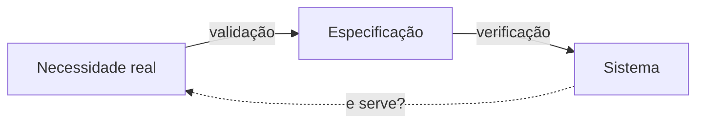

# Aula 10 — Qualidade que se mede

> 🎯 Objetivos: distinguir verificação de validação, escolher métricas que apoiam decisão em vez de virarem meta, e situar maturidade de processo separadamente de qualidade de produto.
> 🎬 Slides da aula: [apresentacao-10-qualidade-que-se-mede.pdf](apresentacao/apresentacao-10-qualidade-que-se-mede.pdf)

## 1. Qualidade não é ausência de defeito

O prontuário da clínica-escola foi entregue sem nenhum defeito conhecido. Todos os testes passam, nenhum chamado foi aberto na primeira semana.

E o sistema é ruim: o supervisor precisa de onze cliques para ver o caso de um aluno, a busca não aceita nome parcial, e a trilha de auditoria — que a norma exige — registra o acesso mas não o motivo.

**Ausência de defeito é uma das dimensões da qualidade, e não a mais importante.** Um sistema sem defeitos que ninguém consegue usar falhou; um com defeitos pequenos que resolve a dor do usuário passou.

Repare que o sistema da abertura passaria em qualquer painel: zero defeitos, zero chamados. **O painel não mostrou a falha porque não media a dimensão que falhou** — e é essa lacuna, e não a má-fé de ninguém, que produz o relatório verde de um projeto que deu errado.

Qualidade tem dimensões que competem entre si:

| Dimensão | Pergunta |
|---|---|
| **Funcional** | faz o que precisa fazer? |
| **Confiabilidade** | continua funcionando quando algo dá errado? |
| **Usabilidade** | a pessoa consegue usar sem treinamento longo? |
| **Desempenho** | responde no tempo que a tarefa exige? |
| **Segurança** | protege o que precisa ser protegido? |
| **Manutenibilidade** | dá para mudar sem quebrar? |
| **Acessibilidade** | quem tem deficiência consegue usar? |

Mais segurança custa usabilidade; mais desempenho custa manutenibilidade. **A pergunta profissional não é "como ter qualidade", é "quais dimensões priorizamos, e o que aceitamos perder"** — e isso é decisão de projeto, com dono, como tudo neste curso.

> 💡 **Na clínica-escola, segurança ganha de usabilidade por decisão consciente.** Onze cliques por causa de controle de acesso é defensável; onze cliques por descuido de projeto não é. A diferença está em alguém ter decidido.

Repare que essa lista de dimensões é a mesma coisa que a Aula 04 chamou de restrições da arquitetura. **Atributo de qualidade priorizado é decisão arquitetural**: escolher confiabilidade acima de desempenho muda como o sistema se divide, e essa escolha é cara de reverter depois. É por isso que ela entra no ADR, e não numa lista de desejos.

## 2. Verificação × validação

Duas perguntas parecidas e diferentes, e confundi-las é o erro clássico:

| | Verificação | Validação |
|---|---|---|
| **Pergunta** | construímos **certo**? | construímos a **coisa certa**? |
| **Compara com** | a especificação | a necessidade real |
| **Quem responde** | quem constrói | quem usa |
| **Exemplo** | o cálculo da multa segue a regra escrita | a regra escrita é a que a instituição pratica |

Um sistema pode passar 100% na verificação e falhar na validação: **tudo foi construído exatamente como especificado, e a especificação estava errada.** É o pior resultado possível, porque é o mais caro e o mais tardio.

> ⚠️ **Verificação sem validação é a armadilha do projeto que "entregou o combinado".** Contrato cumprido, cliente insatisfeito, e os dois com razão. É por isso que a Aula 03 insiste no aceite formal com quem usa, e não só com quem assinou.

E há uma assimetria de custo entre as duas. **Verificação é barata e pode ser automatizada**; validação exige pessoa, tempo e a disponibilidade de quem usa — que é justamente o recurso escasso da Aula 07. É por isso que, sob pressão, a primeira a ser cortada é sempre a validação.

O antídoto é barato: **validar em pedaços pequenos, cedo**. Mostrar a tela de registro à portaria depois de duas semanas custa uma manhã; descobrir na entrega que a busca não serve custa o projeto.



A seta tracejada é a que fecha o ciclo, e a que mais falta. Sem ela, o projeto sabe que construiu conforme a especificação e **não sabe** se a especificação correspondia à necessidade.

## 3. O sistema de qualidade: o que a norma exige

Um **sistema de qualidade** é o conjunto de práticas que a organização mantém para que a qualidade não dependa de quem está no projeto. Ele se divide em duas metades que se confundem o tempo todo:

| | Garantia da qualidade | Controle da qualidade |
|---|---|---|
| **Olha para** | o **processo** que produz | o **resultado** produzido |
| **Pergunta** | estamos trabalhando do jeito acordado? | o que saiu está bom? |
| **Exemplo** | toda mudança passa por revisão de par | este relatório calcula certo? |
| **Quando falha** | o defeito volta, porque a causa continua | um defeito específico escapa |

Na clínica-escola, o que a auditoria externa vai pedir é quase todo **garantia**: existe procedimento escrito para conceder acesso? Ele foi seguido? Há registro? Ela não vai testar o sistema — vai testar se a organização tem como demonstrar que trabalha de um jeito repetível.

> 💡 **Auditoria não pergunta "está bom?", pergunta "como você sabe que está bom?"** — e a segunda pergunta só tem resposta se houver processo e registro. É a diferença entre um time competente e uma organização confiável.

Isso muda o que o projeto precisa produzir. Além do sistema, ele produz **evidência**: quem aprovou o quê, quando, e com base em qual critério. Na clínica-escola, que já tomou uma notificação por dado exposto, a evidência não é burocracia — é o que a instituição vai apresentar se acontecer de novo.

O ponto de gestão é decidir **quanto** disso o projeto vai carregar, e decidir cedo. Evidência produzida no fim é reconstituição, e reconstituição não convence auditoria nenhuma.

## 4. Métricas: as que servem e as que viram meta

Toda métrica cobrada é otimizada, inclusive por caminhos que não melhoram nada. A cobertura de testes chega a 90% e os defeitos continuam iguais, porque o time escreveu testes que executam código sem verificar comportamento.

O teste que salva: **que decisão esta métrica apoia?**

| Métrica | Decisão que ela apoia | Como ela é distorcida |
|---|---|---|
| defeitos encontrados após a entrega | investir mais em revisão ou em teste | parar de registrar defeito pequeno |
| tempo entre pedido e entrega | atacar espera no fluxo (Aula 08) | fatiar itens artificialmente |
| itens que voltaram por não estarem prontos | rever a Definição de Pronto | afrouxar a Definição de Pronto |
| cobertura de testes | achar áreas sem teste nenhum | testes que não verificam nada |

Se a métrica não muda nenhuma decisão, ela não serve. Se ela virou meta, parou de medir. As duas frases parecem óbvias e são violadas em quase todo painel de acompanhamento que existe.

> ⚠️ **A distorção não exige má-fé.** Quando a cobertura é cobrada, escrever testes fáceis é o comportamento racional de quem quer entregar e ser bem avaliado. O defeito está no incentivo, não nas pessoas — e desenhar o incentivo é trabalho de gestão.

Três regras que reduzem a chance de a métrica virar meta:

- **Medir em conjunto, nunca isolada.** Uma métrica de velocidade sempre acompanhada de uma de estabilidade, como faz o DORA na seção 5. Otimizar uma às custas da outra fica visível;
- **Medir o time, não a pessoa.** Métrica individual é otimizada individualmente, e o que se perde é a colaboração — quem ajuda um colega piora o próprio número;
- **Não atrelar a bônus.** É a forma mais rápida de transformar qualquer medida numa meta, e a partir daí ela deixa de informar.

E vale a pergunta de honestidade: **o que essa métrica não vê?** Defeitos encontrados após a entrega não veem o defeito que ninguém percebeu; tempo de entrega não vê se o entregue serve. Toda métrica tem um ponto cego, e nomeá-lo é o que impede confundir o indicador com a realidade.

## 5. As quatro métricas DORA

A pesquisa **DORA** acompanha times de software há mais de uma década e chegou a quatro medidas que, juntas, dizem muito sobre a saúde da entrega:

| Métrica | O que mede | Sinal de problema |
|---|---|---|
| **Frequência de implantação** | com que frequência chega ao usuário | de meses em meses |
| **Tempo de espera** | do commit à produção | semanas |
| **Tempo de restauração** | quanto leva para se recuperar de uma falha | horas ou dias |
| **Taxa de falha em mudanças** | quantas implantações causam problema | acima de 15% |

O que as torna diferentes das métricas ruins é que elas **se equilibram**: as duas primeiras medem velocidade, as duas últimas medem estabilidade. Otimizar velocidade sacrificando estabilidade aparece imediatamente nas outras duas — o que impede a distorção clássica.

> 💡 **DORA mede entrega, não qualidade de produto.** Um time pode implantar dez vezes por dia, com falha baixa, e entregar algo que ninguém quer. As quatro respondem *"conseguimos entregar bem?"*, não *"entregamos o que importa?"* — que é a validação da seção 2.

As quatro também servem como **diagnóstico**, e não só como painel. Tempo de restauração alto costuma indicar falta de observabilidade — o time demora para descobrir o que quebrou, assunto da Aula 14. Frequência baixa com taxa de falha alta indica que implantar dói, e por isso se implanta pouco, o que faz cada implantação carregar mais mudanças e falhar mais. É um ciclo, e as métricas o tornam visível.

## 6. Maturidade: CMMI e MPS.BR

**Maturidade** mede quão definido e repetível é o processo da organização. Os dois modelos usados no Brasil são o **CMMI** (internacional) e o **MPS.BR** (brasileiro, criado para caber em empresa pequena).

O CMMI tem cinco níveis, e o essencial é a progressão:

| Nível | O que caracteriza |
|:---:|---|
| 1 — Inicial | funciona quando as pessoas certas estão no projeto |
| 2 — Gerenciado | há processo por projeto: planejamento, acompanhamento, controle de mudança |
| 3 — Definido | o processo é da organização, e cada projeto o adapta |
| 4 — Quantitativo | o processo é medido, e as medidas orientam decisão |
| 5 — Otimizado | a organização melhora o próprio processo com base nos dados |

A leitura de gestão: **entre o nível 1 e o 2 está a diferença entre depender de heróis e depender de método.** É o salto que mais muda a vida de quem trabalha, e o mais barato de dar — ele não exige ferramenta nem consultoria, exige que cada projeto planeje, acompanhe e controle mudança, que é o conteúdo da Aula 03.

O salto seguinte, do 2 para o 3, é mais caro e menos óbvio: sair de "cada projeto tem processo" para "a organização tem processo, e o projeto o adapta". É o que permite alguém trocar de projeto sem reaprender tudo.

> ⚠️ **Maturidade não é qualidade.** Uma organização nível 3 pode produzir software ruim de forma muito repetível, e um time nível 1 pode produzir excelente software com duas pessoas brilhantes — que saem no ano seguinte, levando o processo na cabeça. Os dois se medem separado, e confundi-los produz certificação sem melhoria.

O **MPS.BR** foi criado justamente porque o CMMI é caro e pesado demais para a maioria das empresas brasileiras. Ele tem sete níveis, em degraus menores, e permite que uma empresa de vinte pessoas mostre evolução sem um programa de anos.

E há um motivo prático para conhecer os dois: **contratos públicos e grandes clientes pedem nível de maturidade como requisito de habilitação.** Nesse caso, a certificação deixa de ser escolha e vira condição para participar — o que é um argumento legítimo, e diferente de "vai melhorar nosso software".

> 💡 **Buscar certificação sem querer o processo produz o pior dos mundos:** o custo do programa, a burocracia dos registros, e nenhum benefício — porque o processo existe para a auditoria e não para o trabalho. Vale decidir, antes de começar, se a meta é o selo ou a capacidade.

> 📖 O Guia PMBOK trata de garantia e controle da qualidade na área de conhecimento da qualidade, com a distinção entre os dois processos. O Sommerville trata de verificação, validação e gerenciamento da qualidade em capítulos próprios, e discute os modelos de maturidade.

## 🏋️ Exercícios da aula

Na pasta `aula-10/` do seu repositório:

1. **`ex01.md`** — classifique cada atividade em **verificação** ou **validação**: (a) conferir se o cálculo da multa segue a regra escrita; (b) mostrar o sistema à portaria e observar o uso; (c) revisar o código de um colega; (d) perguntar ao supervisor se o fluxo do prontuário corresponde ao que ele faz; (e) executar a bateria de testes automatizados; (f) apresentar o relatório ao financiador antes de publicá-lo. *Confere assim: três de cada, e o critério é sempre contra o que se compara — especificação ou necessidade real.*

2. **`ex02.md`** — para cada uma das sete dimensões de qualidade da seção 1, escreva **uma exigência concreta** do [prontuário de clínica-escola](../../recursos/projetos-para-praticar.md#10-prontuário-de-clínica-escola) e diga **com qual outra dimensão ela compete**. *Confere assim: se nenhuma das suas sete exigências competir com outra, você escreveu desejos e não decisões — releia o parágrafo sobre dimensões que competem.*

3. **`ex03.md`** — escolha **quatro métricas** para o painel do projeto de [frota e manutenção](../../recursos/projetos-para-praticar.md#11-frota-e-manutenção-preventiva). Para cada uma: que decisão ela apoia, e **como ela seria distorcida** se virasse meta. Diga também **o que ficou de fora** e por quê. *Confere assim: toda métrica precisa ter uma decisão nomeada. Se você escreveu "para acompanhar o andamento", ela não apoia decisão nenhuma.*

4. **`ex04.md`** — três organizações são descritas a seguir. Posicione cada uma num nível de maturidade e justifique: (a) tem processo escrito, seguido em todos os projetos, e mede prazo e defeitos, mas não usa os dados para mudar nada; (b) cada gerente conduz do seu jeito, e os projetos com o gerente experiente dão certo; (c) cada projeto planeja, acompanha e controla mudança, mas cada um inventa o próprio formato. *Confere assim: nenhuma das três é nível 5, e a (a) é a que mais gente classifica errado — ela mede e não usa.*

5. **`ex05.md`** — 🌶️ **Desafio.** A diretoria da clínica-escola determinou meta de **95% de cobertura de testes** para todos os projetos, com bônus atrelado. **Escreva a resposta**, contendo: (i) como essa meta será atingida sem melhorar a qualidade, descrevendo o comportamento racional que ela induz; (ii) **o que você propõe no lugar** — uma medida que responda à preocupação legítima da diretoria; (iii) **o que se perde** com a sua proposta, inclusive em facilidade de acompanhamento. *Confere assim: a diretoria tem uma preocupação legítima por trás da meta — se a sua resposta não a nomear, você recusou sem entender o pedido.*

## 🧠 Revisão

[8 questões de múltipla escolha](revisao/README.md) para conferir se os conceitos ficaram sólidos. Responda sem consultar a aula — depois volte e corrija.

## ✅ Entrega

```bash
git add aula-10/
git commit -m "Resolve exercícios da aula 10 (qualidade que se mede)"
git push
```

---

⬅️ [Aula 09 — Risco](../aula-09-risco/README.md) | ➡️ [Aula 11 — Documentação](../aula-11-documentacao/README.md)
