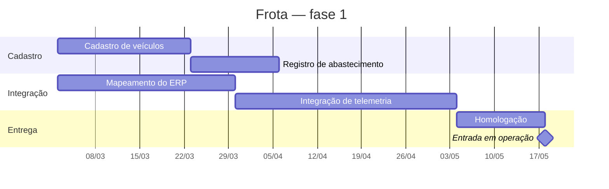
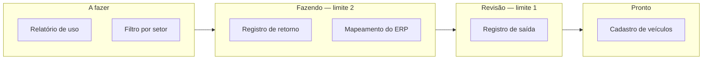

# Aula 12 — Ferramentas e comunicação

> 🎯 Objetivos: escolher a ferramenta de acordo com o regime do projeto, ler um Gantt e um quadro Kanban, aplicar limite de trabalho em andamento e montar um plano de comunicação por interessado.
> 🎬 Slides da aula: [apresentacao-12-ferramentas-e-comunicacao.pdf](apresentacao/apresentacao-12-ferramentas-e-comunicacao.pdf)

## 1. A ferramenta não é o método

Uma transportadora comprou uma ferramenta de gestão ágil, migrou os projetos para quadros e passou a chamar as fases de sprints. Escopo, prazo e orçamento continuaram fechados no início do ano e aprovados pela diretoria, sem possibilidade de revisão.

Seis meses depois, a equipe está frustrada: prometeram adaptação e ela nunca aconteceu. A ferramenta funcionava perfeitamente.

**Trocar a ferramenta é barato; mudar o contrato, a expectativa da diretoria e a disponibilidade do cliente não é.** É por isso que a adoção quase sempre para na parte visível — que é exatamente o ágil teatral da Aula 05, visto agora do lado das ferramentas.

O que se ganha de verdade ao escolher a ferramenta certa é modesto e real: **visibilidade**. Ela não decide nada, não prioriza nada e não conserta processo. Mostra.

E mostrar já é bastante: boa parte dos problemas de gestão sobrevive porque ninguém os vê inteiros. O quadro que expõe catorze itens parados não resolve nada sozinho, e torna impossível continuar dizendo que está tudo andando.

> 💡 **A pergunta antes de escolher qualquer ferramenta:** *o projeto é preditivo ou adaptativo?* A resposta veio na Aula 02, e ela determina o que se acompanha — desvio contra a linha de base, ou fluxo de trabalho. Escolher a ferramenta do regime errado produz relatório que ninguém usa.

> ⚠️ **Ferramenta ágil com gestão sequencial por trás é o arranjo mais comum do mercado.** Ele não é ilegítimo — um projeto pode ser preditivo e usar quadro. O que engana é chamar isso de transformação ágil, e é o time que descobre a diferença.

## 2. Ferramentas para modelos sequenciais

Num projeto preditivo, o que se acompanha é o **desvio contra a linha de base** da Aula 03. Três instrumentos, e todos vêm da EAP:

**A EAP** decompõe o resultado. Cada folha vira tarefa.

**O Gantt** põe as tarefas no tempo, com dependências e marcos:



Lê-se nesta ordem: **o marco** no fim, **a cadeia mais longa** até ele, e **onde há folga**. Aqui a cadeia mais longa passa pela integração — mapeamento e telemetria somam 63 dias, contra 35 do cadastro. Atrasar o cadastro em uma semana não move a entrega; atrasar o mapeamento move.

Essa cadeia tem nome: **caminho crítico**. É onde a atenção do gerente vale mais, e é contraintuitivo, porque a tarefa mais visível raramente é a mais crítica.

> 💡 **O Gantt é a foto de uma decisão, e envelhece.** Se as barras não mudam há dois meses, ou o projeto é perfeito ou ninguém está replanejando. A ferramenta não avisa — ela desenha alegremente um plano que já não corresponde a nada.

## 3. Ferramentas para modelos ágeis

Num projeto adaptativo, o que se acompanha é o **fluxo**: o que entrou, o que está em andamento, o que saiu.

| Instrumento | O que ele mostra | Pergunta que responde |
|---|---|---|
| **Backlog ordenado** | tudo o que se quer, em ordem | o que fazemos a seguir? |
| **Quadro** | onde está cada item agora | onde o trabalho está travando? |
| **Burndown** | quanto falta contra o tempo | vamos chegar? |

O **quadro** é o instrumento central, e o que lhe dá valor não é a existência das colunas:



O **burndown** mostra o que falta contra o tempo. Lê-se pela inclinação, não pelo valor: uma linha real que desce mais devagar que a ideal desde o terceiro dia já permite prever, no quinto, que metade não sairá.

E há um comportamento que confunde quem vê pela primeira vez: **burndown que sobe**. Não é erro de desenho — é escopo entrando no meio da iteração. Se sobe toda vez, o problema não está no time.

| Dia | Restante (ideal) | Restante (real) | O que isso já diz |
|:---:|:---:|:---:|---|
| 1 | 40 | 40 | — |
| 3 | 32 | 38 | a inclinação real é menor: atenção |
| 5 | 24 | 30 | dá para prever que metade não sai |
| 7 | 16 | 34 | **subiu**: entrou escopo no meio |
| 10 | 0 | 22 | fechou com pouco mais da metade |

A leitura útil acontece no **dia 5**, não no dia 10. No dia 10 o gráfico só confirma o que já era evitável — e é por isso que burndown apresentado apenas na retrospectiva não serve para nada: ele vira registro histórico em vez de instrumento de decisão.

> 💡 **Todos os três instrumentos ágeis são de fluxo, e nenhum deles diz se o que está sendo feito importa.** Um quadro saudável, com fluxo constante e burndown limpo, pode estar entregando funcionalidade que ninguém usa — o quarto desperdício da Aula 08.

## 4. Kanban e o limite de trabalho em andamento

O limite por coluna é a única regra do quadro que produz mudança de comportamento. Quando "Fazendo" bate o limite, ninguém puxa item novo: **ajuda-se a terminar o que já está lá.**

O desconforto é o objetivo. Ele torna visível o gargalo que a fila escondia — no quadro acima, se "Revisão" vive cheia, o problema não é quem constrói, é quem revisa.

Por que isso funciona:

- **Começar é grátis, terminar é caro.** Sem limite, todos começam, e o quadro enche de trabalho pela metade — o primeiro desperdício da Aula 08;
- **Item parado não entrega valor nenhum.** Cinco itens 80% prontos valem zero; um item pronto vale um;
- **O limite força a conversa certa.** Em vez de "quem está livre?", a pergunta vira "o que precisa terminar?".

Qual limite escolher? A regra prática que funciona: **menos que o número de pessoas**. Um time de cinco com limite 3 em "Fazendo" garante que, em algum momento, duas pessoas vão trabalhar no mesmo item — que é o ponto. O limite existe para produzir colaboração, não para distribuir tarefas.

E o limite mais revelador não é o de "Fazendo": é o das colunas de **espera**, como revisão ou homologação. Elas costumam não ter limite nenhum, porque parece que "só estão aguardando" — e é exatamente ali que se acumulam os sete dias de espera que a Aula 08 mediu.

> ⚠️ **Quadro sem limite é cemitério.** Catorze cartões em "Fazendo" e nada saindo é o sintoma mais comum, e nenhuma ferramenta o impede — o limite é uma decisão do time, e a ferramenta apenas o exibe.

## 5. Gestão da comunicação

Comunicar não é reunir. O plano de comunicação responde, **por interessado**: o que ele precisa saber, com que frequência, em que formato, e quem envia.

Ele nasce da matriz poder × interesse da Aula 07 — cada quadrante recebe um tratamento:

| Interessado | Precisa saber | Frequência | Formato | Quem envia |
|---|---|---|---|---|
| Diretoria (patrocina) | se a data e o custo se sustentam, e os riscos altos | mensal | uma página, com semáforo | gerente |
| Gestor de frota (usa) | o que muda na operação e quando | quinzenal | reunião de 30 min + resumo | gerente |
| Equipe | tudo o que afeta o trabalho da semana | diária | conversa e quadro | o próprio time |
| Oficina (será afetada) | quando o sistema começa a sugerir janelas | antes de cada marco | comunicado curto | gerente |
| Auditoria | o que foi decidido e quem aprovou | sob demanda | registro no repositório | gerente |

**Mandar o mesmo para todos falha com todos.** A diretoria não lê o detalhe; a equipe não se orienta por uma página mensal. O e-mail com todos em cópia é a forma mais eficiente de garantir que ninguém se sinta responsável por ler.

Repare que a auditoria aparece com frequência **"sob demanda"**, e isso é uma decisão, não uma omissão: ela não acompanha o projeto, mas precisa encontrar o que procura quando vier. O que o plano promete a ela não é periodicidade — é que o registro exista e esteja localizável, que é o assunto da Aula 11.

> 💡 **A frequência é o campo mais importante e o mais esquecido.** Sem ela, a comunicação vira reativa: fala-se com o interessado quando há problema — e a primeira notícia que ele recebe do projeto é uma ruim.

## 6. O plano de comunicação numa tabela

A tabela da seção 5 é o artefato inteiro. Três regras que a tornam usável:

**Uma linha por interessado, não por reunião.** O plano organiza-se por quem recebe, e não pela agenda de quem envia — senão os interessados que não têm reunião simplesmente somem dele.

**Quem envia é uma pessoa.** "A equipe informa" não informa nada; Ana informa.

**Comunicação ruim tem hora marcada.** Notícia ruim vai **antes** do canal previsto, e diretamente. Um risco que virou problema não espera o relatório mensal — o plano estabelece o mínimo, não o teto.

E vale fechar o bloco com o fio comum das quatro aulas: risco, qualidade, documentação e comunicação **são todas formas de fazer a informação chegar a tempo a quem decide**. O risco antecipa o que pode acontecer; a métrica mostra o que está acontecendo; o documento preserva o que foi decidido; a comunicação leva tudo isso a quem precisa. Nenhuma delas produz software — todas evitam que ele seja feito errado.

> 📖 O Guia PMBOK dedica áreas de conhecimento ao cronograma e às comunicações, com o caminho crítico e o plano de comunicações. O Cruz trata do quadro, do limite de trabalho em andamento e do burndown na parte de técnicas ágeis.

## 🏋️ Exercícios da aula

Na pasta `aula-12/` do seu repositório:

1. **`ex01.md`** — para cada situação, escolha entre **Gantt**, **quadro Kanban** ou **burndown**, justificando: (a) mostrar à diretoria que a entrega de setembro depende da integração; (b) descobrir por que nada termina, apesar de todos estarem ocupados; (c) prever, no quinto dia, se a iteração vai fechar; (d) decidir qual atraso pode ser absorvido sem mover a data; (e) mostrar que o escopo cresceu no meio da iteração. *Confere assim: duas das cinco são do mesmo instrumento — e ele é o que mostra tempo contra o que falta.*

2. **`ex02.md`** — leia o Gantt da seção 2 e responda: qual é o caminho crítico, quantos dias de folga tem a cadeia do cadastro, e o que acontece com a data de entrada em operação se o mapeamento do ERP atrasar duas semanas. *Confere assim: a folga da cadeia do cadastro é a diferença entre as duas cadeias — e se o mapeamento atrasar, a data se move exatamente pelo mesmo tanto, porque ele está no caminho crítico.*

3. **`ex03.md`** — um quadro tem 14 cartões em "Fazendo", 1 em "Revisão" e nenhum em "Pronto" há duas semanas. A equipe tem 5 pessoas. Diagnostique o que está acontecendo, proponha os **limites por coluna** que você adotaria e diga **qual conversa** o limite vai forçar na primeira semana. *Confere assim: a sua proposta de limite para "Fazendo" precisa ser menor que o número de pessoas, e você precisa dizer por quê.*

4. **`ex04.md`** — monte o **plano de comunicação** do projeto de [prontuário de clínica-escola](../../recursos/projetos-para-praticar.md#10-prontuário-de-clínica-escola), com no mínimo cinco interessados e as cinco colunas da seção 5. Um dos interessados precisa ser o **comitê de ética**, que se reúne uma vez por mês. *Confere assim: a frequência de comunicação com o comitê não pode ser maior que a frequência com que ele se reúne — se você escreveu "quinzenal", o plano promete o que não se cumpre.*

5. **`ex05.md`** — 🌶️ **Desafio.** A diretoria da transportadora comprou uma ferramenta de gestão ágil e determinou a migração de todos os projetos, mantendo escopo, prazo e orçamento aprovados anualmente. **Escreva a resposta**, contendo: (i) o que a ferramenta vai de fato entregar nesse contexto, sem exagero; (ii) o que ela **não** vai entregar, e qual mudança fora da ferramenta seria necessária; (iii) **o que se perde** ao adotar mesmo assim — e por que adotar ainda pode ser a decisão certa. *Confere assim: o item (iii) precisa terminar defendendo a adoção. Se a sua resposta for só contra, você não encontrou o valor real da visibilidade, que existe mesmo em projeto preditivo.*

## 🧠 Revisão

[8 questões de múltipla escolha](revisao/README.md) para conferir se os conceitos ficaram sólidos. Responda sem consultar a aula — depois volte e corrija.

## ✅ Entrega

```bash
git add aula-12/
git commit -m "Resolve exercícios da aula 12 (ferramentas e comunicação)"
git push
```

---

⬅️ [Aula 11 — Documentação](../aula-11-documentacao/README.md) | ➡️ [Aula 13 — Versão, mudança e configuração](../../bloco-4-projeto-avancado/aula-13-versao-mudanca-configuracao/README.md)
