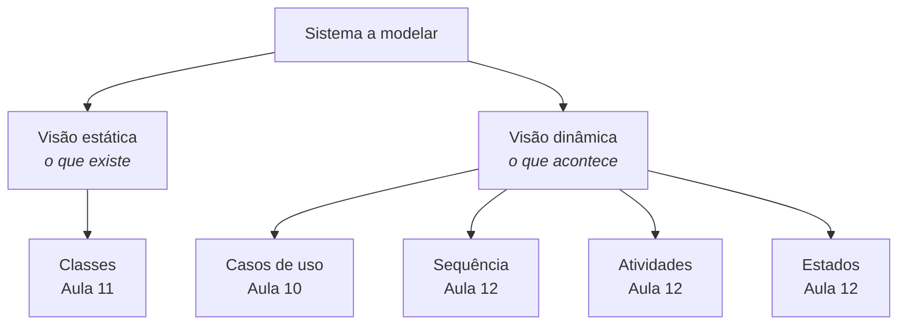

# Aula 09 — Por Que Modelar e o Que É UML

> 🎯 Objetivos: explicar para que serve um modelo e por que todo modelo é incompleto, reconhecer os cinco diagramas UML que se usam de verdade e decidir quanto modelar em um projeto.
> 🎬 Slides da aula: [apresentacao-09-por-que-modelar-e-uml.pdf](apresentacao/apresentacao-09-por-que-modelar-e-uml.pdf)

## 1. Todo modelo está errado

Você tem o documento de requisitos do bloco anterior: interessados, regras, histórias, critérios de aceite. Tudo em prosa. E agora precisa explicar a outra pessoa **como as coisas se relacionam** — que uma interdição atropela reservas, que uma reserva pode existir sem nunca virar uso.

Escrever isso em prosa dá três páginas que ninguém lê igual. Desenhar dá dez minutos.

Um **modelo** é uma representação **simplificada e proposital** de alguma coisa. A palavra que importa é *proposital*: um modelo deixa de fora quase tudo, e o que ele deixa de fora foi **escolhido**. O mapa do metrô não tem a distância real entre as estações — e é por isso que ele funciona.

A frase mais útil da estatística vale integralmente aqui:

> *"Todos os modelos estão errados; alguns são úteis."* — George Box

| Um modelo serve para | Um modelo **não** serve para |
|---|---|
| Conversar sobre uma decisão antes de pagar por ela | substituir a conversa |
| Achar contradição enquanto ela é barata | provar que o sistema está certo |
| Explicar o sistema a quem chega depois | documentar cada detalhe do código |
| Delimitar o que está dentro e fora | ser mantido eternamente atualizado sozinho |

> 💡 A pergunta que decide se um modelo presta não é *"está completo?"* — nenhum está. É **"que decisão este desenho me ajuda a tomar?"**. Se não há resposta, o desenho é enfeite, e enfeite envelhece e mente.

> 📖 Bezerra abre o livro justamente pela discussão de modelos, abstração e por que se modela antes de programar.

## 2. De onde veio a UML

Começo dos anos 1990: a orientação a objetos pegou, e cada autor tinha uma notação própria. Booch desenhava nuvens, Rumbaugh desenhava retângulos, Jacobson tinha os casos de uso. Um diagrama feito numa empresa era ilegível na outra — a chamada *guerra dos métodos*.

Os três se juntaram na Rational e unificaram as notações. Em 1997 o resultado virou padrão da **OMG**, e é o que usamos até hoje: a **UML** — *Unified Modeling Language*.

Duas consequências dessa origem valem para sempre:

- **UML é uma linguagem, não um método.** Ela diz o que cada símbolo significa; **não** diz quando desenhar, quantos diagramas fazer nem em que ordem. Quem diz isso é o processo (Aula 02);
- **UML é orientada a objetos.** Ela nasceu para modelar sistemas feitos de objetos que colaboram. Isso explica por que o diagrama de classes é o centro dela.

> ⚠️ "Usamos UML" não é resposta para "qual é o processo de vocês", assim como "usamos português" não é resposta para "como vocês escrevem um contrato".

## 3. Os quatorze diagramas, e os cinco que importam

A UML define **quatorze** tipos de diagrama. Você não vai usar quatorze — quase ninguém usa. Cinco resolvem praticamente tudo, e são os cinco deste curso:

| Diagrama | Responde a | Aula |
|---|---|---|
| **Casos de uso** | quem usa o sistema e para quê? | 10 |
| **Classes** | que coisas existem e como se relacionam? | 11 |
| **Sequência** | como as partes conversam neste cenário? | 12 |
| **Atividades** | qual é o fluxo do trabalho, com decisões? | 12 |
| **Estados** | por que situações **um objeto** passa ao longo da vida? | 12 |

Os outros nove — objetos, pacotes, componentes, implantação, comunicação, tempo, visão geral de interação, estrutura composta, perfil — existem e têm uso legítimo. Componentes e implantação aparecem de passagem na Aula 14; os demais você reconhece quando encontrar e busca a notação na hora.

> 💡 Não decore os quatorze. Decore a **pergunta** que cada um dos cinco responde. Escolher o diagrama errado é o erro mais caro desta parte do curso — desenhar bem o diagrama errado não ajuda ninguém.

## 4. Visão estática × visão dinâmica

Os cinco se dividem em duas famílias, e essa divisão é a mais útil de todas:

| | **Estática** (estrutura) | **Dinâmica** (comportamento) |
|---|---|---|
| Mostra | o que **existe** e como se liga | o que **acontece**, e em que ordem |
| Tem tempo? | não | sim |
| Diagramas | classes, componentes, implantação | casos de uso, sequência, atividades, estados |
| Pergunta | "quais são as peças?" | "como as peças se comportam?" |



Um exemplo do sistema-guia mostra por que se precisa das duas. O diagrama de classes diz que **existe** uma associação entre `Reserva` e `ConfirmacaoDeUso`, com multiplicidade `0..1`. Ele **não** diz que a confirmação precisa acontecer nos primeiros 15 minutos, nem o que acontece se não acontecer. Isso é `RN-06`, é comportamento, e pede um diagrama de estados.

E o contrário também vale: o diagrama de estados mostra que uma reserva pode ir para "não compareceu", mas não diz **que informação** uma reserva guarda nem a que espaço ela se liga. Nenhuma das duas visões é a principal; elas respondem a perguntas que a outra não responde.

> ⚠️ Um erro comum é achar que o diagrama estático é "o modelo" e o resto é enfeite. **Metade das regras de um domínio é temporal** — prazos, ordens, transições, prioridades — e nenhuma delas cabe num retângulo ligado a outro retângulo.

> 💡 Quatro dos cinco diagramas do curso são dinâmicos. Isso não é acaso: descrever o que existe é a parte fácil, e é por isso que quem está aprendendo tende a parar no diagrama de classes e achar que documentou o sistema.

## 5. UML como língua franca

Por que aprender uma notação padronizada em vez de desenhar do seu jeito?

- **Retângulo com três divisões** é classe em qualquer lugar do mundo;
- **Losango preto** é composição no Brasil, na Índia e na Alemanha;
- **Seta tracejada** é dependência, e não "seta bonitinha".

Isso importa em três momentos concretos: quando entra alguém novo no time, quando o time conversa com outro time, e quando você lê a documentação de um sistema que não construiu — que é a situação mais comum da vida profissional.

> 💡 O valor de um padrão é ele ser **chato e conhecido**. Um desenho pessoal, por mais claro que pareça a quem desenhou, exige uma legenda — e a legenda some antes do desenho.

> 🧩 **Ponte com POO:** o diagrama de classes da UML e a declaração de classes em Java descrevem a mesma coisa em duas linguagens. `Reserva "1" *-- "0..1" ConfirmacaoDeUso` e um atributo do tipo `ConfirmacaoDeUso` dentro de `Reserva` são a mesma afirmação. A Aula 11 faz essa tradução com calma.

## 6. Quanto UML é suficiente

Existe modelagem demais, e ela é tão cara quanto modelagem de menos. Três usos legítimos, com doses diferentes:

| Uso | Quanto desenhar | Vida útil |
|---|---|---|
| **Rascunho** — pensar junto, no quadro | o mínimo para a conversa | minutos; some depois |
| **Documentação** — explicar o sistema a quem chega | os poucos diagramas que respondem às perguntas frequentes | anos, e precisa ser mantido |
| **Especificação** — gerar código ou contratar terceiro | completo e rigoroso | enquanto o contrato durar |

A maior parte do trabalho profissional é **rascunho**, e uma parte menor é **documentação**. Especificação completa é rara e cara — e quando alguém a exige, geralmente há um contrato ou uma certificação por trás.

Três perguntas decidem o quanto desenhar:

1. **Quem vai ler?** Se a resposta é "ninguém", pare;
2. **Que decisão isso ajuda a tomar?** Se nenhuma, é enfeite;
3. **Quem mantém quando mudar?** Diagrama desatualizado é pior que diagrama ausente — ele mente com autoridade.

> ⚠️ O erro mais comum de quem está aprendendo é o **detalhe demais**: modelar todos os atributos, todos os métodos, todas as classes técnicas, e produzir um diagrama que ninguém consegue ler numa tela. Um diagrama com 40 classes não documenta um sistema; ele documenta que ninguém decidiu o que era importante.

E existe o erro simétrico, menos discutido: **desenhar de menos por preguiça e chamar isso de agilidade**. Os dois têm o mesmo sintoma — ninguém consegue responder a uma pergunta sobre o sistema sem abrir o código —, e a Aula 03 já separou as duas coisas: o filtro não é a quantidade de páginas, é se alguém vai ler.

| Sintoma | Provável causa |
|---|---|
| O diagrama não cabe na tela | detalhe demais; falta decidir o recorte |
| O diagrama está sempre desatualizado | é mantido sem ninguém consultar; considere descartá-lo |
| Toda pergunta sobre o sistema termina em "abre o código" | documentação de menos |
| Ninguém sabe dizer para quem o diagrama foi feito | ele não tem público, logo não tem propósito |

## 🏋️ Exercícios da aula

Na pasta `aula-09/` do seu repositório:

1. **`ex01.md`** — para cada pergunta, diga **qual diagrama** você desenharia e por que os outros não servem: (a) quem interage com o sistema e para quê? (b) que informações existem sobre um espaço? (c) em que ordem as partes do sistema trocam mensagens ao registrar uma interdição? (d) por quais situações uma reserva passa desde que é criada? (e) qual é o passo a passo, com decisões, de alguém procurando sala? (f) o sistema conversa com o Sistema Acadêmico em que momentos?;
2. **`ex02.md`** — abaixo está a descrição de um diagrama entregue por uma equipe. **Critique-o**: aponte o que sobra, o que falta e o que está no nível errado de abstração. Depois escreva, em cinco linhas, **o diagrama que você entregaria no lugar** e a quem ele se destina.

   > *Diagrama de classes com 34 classes numa folha A4. Inclui `Reserva`, `Espaco`, `ReservaDAO`, `EspacoDAO`, `ReservaController`, `ReservaService`, `ReservaDTO`, `AbstractEntity`, `StringUtils`, `DateFormatter` e `ConexaoBanco`. Cada classe lista todos os atributos com tipo, todos os getters e setters. Não há multiplicidades nas associações. Foi apresentado à secretaria numa reunião de validação de requisitos.*

3. **`ex03.md`** — leia o [diagrama de classes do guia de notações](../../recursos/notacoes-uml.md#1-diagrama-de-classes) e **escreva em português** tudo que ele afirma sobre o mundo — uma frase por associação e por multiplicidade, no plural e nos dois sentidos. Depois aponte **duas afirmações que ele faz e que você não tem certeza se são verdadeiras** no sistema-guia, e escreva a pergunta que faria à secretaria para confirmar;
4. **`ex04.md`** — monte uma tabela com os cinco diagramas do curso e, para cada um: a visão (estática ou dinâmica), a pergunta que ele responde, o que ele **não** consegue expressar e um exemplo de informação do sistema-guia que se perderia se ele fosse o único diagrama do projeto;
5. **Desafio 🌶️ `ex05.md`** — você tem **quatro horas** para documentar o sistema-guia para uma pessoa que entra no time na semana que vem e vai trabalhar na área de reservas. Decida **quais diagramas fazer** e escreva o plano: quais são, em que ordem, quanto tempo em cada um, e o que cada um responde. Em seguida — e esta é a parte que vale mais —, escreva a seção **"o que deliberadamente não documentei"**, listando pelo menos cinco coisas que ficaram de fora e **o motivo de cada uma**. Feche dizendo como a pessoa nova vai descobrir aquilo que você não documentou. Bom modelador se reconhece pelo que ele decide não desenhar.

## 🧠 Revisão

[8 questões de múltipla escolha](revisao/README.md) para conferir se os conceitos ficaram sólidos. Responda sem consultar a aula — depois volte e corrija.

## ✅ Entrega

```bash
git add aula-09/
git commit -m "Resolve exercícios da aula 09 (por que modelar e o que é UML)"
git push
```

---

⬅️ [Aula 08 — Análise, priorização e validação](../../bloco-2-requisitos/aula-08-analise-priorizacao-validacao/README.md) | ➡️ [Aula 10 — Casos de uso](../aula-10-casos-de-uso/README.md)
