<!-- _class: capa -->

🗺️

# Por Que Modelar e o Que É UML

## Aula 09 · Bloco 3 — Modelagem e UML

Todo modelo está errado; alguns são úteis

---

## 🎯 Nesta aula

1. Todo modelo está **errado**
2. De onde veio a **UML**
3. Os quatorze diagramas, e os **cinco que importam**
4. Visão **estática × dinâmica**
5. **Quanto** UML é suficiente

---

## O que é um modelo

Explicar **como as coisas se relacionam** — que uma interdição atropela reservas, que uma reserva pode existir sem nunca virar uso — em prosa dá três páginas que ninguém lê igual. Desenhado dá dez minutos.

Modelo é uma representação **simplificada e proposital**. A palavra que importa é *proposital*: ele deixa de fora quase tudo, e o que ficou de fora foi **escolhido**.

---

<!-- _class: lead -->

## 💡 O mapa do metrô

não tem a distância real entre as estações —
e é **por isso** que ele funciona.

> *"Todos os modelos estão errados;
> alguns são úteis."* — George Box

A pergunta não é *"está completo?"* — nenhum está.
É **"que decisão este desenho me ajuda a tomar?"**

Sem resposta, o desenho é enfeite —
e enfeite envelhece e mente.

---

<!-- _class: tabela-densa -->

## Para que serve, e para que não serve

| Um modelo serve para | Um modelo **não** serve para |
|---|---|
| Conversar sobre uma decisão antes de pagar por ela | substituir a conversa |
| Achar contradição enquanto ela é barata | provar que o sistema está certo |
| Explicar o sistema a quem chega depois | documentar cada detalhe do código |
| Delimitar o que está dentro e fora | ficar atualizado sozinho |

---

## De onde veio a UML

Anos 1990: cada autor tinha uma notação. Booch desenhava nuvens, Rumbaugh retângulos, Jacobson tinha os casos de uso. Um diagrama feito numa empresa era ilegível na outra — a **guerra dos métodos**.

Os três se juntaram na Rational; em 1997 virou padrão da **OMG**.

- **UML é uma linguagem, não um método.** Diz o que cada símbolo significa; **não** diz quando desenhar nem quantos diagramas fazer;
- **UML é orientada a objetos** — por isso o diagrama de classes é o centro dela.

---

<!-- _class: lead -->

## ⚠️ "Usamos UML" não é um processo

Assim como *"usamos português"*
não é resposta para
**"como vocês escrevem um contrato?"**

Quem responde por quando desenhar,
quantos diagramas e em que ordem
é o **processo** — a Aula 02.

---

<!-- _class: tabela-densa -->

## Quatorze diagramas, cinco que importam

| Diagrama | Responde a | Aula |
|---|---|---|
| **Casos de uso** | quem usa o sistema e para quê? | 10 |
| **Classes** | que coisas existem e como se relacionam? | 11 |
| **Sequência** | como as partes conversam neste cenário? | 12 |
| **Atividades** | qual é o fluxo do trabalho, com decisões? | 12 |
| **Estados** | por que situações **um objeto** passa? | 12 |

Os outros nove têm uso legítimo — componentes e implantação voltam na Aula 14.

---

<!-- _class: lead -->

## 💡 Não decore os quatorze

Decore a **pergunta** que cada um dos cinco responde.

Escolher o diagrama errado é o erro mais caro
desta parte do curso:

**desenhar bem o diagrama errado
não ajuda ninguém.**

---

<!-- _class: diagrama -->

## Duas famílias

---

<!-- _class: tabela-densa -->

## Estática × dinâmica

| | **Estática** | **Dinâmica** |
|---|---|---|
| Mostra | o que **existe** e como se liga | o que **acontece**, e em que ordem |
| Tem tempo? | não | sim |
| Diagramas | classes, componentes, implantação | casos de uso, sequência, atividades, estados |
| Pergunta | "quais são as peças?" | "como as peças se comportam?" |

---

## Por que se precisa das duas

O **diagrama de classes** diz que existe associação entre `Reserva` e `ConfirmacaoDeUso`, com multiplicidade `0..1`.

Ele **não** diz que a confirmação precisa acontecer nos primeiros 15 minutos, nem o que acontece se não acontecer. Isso é a `RN-06` — comportamento, e pede um diagrama de **estados**.

E o contrário vale: o diagrama de estados mostra que a reserva pode ir para "não compareceu", mas não diz **que informação** ela guarda.

---

<!-- _class: lead -->

## ⚠️ Metade das regras de um domínio é temporal

Prazos, ordens, transições, prioridades —
e **nenhuma** delas cabe num retângulo
ligado a outro retângulo.

💡 Quatro dos cinco diagramas do curso são dinâmicos,
e isso não é acaso: descrever o que existe é a parte fácil.

É por isso que quem está aprendendo tende a parar
no diagrama de classes e achar que documentou o sistema.

---

## UML como língua franca

- **Retângulo com três divisões** é classe em qualquer lugar do mundo;
- **Losango preto** é composição no Brasil, na Índia e na Alemanha;
- **Seta tracejada** é dependência, não "seta bonitinha".

Isso importa em três momentos: quando entra alguém novo, quando o time conversa com outro time, e quando você lê a documentação de um sistema que **não construiu** — a situação mais comum da vida profissional.

> 💡 O valor de um padrão é ele ser **chato e conhecido**.

---

## Quanto UML é suficiente

| Uso | Quanto desenhar | Vida útil |
|---|---|---|
| **Rascunho** — pensar junto no quadro | o mínimo para a conversa | minutos; some depois |
| **Documentação** — explicar a quem chega | os poucos que respondem às perguntas frequentes | anos, e precisa ser mantido |
| **Especificação** — contratar terceiro | completo e rigoroso | enquanto o contrato durar |

Três perguntas decidem: **quem vai ler?** · **que decisão isso ajuda a tomar?** · **quem mantém quando mudar?**

---

<!-- _class: lead -->

## ⚠️ Os dois erros simétricos

**Detalhe demais.** Um diagrama com 40 classes
não documenta um sistema — documenta que
**ninguém decidiu o que era importante**.

**Detalhe de menos por preguiça**, chamado de agilidade.

Os dois têm o mesmo sintoma: ninguém responde a uma
pergunta sobre o sistema sem abrir o código.

O filtro não é a quantidade de páginas.
É **se alguém vai ler**.

---

<!-- _class: checkpoint -->

## 🏋️ Exercícios da aula

Na pasta `aula-09/`:

1. **`ex01.md`** — qual diagrama para cada uma de seis perguntas, e por que os outros não servem;
2. **`ex02.md`** — critique um diagrama de 34 classes numa folha A4;
3. **`ex03.md`** — escreva **em português** tudo que um diagrama de classes afirma;
4. **`ex04.md`** — os cinco diagramas e o que cada um **não** consegue expressar;
5. **Desafio 🌶️ `ex05.md`** — documente o sistema em 4 horas — e escreva **"o que deliberadamente não documentei"**.

---

<!-- _class: lead -->

## ➡️ Próxima aula

**Aula 10 — Casos de uso**

Quem usa o sistema, para quê —
e por que o diagrama é só o índice.
