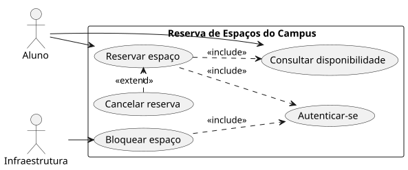

<!-- _class: capa -->

🎭

# Casos de Uso

## Aula 10 · Bloco 3 — Modelagem e UML

O diagrama é o índice. O conteúdo é a especificação textual

---

## 🎯 Nesta aula

1. Onde termina o **sistema**
2. Caso de uso **não é tela**
3. `include`, `extend` e **generalização**
4. A **especificação textual** — onde está o conteúdo
5. Caso de uso × história, e **granularidade**

---

## A fronteira, e o que fica fora dela

Primeira pergunta antes de qualquer desenho: **o que é o sistema e o que é o mundo?**

O Sistema Acadêmico está dentro ou fora? Se está dentro, você responde por ele. Se está fora, você **depende** dele e precisa decidir o que fazer quando ele cair.

Ele está **fora** — e isso é decisão de escopo, já registrada no documento do cliente.

> **Ator** é um papel externo à fronteira que interage com o sistema.

---

<!-- _class: lista-limpa -->

## Três consequências que resolvem quase tudo

- 🎭 **Ator é papel, não pessoa.** A mesma professora é *Solicitante* ao reservar e *Coordenação* ao pedir o relatório — dois atores, uma pessoa;
- 🤖 **Ator pode não ser humano.** O Sistema Acadêmico é ator: está fora e interage. Um relógio que dispara rotina às 3h também;
- 🚫 **O que está dentro nunca é ator.** Banco de dados, servidor, módulo de notificação são partes do sistema.

---

<!-- _class: lead -->

## 💡 O teste rápido da fronteira

Se **você é responsável por consertar
quando aquilo quebrar**, está dentro.

Se você só pode **reclamar com outra pessoa**,
está fora — e é ator.

---

<!-- _class: tabela-densa -->

## Caso de uso não é tela

`verbo + complemento`, no infinitivo, e passa neste teste: *"o aluno usa o sistema para \_\_\_\_."*

| Escrito errado | Por quê | Escrito certo |
|---|---|---|
| Tela de login | é uma tela | Autenticar-se |
| Menu principal | é navegação | *(não é caso de uso)* |
| Preencher formulário | é um passo | Reservar espaço |
| Clicar em cancelar | é uma interação | Cancelar reserva |
| Gerenciar reservas | esconde 4 objetivos | Reservar · Cancelar · Consultar · Confirmar |

---

<!-- _class: lead -->

## ⚠️ "Gerenciar X" quase nunca é caso de uso

É o nome que se dá
quando **não se decidiu**
quais são os objetivos de verdade.

Toda vez que a palavra aparecer,
quebre em verbos concretos
e veja **quantos** aparecem.

Ninguém usa o sistema para "clicar em salvar".
Usa para **reservar um espaço**.

---

## Três setas, e duas são trocadas o tempo todo

| | Significa | Quem aponta |
|---|---|---|
| `include` | **sempre** acontece; extraído para não repetir | o **base** → o incluído |
| `extend` | acontece **às vezes**, sob condição | o **extensor** → o base |
| generalização | é uma variação especializada | o específico → o geral |

A regra que resolve na hora: leia em voz alta **"isto acontece sempre?"**. Sempre → `include`. Só quando ⟨condição⟩ → `extend` — **e a seta vai na direção contrária** da que a intuição pede.

---

<!-- _class: diagrama -->

## O diagrama do sistema-guia

---

<!-- _class: lead -->

## 💡 Na dúvida, não use nenhuma das três

Dois casos de uso **independentes e bem especificados**
valem mais que um diagrama cheio de setas
que cada leitor interpreta de um jeito.

O relacionamento existe para **evitar repetição**,
não para demonstrar conhecimento de notação.

---

<!-- _class: lead -->

## ⚠️ O ponto mais importante da aula

**O diagrama de casos de uso é o índice.
O conteúdo é a especificação textual.**

O diagrama cabe num slide e sai em dez minutos.
Quem vai construir o sistema lê a **especificação** —
e é ela que expõe as regras que ninguém tinha percebido.

Um diagrama com dez elipses e nenhuma especificação
**não documenta nada**.

---

<!-- _class: tabela-densa -->

## UC-02 — Reservar espaço

| | |
|---|---|
| **Ator principal** | Solicitante (aluno, professor ou setor) |
| **Interessados** | Secretaria (quer parar de mediar); Infraestrutura (precisa interditar) |
| **Pré-condições** | Solicitante autenticado; existe espaço cadastrado |
| **Pós-condição** | Reserva registrada, espaço indisponível no período, solicitante notificado |
| **Gatilho** | O solicitante decide que precisa de um espaço |

---

## Fluxo principal — 6 passos

1. O solicitante informa período, quantidade de pessoas e recursos;
2. O sistema consulta a grade no Sistema Acadêmico e as reservas e bloqueios;
3. O sistema apresenta os espaços livres que atendem;
4. O solicitante escolhe um espaço e **declara a finalidade**;
5. O sistema verifica os limites (`RN-02`, `RN-03`) e a compatibilidade (`RN-08`);
6. O sistema registra a reserva e notifica.

---

<!-- _class: tabela-densa -->

## E os caminhos que não são o feliz

**Alternativos**

- **4a.** Finalidade acadêmica em horário de estudo em grupo → desloca a reserva anterior (`RN-04`), com confirmação e notificação;
- **3a.** Nenhum espaço atende exatamente → apresenta os parciais, indicando o que falta.

**Exceção**

- **2a.** O Sistema Acadêmico não responde → avisa que a disponibilidade pode estar desatualizada;
- **5a / 5b.** Já tem 2 reservas futuras (`RN-03`) ou está suspenso (`RN-07`) → recusa e diz o porquê;
- **6a.** Falha ao registrar → nada é criado, o espaço continua livre.

---

<!-- _class: lead -->

## ⚠️ É na exceção que mora a regra de negócio

Seis passos no fluxo principal.
**Seis casos** nos alternativos e de exceção —
e são eles que citam quase todas as regras.

Um caso de uso só com fluxo principal
descreve o sistema **num dia bom**.

💡 A técnica para achar exceção: em cada passo,
pergunte **"e se não?"**

---

<!-- _class: tabela-densa -->

## Caso de uso × história, e granularidade

| | Caso de uso | História |
|---|---|---|
| Tamanho | um objetivo completo, com todos os caminhos | uma fatia que cabe num ciclo |
| Bom para | entender o domínio e achar exceção | organizar o trabalho e priorizar |
| Fraco em | acompanhar trabalho | dar visão do todo |

O critério de tamanho é a **sessão**: o que o ator faz de uma vez e consideraria "resolvido" ao sair. *Usar o sistema* é grande demais; *digitar a data* é pequeno demais; **reservar espaço** está no ponto.

---

<!-- _class: checkpoint -->

## 🏋️ Exercícios da aula

Na pasta `aula-10/`:

1. **`ex01.md`** — todos os atores, principais e secundários, e o parágrafo que define a fronteira;
2. **`ex02.md`** — oito nomes entregues como casos de uso: quais não são, e por quê;
3. **`ex03.md`** — `include`, `extend` ou nenhum, em cinco pares, com a condição de cada `extend`;
4. **`ex04.md`** — dois casos de uso completos, cada um com **dois fluxos de exceção**;
5. **Desafio 🌶️ `ex05.md`** — revise o diagrama do guia, vá além dele, e responda: **o que a especificação revelou que o diagrama escondia?**

---

<!-- _class: lead -->

## ➡️ Próxima aula

**Aula 11 — Diagrama de classes**

Que coisas existem no domínio,
e o que cada associação afirma sobre o mundo.
