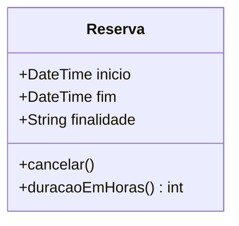
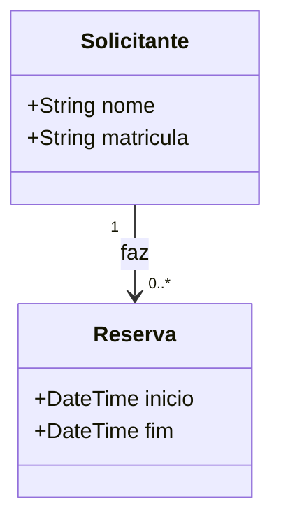
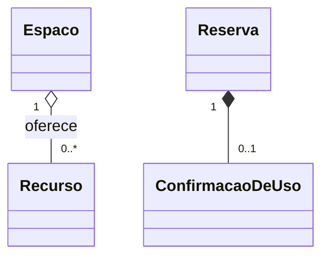
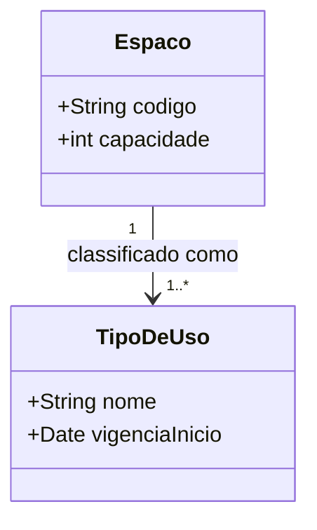

# Aula 11 — Diagrama de Classes

> 🎯 Objetivos: extrair classes de um enunciado, definir associações com multiplicidade nos dois sentidos e decidir entre agregação, composição e herança com critério.
> 🎬 Slides da aula: [apresentacao-11-diagrama-de-classes.pdf](apresentacao/apresentacao-11-diagrama-de-classes.pdf)

## 1. As coisas que existem

Os casos de uso da aula anterior dizem o que o sistema **faz**. Falta a outra metade: **sobre o que** ele faz isso.

Quando o `UC-02` diz *"o sistema verifica os limites do solicitante"*, ele pressupõe que existe algo chamado solicitante, que esse algo tem reservas, e que dá para contá-las. O diagrama de classes é onde essas coisas ganham nome, conteúdo e ligações.

Uma **classe** é um tipo de coisa do domínio: `Reserva`, `Espaco`, `Bloqueio`. Ela tem:

- **Atributos** — o que ela guarda: `inicio`, `fim`, `finalidade`;
- **Operações** — o que ela sabe fazer: `cancelar()`, `estaLivre(periodo)`.



Três divisões no retângulo: nome, atributos, operações. As duas últimas podem ficar vazias quando não interessam ao que você quer discutir.

> ⚠️ **Classe é substantivo.** `CadastrarEspaco`, `GerenciarAgenda` e `ProcessarReserva` não são classes — são operações com fantasia de classe. Se o candidato só tem métodos e nenhum atributo com significado, ele é um procedimento, e provavelmente pertence a alguma classe de verdade.

> 📖 Bezerra trata do diagrama de classes em mais de um capítulo: primeiro as classes de análise, depois o refinamento para projeto.

## 2. Visibilidade

Cada atributo e operação declara quem pode alcançá-lo:

| Símbolo | Visibilidade | Alcance |
|---|---|---|
| `+` | público | qualquer classe |
| `-` | privado | só a própria classe |
| `#` | protegido | a própria classe e as que herdam dela |
| `~` | pacote | classes do mesmo pacote |

A regra de bolso profissional: **atributo privado, operação pública**. Quem precisa do dado pede à classe; a classe decide se entrega e como.

> 🧩 **Ponte com POO:** é exatamente o `private` e o `public` que você escreve em Java. O diagrama e o código dizem a mesma coisa — e a razão é a mesma: quem controla o próprio estado consegue garantir que ele nunca fique inválido. Uma `Reserva` que deixa qualquer um mexer em `fim` não consegue prometer que `fim` é depois de `inicio`.

> 💡 Na fase de **análise**, visibilidade quase não importa e costuma ser omitida — ali se discute o domínio, não a implementação. Ela entra quando o diagrama vira projeto (seção 6).

## 3. Associação e multiplicidade

Classes isoladas não dizem nada. O que interessa é como elas se ligam:



Lê-se: **um solicitante faz de zero a muitas reservas; uma reserva é feita por exatamente um solicitante.**

A **multiplicidade** diz quantos objetos participam de cada lado:

| Notação | Significa |
|---|---|
| `1` | exatamente um — obrigatório |
| `0..1` | nenhum ou um — opcional |
| `0..*` ou `*` | qualquer quantidade, inclusive nenhuma |
| `1..*` | pelo menos um |
| `2..5` | entre dois e cinco |

**A regra que evita o erro mais comum:** toda associação tem **duas** multiplicidades, e as duas precisam ser lidas em voz alta, no plural, nos dois sentidos:

> *"Um solicitante faz quantas reservas?"* → `0..*`
> *"Uma reserva é feita por quantos solicitantes?"* → `1`

> ⚠️ Cuidado com o **mínimo**, que quase ninguém pensa. `1` e `0..1` dizem coisas muito diferentes sobre o mundo: um obriga, o outro permite ausência. No sistema-guia, `Reserva "1" *-- "0..1" ConfirmacaoDeUso` afirma que **uma reserva pode nunca ter confirmação** — e é exatamente esse `0..1` que representa o problema da sala vazia.

## 4. Agregação × composição

Duas associações especiais dizem "isto é parte daquilo". A definição de livro — *todo-parte* — vale para as duas e por isso não decide nada. **Duas perguntas decidem:**

1. **A parte pode existir sem o todo?** Se pode → agregação (losango branco, `o--`);
2. **Se o todo for destruído, a parte vai junto?** Se vai → composição (losango preto, `*--`).



- **Agregação:** desativar a sala B-12 não faz o projetor deixar de existir — ele vai para outra sala;
- **Composição:** a confirmação de uso só existe dentro daquela reserva; se a reserva for apagada, a confirmação não significa mais nada.

> 💡 Se a distinção não muda **nenhuma** decisão nem **nenhuma** regra do domínio, use associação simples e siga em frente. Losango errado documenta uma mentira; losango ausente apenas documenta menos.

## 5. Herança e generalização

A herança diz **"é-um"**: a subclasse é uma variedade da superclasse e serve em qualquer lugar onde a superclasse serve.

O critério é mais estreito do que parece. Só use herança quando o "é-um" for **permanente e exclusivo**:

| Pergunta | Se a resposta for… |
|---|---|
| O objeto pode **mudar de categoria** durante a vida? | herança está errada |
| O objeto pode estar em **duas categorias ao mesmo tempo**? | herança está errada |
| A subclasse tem **atributos ou comportamento próprios** relevantes? | se não tem, não vale a pena |

Um erro do próprio sistema-guia: modelar `SalaDeEstudo` e `Laboratorio` como subclasses de `Espaco`. Parece natural — até a sala ser convertida em laboratório no recesso, e o objeto precisar mudar de classe, o que não existe. O que muda é um **atributo** ou um **objeto associado**, não a classe:



> ⚠️ Teste do "é-um": *"toda sala de estudo é uma sala de estudo, para sempre?"* Se você precisa dizer **"é, mas…"**, não é herança. É a armadilha mais comum de quem está aprendendo POO ao mesmo tempo — herança é a primeira ferramenta que se aprende, e vira martelo.

## 6. Classe de análise × classe de projeto

O mesmo sistema rende **dois** diagramas de classes, com propósitos diferentes e em momentos diferentes:

| | **Análise** | **Projeto** |
|---|---|---|
| Fala a língua de | do cliente | de quem constrói |
| Contém | conceitos do domínio | conceitos do domínio + os que a tecnologia exige |
| Exemplos | `Espaco`, `Reserva`, `Bloqueio` | `+ EspacoRepositorio`, `+ ReservaControlador`, `+ ReservaDTO` |
| Tipos | omitidos ou genéricos | tipos da linguagem, coleções, chaves técnicas |
| Serve para | validar o domínio **com o cliente** | orientar a construção |
| Quando | agora, no Bloco 3 | depois de decidida a arquitetura (Aula 14) |

> ⚠️ Misturar os dois entrega um diagrama que **o cliente não valida e o programador não usa** — foi exatamente o defeito do diagrama criticado no `ex02` da Aula 09. Na análise, se a classe não faz sentido para a secretaria, ela não deveria estar ali.

## 7. Do substantivo à classe

Como sair do texto e chegar ao diagrama? Uma técnica antiga e ainda eficaz:

1. **Grife os substantivos** do documento de requisitos e da especificação dos casos de uso;
2. **Descarte** os que forem sinônimos (fixe o termo do glossário), os que forem atributos e os que estiverem fora da fronteira;
3. **Promova a classe** o que sobrar, e teste cada um;
4. **Grife os verbos** entre eles — viram associações ou operações;
5. **Leia cada associação em voz alta**, nos dois sentidos.

O passo 3 tem dois testes que resolvem quase tudo:

| Teste | Se falhar |
|---|---|
| Tem **atributos próprios** ou **relacionamentos próprios**? | é atributo de outra classe, não classe |
| O cliente vai querer guardar mais alguma coisa sobre isso um dia? | idem |

Aplicando ao trecho *"o solicitante escolhe um espaço e declara a finalidade"*: `Solicitante` tem atributos e reservas → classe. `Espaco` idem → classe. `Finalidade` tem só um nome e uma regra de prioridade… **depende**: se a instituição quiser cadastrar novas finalidades com prioridades diferentes, é classe; se são quatro valores fixos, é atributo. **Essa decisão precisa estar escrita**, com o motivo.

> 💡 Repare no que aconteceu: a técnica não deu a resposta — ela produziu uma **pergunta para o cliente**. É assim que deve ser. Modelagem que não gera pergunta é modelagem que está inventando o domínio.

## 🏋️ Exercícios da aula

Na pasta `aula-11/` do seu repositório:

1. **`ex01.md`** — aplique os cinco passos da seção 7 ao enunciado abaixo. Entregue: a lista de substantivos grifados; a tabela de decisão (classe · atributo · fora da fronteira · sinônimo) com justificativa; e o diagrama Mermaid resultante, com todas as multiplicidades.

   > *A biblioteca empresta notebooks para uso dentro do prédio. Cada notebook tem patrimônio, modelo e situação. O aluno pega o notebook apresentando a carteirinha, e o atendente registra a saída com data e hora. Na devolução, registra-se a hora e o estado do equipamento. Um notebook danificado sai de circulação até a avaliação técnica. Alunos com dois atrasos no mês ficam suspensos por quinze dias.*

2. **`ex02.md`** — o diagrama abaixo tem **pelo menos seis defeitos**. Encontre-os, classifique cada um e entregue o diagrama corrigido em Mermaid, com uma linha de justificativa por correção.

   > Classes: `CadastrarReserva`, `Reserva` (com atributos `nomeDoEspaco`, `capacidadeDoEspaco`, `codigoDoEspaco`), `Espaco`, `ReservaBolsista` e `ReservaComum` como subclasses de `Reserva`, `GerenciadorDeSistema` com 22 operações. Associações: `Reserva --> Espaco` sem multiplicidade em nenhum dos lados; `Espaco *-- Reserva`.

3. **`ex03.md`** — para cada par, defina as multiplicidades **nos dois sentidos** e escreva as duas frases em português que as justificam. Onde a resposta depender de uma decisão do cliente, **escreva a pergunta** em vez de inventar: (a) `Espaco` e `Reserva`; (b) `Reserva` e `Solicitante`; (c) `Espaco` e `Bloqueio`; (d) `Reserva` e `ConfirmacaoDeUso`; (e) `Espaco` e `Recurso`; (f) `Bloqueio` e `Reserva` (as reservas que ele interrompeu);
4. **`ex04.md`** — decida **agregação, composição ou associação simples** para cinco pares, aplicando as duas perguntas da seção 4 e escrevendo as duas respostas: (a) `Espaco` e `Recurso`; (b) `Reserva` e `ConfirmacaoDeUso`; (c) `Bloqueio` e `Espaco`; (d) `Solicitante` e `Reserva`; (e) `Reserva` e `Finalidade`. Ao final, indique **qual das cinco decisões você considera discutível** e o que mudaria na sua escolha;
5. **Desafio 🌶️ `ex05.md`** — o [guia de notações](../../recursos/notacoes-uml.md#1-diagrama-de-classes) traz um fragmento com quatro classes do sistema-guia. **Complete-o:** entregue o **diagrama de classes de análise** do sistema inteiro, cobrindo todo o [vocabulário do domínio](../../recursos/sistema-guia.md#5-vocabulário-do-domínio) e as oito regras de negócio. Requisitos da entrega: todas as multiplicidades nos dois sentidos; **pelo menos uma composição justificada**; nenhuma classe técnica (é análise, não projeto); e um texto acompanhando o diagrama com **(a)** as decisões de modelagem que você tomou e as alternativas que descartou, **(b)** quais regras de negócio o diagrama **não consegue** expressar e onde elas precisarão viver, e **(c)** as perguntas que sobraram para o cliente. O item (b) vale tanto quanto o diagrama: enxergar o limite do modelo é o que a Aula 09 pediu.

## 🧠 Revisão

[8 questões de múltipla escolha](revisao/README.md) para conferir se os conceitos ficaram sólidos. Responda sem consultar a aula — depois volte e corrija.

## ✅ Entrega

```bash
git add aula-11/
git commit -m "Resolve exercícios da aula 11 (diagrama de classes)"
git push
```

---

⬅️ [Aula 10 — Casos de uso](../aula-10-casos-de-uso/README.md) | ➡️ [Aula 12 — Modelagem dinâmica](../aula-12-modelagem-dinamica/README.md)
