<!-- _class: capa -->

📦

# Diagrama de Classes

## Aula 11 · Bloco 3 — Modelagem e UML

Toda associação é uma afirmação sobre o mundo — leia em voz alta

---

## 🎯 Nesta aula

1. As coisas que **existem**
2. **Associação** e multiplicidade
3. **Agregação × composição**
4. **Herança** — e por que ela é mais estreita do que parece
5. Classe de **análise × projeto**, e como sair do texto

---

## Os casos de uso dizem o que o sistema faz

Falta a outra metade: **sobre o quê**.

Quando o `UC-02` diz *"o sistema verifica os limites do solicitante"*, ele pressupõe que existe um solicitante, que ele tem reservas, e que dá para contá-las.

Uma **classe** é um tipo de coisa do domínio. Ela tem **atributos** — o que guarda — e **operações** — o que sabe fazer. Três divisões no retângulo; as duas últimas podem ficar vazias.

---

<!-- _class: lead -->

## ⚠️ Classe é substantivo

`CadastrarEspaco`, `GerenciarAgenda` e `ProcessarReserva`
**não são classes** — são operações com fantasia de classe.

Se o candidato só tem métodos e nenhum atributo
com significado, ele é um **procedimento**,
e provavelmente pertence a alguma classe de verdade.

---

<!-- _class: diagrama -->

## Um fragmento do sistema-guia

---

## Visibilidade

| Símbolo | Visibilidade | Alcance |
|---|---|---|
| `+` | público | qualquer classe |
| `-` | privado | só a própria classe |
| `#` | protegido | a própria e as que herdam dela |
| `~` | pacote | classes do mesmo pacote |

A regra de bolso: **atributo privado, operação pública**. Quem precisa do dado **pede à classe**; a classe decide se entrega e como. Na **análise**, visibilidade quase não importa e costuma ser omitida.

---

<!-- _class: lead -->

## 🧩 É o `private` que você escreve em Java

E a razão é a mesma nos dois lugares:

**quem controla o próprio estado
consegue garantir que ele nunca fique inválido.**

Uma `Reserva` que deixa qualquer um mexer em `fim`
não consegue prometer que `fim` é depois de `inicio`.

---

## Multiplicidade

| Notação | Significa |
|---|---|
| `1` | exatamente um — obrigatório |
| `0..1` | nenhum ou um — opcional |
| `0..*` ou `*` | qualquer quantidade, inclusive nenhuma |
| `1..*` | pelo menos um |
| `2..5` | entre dois e cinco |

Toda associação tem **duas** multiplicidades, e as duas são lidas em voz alta, no plural, **nos dois sentidos**.

---

<!-- _class: lead -->

## ⚠️ O mínimo, que quase ninguém pensa

`1` e `0..1` dizem coisas **muito** diferentes
sobre o mundo: um obriga, o outro permite ausência.

No sistema-guia,
`Reserva "1" *-- "0..1" ConfirmacaoDeUso`
afirma que **uma reserva pode nunca ter confirmação**.

E é exatamente esse `0..1`
que representa o problema da **sala vazia**.

---

## Agregação × composição

A definição de livro — *todo-parte* — vale para as duas, e por isso **não decide nada**. Duas perguntas decidem:

1. **A parte pode existir sem o todo?** Se pode → **agregação** (losango branco, `o--`);
2. **Se o todo for destruído, a parte vai junto?** Se vai → **composição** (losango preto, `*--`).

- Desativar a sala B-12 **não** faz o projetor deixar de existir → agregação;
- A confirmação de uso só existe dentro daquela reserva → composição.

---

<!-- _class: lead -->

## 💡 E quando a distinção não muda nada?

Se ela não muda **nenhuma** decisão
nem **nenhuma** regra do domínio,
use associação simples e siga em frente.

**Losango errado documenta uma mentira;
losango ausente apenas documenta menos.**

---

## Herança: o critério é estreito

A herança diz **"é-um"** — e só vale quando o "é-um" é **permanente e exclusivo**.

| Pergunta | Se a resposta for sim… |
|---|---|
| O objeto pode **mudar de categoria** durante a vida? | herança está errada |
| Pode estar em **duas categorias ao mesmo tempo**? | herança está errada |
| A subclasse **não** tem comportamento próprio? | não vale a pena |

---

<!-- _class: lead -->

## ⚠️ O erro do próprio sistema-guia

`SalaDeEstudo` e `Laboratorio` como subclasses de `Espaco`
parece natural — **até a sala virar laboratório no recesso**,
e o objeto precisar mudar de classe, o que não existe.

O que muda é um **atributo** ou um **objeto associado**,
não a classe.

Teste do "é-um": *"toda sala de estudo é uma sala
de estudo, para sempre?"* Se você precisa dizer
**"é, mas…"**, não é herança.

---

<!-- _class: tabela-densa -->

## Classe de análise × classe de projeto

| | **Análise** | **Projeto** |
|---|---|---|
| Fala a língua | do cliente | de quem constrói |
| Exemplos | `Espaco`, `Reserva`, `Bloqueio` | `+ EspacoRepositorio`, `+ ReservaDTO` |
| Tipos | omitidos ou genéricos | tipos da linguagem, chaves técnicas |
| Serve para | validar o domínio **com o cliente** | orientar a construção |
| Quando | agora, no Bloco 3 | depois da arquitetura (Aula 14) |

> ⚠️ Misturar os dois entrega um diagrama que **o cliente não valida e o programador não usa**.

---

## Do substantivo à classe

1. **Grife os substantivos** do documento e das especificações;
2. **Descarte** sinônimos, atributos e o que está fora da fronteira;
3. **Promova a classe** o que sobrar — e teste cada um;
4. **Grife os verbos** entre eles — viram associações ou operações;
5. **Leia cada associação em voz alta**, nos dois sentidos.

O teste do passo 3: *tem atributos ou relacionamentos próprios?* · *o cliente vai querer guardar mais alguma coisa sobre isso um dia?*

---

<!-- _class: lead -->

## 💡 A técnica não dá a resposta

*"O solicitante escolhe um espaço e declara a finalidade."*

`Finalidade` é classe ou atributo? **Depende** — se a
instituição quiser cadastrar novas finalidades com
prioridades diferentes, é classe; se são quatro
valores fixos, é atributo. E isso **precisa estar escrito**.

Repare: a técnica produziu uma **pergunta para o cliente**.

Modelagem que não gera pergunta
é modelagem que está **inventando** o domínio.

---

<!-- _class: checkpoint -->

## 🏋️ Exercícios da aula

Na pasta `aula-11/`:

1. **`ex01.md`** — os cinco passos aplicados ao enunciado do empréstimo de notebooks;
2. **`ex02.md`** — ache os seis defeitos de um diagrama e entregue o corrigido;
3. **`ex03.md`** — multiplicidades nos dois sentidos em seis pares — e a **pergunta**, onde depender do cliente;
4. **`ex04.md`** — agregação, composição ou associação simples em cinco pares;
5. **Desafio 🌶️ `ex05.md`** — o diagrama de análise do sistema inteiro, e **quais regras ele não consegue expressar**.

---

<!-- _class: lead -->

## ➡️ Próxima aula

**Aula 12 — Modelagem dinâmica**

Sequência, atividades e estados:
os três diagramas que têm tempo dentro.
