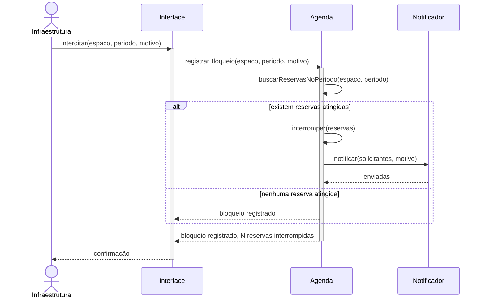
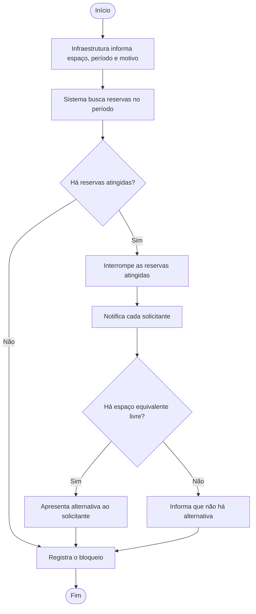
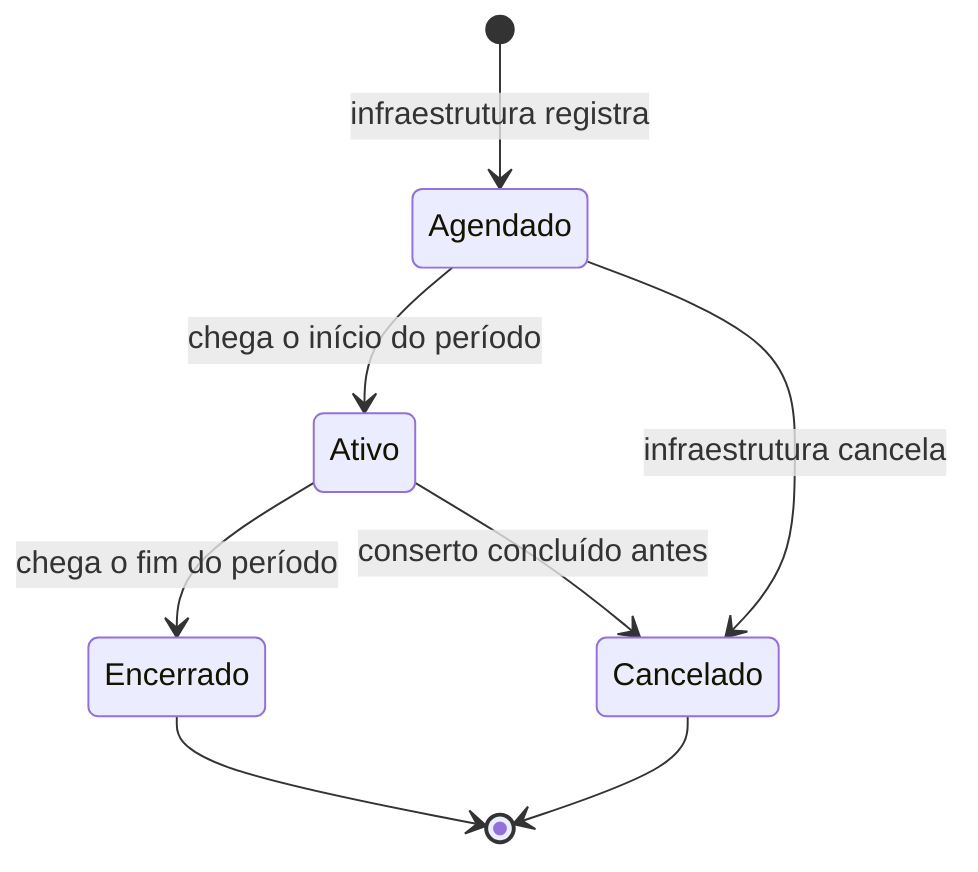

# Aula 12 — Modelagem Dinâmica

> 🎯 Objetivos: converter um cenário de caso de uso em diagrama de sequência, modelar um fluxo de trabalho com atividades e desenhar o ciclo de vida de um objeto com estados.
> 🎬 Slides da aula: [apresentacao-12-modelagem-dinamica.pdf](apresentacao/apresentacao-12-modelagem-dinamica.pdf)

## 1. O que o retângulo não conta

O diagrama de classes da aula anterior afirma que existe um `Bloqueio`, que ele se liga a um `Espaco` e que pode interromper `Reserva`s. Tudo verdade, e tudo insuficiente.

Ele não diz **nada** sobre:

- Em que **ordem** as coisas acontecem quando alguém interdita um espaço;
- **Quem** avisa quem, e o que acontece se o aviso falhar;
- Que uma reserva **interrompida** não volta sozinha se a interdição for cancelada;
- Que a confirmação de uso tem **15 minutos** para acontecer.

Nada disso cabe num retângulo ligado a outro retângulo, porque tudo isso tem **tempo** dentro. É para isso que existe a visão dinâmica, e ela tem três diagramas — cada um respondendo a uma pergunta diferente sobre o mesmo sistema.

> 💡 A pergunta que separa as duas visões: **"isto é verdade o tempo todo, ou isto acontece?"** O que é verdade o tempo todo é estático. O que acontece pede diagrama dinâmico.

> 📖 Bezerra trata dos diagramas de interação e do diagrama de estados em capítulos próprios, sempre partindo dos casos de uso já especificados.

## 2. Sequência: o cenário virando mensagens

O diagrama de **sequência** mostra **quem manda mensagem para quem, e em que ordem**, dentro de **um cenário**. A palavra é essa: um cenário, não o caso de uso inteiro — normalmente o fluxo principal, ou um alternativo que interessa discutir.

Este é o fluxo principal da interdição:



Repare que o diagrama **veio da especificação textual** do caso de uso: cada mensagem corresponde a um passo do fluxo. Se aparecer uma mensagem que não corresponde a passo nenhum, ou um passo sem mensagem, **um dos dois documentos está errado** — e essa conferência é um dos usos mais valiosos do diagrama de sequência.

> ⚠️ O erro clássico é usar sequência para descrever o **fluxo do usuário** ("o usuário clica, aparece a tela, ele preenche"). Sequência é sobre **colaboração entre partes do sistema**. Se o seu diagrama só tem o ator e uma caixa chamada "Sistema", ele não está mostrando nada que a especificação já não dissesse.

## 3. Linha de vida, ativação e retorno

O vocabulário do diagrama, que é pequeno:

| Elemento | O que é | Em Mermaid |
|---|---|---|
| **Participante** | quem troca mensagens | `participant Ag as Agenda` |
| **Ator** | participante externo, desenhado como boneco | `actor Infra` |
| **Linha de vida** | a linha vertical sob cada participante — o tempo passa para baixo | automática |
| **Ativação** | a barra que marca quando aquele participante está executando | `activate` / `deactivate` |
| **Mensagem síncrona** | chamada que espera resposta (seta cheia) | `A->>B: msg` |
| **Retorno** | a resposta (seta tracejada) | `B-->>A: resp` |
| **Autochamada** | o participante chama a si mesmo | `Ag->>Ag: buscar…` |
| **Alternativa** | o `if/else` do diagrama | `alt` … `else` … `end` |

> 💡 **Nem todo retorno precisa ser desenhado.** Retorno óbvio polui; retorno que carrega informação relevante (`bloqueio registrado, N reservas interrompidas`) merece a seta. A regra vale para o diagrama todo: desenhe o que ajuda a decidir.

## 4. Atividades: o fluxo do trabalho

O diagrama de **atividades** mostra o **fluxo de trabalho**, com decisões e caminhos paralelos. Diferente do sequência, ele não se importa com quem faz — se importa com **o que acontece e em que ordem**.



Ele é o mais fácil de mostrar a quem não é da área — a secretaria lê um fluxograma sem treinamento. Por isso é o diagrama preferido para **validar processo com o cliente**.

> ⚠️ Cuidado com a fronteira: o diagrama de atividades descreve **o processo**, que muitas vezes é maior que o sistema. Parte do fluxo acima acontece dentro do software, parte acontece no mundo (alguém precisa ir consertar o projetor). Se isso importar, use raias (`subgraph`) para separar quem faz o quê.

## 5. Estados: o ciclo de vida de um objeto

O diagrama de **estados** responde a uma pergunta bem específica: **por quais situações um objeto passa ao longo da vida, e o que provoca cada transição?**

A palavra decisiva é **um**. Um diagrama de estados descreve **um** objeto — não o sistema.



Este é o ciclo de vida do **`Bloqueio`**. O da `Reserva` é outro, e está no [guia de notações](../../recursos/notacoes-uml.md#3-diagrama-de-estados) — dois objetos, dois diagramas, e é assim que tem que ser.

O que o diagrama de estados revela e nenhum outro revela:

- **Transições que não existem.** Não há seta de `encerrado` para `ativo`: bloqueio encerrado não volta. Isso é uma regra, e ela ficou visível;
- **Estados finais.** Uma vez cancelado, acabou;
- **O que dispara cada mudança** — e, portanto, o que o sistema precisa saber observar. `agendado --> ativo` acontece pela passagem do tempo, não por alguém clicar. Isso tem consequência de projeto.

> 💡 Nem todo objeto merece um diagrama de estados — só os que têm **vida interessante**. `Espaco` praticamente não muda de situação; `Reserva` e `Bloqueio` mudam bastante, e é lá que estão as regras. Escolha os dois ou três objetos que mais mudam.

> 🧩 **Ponte com POO:** um diagrama de estados costuma virar um atributo de situação mais as regras que dizem quais transições são permitidas. Quando a lógica de transição fica espalhada por vários lugares do código, o resultado é aquele defeito que a Aula 13 chama de baixa coesão — e a Aula 15 mostra um padrão que resolve.

## 6. Qual usar quando

| A pergunta é… | Diagrama |
|---|---|
| Em que ordem as partes do sistema conversam neste cenário? | **Sequência** |
| Qual é o passo a passo do processo, com decisões? | **Atividades** |
| Por quais situações **este objeto** passa? | **Estados** |
| Quem usa o sistema e para quê? | Casos de uso (Aula 10) |
| Que coisas existem e como se ligam? | Classes (Aula 11) |

Os três dinâmicos descrevem o **mesmo sistema** por ângulos diferentes, e é normal — desejável, até — que o mesmo comportamento apareça em mais de um. O que não é normal é desenhar os três por obrigação: cada um precisa responder a uma pergunta que alguém realmente fez.

> ⚠️ Sinal de que você escolheu o diagrama errado: o desenho fica trivial (uma linha reta, sem decisão nem alternativa) ou fica impossível de ler (quinze participantes). Nos dois casos, o problema não é o desenho — é que a pergunta pedia outro diagrama.

## 🏋️ Exercícios da aula

Na pasta `aula-12/` do seu repositório:

1. **`ex01.md`** — pegue a especificação do `UC-02 — Reservar espaço` da [Aula 10, seção 4](../aula-10-casos-de-uso/README.md#4-a-especificação-textual--onde-está-o-conteúdo) e converta o **fluxo principal** em diagrama de sequência. Depois acrescente, no mesmo diagrama, o **fluxo alternativo 4a** (prioridade acadêmica desloca reserva) usando `alt`. Ao final, escreva a conferência: **cada mensagem corresponde a qual passo do fluxo?** Se sobrou mensagem ou passo, explique;
2. **`ex02.md`** — modele com **diagrama de atividades** o processo completo de *"aluno precisa de sala para estudar em grupo"*, do momento em que ele percebe a necessidade até ele estar dentro da sala. Inclua o que acontece **fora do software** e use raias para separar aluno, sistema e secretaria. Depois responda: **quantas das caixas do seu diagrama são do sistema?** O que isso diz sobre o que estamos construindo?;
3. **`ex03.md`** — desenhe o **diagrama de estados** de um destes objetos: `ConfirmacaoDeUso`, `Solicitante` (do ponto de vista da suspensão por não comparecimento, `RN-07`) ou `Espaco`. Requisitos: todos os estados, todas as transições com o evento que as dispara, estados finais marcados. Depois liste **as transições que você deliberadamente não desenhou** e a regra que as proíbe — e diga se algum objeto da lista **não merecia** um diagrama de estados, justificando;
4. **`ex04.md`** — para cada pergunta, diga qual dos cinco diagramas do curso você desenharia, e por que os outros quatro não servem: (a) por que uma reserva pode ficar "não confirmada" sem ninguém ter cancelado? (b) o notificador é chamado antes ou depois de as reservas serem interrompidas? (c) o que o aluno faz quando não encontra sala livre? (d) a confirmação de uso pode existir sem reserva? (e) quem pode interditar um espaço?;
5. **Desafio 🌶️ `ex05.md`** — escolha **um cenário** ainda não modelado nesta aula nem no guia de notações — sugestões: *confirmar uso no local*, *cancelar reserva a menos de 2 h*, *reserva não confirmada em 15 minutos*. Desenhe os **três diagramas dinâmicos** do mesmo cenário: sequência, atividades e estados. Depois escreva a análise comparativa, que é o que vale nota aqui: **(a)** o que cada diagrama revelou que os outros dois escondiam; **(b)** qual dos três você entregaria à secretaria e qual entregaria a quem vai programar, e por quê; **(c)** qual dos três foi **desnecessário** neste cenário — e defenda a escolha. Se você achar que os três foram necessários, prove: aponte uma decisão concreta que só aquele diagrama permitiu tomar.

## 🧠 Revisão

[8 questões de múltipla escolha](revisao/README.md) para conferir se os conceitos ficaram sólidos. Responda sem consultar a aula — depois volte e corrija.

## ✅ Entrega

```bash
git add aula-12/
git commit -m "Resolve exercícios da aula 12 (modelagem dinâmica)"
git push
```

---

⬅️ [Aula 11 — Diagrama de classes](../aula-11-diagrama-de-classes/README.md) | ➡️ [Aula 13 — Princípios de bom projeto](../../bloco-4-projeto-de-software/aula-13-principios-de-projeto/README.md)
