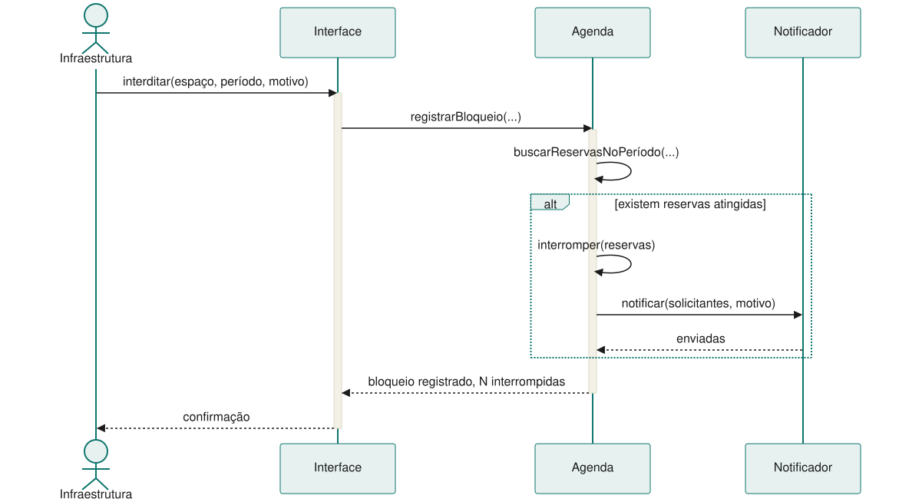

<!-- _class: capa -->

⏱️

# Modelagem Dinâmica

## Aula 12 · Bloco 3 — Modelagem e UML

Isto é verdade o tempo todo, ou isto acontece?

---

## 🎯 Nesta aula

1. O que o **retângulo não conta**
2. **Sequência** — o cenário virando mensagens
3. **Atividades** — o fluxo do trabalho
4. **Estados** — o ciclo de vida de um objeto
5. **Qual usar quando**

---

## O que o diagrama de classes não diz

Ele afirma que existe um `Bloqueio`, que se liga a um `Espaco` e pode interromper `Reserva`s. Tudo verdade, e tudo insuficiente. Ele não diz nada sobre:

- Em que **ordem** as coisas acontecem numa interdição;
- **Quem** avisa quem, e o que acontece se o aviso falhar;
- Que uma reserva interrompida **não volta sozinha**;
- Que a confirmação de uso tem **15 minutos** para acontecer.

Nada disso cabe num retângulo ligado a outro retângulo: tudo tem **tempo** dentro.

---

<!-- _class: lead -->

## 💡 A pergunta que separa as duas visões

**"Isto é verdade o tempo todo,
ou isto acontece?"**

O que é verdade o tempo todo é **estático**.

O que acontece pede **diagrama dinâmico**.

---

<!-- _class: diagrama -->

## Sequência: a interdição, passo a passo

---

<!-- _class: lead -->

## 💡 Ele veio da especificação textual

Cada mensagem corresponde a **um passo do fluxo**
do caso de uso.

Se aparecer uma mensagem que não corresponde
a passo nenhum, ou um passo sem mensagem,
**um dos dois documentos está errado**.

Essa conferência é um dos usos mais valiosos
do diagrama de sequência.

---

<!-- _class: tabela-densa -->

## O vocabulário, que é pequeno

| Elemento | O que é | Em Mermaid |
|---|---|---|
| **Participante** | quem troca mensagens | `participant Ag as Agenda` |
| **Linha de vida** | a vertical sob cada um — o tempo desce | automática |
| **Ativação** | a barra de quando ele está executando | `activate` / `deactivate` |
| **Síncrona** | chamada que espera resposta | `A->>B: msg` |
| **Retorno** | a resposta, tracejada | `B-->>A: resp` |
| **Alternativa** | o `if/else` do diagrama | `alt` … `else` … `end` |

---

<!-- _class: lead -->

## ⚠️ O erro clássico da sequência

Usá-la para descrever o **fluxo do usuário**:
*"o usuário clica, aparece a tela, ele preenche"*.

Sequência é sobre **colaboração entre partes
do sistema**.

Se o seu diagrama só tem o ator e uma caixa
chamada "Sistema", ele não mostra nada
que a especificação já não dissesse.

---

## Atividades: o fluxo do trabalho

Diferente do sequência, ele **não se importa com quem faz** — se importa com o que acontece e em que ordem, com decisões e caminhos paralelos.

É o mais fácil de mostrar a quem não é da área: a secretaria lê um fluxograma sem treinamento. Por isso é o diagrama preferido para **validar processo com o cliente**.

> ⚠️ O processo costuma ser **maior que o sistema**. Parte do fluxo acontece no software, parte no mundo — alguém precisa ir consertar o projetor. Se isso importar, use **raias**.

---

<!-- _class: diagrama -->

## Estados: o ciclo de vida do `Bloqueio`

---

<!-- _class: lead -->

## ⚠️ A palavra decisiva é **um**

Um diagrama de estados descreve
**um objeto** — não o sistema.

O ciclo do `Bloqueio` é este.
O da `Reserva` é **outro**, e é outro diagrama.

💡 E nem todo objeto merece um:
só os que têm **vida interessante**.
`Espaco` quase não muda de situação;
`Reserva` e `Bloqueio` mudam bastante,
e é lá que estão as regras.

---

<!-- _class: lista-limpa -->

## O que só o diagrama de estados revela

- 🚫 **Transições que não existem.** Não há seta de `encerrado` para `ativo`: bloqueio encerrado não volta. Isso é uma regra, e ela ficou **visível**;
- 🏁 **Estados finais.** Uma vez cancelado, acabou;
- ⏰ **O que dispara cada mudança** — e portanto o que o sistema precisa saber observar. `agendado → ativo` acontece pela **passagem do tempo**, não por alguém clicar. Isso tem consequência de projeto.

---

## Qual usar quando

| A pergunta é… | Diagrama |
|---|---|
| Em que ordem as partes conversam neste cenário? | **Sequência** |
| Qual é o passo a passo do processo, com decisões? | **Atividades** |
| Por quais situações **este objeto** passa? | **Estados** |
| Quem usa o sistema e para quê? | Casos de uso |
| Que coisas existem e como se ligam? | Classes |

É normal — desejável, até — que o mesmo comportamento apareça em mais de um.

---

<!-- _class: lead -->

## ⚠️ Sinal de que você escolheu errado

O desenho fica **trivial** — uma linha reta,
sem decisão nem alternativa —
ou fica **impossível de ler**, com quinze participantes.

Nos dois casos o problema não é o desenho:
é que a pergunta pedia **outro diagrama**.

O que não é normal é desenhar os três por obrigação.

---

<!-- _class: checkpoint -->

## 🏋️ Exercícios da aula

Na pasta `aula-12/`:

1. **`ex01.md`** — o `UC-02` em sequência, com o alternativo 4a em `alt`, e a conferência passo a passo;
2. **`ex02.md`** — atividades do *"aluno precisa de sala"*, com raias — **quantas caixas são do sistema?**;
3. **`ex03.md`** — estados de um objeto, e **as transições que você não desenhou**;
4. **`ex04.md`** — qual dos cinco diagramas para cada uma de cinco perguntas;
5. **Desafio 🌶️ `ex05.md`** — os três diagramas dinâmicos do mesmo cenário, e **qual dos três foi desnecessário**.

---

<!-- _class: lead -->

## ➡️ Próximo bloco

**Bloco 4 — Projeto de software**

**Aula 13 — Princípios de bom projeto**

Coesão, acoplamento — e por que
"classe pequena" não é a mesma coisa que "classe coesa".
