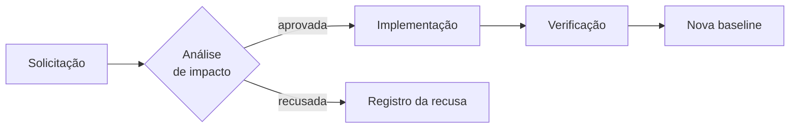
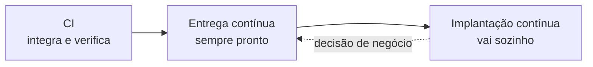

# Aula 13 — Versão, mudança e configuração

> 🎯 Objetivos: identificar os itens de configuração de um projeto, estabelecer e proteger uma baseline, reconhecer o custo do branch longo e distinguir integração de entrega e implantação contínuas.
> 🎬 Slides da aula: [apresentacao-13-versao-mudanca-configuracao.pdf](apresentacao/apresentacao-13-versao-mudanca-configuracao.pdf)

## 1. Controle de versão como prática de engenharia

O restaurante do delivery não pode parar. Toda mudança entra com o serviço funcionando, no meio do expediente — e a pergunta que define a maturidade do projeto é simples: **se essa mudança quebrar, quanto tempo até voltar ao que funcionava?**

Se a resposta for "não sei", não há controle de versão de verdade. Há um lugar onde os arquivos ficam.

Controle de versão responde a três perguntas que a gestão precisa:

| Pergunta | Sem controle | Com controle |
|---|---|---|
| o que mudou desde a última entrega? | ninguém sabe ao certo | a lista exata, com autor e data |
| como volto ao que funcionava? | reconstrói-se de memória | um comando |
| quem alterou isto, e por quê? | perde-se com a rotatividade | está registrado junto da mudança |

> 🧩 **Ponte com POO:** você já usa Git no outro curso para versionar código. Aqui a mesma ferramenta é vista pelo que ela resolve **de gestão**: rastreabilidade da mudança e capacidade de voltar atrás. O comando é o mesmo; a pergunta é outra.

## 2. Estratégia de integração: o custo do branch longo

Duas pessoas trabalham no sistema de delivery. Uma cria um ramo na segunda e integra na sexta. A outra cria um ramo e integra três semanas depois.

O segundo caso parece mais cuidadoso — *"vou terminar tudo direitinho antes de integrar"* — e custa muito mais. **O conflito cresce com o tempo**, e não linearmente: três semanas de trabalho paralelo produzem conflitos que ninguém consegue mais resolver com segurança, porque nem quem escreveu lembra por que cada linha está ali.

| Estratégia | Ramo vive | Custo da integração |
|---|---|---|
| integração frequente | horas ou 1–2 dias | pequeno e previsível |
| ramo por funcionalidade, curto | até 1 semana | administrável |
| ramo longo | semanas | grande, imprevisível, e concentrado no pior momento |

**Adiar a integração não evita o custo: multiplica.** Um problema grande e imprevisível no fim vale menos que vários pequenos e baratos ao longo do caminho — que é a mesma lógica da curva de custo da Aula 02.

> ⚠️ **O ramo longo tem um agravante de gestão:** enquanto ele existe, ninguém sabe se aquilo funciona junto com o resto. O trabalho parece pronto no quadro e ainda não passou pelo único teste que importa.

É o mesmo trabalho parcialmente feito que o Lean da Aula 08 chama de desperdício, agora numa forma que nem aparece no quadro: **o cartão está em "Revisão" e o risco continua inteiro em pé.**

E há um efeito perverso: quanto maior o ramo, mais assustadora é a integração, e mais se adia. O comportamento se retroalimenta, e o time acaba com um ramo de dois meses que ninguém tem coragem de juntar.

## 3. Gerência de configuração: o que é item de configuração

**Item de configuração** é tudo que precisa ser controlado porque alguém depende dele estar numa versão específica. Não é só código.

No delivery:

| Item de configuração | Por que ele entra |
|---|---|
| o código da aplicação | óbvio, e a menor parte da lista |
| o script do banco de dados | uma versão errada aqui derruba tudo |
| a configuração do ambiente | a mesma versão do código se comporta diferente com outra configuração |
| o cardápio e as regras de preço | mudam sem código, e mudam o comportamento |
| a documentação de operação | precisa corresponder à versão no ar |
| a versão das bibliotecas usadas | o que funcionou ontem depende delas |

A pergunta que identifica um item: **se isto mudar sozinho, alguma coisa quebra ou alguém se engana?** Se sim, é item de configuração e precisa de versão.

> 💡 **A maior parte dos incidentes de produção não vem do código.** Vem de configuração divergente entre ambientes, de biblioteca que mudou de versão, e de script de banco aplicado fora de ordem. O código é o item mais controlado e o menos problemático.

Há uma consequência prática dessa lista: **"funciona na minha máquina" é quase sempre um problema de item de configuração não controlado.** Alguma coisa é diferente entre os dois ambientes, e ela não estava sob versão — por isso ninguém sabe qual.

E há um item que quase nunca entra na lista e deveria: **a versão da própria documentação de operação.** Se o procedimento descreve a versão 2.3 e o que está no ar é a 2.5, quem opera às três da manhã vai seguir instruções erradas.

## 4. Baseline e rastreamento de mudança

Uma **baseline** é um conjunto de itens de configuração, em versões específicas, aprovado e congelado. Ela é a mesma ideia da linha de base da Aula 03, aplicada ao produto em vez do plano.

A partir dela, mudança deixa de ser edição e passa a ser **processo**:



Três coisas que esse fluxo garante, e que a edição direta não garante:

- **Impacto avaliado antes.** Quem pede raramente sabe o que a mudança toca;
- **Recusa registrada.** A mudança recusada em março volta em julho, com o mesmo argumento, se ninguém escreveu por que não;
- **Rastreabilidade.** Dá para responder *"por que este comportamento mudou na versão 2.4?"* — que é a pergunta que a auditoria faz.

> ⚠️ **Processo de mudança pesado demais é contornado, não seguido.** Se aprovar uma correção de texto leva três dias, as pessoas passam a corrigir direto e a avisar depois — e aí não há nem processo nem registro. O peso do processo precisa ser proporcional ao risco da mudança, e mudança emergencial precisa de um caminho próprio, escrito e mais curto.

Uma forma prática de calibrar isso é classificar a mudança antes de decidir o caminho:

| Tipo | Exemplo no delivery | Caminho |
|---|---|---|
| **Padrão** | tirar um item do cardápio | pré-aprovada, registra-se e faz |
| **Normal** | mudar a regra de cálculo do frete | análise de impacto, aprovação, nova baseline |
| **Emergencial** | acabou o ingrediente às 20h de sábado | executa e **registra depois**, com prazo |

A linha emergencial é a que exige mais cuidado de gestão, porque é a que vira hábito. Ela precisa de duas coisas escritas: **o que ela autoriza pular** — a aprovação prévia, não a verificação — e **o que ela obriga a fazer depois**, com prazo. Sem a segunda, o caminho emergencial deixa de ser exceção e vira o processo real.

> 💡 **Recusa registrada vale tanto quanto aprovação registrada.** É o único jeito de a mesma discussão não voltar em julho com o mesmo argumento — e é o mesmo princípio do ADR da Aula 04, aplicado a mudanças em vez de arquitetura.

## 5. Integração contínua

**Integração contínua** é integrar o trabalho de todos com frequência — várias vezes ao dia — e verificar automaticamente que o conjunto continua funcionando.

O que ela exige, e é aqui que a maioria para:

- **Um lugar único onde o trabalho se junta**, e todos integrando nele;
- **Verificação automática** que roda a cada integração;
- **Prioridade de conserto:** integração quebrada é o problema mais importante do time até voltar a passar.

A terceira é cultural e é a que falha. Uma verificação que fica vermelha por três dias deixa de significar qualquer coisa, e a partir daí o time convive com ela vermelha — que é o mesmo que não ter.

O ganho de gestão da integração contínua é **antecipar a descoberta**. Ela não impede que alguém escreva algo que quebra o conjunto: garante que isso apareça em minutos, quando ainda é uma linha, em vez de aparecer em três semanas, quando são quatrocentas.

É o mesmo argumento da curva da Aula 02 e da validação em pedaços pequenos da Aula 10. **Três aulas diferentes, o mesmo princípio: encurtar a distância entre cometer o erro e descobri-lo.**

> 💡 **Integração contínua não é a ferramenta.** Ter uma esteira configurada e ramos que vivem três semanas não é integração contínua: é uma ferramenta rodando sobre um processo que ela não muda. A prática é integrar com frequência; a esteira apenas verifica.

## 6. CI/CD: o que cada sigla entrega

A sigla junta três coisas distintas, e confundi-las produz discussão sem sentido:

| Sigla | O que significa | Decisão de quem |
|---|---|---|
| **CI** — integração contínua | o trabalho de todos se junta e é verificado várias vezes ao dia | **engenharia** |
| **CD** — entrega contínua | o sistema está **sempre pronto** para ser implantado, a qualquer momento | **engenharia** |
| **CD** — implantação contínua | toda mudança aprovada vai a produção **automaticamente** | **negócio** |

A distinção que mais importa: **entrega contínua é estar pronto; implantação contínua é ir automaticamente.**

*"Não podemos fazer entrega contínua, o negócio não aceita mudança todo dia"* confunde as duas. O negócio decide **quando** publicar; estar sempre pronto para publicar é decisão de engenharia, e quase sempre vale a pena — inclusive porque encurta o tempo de restauração da Aula 10 quando algo dá errado.

> ⚠️ **Recusar a implantação contínua não obriga a abrir mão da entrega contínua.** No restaurante que não pode parar, implantar automaticamente no sábado à noite seria irresponsável; estar pronto para implantar uma correção em dez minutos na terça de manhã é exatamente o que se quer.

As três se encadeiam, e não dá para pular etapa:



Sem integração contínua não há como estar sempre pronto — não se sabe se o conjunto funciona. E sem estar sempre pronto, a implantação automática publicaria algo não verificado, que é a pior das combinações.

E este bloco fecha o fio do curso: **a mudança é o objeto de trabalho da gestão de projeto.** O escopo muda (Aula 01), o plano muda (Aula 03), o risco vira problema (Aula 09), o requisito de negócio muda em produção. Controlar versão, configuração e mudança é o que permite que tudo isso aconteça sem que ninguém perca o rastro do que está no ar.

> 💡 **A pergunta da abertura, respondida:** se a mudança quebrar, quanto tempo até voltar? Com baseline, controle de versão e verificação automática, a resposta é minutos — e é essa resposta que autoriza o time a mudar com frequência, em vez de acumular mudanças por medo.

> 📖 O Sommerville trata de gerenciamento de configuração num capítulo próprio, com gerenciamento de versões, integração contínua, gerenciamento de mudanças e de releases. O Guia PMBOK trata do controle integrado de mudanças na área de integração.

## 🏋️ Exercícios da aula

Na pasta `aula-13/` do seu repositório:

1. **`ex01.md`** — identifique os **itens de configuração** do projeto de [delivery de restaurante](../../recursos/projetos-para-praticar.md#5-delivery-de-restaurante-do-bairro), aplicando a pergunta da seção 3. Liste no mínimo seis, e para cada um diga **o que quebra** se ele mudar sozinho. *Confere assim: se todos os seus itens forem código ou banco, releia — o cardápio e as regras de preço mudam sem código e mudam o comportamento do sistema.*

2. **`ex02.md`** — ordene seis mudanças pelo **impacto na baseline**, da menor para a maior, e diga qual delas você exigiria que passasse pelo fluxo completo da seção 4: (a) corrigir um erro de português numa tela; (b) mudar a regra de cálculo do frete; (c) atualizar a versão de uma biblioteca; (d) acrescentar um campo opcional no cadastro; (e) alterar a estrutura de uma tabela do banco; (f) trocar a cor de um botão. *Confere assim: duas das seis exigem o fluxo completo, e uma delas parece pequena — a que muda versão de biblioteca já derrubou muito sistema.*

3. **`ex03.md`** — desenhe em Mermaid o **fluxo de uma mudança emergencial** no delivery: acabou um ingrediente às 20h de sábado e o item precisa sair do cardápio agora. Diga **o que o fluxo emergencial autoriza pular** e **o que ele obriga a fazer depois**. *Confere assim: se o seu fluxo emergencial não obrigar nada depois, você não criou um caminho rápido — criou uma porta dos fundos permanente.*

4. **`ex04.md`** — dois times têm a mesma esteira de verificação automática configurada. No time A, os ramos vivem um dia; no time B, três semanas. Descreva **três consequências concretas** dessa diferença, e diga por que a ferramenta idêntica produz resultados diferentes. *Confere assim: pelo menos uma das suas consequências precisa ser sobre o que o time B não sabe enquanto o ramo está aberto.*

5. **`ex05.md`** — 🌶️ **Desafio.** O dono do restaurante recusa implantação contínua: *"não quero que mexam no sistema no sábado à noite"*. Ele tem razão. **Escreva a proposta** que atende à preocupação dele sem abrir mão do que a engenharia ganha, contendo: (i) o que você adota e o que não adota, com os nomes corretos das três siglas; (ii) o que muda na prática para ele, em linguagem de dono de restaurante; (iii) **o que se perde** com a sua proposta em relação à implantação contínua plena. *Confere assim: se a sua resposta usar "CI/CD" como um bloco só, ela não distingue o que ele recusou do que ele nem sabe que existe — e é justamente aí que está o acordo.*

## 🧠 Revisão

[8 questões de múltipla escolha](revisao/README.md) para conferir se os conceitos ficaram sólidos. Responda sem consultar a aula — depois volte e corrija.

## ✅ Entrega

```bash
git add aula-13/
git commit -m "Resolve exercícios da aula 13 (versão, mudança e configuração)"
git push
```

---

⬅️ [Aula 12 — Ferramentas e comunicação](../../bloco-3-ferramentas-e-qualidade/aula-12-ferramentas-e-comunicacao/README.md) | ➡️ [Aula 14 — Entregar e sustentar](../aula-14-entregar-e-sustentar/README.md)
