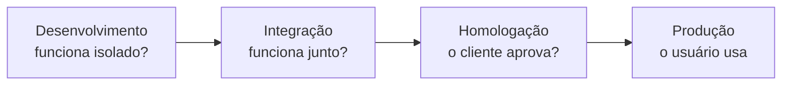

# Aula 14 — Entregar e sustentar

> 🎯 Objetivos: planejar um lançamento com caminho de volta, instrumentar o que o negócio precisa observar, classificar manutenção nos quatro tipos e tratar dívida técnica como decisão registrada.
> 🎬 Slides da aula: [apresentacao-14-entregar-e-sustentar.pdf](apresentacao/apresentacao-14-entregar-e-sustentar.pdf)

## 1. O que acontece depois que sobe

A Aula 13 terminou com o sistema pronto para ser implantado. Esta aula começa no minuto seguinte — e é aqui que a maior parte do custo de um software acontece.

Um projeto de oito meses gera anos de operação. **Manter custa mais que construir**, e quase todo o esforço de um curso de projeto vai para a parte curta. Esta aula é sobre a longa.

No delivery, a mudança sobe às 18h de uma terça. Três perguntas decidem se foi bem-feito:

- **Como voltamos, se quebrar?**
- **Como sabemos que quebrou, antes de o cliente reclamar?**
- **Quem responde por isso às 21h de sábado?**

Nenhuma das três é sobre construir. Todas são sobre sustentar.

> 💡 **A entrega não é o fim do projeto — é o começo da vida do produto.** O encerramento da Aula 03 fecha o projeto; o sistema continua, e alguém precisa ter sido designado para ele antes de a equipe se desfazer.

## 2. O pipeline e os ambientes

Uma mudança percorre ambientes antes de chegar ao usuário, e cada um responde a uma pergunta diferente:



O **pipeline** é a automação desse caminho: a cada mudança, a esteira compila, verifica, empacota e disponibiliza para o próximo ambiente. O que ele entrega de gestão é **previsibilidade** — o mesmo processo, na mesma ordem, sem depender de quem está de plantão.

Duas regras que fazem o pipeline valer:

- **O mesmo pacote atravessa todos os ambientes.** Recompilar para produção introduz uma diferença que ninguém controla, e transforma a homologação num teste de outra coisa;
- **A configuração muda, o pacote não.** É a aplicação prática dos itens de configuração da Aula 13.

> ⚠️ **Ambiente de homologação que não se parece com produção não homologa nada.** Metade dos incidentes de estreia vem de diferenças que a homologação não reproduziu — volume de dados, integração real, carga.

## 3. Feature flag e o lançamento controlado

Nem toda mudança precisa chegar a todos ao mesmo tempo. A **feature flag** separa **implantar** de **liberar**: o código sobe desligado, e alguém o liga depois, para quem quiser.

Isso resolve o problema do restaurante que não pode parar:

| Estratégia | Como funciona | Quando serve |
|---|---|---|
| **Feature flag** | sobe desligado, liga-se para um grupo | funcionalidade nova e arriscada |
| **Lançamento gradual** | 5% dos usuários, depois 25%, depois todos | mudança que afeta todos |
| **Dois ambientes em paralelo** | o novo sobe ao lado, e o tráfego é trocado | quando voltar precisa ser instantâneo |
| **Janela de manutenção** | avisa-se, para o serviço, sobe, religa | quando nenhuma das outras é possível |

**O ganho não é técnico, é de gestão:** a decisão de liberar deixa de coincidir com a de implantar, e passa a ser tomada por quem entende do negócio, no momento certo.

> ⚠️ **Flag é dívida com prazo.** Cada uma acrescenta um caminho a mais no sistema, e duas flags produzem quatro combinações possíveis. Toda flag precisa de data para ser removida, senão o sistema vira um emaranhado de condições que ninguém entende — e ninguém ousa apagar.

## 4. Mudança em produção precisa de caminho de volta

A pergunta da abertura — *como voltamos, se quebrar?* — precisa estar respondida **antes** de subir. Não depois.

| Tipo de mudança | Voltar é |
|---|---|
| código novo, sem tocar em dados | fácil: republica-se a versão anterior |
| mudança de configuração | fácil, se a anterior estiver versionada |
| estrutura de banco que só acrescenta | possível, com cuidado |
| estrutura de banco que remove ou converte | **caro ou impossível** |

A última linha muda o risco da mudança e precisa estar escrita. Uma migração destrutiva não tem volta: o plano deixa de ser "reverter" e passa a ser "corrigir para frente com o sistema fora do ar" — o que é uma decisão legítima, desde que tomada antes, por quem tem autoridade, e não descoberta às 21h de sábado.

> 💡 **O plano de volta é o item que mais se corta por pressa e mais se lamenta.** Ele custa meia hora de conversa e evita a única situação em que ninguém sabe o que fazer: o sistema fora do ar, sem alternativa preparada, com o cliente ligando.

Um plano de volta que serve responde quatro perguntas, e cabe em cinco linhas:

| | Exemplo no delivery |
|---|---|
| **Quando decidimos voltar?** | se a taxa de pedidos confirmados cair abaixo de 80% por 10 min |
| **Quem decide?** | quem estiver de plantão, sem precisar consultar ninguém |
| **Como se volta?** | republicar a versão anterior; o banco não foi alterado |
| **Quanto leva?** | cerca de 4 minutos |

A primeira linha é a mais importante e a que sempre falta. **Sem critério definido antes, a decisão de voltar é tomada por desgaste** — espera-se, tenta-se consertar, e a conversa sobre reverter só acontece quando já se passou uma hora.

## 5. Observabilidade: registro, métrica e alerta

O painel mostra processador em 30% e memória em 40%, tudo verde. E 30% dos pedidos falham há dois dias.

**Monitorar a máquina não é observar o serviço.** Observabilidade é conseguir responder *o que está acontecendo com o negócio* a partir do que o sistema emite:

| Elemento | O que é | Exemplo no delivery |
|---|---|---|
| **Registro** | o rastro do que aconteceu, consultável | "pedido 4471 recusado: pagamento não confirmado" |
| **Métrica** | número agregado ao longo do tempo | pedidos confirmados por hora |
| **Alerta** | aviso disparado por uma condição | pedidos confirmados caíram 50% em 15 min |

O que se instrumenta é o **comportamento do negócio**, não a máquina: pedido criado, pagamento confirmado, entrega concluída. É essa lista que revela, em quinze minutos, que algo quebrou.

> ⚠️ **Alerta que dispara sem exigir ação treina o time a ignorá-lo.** Depois de duas semanas recebendo avisos irrelevantes, ninguém olha — e o alerta importante chega no mesmo canal que os outros. Alerta é para acordar alguém; se não for para acordar, é métrica.

A pergunta que orienta a instrumentação: **o que eu preciso saber para responder "o serviço está bom?" sem perguntar a ninguém?** No delivery, a resposta é a taxa de pedidos confirmados. Se ela cai, algo quebrou — não importa qual componente.

Observabilidade também é o que reduz o **tempo de restauração**, uma das quatro métricas DORA da Aula 10. Não adianta conseguir implantar uma correção em dez minutos se o time leva quatro horas para descobrir o que corrigir.

> 💡 **Um sistema bem instrumentado responde à pergunta que ninguém previu.** É essa a diferença entre monitoramento — painéis que respondem perguntas conhecidas — e observabilidade, que permite investigar um comportamento estranho que ninguém tinha imaginado.

## 6. Manutenção: os quatro tipos

"Manutenção" sugere conserto, e conserto é a menor parte dela:

| Tipo | O que é | Proporção típica |
|---|---|---|
| **Corretiva** | consertar defeito | a menor |
| **Adaptativa** | acompanhar mudança externa: lei, integração, sistema operacional | grande e inevitável |
| **Perfectiva** | melhorar o que já funciona, a pedido de quem usa | a maior |
| **Preventiva** | reduzir o risco de defeito futuro | a que mais se corta |

A leitura de gestão importa no orçamento: **um contrato de manutenção que cobre só a corretiva deixa de fora a maior parte do trabalho.** Adaptar-se a uma lei nova não é defeito de ninguém e consome o mesmo time — e a discussão sobre quem paga acontece no pior momento, com o prazo legal correndo.

A **preventiva** é a que mais se corta, e por um motivo compreensível: ela evita um problema que ninguém viu ainda. Quem a executa não tem como demonstrar o que teria acontecido sem ela — é a mesma assimetria da Aula 07, em que o gerente é cobrado pelo que apareceu e não pelo que evitou.

E há um erro de expectativa que vale desfazer cedo: **manutenção não é o que se faz enquanto se espera o próximo projeto.** É trabalho de engenharia com as mesmas exigências — versão, baseline, verificação, plano de volta —, e um time que trata manutenção como tarefa de segunda classe produz nela os incidentes que evitou no projeto.

> ⚠️ **Quando o projeto acaba, alguém precisa ter sido designado para o sistema.** Se a equipe se desfez e a designação não foi feita, o primeiro chamado vai encontrar uma organização sem dono — e a resposta demora dias em vez de horas.

## 7. Evolução e dívida técnica

**Dívida técnica** é o custo futuro de uma decisão tomada hoje para entregar mais rápido. Como dívida financeira, ela tem duas formas:

- **Deliberada e registrada:** *"vamos duplicar esta regra para entregar na sexta, e unificar na semana 3"*. É legítima, e às vezes é a decisão certa;
- **Acidental e silenciosa:** ninguém decidiu nada, e a estrutura foi ficando. É a que a Aula 07 descreveu como qualidade cedendo sem que ninguém autorize.

A diferença é **o registro**, e ele é o que permite pagá-la: dívida escrita entra na lista e disputa prioridade com funcionalidade nova; dívida não escrita só aparece como lentidão crescente que ninguém consegue explicar ao patrocinador.

> 💡 **Nem toda dívida deve ser paga.** Um sistema que será desligado em um ano não justifica refatoração. A pergunta é a mesma de todo o curso: **quanto custa conviver com isso, contra quanto custa resolver** — e a resposta depende de quanto tempo o sistema ainda vai viver.

E há o problema de tradução, que é onde a maioria dos times perde a discussão. O patrocinador não entende — e não precisa entender — o que significa refatorar. Ele entende isto:

| Em vocabulário técnico | Em vocabulário de quem paga |
|---|---|
| "esse módulo tem alto acoplamento" | "cada mudança nessa área leva três vezes mais tempo" |
| "precisamos refatorar antes de continuar" | "podemos entregar duas funcionalidades agora e nenhuma em março, ou uma agora e quatro até março" |
| "a cobertura de testes está baixa aqui" | "sempre que mexemos aqui, algo quebra em outro lugar" |

**A dívida técnica só entra na disputa por prioridade quando alguém a traduz em tempo e dinheiro.** Enquanto ela for apresentada como preferência de engenharia, ela perde para qualquer funcionalidade nova — e com razão, do ponto de vista de quem decide.

Este é o fecho do assunto e do bloco: **sustentar um sistema é uma sequência de decisões com custo, exatamente como construí-lo.** A diferença é que elas acontecem depois que o projeto acabou, quando o time diminuiu e a atenção da organização foi para outro lugar.

> 📖 O Sommerville trata de evolução de software, manutenção e seus tipos num capítulo próprio, e de entrega e implantação no capítulo de gerenciamento de configuração. O Guia PMBOK trata da transição do produto para a operação no encerramento.

## 🏋️ Exercícios da aula

Na pasta `aula-14/` do seu repositório:

1. **`ex01.md`** — desenhe em Mermaid o **pipeline** do [delivery de restaurante](../../recursos/projetos-para-praticar.md#5-delivery-de-restaurante-do-bairro), com os ambientes e a pergunta que cada um responde. Diga também **o que sobe** em cada etapa — pacote ou configuração. *Confere assim: o pacote precisa ser o mesmo do começo ao fim; se ele for reconstruído em algum ponto, releia a seção 2.*

2. **`ex02.md`** — classifique oito chamados nos **quatro tipos de manutenção**: (a) o cálculo do frete arredonda errado; (b) a nova lei exige guardar o CPF do cliente; (c) o dono pede um filtro por forma de pagamento; (d) a biblioteca de pagamento sai de suporte em seis meses; (e) o cardápio some quando o item tem foto grande; (f) o parceiro de entrega mudou a integração; (g) o relatório demora 40 s e alguém quer 5 s; (h) reescrever um trecho que ninguém entende antes que ele quebre. *Confere assim: dois de cada, e a (h) é a que quase todo mundo classifica errado.*

3. **`ex03.md`** — para cada mudança, diga **como se volta** e classifique o risco: (a) subir uma correção de texto; (b) acrescentar uma coluna opcional no banco; (c) converter todos os endereços para um formato novo, removendo o antigo; (d) trocar a versão da biblioteca de pagamento. Para a que não tem volta, escreva **o plano alternativo**. *Confere assim: só uma das quatro não tem volta, e o plano dela não pode conter a palavra "reverter".*

4. **`ex04.md`** — defina **o que instrumentar** no delivery: cinco eventos de negócio, três métricas e dois alertas com a condição que os dispara. Para cada alerta, escreva **qual ação ele exige de quem o receber**. *Confere assim: se algum dos seus alertas não exigir ação imediata, ele é métrica — mova-o e escolha outro.*

5. **`ex05.md`** — 🌶️ **Desafio.** Faltam duas semanas para a temporada de inverno, quando o delivery dobra. A equipe identificou uma dívida técnica que torna cada mudança três vezes mais lenta, e o dono quer duas funcionalidades novas antes da temporada. **Escreva a decisão**, contendo: (i) o que entra e o que fica, com o critério; (ii) como você apresenta a dívida ao dono, em linguagem de dono de restaurante — sem usar o termo "dívida técnica"; (iii) **o que se perde** com a sua escolha, e o cenário em que ela se mostraria errada. *Confere assim: o item (ii) é o exercício de verdade. Se a sua explicação mencionar código, refatoração ou arquitetura, ele não vai entender — traduza para tempo e dinheiro.*

### 📤 Entrega

Estes exercícios são feitos em sala e vão para o **seu repositório** `exercicios-projeto-software`:

```bash
cd ..                 # da pasta da aula para a raiz do repositório
git add aula-14/
git commit -m "Resolve exercícios da aula 14"
git push
```

Confira no navegador que a pasta apareceu em `github.com/SEU-USUARIO/exercicios-projeto-software`.

## 🧠 Revisão

[8 questões de múltipla escolha](revisao/README.md) para conferir se os conceitos ficaram sólidos. Responda sem consultar a aula — depois volte e corrija.

---

⬅️ [Aula 13 — Versão, mudança e configuração](../aula-13-versao-mudanca-configuracao/README.md) | ➡️ [Aula 15 — O usuário do outro lado](../aula-15-o-usuario-do-outro-lado/README.md)
