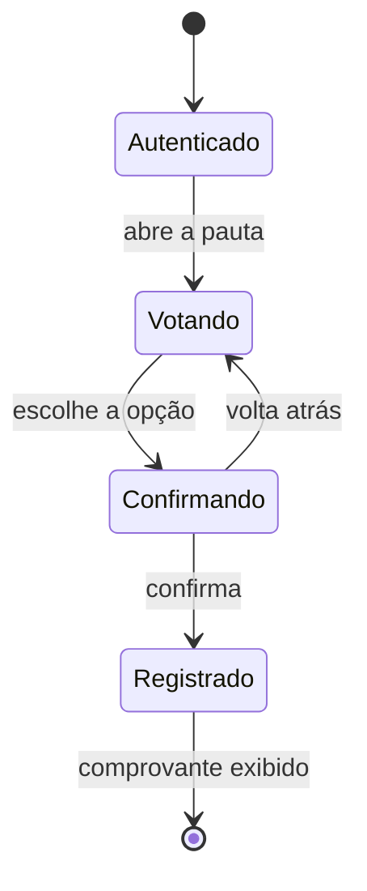

# Aula 15 — O usuário do outro lado

> 🎯 Objetivos: levantar contexto de uso antes de desenhar interface, distinguir UX de UI, aplicar heurísticas de usabilidade a uma tela e tratar acessibilidade como decisão de projeto, não como ajuste final.
> 🎬 Slides da aula: [apresentacao-15-o-usuario-do-outro-lado.pdf](apresentacao/apresentacao-15-o-usuario-do-outro-lado.pdf)

## 1. O sistema que funciona e ninguém usa

O sistema de votação da assembleia digital foi entregue e funciona: apura corretamente, garante o sigilo, registra tudo para auditoria.

Na primeira assembleia, 40% dos associados não conseguiram votar. Não por falha — o sistema esteve no ar o tempo todo. Eles não conseguiram **usar**: o botão de confirmar ficava abaixo da dobra numa tela de celular, a mensagem de erro do voto duplicado dizia "operação inválida", e a maioria dos associados tem mais de 60 anos e acessou pelo telefone, na rua.

**A entrega passou em toda verificação e falhou na única coisa que importava.** É a validação sem verificação da Aula 10, agora do lado do usuário.

Esta aula entra num curso de gestão por um motivo prático: **a interface é onde o projeto encontra a realidade**, e decisões sobre ela são tomadas o tempo todo por quem não é especialista — que é a situação normal.

> 💡 **Nenhum manual salva uma interface ruim.** Se a tela precisa de treinamento para uma tarefa que a pessoa fará uma vez por ano, o treinamento não vai acontecer, e o custo cai no suporte.

## 2. Análise de interface: quem usa, para quê, em que contexto

Antes de desenhar qualquer coisa, três perguntas — e nenhuma delas é sobre tela:

| Pergunta | Na assembleia digital |
|---|---|
| **Quem usa?** | associados de 25 a 85 anos, com familiaridade digital muito desigual |
| **Para quê?** | votar uma vez, em 5 minutos, e ter certeza de que o voto contou |
| **Em que contexto?** | de casa ou da rua, no celular, muitos com internet instável, alguns com baixa visão |

O contexto é o que mais muda o desenho e o que menos se levanta. Um sistema usado **uma vez por ano** exige o oposto de um usado oito horas por dia: o primeiro precisa ser óbvio para quem nunca viu; o segundo precisa ser rápido para quem já sabe.

| | Uso raro | Uso diário |
|---|---|---|
| **Prioriza** | ser óbvio | ser rápido |
| **Aceita** | mais passos, se cada um for claro | atalhos, densidade, aprendizado inicial |
| **Erra ao** | supor familiaridade | tratar o usuário como se fosse a primeira vez |

O prontuário da clínica é uso diário — onze cliques ali é um problema. A votação é uso anual — onze cliques ali podem ser aceitáveis, desde que nenhum deles gere dúvida.

Um detalhe do contexto que decide sozinho boa parte do desenho: **em que tela isso vai ser usado?** Um sistema pensado num monitor de 27 polegadas e usado num celular de 5 perde metade da informação abaixo da dobra — que foi literalmente o que aconteceu com o botão de confirmar da assembleia.

> 💡 **Contexto de uso é levantamento, não suposição.** As três perguntas se respondem observando e perguntando, não em reunião. E as respostas mudam o produto mais do que qualquer decisão visual tomada depois.

> ⚠️ **Levantar contexto de uso é a etapa de empatia da Aula 08.** Sem sair da sala e observar, o desenho reflete o contexto de quem constrói — jovem, com internet boa, monitor grande e conhecendo o sistema por dentro.

## 3. As heurísticas que pegam a maior parte

Não é preciso ser especialista para achar a maioria dos problemas. Um conjunto de heurísticas resolve quase tudo, e cinco delas respondem pelo grosso:

| Heurística | O que ela pede | Violação na assembleia |
|---|---|---|
| **Visibilidade do estado** | o sistema mostra o que está acontecendo | o associado não sabe se o voto foi registrado |
| **Linguagem do usuário** | palavras do domínio dele, não do sistema | "operação inválida" em vez de "você já votou nesta pauta" |
| **Prevenção de erro** | melhor impedir que avisar depois | permitir clicar duas vezes e depois recusar |
| **Reconhecer em vez de lembrar** | as opções visíveis, sem exigir memória | exigir o número da pauta digitado à mão |
| **Ajuda a se recuperar** | dizer o que aconteceu e o que fazer agora | erro sem instrução de saída |

A segunda é a mais barata de corrigir e a mais violada. **Mensagem de erro é interface**, e quase sempre é escrita pela pessoa que menos deveria escrevê-la: quem programou, no momento em que estava pensando no caso técnico.

Uma mensagem de erro útil responde a três coisas, e a maioria responde a nenhuma:

| | Ruim | Boa |
|---|---|---|
| **o que aconteceu** | "operação inválida" | "você já votou nesta pauta" |
| **por que** | — | "cada associado vota uma vez por pauta" |
| **o que fazer agora** | — | "volte à lista para ver as pautas em aberto" |

Escrever as mensagens de erro é uma tarefa barata que quase nenhum projeto aloca — e que costuma render mais satisfação de usuário por hora investida do que qualquer outra coisa nesta aula.

> 💡 **Um teste que qualquer um pode fazer:** peça a alguém que não participou do projeto para executar a tarefa, sem ajuda, enquanto você observa em silêncio. Cinco pessoas revelam quase todos os problemas sérios, e o silêncio é a parte difícil.

O silêncio é difícil porque a vontade de explicar é enorme — *"é só clicar ali em cima"* —, e cada explicação apaga a informação que se está tentando obter. **O que a pessoa não consegue fazer sozinha é exatamente o resultado do teste.**

E é um teste que cabe no orçamento de qualquer projeto: cinco pessoas, vinte minutos cada, sem ferramenta e sem especialista. Comparado ao custo de descobrir na primeira assembleia que 40% não votaram, é a medida de menor custo do curso inteiro.

Aplicado à situação da abertura, cada uma das cinco heurísticas apontaria um problema diferente — o que explica por que os 40% não foram um azar, e sim o acúmulo de cinco decisões pequenas que ninguém tomou de propósito.

## 4. UX não é UI

Duas siglas parecidas e um mal-entendido caro:

| | UI — interface | UX — experiência |
|---|---|---|
| **É** | o que se vê e se toca | o que acontece com a pessoa |
| **Inclui** | telas, botões, cores, tipografia | quantos passos, quanto se espera, o que se entende quando dá errado |
| **Melhora com** | desenho visual | reduzir passos, antecipar erro, dizer o estado |

*"Vamos melhorar a experiência"* seguido de uma troca de paleta de cores é a confusão em estado puro. **Uma tela bonita que exige onze cliques piorou a experiência** — e o inverso também vale: uma tela feia que resolve em dois cliques tem UX melhor que a bonita.

A UX de um sistema inclui coisas que não estão em tela nenhuma: quanto tempo o sistema leva para responder, o que acontece quando a internet cai no meio, se o e-mail de confirmação chega, e o que a pessoa faz quando não consegue.

> ⚠️ **A parte visível é a barata de mudar, e por isso é onde se mexe.** Trocar cor é uma tarde; reduzir de onze para três passos exige rever o fluxo, e às vezes a arquitetura da Aula 04. É a mesma economia de esforço que faz a adoção de ferramenta parar na parte visível.

Para gestão, a distinção tem uma consequência de orçamento: **UI se resolve com um profissional de desenho; UX se resolve com decisão de projeto.** Contratar quem desenhe telas bonitas não conserta um fluxo de onze passos, porque o fluxo não é decisão de quem desenha — é de quem definiu o escopo e a arquitetura.

E há um sintoma que identifica o problema em segundos: **se a reclamação dos usuários for sobre tempo e quantidade de passos, não é UI.** "Está feio" é UI; "levo dez minutos para lançar um atendimento" é UX, e nenhuma paleta resolve.

## 5. Projeto de interação: fluxo, estado e retorno

Interação é a conversa entre a pessoa e o sistema. Três elementos decidem se ela funciona:

**Fluxo** — a sequência de passos até concluir a tarefa. Cada passo é uma chance de desistir. A pergunta é sempre *"este passo é necessário agora?"*.

**Estado** — a pessoa precisa saber onde está e o que já aconteceu. Numa votação de cinco pautas, ela precisa ver quais já votou.

**Retorno** — toda ação precisa de resposta imediata e compreensível. Silêncio depois de um clique produz o segundo clique, que produz o voto duplicado.



O estado **Confirmando** existe por causa da prevenção de erro, e o `Registrado` com comprovante existe por causa do retorno. Sem os dois, o fluxo funciona igual — e produz os 40% da abertura.

Repare no que o diagrama torna discutível: a transição **Confirmando → Votando** é um passo a mais, e alguém vai propor removê-la para "simplificar". Com o desenho na mesa, a discussão é sobre o que se perde ao removê-la; sem ele, a remoção acontece em silêncio, no código.

E há uma decisão de gestão escondida no fluxo: **quantos passos são aceitáveis depende do custo do erro.** Confirmar um voto tem custo alto e irreversível; filtrar uma lista não tem custo nenhum. Pedir confirmação para tudo é tão ruim quanto não pedir para nada — treina a pessoa a clicar "sim" sem ler, e aí a confirmação que importava também é ignorada.

> 💡 **Fluxo de interação é o mesmo tipo de artefato dos outros da trilha:** ele torna explícita uma decisão que, sem desenho, cada pessoa do time imagina de um jeito.

## 6. Acessibilidade não é item extra

Acessibilidade é o conjunto de decisões que permite usar o sistema a quem tem alguma deficiência — visual, motora, auditiva ou cognitiva. E também a quem está com o braço quebrado, no sol, ou com o celular antigo.

Ela atravessa quatro camadas, e só uma delas é visual:

| Camada | Exemplo |
|---|---|
| **Estrutura** | ordem de leitura correta, campos com rótulo associado |
| **Fluxo** | dar tempo suficiente; não exigir precisão de toque |
| **Conteúdo** | linguagem simples, contraste suficiente, texto alternativo |
| **Alternativa** | quem não consegue pelo canal digital tem outro caminho |

**Decidida no início, é quase de graça; retrofitada, é reconstrução.** Corrigir a estrutura de um sistema pronto costuma significar refazer as telas — o que é caro e por isso não acontece.

E em serviço público ou de interesse coletivo, ela **não é escolha**: é obrigação legal. Na assembleia da entidade, um associado que não consegue votar por causa da interface teve um direito estatutário negado por decisão de projeto.

> ⚠️ **"Depois a gente adapta" é a frase que garante que não vai acontecer.** Ela transfere para o futuro um trabalho que só era barato no passado, e o futuro chega com outras prioridades — que é exatamente o que a dívida técnica da Aula 14 descreve.

Há um argumento que costuma destravar a conversa com quem decide, e ele não é moral: **acessibilidade melhora o sistema para todo mundo.** Contraste suficiente serve a quem tem baixa visão e a quem está no sol; alvo de toque grande serve a quem tem tremor e a quem está no ônibus; linguagem simples serve a quem tem dificuldade de leitura e a quem está com pressa.

O público que se beneficia é sempre maior que o público que a exigência nomeia — e num sistema com 40% de não-conclusão, como o da abertura, é impossível separar quem não conseguiu por deficiência de quem não conseguiu por contexto ruim.

E vale fechar a aula com o que ela tem em comum com as quatorze anteriores: **as decisões de interface são decisões de projeto, com custo, dono e alternativa descartada.** O botão abaixo da dobra não foi um descuido de programação — foi uma decisão que ninguém tomou explicitamente, e por isso ninguém a registrou nem a defendeu. É a quarta causa de fracasso da Aula 01, na última tela do sistema.

> 📖 As dez heurísticas de usabilidade do Nielsen Norman Group são a referência clássica e cabem numa página. Para acessibilidade, as diretrizes WCAG do W3C e o modelo brasileiro eMAG. Os três links estão em [links úteis](../../recursos/links-uteis.md).

## 🏋️ Exercícios da aula

Na pasta `aula-15/` do seu repositório:

1. **`ex01.md`** — levante o **contexto de uso** de três perfis do [prontuário de clínica-escola](../../recursos/projetos-para-praticar.md#10-prontuário-de-clínica-escola) — aluno, supervisor e secretaria — respondendo às três perguntas da seção 2. Depois diga **qual dos três** determina o desenho da tela principal, e por quê. *Confere assim: os três têm frequências de uso muito diferentes, e é a frequência que decide entre "óbvio" e "rápido".*

2. **`ex02.md`** — aponte a **heurística violada** em cada situação e proponha a correção: (a) mensagem "erro 422 na requisição"; (b) o usuário clica em salvar e nada acontece por 6 segundos; (c) o sistema aceita a inscrição e depois informa que as vagas acabaram; (d) exige-se digitar o código do procedimento, que está numa tabela impressa; (e) o formulário some inteiro quando um campo está errado. *Confere assim: são cinco heurísticas diferentes — se você repetiu alguma, releia a tabela da seção 3.*

3. **`ex03.md`** — separe oito decisões entre **UX** e **UI**: (a) trocar a paleta de cores; (b) reduzir o cadastro de 3 telas para 1; (c) aumentar o tamanho da fonte; (d) enviar e-mail de confirmação; (e) mudar o ícone do botão de salvar; (f) permitir concluir sem preencher campos opcionais; (g) mostrar em que etapa a pessoa está; (h) escolher outra tipografia. *Confere assim: quatro de cada, e a (c) é a que mais gente classifica errado — pense em quem tem baixa visão.*

4. **`ex04.md`** — desenhe em Mermaid o **fluxo de interação** de "solicitar carona" no projeto de [carona entre colegas](../../recursos/projetos-para-praticar.md#3-carona-entre-colegas), com os estados e as transições, incluindo o caminho de voltar atrás e o retorno ao usuário. *Confere assim: se o seu fluxo não tiver nenhuma transição de volta, o usuário que se enganou não tem saída — e vai fechar o aplicativo.*

5. **`ex05.md`** — 🌶️ **Desafio.** Na assembleia digital, o cliente pediu que o voto fosse confirmado em **um único clique**, "para ser mais rápido". Você sabe que isso produz voto acidental e que a apuração precisa ser incontestável. **Escreva a decisão**, contendo: (i) o que você faz, e a heurística que sustenta; (ii) como você apresenta isso ao cliente, que pediu o contrário; (iii) **o que se perde** com a sua escolha, reconhecendo o que o pedido dele tinha de legítimo. *Confere assim: o item (iii) precisa reconhecer que ele tem um ponto — cada passo a mais é uma chance de desistir, e num público de 85 anos isso é sério. Se a sua resposta tratar o pedido como simplesmente errado, releia a seção 5.*

### 📤 Entrega

Estes exercícios são feitos em sala e vão para o **seu repositório** `exercicios-projeto-software`:

```bash
cd ..                 # da pasta da aula para a raiz do repositório
git add aula-15/
git commit -m "Resolve exercícios da aula 15"
git push
```

Confira no navegador que a pasta apareceu em `github.com/SEU-USUARIO/exercicios-projeto-software`.

## 🧠 Revisão

[8 questões de múltipla escolha](revisao/README.md) para conferir se os conceitos ficaram sólidos. Responda sem consultar a aula — depois volte e corrija.

---

⬅️ [Aula 14 — Entregar e sustentar](../aula-14-entregar-e-sustentar/README.md) | ➡️ [Aula 16 — Governança](../aula-16-governanca/README.md)
