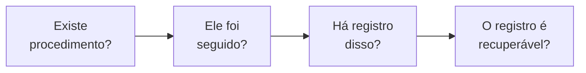
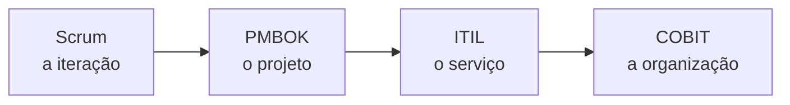

# Aula 16 — Governança

> 🎯 Objetivos: distinguir governança de gestão, saber qual pergunta cada arcabouço responde — PMBOK, ITIL e COBIT —, e reconhecer o impacto ESG de uma decisão técnica.
> 🎬 Slides da aula: [apresentacao-16-governanca.pdf](apresentacao/apresentacao-16-governanca.pdf)

## 1. Governança: quem decide e quem responde

A entidade da assembleia digital tem uma diretoria eleita, com mandato de dois anos, que contratou o sistema que vai apurar a eleição seguinte — a que pode tirá-la do cargo.

Ninguém agiu de má-fé. Mas três perguntas ficaram sem resposta escrita:

- **Quem decide** se o sistema entra em uso nesta assembleia?
- **Quem responde** se a apuração for contestada?
- **Quem audita**, e com que acesso?

**Governança é o conjunto de respostas a essas três perguntas.** Ela não executa nada: define quem pode decidir o quê, a quem essa pessoa presta contas, e como isso é verificado.

| | Gestão | Governança |
|---|---|---|
| **Pergunta** | como fazemos? | quem decide, e quem responde? |
| **Horizonte** | o projeto | a organização |
| **Produz** | entrega | direção, autoridade e controle |
| **Falha assim** | atraso, retrabalho | decisão tomada por quem não podia tomá-la |

> ⚠️ **"Governança só atrasa" é a queixa de quem só conheceu os sintomas ruins dela** — comitê que não decide, formulário que ninguém lê. Um projeto sem governança não é mais rápido: ele apenas descobre mais tarde que a decisão não valia.

## 2. PMI e PMBOK: o arcabouço de projeto

O **PMI** é a instituição que publica o **Guia PMBOK**, a referência mais usada em gerenciamento de projetos — e a base de boa parte deste curso.

O que ele organiza:

| Estrutura | O que é |
|---|---|
| **Cinco grupos de processo** | iniciação, planejamento, execução, monitoramento e controle, encerramento (Aula 03) |
| **Dez áreas de conhecimento** | integração, escopo, cronograma, custos, qualidade, recursos, comunicações, riscos, aquisições, partes interessadas |

Quase tudo o que este curso tratou está em alguma dessas caixas: risco na Aula 09, qualidade na 10, comunicações na 12, partes interessadas na 07.

**A pergunta que o PMBOK responde é: como se conduz um esforço temporário até um resultado aceito?**

> 💡 **PMBOK é referência, não receita.** Ele descreve processos que existem em projetos; nenhum projeto executa todos. Aplicar os 49 processos num projeto de três pessoas produz mais artefato que produto — o que a Aula 01 já dizia sobre processo demais.

## 3. ITIL: serviço, não projeto

O **ITIL** trata do que acontece **depois** que o projeto acabou: o sistema em operação, atendendo gente todos os dias.

O vocabulário dele é outro:

| Conceito ITIL | O que é |
|---|---|
| **Serviço** | o que a TI entrega continuamente a quem usa |
| **Incidente** | interrupção não planejada — o delivery fora do ar |
| **Problema** | a causa raiz por trás de incidentes repetidos |
| **Requisição** | pedido rotineiro e previsto: acesso novo, senha |
| **Acordo de nível de serviço** | o compromisso de tempo de resposta e disponibilidade |

**A pergunta que o ITIL responde é: como se sustenta um serviço em operação, com qualidade previsível?**

Repare que "incidente" e "problema" no ITIL não são os mesmos da Aula 09. Ali, problema era o que já aconteceu; aqui, problema é a **causa** de incidentes repetidos. Vocabulários diferentes, e usá-los trocados numa reunião com a área de operações produz mal-entendido garantido.

> ⚠️ **Aplicar ITIL a projeto é o erro mais comum entre os três arcabouços.** Um projeto adota gestão de incidentes e catálogo de serviços, afunda em cerimônia e não ganha nada — porque ele não tem operação contínua a sustentar. **ITIL é sobre serviço; PMBOK é sobre projeto.**

## 4. COBIT: controle e auditoria

O **COBIT** olha de mais alto: não como se faz um projeto nem como se sustenta um serviço, mas **como a organização garante que a TI serve ao negócio, e como isso se demonstra**.

Ele separa explicitamente duas coisas que as outras duas misturam:

| | Governar | Gerenciar |
|---|---|---|
| **Faz o quê** | avalia, dirige e monitora | planeja, constrói, executa, monitora |
| **Quem** | conselho, diretoria | gestores |
| **Pergunta** | estamos indo na direção certa? | estamos executando bem? |

**A pergunta que o COBIT responde é: como se demonstra que a TI está sob controle?** É o arcabouço da auditoria — e é por isso que ele aparece na clínica-escola, que já tomou uma notificação por dado exposto.

Na prática, ele pede o que a Aula 11 chamou de documentação para **provar**: procedimento definido, execução registrada, e evidência recuperável.

Numa auditoria, a sequência de perguntas é sempre a mesma, e cada uma depende da anterior:



Falhar na primeira é o caso mais comum e o mais barato de corrigir. Falhar na última é o mais frustrante: **o procedimento existia, foi seguido, e ninguém consegue mostrar** — o que, para efeito de auditoria, é idêntico a não ter feito.

> ⚠️ **Evidência reconstituída depois não convence auditoria nenhuma**, e é a saída que todo projeto tenta na véspera. Registro tem data, e a data denuncia.

## 5. Qual sigla responde qual pergunta

O erro que os três compartilham é serem adotados sem que ninguém enuncie a pergunta:

| Se a pergunta é… | O arcabouço é |
|---|---|
| como levo este esforço temporário até o aceite? | **PMBOK** |
| como sustento este sistema em operação? | **ITIL** |
| como demonstro que a TI está sob controle? | **COBIT** |
| como o time organiza o trabalho de duas em duas semanas? | **Scrum** (Aula 06) |

Os quatro convivem: um projeto conduzido com Scrum, dentro de um contrato estruturado à moda do PMBOK, entrega um sistema que passa a ser operado à moda do ITIL, numa organização auditada segundo o COBIT. Não são concorrentes.

O que os separa é a **unidade de trabalho** de cada um:



Da esquerda para a direita, o horizonte cresce e a frequência de decisão cai: a iteração decide toda quinzena; a organização decide todo ano. **Cobrar de um arcabouço a resposta que está no horizonte do outro é a origem de quase toda a frustração com metodologia.**

> 💡 **Antes de adotar qualquer um, escreva a pergunta que você quer que ele responda.** Se ninguém consegue escrevê-la, a adoção vai importar burocracia sem trazer benefício — que é o mesmo teste da ferramenta na Aula 12 e da oficina na Aula 08.

## 6. ESG em projeto de TI

**ESG** — *environmental, social and governance* — é a agenda pela qual organizações passaram a ser avaliadas além do resultado financeiro. Ela chega a projetos de software de forma mais concreta do que parece:

| Eixo | Como aparece num projeto de TI |
|---|---|
| **Ambiental** | consumo de infraestrutura; um relatório que ninguém lê rodando de hora em hora custa energia |
| **Social** | acessibilidade (Aula 15); exclusão de quem tem celular antigo ou internet ruim; uso de dado pessoal |
| **Governança** | quem decide, quem responde, quem audita — a seção 1 desta aula |

Três decisões deste curso têm impacto ESG direto, e nenhuma foi tomada por esse motivo:

- **Processar telemetria em lote em vez de tempo real** (Aula 04) reduz infraestrutura — decisão ambiental, tomada por custo;
- **A interface que exclui 40% dos associados** (Aula 15) é decisão social, tomada por descuido;
- **A trilha de auditoria do prontuário** (Aula 11) é decisão de governança, tomada por exigência legal.

> ⚠️ **ESG vira decoreba quando é tratado como relatório anual.** Ele só significa alguma coisa num projeto se aparecer nas decisões — e aparece, quase sempre com outro nome: custo de infraestrutura, acessibilidade, LGPD, auditoria.

## 7. O mapa do curso

Dezesseis aulas, e um fio só:

| Bloco | O que ele respondeu |
|---|---|
| **1 — Fundamentos** | o que é projeto, qual ciclo de vida, quais processos, e que arquitetura é decisão de gestão |
| **2 — Metodologias** | o que o ágil de fato diz, como o Scrum distribui autoridade, e quando descobrir, enxugar ou melhorar |
| **3 — Ferramentas e qualidade** | como antecipar risco, o que medir, o que documentar e como fazer a informação chegar |
| **4 — Avançado** | como a mudança chega ao usuário sem quebrar, quem está do outro lado, e quem responde pelo conjunto |

E o que sobra depois que os nomes forem esquecidos:

**Toda decisão de projeto tem dono, alternativa descartada e custo.** A matriz da Aula 01, o registro de ciclo de vida da 02, a linha de base da 03, o ADR da 04, o registro de risco da 09, o ADR de mudança da 13 — são seis formatos do mesmo hábito.

**"Depende" é resposta legítima, desde que você complete a frase.** Foi a promessa da abertura do curso, e é o que separa quem gerencia de quem preenche formulário.

E há uma terceira, que não estava no plano e apareceu em quase todas as aulas: **a informação precisa chegar a tempo a quem decide.** As quatro causas de fracasso da Aula 01, o risco sem gatilho da 09, a métrica que não muda decisão da 10, o documento sem leitor da 11 e o plano de comunicação da 12 são o mesmo problema com cinco roupas.

> 💡 **O que este curso não ensinou, de propósito:** estimar com precisão, negociar contrato, montar orçamento e conduzir equipe. São assuntos de carreira, não de primeira disciplina — e todos ficam mais fáceis para quem já sabe distinguir uma decisão de um palpite.

> 📖 Para continuar: o **Guia PMBOK** é a referência de projeto; o **ITIL** e o **COBIT** têm material introdutório gratuito em seus sites oficiais, listados em [links úteis](../../recursos/links-uteis.md). Nenhum deles se lê de capa a capa — todos se consultam a partir de uma pergunta.

## 🏋️ Exercícios da aula

Na pasta `aula-16/` do seu repositório:

1. **`ex01.md`** — ligue cada pergunta ao arcabouço que a responde: (a) quanto tempo temos para restabelecer o serviço após uma queda? (b) quem aprova o encerramento do projeto? (c) como demonstramos à auditoria que os acessos são concedidos com critério? (d) o que entra na próxima iteração? (e) qual é o caminho crítico do cronograma? (f) como tratamos um pedido de acesso novo? *Confere assim: dois para o PMBOK, dois para o ITIL, um para o COBIT e um para o Scrum.*

2. **`ex02.md`** — separe seis situações entre **projeto** e **serviço**, e diga que consequência prática essa classificação tem: (a) construir o sistema de votação; (b) atender associados que não conseguem entrar; (c) migrar o sistema para outro provedor; (d) restabelecer o sistema após uma queda; (e) implantar o sistema em outra entidade; (f) conceder acesso a um novo administrador. *Confere assim: três de cada, e a consequência prática é sempre sobre quem responde e com que compromisso de prazo.*

3. **`ex03.md`** — para o projeto da [assembleia e votação digital](../../recursos/projetos-para-praticar.md#12-assembleia-e-votação-digital), responda as três perguntas de governança da seção 1 — quem decide, quem responde, quem audita —, dizendo **onde cada resposta ficaria registrada**. *Confere assim: uma das três respostas é desconfortável, porque a diretoria que contrata pode perder a eleição que o sistema apura. Se a sua resposta não tocar nisso, releia o projeto.*

4. **`ex04.md`** — identifique o **impacto ESG** de três decisões técnicas: (a) manter um relatório automático de hora em hora que ninguém abre; (b) exigir aplicativo com versão recente de sistema operacional; (c) registrar cada acesso a dado sensível com autor e motivo. Diga o eixo e se o impacto é positivo ou negativo. *Confere assim: um de cada eixo, e a (b) tem impacto social maior do que parece — pense em quem tem celular antigo.*

5. **`ex05.md`** — 🌶️ **Desafio. Autoavaliação e mapa pessoal.** Escolha **uma decisão** que você tomaria diferente hoje, num trabalho, num projeto de outra matéria ou num sistema que você usa. Escreva: (i) a decisão como foi tomada, e por quem; (ii) como você a tomaria agora, e **qual aula deste curso** mudou a sua leitura; (iii) **o que se perde** com a sua nova escolha — porque ela também tem custo. *Confere assim: se o item (iii) estiver vazio, você trocou uma certeza por outra. O curso inteiro foi sobre o fato de que toda decisão custa algo.*

## 🧠 Revisão

[8 questões de múltipla escolha](revisao/README.md) para conferir se os conceitos ficaram sólidos. Responda sem consultar a aula — depois volte e corrija.

## ✅ Entrega

```bash
git add aula-16/
git commit -m "Resolve exercícios da aula 16 (governança)"
git push
```

---

⬅️ [Aula 15 — O usuário do outro lado](../aula-15-o-usuario-do-outro-lado/README.md) | 🏠 [Início](../../README.md)
