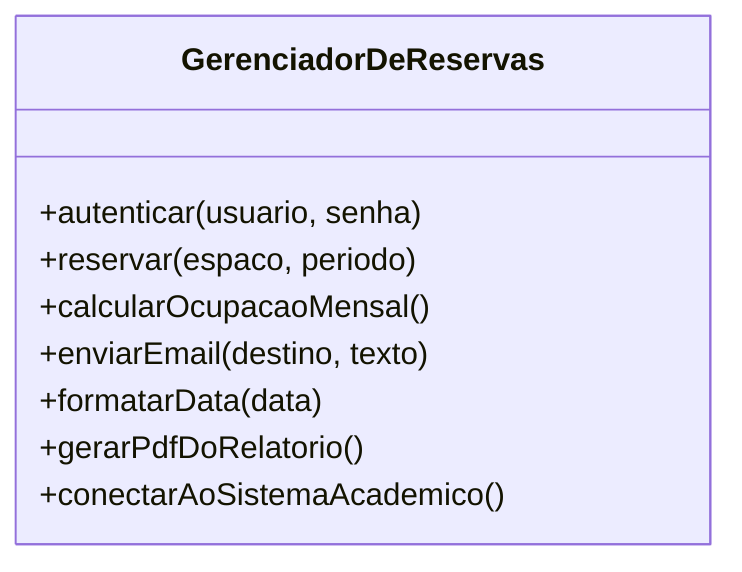

# Aula 13 — Princípios de Bom Projeto

> 🎯 Objetivos: diagnosticar coesão e acoplamento em um projeto, separar responsabilidades pelo motivo de mudança e aplicar SRP e OCP com critério.
> 🎬 Slides da aula: [apresentacao-13-principios-de-projeto.pdf](apresentacao/apresentacao-13-principios-de-projeto.pdf)

## 1. Onde o projeto entra

Os três blocos anteriores responderam **o que** o sistema faz. A partir de agora a pergunta muda: **como ele é construído por dentro?**

E aqui aparece uma dificuldade nova. Até a Aula 12, havia sempre uma referência externa contra a qual conferir: o cliente sabe se o requisito está certo, a norma diz qual é a regra. **Em projeto não há isso.** Duas soluções bem diferentes podem satisfazer exatamente os mesmos requisitos, e ambas funcionam. O que as separa não é correção — é o **custo de mudá-las depois**.

Por isso o critério de qualidade em projeto é sempre o mesmo:

> **Um bom projeto é aquele em que uma mudança provável exige alterar poucos lugares, e onde encontrá-los é óbvio.**

Duas medidas concretizam isso, e a aula inteira gira em torno delas: **coesão** (o que está junto pertence junto?) e **acoplamento** (o quanto uma parte depende de outra?).

> ⚠️ Note que o critério é **mudança provável**, não mudança possível. Tudo pode mudar. Projetar para toda mudança concebível produz um sistema de abstrações vazias, caro de escrever e impossível de ler — a doença que a seção 5 discute.

> 📖 Bezerra trata dos princípios de projeto orientado a objetos e da transição da análise para o projeto no bloco final do livro.

## 2. Coesão

**Coesão** mede o quanto os elementos que estão juntos **tratam do mesmo assunto**.

Uma classe coesa tem uma resposta curta para *"do que você cuida?"*. Uma classe pouco coesa responde com "e", e com muitos "e":



Essa classe cuida de autenticação, agenda, estatística, e-mail, formatação, geração de documento e integração. Sete assuntos, sete motivos para ela mudar. Quem mexe nela para trocar o texto de um e-mail corre o risco de quebrar a reserva.

**O teste que resolve:** descreva a responsabilidade da classe **em uma frase, sem usar "e" e sem usar "gerencia"**. Se não conseguir, a classe tem mais de uma responsabilidade.

> ⚠️ **Coesão alta não quer dizer classe pequena.** Uma classe grande pode ser perfeitamente coesa se tudo nela trata do mesmo assunto. Quebrar uma classe coesa em cinco pedacinhos não aumenta a coesão — aumenta o acoplamento entre eles, que é o contrário do objetivo. Trinta classes de uma linha, exigindo abrir sete arquivos para entender qualquer coisa, é um projeto ruim que se acha organizado.

## 3. Acoplamento

**Acoplamento** mede o quanto uma parte depende de outra. A pergunta que o revela:

> *"Se aquele módulo mudar por dentro, este aqui precisa mudar também?"*

Se a resposta for sim, estão acoplados. E nem todo acoplamento é igual:

| Tipo de dependência | Custo | Exemplo |
|---|---|---|
| Depender de uma **interface** estável | baixo — saudável e necessário | `Agenda` usa `Notificador`, sem saber se é e-mail ou mensagem |
| Depender de um **tipo concreto** | médio | `Agenda` cria um `NotificadorDeEmail` diretamente |
| Depender de **detalhe interno** de outro módulo | alto | `Agenda` lê um atributo público de `NotificadorDeEmail` |
| Depender de **dado global compartilhado** | altíssimo | os dois leem e escrevem na mesma variável global |

> ⚠️ **Baixo acoplamento não é acoplamento zero.** Módulo que não se conecta a nada não faz parte de sistema nenhum. O que se controla é a **quantidade** e o **tipo** — e o objetivo é depender de coisas que mudam pouco (contratos), não de coisas que mudam muito (implementações).

> 💡 As duas medidas caminham juntas e em direções opostas: **alta coesão dentro, baixo acoplamento fora**. Elas também se contrapõem — separar demais para "reduzir acoplamento" cria mais conexões entre pedaços pequenos. O ponto certo é onde as mudanças prováveis ficam contidas.

## 4. Separação de responsabilidades

Como saber **onde cortar**? O critério mais útil não é "o que parece diferente", é:

> **Separe o que muda por motivos diferentes.**

Volte à classe da seção 2 e pergunte quem pede cada mudança:

| Comportamento | Quem pede mudança |
|---|---|
| Regra de prioridade de reserva | a norma de uso dos espaços |
| Texto e formato do e-mail | a secretaria, por comunicação |
| Cálculo da ocupação | a coordenação, por causa do relatório |
| Forma de falar com o Sistema Acadêmico | a TI, quando o legado mudar |

Quatro fontes de mudança diferentes, com calendários diferentes. Elas não deveriam morar no mesmo lugar — não por elegância, mas porque cada alteração numa delas obriga a reabrir e retestar todas as outras.

> 💡 Esse critério tem um nome quando aplicado a classes — **SRP**, a primeira letra do SOLID — e é a razão de a formulação correta dele ser *"uma classe deve ter apenas um motivo para mudar"*, e não *"uma classe deve fazer apenas uma coisa"*. As duas frases parecem iguais e não são: "uma coisa" é indefinível; "um motivo para mudar" você consegue apontar com o dedo.

## 5. Abstração e encapsulamento como decisão

**Encapsular** é esconder o estado interno atrás de operações. **Abstrair** é esconder o que não importa neste nível.

Os dois são ferramentas, e ferramentas têm custo:

| | O que se ganha | O que se paga |
|---|---|---|
| Encapsulamento | a classe garante que o próprio estado é válido | um pouco mais de código |
| Abstração (interface) | trocar a implementação sem tocar em quem usa | mais um arquivo, mais uma indireção ao ler |

O erro clássico de quem acabou de aprender é abstrair **antes de haver o que abstrair**:

> Criar a interface `Notificador` quando existe — e vai existir por muito tempo — **uma única** implementação, que é e-mail.

Isso não é flexibilidade; é dívida disfarçada de boa prática. Você paga a indireção hoje pela chance de precisar dela um dia.

> 💡 A regra prática: **espere o segundo caso concreto.** Quando a secretaria pedir notificação por mensagem além do e-mail, a abstração se justifica sozinha — e você vai extraí-la sabendo exatamente qual é o contrato certo, porque tem dois exemplos na mão em vez de um imaginado.

> 🧩 **Ponte com POO:** `private`, `interface` e classe abstrata são as ferramentas com que você faz isso em Java. O que este curso acrescenta é o **critério** para usá-las: não é "sempre encapsule tudo e abstraia tudo", é "esconda o que muda, e abstraia quando houver mais de um caso".

## 6. SOLID em dose gentil

Cinco princípios de projeto orientado a objetos. Dois merecem atenção agora; os outros três você reconhece quando encontrar.

**SRP — Responsabilidade Única.** *Uma classe deve ter um único motivo para mudar.* É a seção 4 inteira. Sintomas de violação: a classe muda por pedidos de duas áreas diferentes; o nome tem "e" ou "Gerenciador"; ao mexer nela, você precisa testar coisas sem relação com o que mexeu.

**OCP — Aberto/Fechado.** *Uma classe deve estar aberta para extensão e fechada para modificação.* Ou seja: acrescentar um caso novo não deveria exigir reabrir e alterar código que já funciona.

O sintoma de violação é uma cadeia de condicionais que cresce a cada regra nova:

```
se finalidade == "aula extra"        → prioridade 1
senão se finalidade == "banca"       → prioridade 1
senão se finalidade == "evento"      → prioridade 2
senão se finalidade == "estudo"      → prioridade 3
senão ...                            ← toda finalidade nova reabre este código
```

Cada finalidade nova exige alterar — e retestar — o mesmo trecho. A saída é deixar cada finalidade responder pela própria prioridade, e o código que decide não precisar saber quais existem. **A Aula 15 mostra o padrão que faz isso** (é o Strategy).

> ⚠️ OCP não significa "nunca altere código". Significa que **o eixo de variação previsto** deveria ser extensível sem cirurgia. Prever todos os eixos é impossível e caro — e tentar é o erro da seção 5 de novo.

**Os outros três, em pinceladas:**

- **LSP — Substituição de Liskov:** onde a superclasse serve, a subclasse tem de servir. Se a subclasse precisa lançar erro em um método herdado ou exigir mais que a superclasse, a herança está errada — é o "é-um, mas…" da Aula 11;
- **ISP — Segregação de Interfaces:** melhor várias interfaces pequenas do que uma grande que obriga a implementar métodos vazios;
- **DIP — Inversão de Dependência:** módulos de alto nível não devem depender de detalhes; ambos dependem de abstrações. É o que faz `Agenda` depender de `Notificador` e não de `NotificadorDeEmail`.

> 💡 SOLID é um conjunto de **sintomas e curas**, não de mandamentos. A pergunta nunca é "meu código é SOLID?" — é *"o que dói quando eu mudo isto, e qual princípio nomeia essa dor?"*.

## 🏋️ Exercícios da aula

Na pasta `aula-13/` do seu repositório:

1. **`ex01.md`** — abaixo está o projeto de um módulo. **Diagnostique coesão e acoplamento** classe por classe, aponte os três piores problemas em ordem de gravidade e justifique a ordem.

   > `ServicoDeReserva` — métodos: `reservar`, `cancelar`, `validarLimiteDoSolicitante`, `montarHtmlDoEmail`, `enviarEmail`, `salvarNoBanco`, `lerConfiguracao`, `calcularOcupacaoDoMes`, `exportarCsv`.
   > `Espaco` — atributos públicos `codigo`, `capacidade`, `listaDeReservas`; nenhum método.
   > `Relatorio` — método `gerar(ServicoDeReserva servico)`, que lê `servico.listaInternaDeReservas` diretamente.

2. **`ex02.md`** — refatore o `ServicoDeReserva` do `ex01`. Entregue: o diagrama de classes Mermaid do resultado; a tabela **classe → responsabilidade em uma frase, sem "e" e sem "gerencia"**; e, para cada classe nova, **qual fonte de mudança** ela isola (quem pede alteração nela). Ao final, diga quantos lugares precisariam mudar, no projeto antigo e no novo, se a secretaria mudasse o texto do e-mail;
3. **`ex03.md`** — para cada situação, diga se há violação de **SRP**, **OCP**, **LSP**, ambas ou nenhuma, e explique: (a) a classe `Reserva` tem um método `gerarPdf()`; (b) acrescentar uma nova finalidade exige alterar quatro `if` espalhados; (c) `ReservaRecorrente` herda de `Reserva` mas lança erro em `cancelar()`; (d) `Agenda` cria diretamente um `NotificadorDeEmail`; (e) a classe `Espaco` tem 12 atributos e nenhum método além de leitura e escrita;
4. **`ex04.md`** — você precisa decidir onde colocar a regra `RN-04` (prioridade acadêmica desloca reserva de estudo). Há três opções: dentro de `Reserva`; numa classe `PoliticaDePrioridade` própria; ou espalhada no serviço que registra reservas. **Escolha uma e defenda usando os dois critérios da aula** — coesão e acoplamento —, dizendo explicitamente o que você perde nas outras duas. Feche com o que aconteceria com a sua escolha se a norma passasse a ter seis níveis de prioridade;
5. **Desafio 🌶️ `ex05.md`** — pegue o **módulo de notificação** do sistema-guia (hoje: manda e-mail quando uma reserva é interrompida) e **redesenhe-o** para o cenário em que a instituição passa a querer também mensagem por aplicativo e aviso dentro do próprio sistema, com o usuário escolhendo o canal. Entregue: o diagrama antes e o diagrama depois; a justificativa por coesão e acoplamento; e — a parte que vale mais — **meça o que melhorou**, com números: quantas classes precisam mudar para acrescentar um quarto canal, antes e depois; quantos lugares conhecem o formato do e-mail, antes e depois; quantas classes precisam ser retestadas ao mudar o texto de uma notificação, antes e depois. Se algum número piorou, diga qual e por que valeu a pena mesmo assim — **todo projeto troca uma coisa por outra, e saber dizer qual é o preço é a competência desta aula.**

## 🧠 Revisão

[8 questões de múltipla escolha](revisao/README.md) para conferir se os conceitos ficaram sólidos. Responda sem consultar a aula — depois volte e corrija.

## ✅ Entrega

```bash
git add aula-13/
git commit -m "Resolve exercícios da aula 13 (princípios de projeto)"
git push
```

---

⬅️ [Aula 12 — Modelagem dinâmica](../../bloco-3-modelagem-e-uml/aula-12-modelagem-dinamica/README.md) | ➡️ [Aula 14 — Arquitetura de software](../aula-14-arquitetura-de-software/README.md)
