<!-- _class: capa -->

<div class="emoji">🧱</div>

# Princípios de Bom Projeto

## Aula 13 · Bloco 4 — Projeto de software

<div class="meta">Separe o que muda por motivos diferentes</div>

---

## 🎯 Nesta aula

1. Onde o **projeto** entra
2. **Coesão** — e por que não é "classe pequena"
3. **Acoplamento** — e por que não é "zero"
4. Separação de **responsabilidades**
5. Abstração como decisão, e **SOLID** em dose gentil

---

## Em projeto não há gabarito

Até a Aula 12 havia sempre uma referência externa: o cliente sabe se o requisito está certo, a norma diz qual é a regra.

**Em projeto não há isso.** Duas soluções bem diferentes satisfazem os mesmos requisitos, e ambas funcionam. O que as separa não é correção — é o **custo de mudá-las depois**.

> **Um bom projeto é aquele em que uma mudança provável exige alterar poucos lugares, e onde encontrá-los é óbvio.**

---

<!-- _class: lead -->

## ⚠️ Mudança **provável**, não mudança possível

Tudo pode mudar.

Projetar para toda mudança concebível
produz um sistema de **abstrações vazias**,
caro de escrever e impossível de ler.

Duas medidas concretizam o critério:
**coesão** — o que está junto pertence junto? —
e **acoplamento** — o quanto uma parte depende de outra?

---

<!-- _class: diagrama -->

## Do que você cuida?



---

## Sete assuntos, sete motivos para mudar

Autenticação, agenda, estatística, e-mail, formatação, geração de documento e integração.

Quem mexe nela para trocar o texto de um e-mail **corre o risco de quebrar a reserva**.

> 💡 **O teste que resolve:** descreva a responsabilidade da classe **em uma frase, sem usar "e" e sem usar "gerencia"**. Se não conseguir, ela tem mais de uma responsabilidade.

---

<!-- _class: lead -->

## ⚠️ Coesão alta ≠ classe pequena

Uma classe **grande** pode ser perfeitamente coesa
se tudo nela trata do mesmo assunto.

Quebrar uma classe coesa em cinco pedacinhos
não aumenta a coesão — aumenta o **acoplamento**
entre eles, que é o contrário do objetivo.

Trinta classes de uma linha, exigindo abrir sete arquivos
para entender qualquer coisa, é **um projeto ruim
que se acha organizado**.

---

<!-- _class: tabela-densa -->

## Acoplamento: nem todo é igual

*"Se aquele módulo mudar por dentro, este aqui precisa mudar também?"*

| Depender de… | Custo | Exemplo |
|---|---|---|
| uma **interface** estável | baixo — saudável | `Agenda` usa `Notificador`, sem saber o canal |
| um **tipo concreto** | médio | `Agenda` cria um `NotificadorDeEmail` |
| **detalhe interno** de outro módulo | alto | `Agenda` lê atributo público alheio |
| **dado global** compartilhado | altíssimo | os dois escrevem na mesma variável |

---

<!-- _class: lead -->

## ⚠️ Baixo acoplamento não é acoplamento zero

Módulo que não se conecta a nada
não faz parte de sistema nenhum.

O que se controla é a **quantidade** e o **tipo** —
e o objetivo é depender de coisas que **mudam pouco**
(contratos), não das que mudam muito (implementações).

💡 **Alta coesão dentro, baixo acoplamento fora.**
As duas se contrapõem: separar demais cria mais
conexões entre pedaços pequenos.

---

## Onde cortar?

> **Separe o que muda por motivos diferentes.**

| Comportamento | Quem pede mudança |
|---|---|
| Regra de prioridade de reserva | a norma de uso dos espaços |
| Texto e formato do e-mail | a secretaria |
| Cálculo da ocupação | a coordenação |
| Forma de falar com o Sistema Acadêmico | a TI, quando o legado mudar |

Quatro calendários — e cada alteração obriga a **reabrir e retestar** as outras.

---

<!-- _class: lead -->

## 💡 Por que a formulação do SRP importa

*"Uma classe deve ter apenas **um motivo para mudar**"* —
e **não** *"uma classe deve fazer apenas uma coisa"*.

As duas frases parecem iguais e não são:

**"uma coisa" é indefinível;
"um motivo para mudar" você aponta com o dedo.**

---

## Abstração e encapsulamento têm custo

| | O que se ganha | O que se paga |
|---|---|---|
| Encapsulamento | a classe garante que o próprio estado é válido | um pouco mais de código |
| Abstração | trocar a implementação sem tocar em quem usa | mais um arquivo, mais uma indireção |

O erro clássico é abstrair **antes de haver o que abstrair**: criar a interface `Notificador` quando existe — e vai existir por muito tempo — **uma única** implementação.

Isso não é flexibilidade; é **dívida disfarçada de boa prática**.

---

<!-- _class: lead -->

## 💡 Espere o segundo caso concreto

Quando a secretaria pedir notificação por mensagem
**além** do e-mail, a abstração se justifica sozinha.

E você vai extraí-la sabendo **qual é o contrato certo**,
porque tem dois exemplos na mão
em vez de um imaginado.

🧩 O que este curso acrescenta ao `private` e ao `interface`
do Java é o **critério**: esconda o que muda,
e abstraia quando houver mais de um caso.

---

## OCP: o sintoma é a cadeia que cresce

```
se finalidade == "aula extra"   → prioridade 1
senão se finalidade == "banca"  → prioridade 1
senão se finalidade == "evento" → prioridade 2
senão ...        ← toda finalidade nova reabre este código
```

*Aberta para extensão, fechada para modificação.* Acrescentar um caso novo não deveria exigir reabrir código que já funciona.

A saída é cada finalidade responder pela **própria** prioridade. **A Aula 15 mostra o padrão** — é o Strategy.

---

<!-- _class: lista-limpa -->

## Os outros três, em pinceladas

- **LSP** — onde a superclasse serve, a subclasse tem de servir. Se ela precisa lançar erro num método herdado, a herança está errada: é o *"é-um, mas…"* da Aula 11;
- **ISP** — várias interfaces pequenas valem mais que uma grande que obriga a implementar métodos vazios;
- **DIP** — módulos de alto nível não dependem de detalhes; ambos dependem de abstrações. É o que faz `Agenda` depender de `Notificador`.

---

<!-- _class: lead -->

## 💡 SOLID é sintoma e cura, não mandamento

A pergunta nunca é *"meu código é SOLID?"*

É **"o que dói quando eu mudo isto,
e qual princípio nomeia essa dor?"**

⚠️ E OCP não significa "nunca altere código":
significa que o **eixo de variação previsto**
deveria ser extensível sem cirurgia.

---

<!-- _class: checkpoint -->

## 🏋️ Exercícios da aula

Na pasta `aula-13/`:

1. **`ex01.md`** — diagnostique coesão e acoplamento de três classes, e ordene os piores problemas;
2. **`ex02.md`** — refatore o `ServicoDeReserva`: cada classe, uma frase sem "e" e sem "gerencia";
3. **`ex03.md`** — SRP, OCP, LSP, ambas ou nenhuma, em cinco situações;
4. **`ex04.md`** — onde colocar a `RN-04`, defendendo pelos dois critérios;
5. **Desafio 🌶️ `ex05.md`** — redesenhe o módulo de notificação e **meça o que melhorou, com números**.

---

<!-- _class: lead -->

## ➡️ Próxima aula

**Aula 14 — Arquitetura de software**

As decisões caras de reverter —
e como registrá-las antes de esquecer o porquê.
