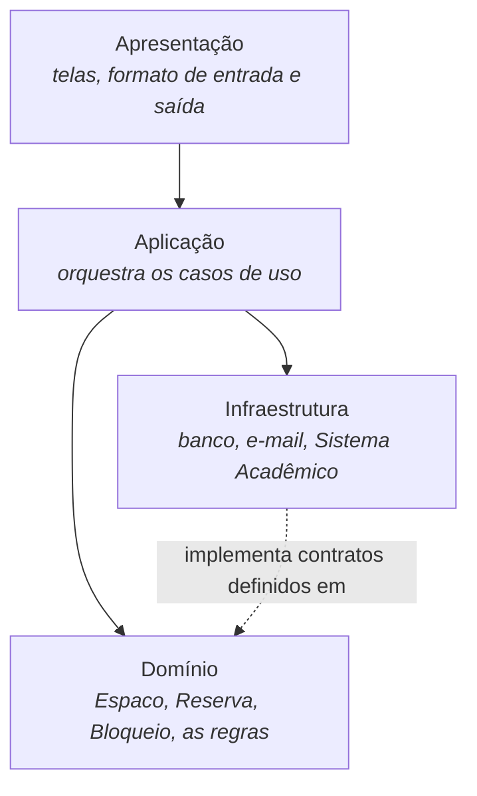
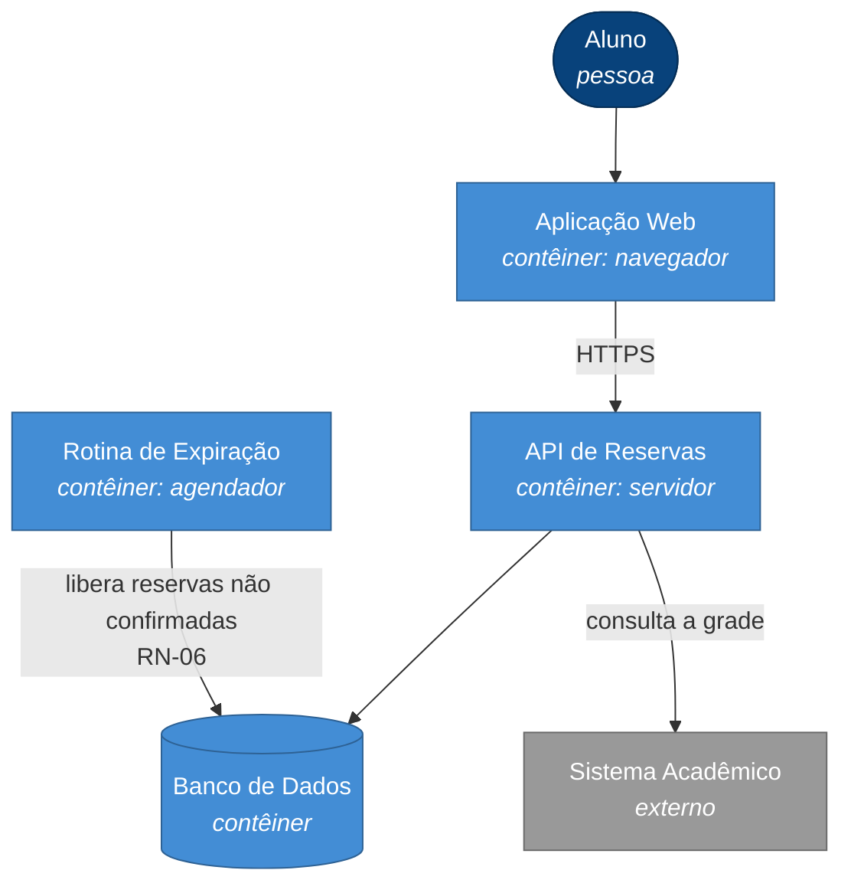

# Aula 14 — Arquitetura de Software

> 🎯 Objetivos: distinguir decisão arquitetural de decisão de projeto detalhado, comparar estilos arquiteturais pelo custo que cobram e registrar uma decisão em um ADR.
> 🎬 Slides da aula: [apresentacao-14-arquitetura-de-software.pdf](apresentacao/apresentacao-14-arquitetura-de-software.pdf)

## 1. As decisões difíceis de mudar

Duas perguntas chegam na mesma reunião:

- *"A classe `Reserva` deve ter o método `cancelar()` ou isso fica no serviço?"*
- *"O sistema consulta o Sistema Acadêmico em tempo real a cada busca, ou mantém uma cópia da grade atualizada de hora em hora?"*

As duas são decisões de projeto. Só que a primeira, se estiver errada, custa uma tarde para corrigir. A segunda espalha consequências por todo o sistema: desempenho, comportamento quando o legado cai, atualidade do dado, complexidade de operação. Mudá-la depois de seis meses é reescrever meio sistema.

> **Arquitetura são as decisões caras de reverter, e a relação entre as partes que delas decorre.**

O teste que separa as duas: **"quanto custaria mudar isto daqui a seis meses?"** Caro e espalhado → arquitetura, decida agora com cuidado. Barato e local → projeto detalhado, decida depois e siga em frente.

| É arquitetura | Não é arquitetura |
|---|---|
| Como o sistema conversa com o Sistema Acadêmico | o nome do método que faz a chamada |
| Se os dados ficam num banco relacional ou em arquivos | o nome da tabela |
| Se o sistema é implantado como uma unidade ou várias | a ordem dos parâmetros |
| Onde mora a regra de prioridade | o `if` que a implementa |
| Como o sistema se comporta quando uma parte cai | a mensagem de erro exibida |

> ⚠️ **"Nossa arquitetura é React com Spring Boot e PostgreSQL"** não é uma arquitetura — é uma lista de tecnologias. Ela não diz quais são as partes, como conversam, onde ficam os dados nem o que acontece quando algo cai. A pilha é uma **consequência** da arquitetura, não ela.

> 📖 Bezerra trata de projeto arquitetural e da organização em camadas na parte de projeto; Sommerville tem um capítulo dedicado a projeto de arquitetura com os padrões arquiteturais clássicos.

## 2. Camadas

O estilo mais usado, e o primeiro que vale conhecer. A ideia é agrupar o sistema por **responsabilidade técnica**, com uma regra de dependência: cada camada conhece a de baixo, nunca a de cima.



O que se ganha: dá para trocar a apresentação sem tocar nas regras, e trocar o banco sem tocar no domínio. O que se paga: uma requisição atravessa três ou quatro camadas, e há mais código de passagem.

> 💡 A camada de **domínio** é a que interessa mais neste curso: é onde vivem `RN-01` a `RN-08`. A seta pontilhada do desenho é a parte que mais gente erra: quem define o contrato de "notificar" é o domínio; a infraestrutura o implementa. Se a dependência apontar ao contrário, o domínio passa a saber que existe e-mail — e é o DIP da Aula 13 sendo violado no tamanho grande.

> ⚠️ **Camada (*layer*) não é o mesmo que camada física (*tier*).** *Layer* é divisão lógica no código; *tier* é divisão de execução em máquinas diferentes. Um sistema com quatro *layers* pode rodar inteiro num único *tier*. O falso amigo está no [glossário](../../recursos/glossario.md#5-projeto-e-arquitetura).

## 3. Cliente-servidor e MVC

**Cliente-servidor** é o estilo em que uma parte pede e outra responde, geralmente por rede. É a base de praticamente todo sistema web — inclusive o sistema-guia, com o navegador do aluno de um lado e o servidor da instituição do outro.

A consequência que interessa a projeto: **a rede está no meio**, e a rede falha, demora e perde mensagem. Todo comportamento do sistema precisa considerar isso — que é justamente por que "o Sistema Acadêmico não responde" virou fluxo de exceção lá na Aula 10.

**MVC** separa três responsabilidades na parte que interage com o usuário:

| Parte | Responsabilidade |
|---|---|
| **Modelo** | os dados e as regras — `Reserva`, `Espaco`, `RN-04` |
| **Visão** | apresentar; não decide nada |
| **Controlador** | receber a ação do usuário, acionar o modelo, escolher a visão |

> 💡 O valor do MVC é uma regra só: **a visão não contém regra de negócio**. Quando a prioridade de reserva é decidida dentro da tela, o mesmo cálculo precisa ser repetido no aplicativo, no relatório e na rotina automática — e as três versões divergem em seis meses.

## 4. Monolito × microsserviços

Aqui mora a decisão arquitetural mais discutida da década, e a que mais se toma pelo motivo errado.

| | **Monolito** | **Microsserviços** |
|---|---|---|
| Implantação | uma unidade | várias, independentes |
| Chamada entre partes | dentro do processo, rápida e confiável | pela rede: lenta, e falha |
| Dado | um banco, com transação | um banco por serviço, sem transação entre eles |
| Time | um time coordenado | times que decidem sozinhos |
| Erro | o que quebra é local | precisa saber em qual serviço quebrou |
| Custa caro em | crescer sem virar bagunça | operação, observabilidade, consistência |

**Microsserviços resolvem um problema organizacional, não técnico.** A Netflix não os adotou por elegância — adotou porque centenas de times pisavam no pé uns dos outros ao implantar um sistema só. Se você não tem esse problema, está comprando o remédio sem a doença.

Para o sistema-guia — algumas centenas de usuários, um time pequeno, três pessoas na TI —, microsserviços seriam um erro de projeto com consequências caras: sete implantações, transação distribuída para uma reserva, e um plantão que a instituição não tem.

> 💡 A recomendação profissional atual: **comece monolito, mas bem modularizado.** As fronteiras que você desenhar por dentro — domínio de reservas, domínio de espaços, notificação — são exatamente as linhas de corte no dia em que houver motivo real para extrair um serviço. Modularidade é barata; distribuição é cara.

> ⚠️ Um monolito mal modularizado não vira microsserviços; vira vários monólitos mal modularizados conversando por rede — com todos os defeitos anteriores mais os novos.

## 5. Componentes e implantação

Dois diagramas de apoio, que valem pelo que revelam:

- **Componentes** — quais são as partes construíveis do sistema e que interfaces elas oferecem umas às outras;
- **Implantação** — **onde cada coisa roda**: qual servidor, qual processo, qual dispositivo.

O de implantação costuma ser o mais esclarecedor num projeto real, porque explicita o que só existe na cabeça de quem opera: que o banco está em outra máquina, que o Sistema Acadêmico só é acessível pela rede interna, que a rotina noturna roda num agendador separado. Cada uma dessas linhas é um ponto onde o sistema pode falhar.

## 6. C4

Quando se desenha arquitetura, o problema recorrente é o **nível de detalhe**: o desenho ou é vago demais para decidir alguma coisa, ou detalhado demais para caber numa tela. O **C4** resolve isso propondo quatro níveis de zoom, cada um para um público:

| Nível | Mostra | Para quem |
|---|---|---|
| **1 — Contexto** | o sistema, seus usuários e os sistemas externos | qualquer pessoa, inclusive a secretaria |
| **2 — Contêineres** | as unidades executáveis: aplicação web, API, banco, rotina | time técnico e quem opera |
| **3 — Componentes** | as partes dentro de um contêiner | quem vai construir aquele contêiner |
| **4 — Código** | classes | raramente vale desenhar; o código já está lá |

Na prática, **os níveis 1 e 2 respondem 90% das perguntas** e são os únicos que a maioria dos projetos mantém.

O **nível 1** do sistema-guia está no [guia de notações](../../recursos/notacoes-uml.md#5-componentes-implantação-e-c4). O **nível 2** desce um degrau e mostra as unidades que realmente executam:



Repare no que o nível 2 tornou visível e o nível 1 escondia: existe uma **rotina de expiração** rodando separada, porque `RN-06` depende da passagem do tempo e não de alguém clicar. Isso é uma peça a construir, operar e monitorar — e ela apareceu por causa do desenho.

## 7. ADR: registrar a decisão

Seis meses depois, alguém pergunta: *"por que a gente consulta o Sistema Acadêmico de hora em hora em vez de em tempo real?"* Se ninguém souber responder, uma de duas coisas acontece — e as duas são ruins: o time mantém uma decisão que talvez não faça mais sentido, ou reverte uma decisão cujo motivo ainda é válido.

Um **ADR** (*Architecture Decision Record*) é um documento curto que evita isso. Meia página, cinco seções:

---

**ADR-001 — Consulta à grade do Sistema Acadêmico por sincronização periódica**

**Situação:** proposto · **Data:** 2026-03-10 · **Decidem:** time de desenvolvimento e TI

**Contexto.** A busca por espaços livres precisa saber quais salas já estão ocupadas por aulas regulares. Essa informação vive no Sistema Acadêmico, que é legado, responde entre 2 e 8 segundos, tem janela de manutenção noturna e sai do ar sem aviso. A busca é a operação mais usada do sistema e o pico acontece na semana de provas.

**Decisão.** A plataforma manterá uma **cópia local da grade de aulas**, sincronizada a cada hora. As consultas de disponibilidade usarão a cópia local. A tela informará o horário da última sincronização.

**Alternativas consideradas.**

| Alternativa | Por que foi descartada |
|---|---|
| Consultar em tempo real a cada busca | a operação mais usada ficaria refém do componente mais lento e menos confiável do conjunto |
| Sincronizar uma vez por dia | mudança de sala feita durante o dia só apareceria no dia seguinte |
| Pedir ao Sistema Acadêmico que notifique mudanças | tecnicamente melhor, mas depende de alteração num sistema que não controlamos e sem prazo |

**Consequências.** A busca fica rápida e continua funcionando com o legado fora do ar (positivo). A grade pode estar até 1 hora desatualizada, o que exige avisar o usuário e aceitar conflito raro (negativo). Passa a existir uma rotina de sincronização para operar e monitorar (custo novo). Reavaliar se o Sistema Acadêmico passar a oferecer notificação de mudanças.

---

> 💡 O que torna um ADR útil não é a decisão — é a tabela de **alternativas descartadas com o motivo**. É ela que permite a quem vem depois saber se o motivo ainda vale. ADR sem alternativas é um comunicado, não um registro de decisão.

> ⚠️ ADR é **imutável**. Mudou de ideia? Escreve-se um ADR novo que substitui o anterior, e o anterior é marcado como substituído. Editar o antigo apaga exatamente a informação que dá valor ao arquivo: o que se pensava na época.

## 🏋️ Exercícios da aula

Na pasta `aula-14/` do seu repositório:

1. **`ex01.md`** — classifique cada decisão em **arquitetural** ou **projeto detalhado**, aplicando o teste da seção 1, e estime o custo de mudá-la em seis meses: (a) usar banco relacional; (b) o nome da coluna que guarda a finalidade; (c) manter cópia local da grade de aulas; (d) `Reserva` ter ou não o método `cancelar()`; (e) o sistema ser web em vez de aplicativo instalado; (f) a rotina de expiração rodar a cada minuto ou a cada cinco; (g) autenticar pelo login institucional; (h) a ordem dos campos no formulário. Marque as duas em que você teve mais dúvida e explique a fronteira;
2. **`ex02.md`** — desenhe em Mermaid as **camadas** do sistema-guia e distribua nelas: `Espaco`, `Reserva`, `RN-04`, a tela de busca, o envio de e-mail, o acesso ao banco, a rotina de expiração, a chamada ao Sistema Acadêmico e o controlador de reservas. Depois responda: **onde você colocou `RN-04` e por quê?** E: qual dependência do seu desenho aponta "para cima" ou para uma tecnologia — e como você a inverteria?;
3. **`ex03.md`** — escreva um **ADR completo**, no formato da seção 7, para uma destas decisões: (a) como o sistema se comporta quando duas pessoas reservam o mesmo espaço no mesmo instante; (b) onde fica registrada a trilha de quem reservou o quê, e por quanto tempo; (c) como a rotina que expira reservas não confirmadas é executada. Obrigatório: **no mínimo três alternativas descartadas com motivo**, e consequências positivas **e** negativas — ADR sem consequência negativa é propaganda;
4. **`ex04.md`** — uma equipe propõe: *"vamos fazer em microsserviços: um serviço de reservas, um de espaços, um de notificação, um de relatórios e um de integração. Assim cada um escala sozinho e o sistema fica moderno."* Escreva a **crítica técnica** dessa proposta: o que ela custa em operação, dado e consistência para este contexto específico; qual problema real ela resolveria e se esse problema existe aqui; e **qual seria a sua contraproposta**, com a fronteira interna que você desenharia num monolito modularizado. Seja justo: aponte **uma** situação em que a proposta deles estaria certa;
5. **Desafio 🌶️ `ex05.md`** — entregue os **dois primeiros níveis de C4** do sistema-guia. **(a) Contexto:** o [guia de notações](../../recursos/notacoes-uml.md#5-componentes-implantação-e-c4) traz uma versão — revise-a, acrescente o que faltar, corrija o que discordar e **justifique cada mudança**. **(b) Contêineres:** desenhe o seu, partindo do exemplo da seção 6 mas tomando as suas próprias decisões — e cada contêiner precisa vir com uma linha dizendo qual é a responsabilidade dele e por que ele existe separado dos outros. **(c)** Escreva o **ADR da decisão mais importante** que o seu diagrama de contêineres representa. **(d)** Feche apontando: **que pergunta o nível 2 respondeu que o nível 1 não respondia?** Se a resposta for "nenhuma", o seu nível 2 provavelmente é o nível 1 com mais caixas.

## 🧠 Revisão

[8 questões de múltipla escolha](revisao/README.md) para conferir se os conceitos ficaram sólidos. Responda sem consultar a aula — depois volte e corrija.

## ✅ Entrega

```bash
git add aula-14/
git commit -m "Resolve exercícios da aula 14 (arquitetura de software)"
git push
```

---

⬅️ [Aula 13 — Princípios de bom projeto](../aula-13-principios-de-projeto/README.md) | ➡️ [Aula 15 — Padrões de projeto](../aula-15-padroes-de-projeto/README.md)
