<!-- _class: capa -->

🏛️

# Arquitetura de Software

## Aula 14 · Bloco 4 — Projeto de software

As decisões caras de reverter — e o registro do porquê

---

## 🎯 Nesta aula

1. As decisões **difíceis de mudar**
2. **Camadas**, cliente-servidor e MVC
3. **Monolito × microsserviços**
4. **C4** — quatro níveis de zoom
5. **ADR** — registrar a decisão

---

## Duas perguntas na mesma reunião

- *"A classe `Reserva` deve ter o método `cancelar()`, ou isso fica no serviço?"*
- *"O sistema consulta o Sistema Acadêmico em tempo real, ou mantém uma cópia da grade atualizada de hora em hora?"*

A primeira, errada, custa **uma tarde**. A segunda espalha consequências por todo o sistema — e mudá-la em seis meses é reescrever meio sistema.

> **Arquitetura são as decisões caras de reverter, e a relação entre as partes que delas decorre.**

---

<!-- _class: tabela-densa -->

## O teste: "quanto custa mudar isto em seis meses?"

| É arquitetura | Não é arquitetura |
|---|---|
| Como o sistema conversa com o Sistema Acadêmico | o nome do método que faz a chamada |
| Se os dados ficam em banco relacional ou arquivos | o nome da tabela |
| Se é implantado como uma unidade ou várias | a ordem dos parâmetros |
| Onde mora a regra de prioridade | o `if` que a implementa |
| Como o sistema se comporta quando uma parte cai | a mensagem de erro exibida |

---

<!-- _class: lead -->

## ⚠️ "React com Spring Boot e PostgreSQL"

**não é uma arquitetura** — é uma lista de tecnologias.

Ela não diz quais são as partes, como conversam,
onde ficam os dados, nem o que acontece
quando algo cai.

A pilha é uma **consequência** da arquitetura,
não ela.

---

<!-- _class: diagrama -->

## Camadas, e a regra de dependência

---

<!-- _class: lead -->

## 💡 A seta pontilhada é o que mais gente erra

Quem define o contrato de "notificar"
é o **domínio**; a infraestrutura o **implementa**.

Se a dependência apontar ao contrário,
o domínio passa a saber que existe e-mail —
e é o **DIP** da Aula 13 sendo violado no tamanho grande.

⚠️ E *layer* não é *tier*: **camada lógica** no código
não é **camada física** em máquinas. Quatro *layers*
podem rodar num único *tier*.

---

## Cliente-servidor e MVC

**Cliente-servidor** — uma parte pede, outra responde, pela rede. E a rede **falha, demora e perde mensagem**. É por isso que *"o Sistema Acadêmico não responde"* virou fluxo de exceção lá na Aula 10.

| MVC | Responsabilidade |
|---|---|
| **Modelo** | os dados e as regras — `Reserva`, `Espaco`, `RN-04` |
| **Visão** | apresentar; não decide nada |
| **Controlador** | receber a ação, acionar o modelo, escolher a visão |

---

<!-- _class: lead -->

## 💡 O valor do MVC é uma regra só

**A visão não contém regra de negócio.**

Quando a prioridade de reserva é decidida
dentro da tela, o mesmo cálculo precisa ser repetido
no aplicativo, no relatório e na rotina automática —

e as três versões **divergem em seis meses**.

---

<!-- _class: tabela-densa -->

## Monolito × microsserviços

| | **Monolito** | **Microsserviços** |
|---|---|---|
| Implantação | uma unidade | várias, independentes |
| Chamada entre partes | no processo: rápida e confiável | pela rede: lenta, e falha |
| Dado | um banco, com transação | um por serviço, sem transação entre eles |
| Time | um time coordenado | times que decidem sozinhos |
| Custa caro em | crescer sem virar bagunça | operação, observabilidade, consistência |

---

<!-- _class: lead -->

## ⚠️ Eles resolvem um problema organizacional

**não um problema técnico.**

A Netflix não os adotou por elegância — adotou porque
centenas de times pisavam no pé uns dos outros.

Se você não tem esse problema,
está **comprando o remédio sem a doença**.

Para o sistema-guia — centenas de usuários, três pessoas
na TI — seriam sete implantações, transação distribuída
para uma reserva, e um plantão que a instituição não tem.

---

<!-- _class: lead -->

## 💡 Comece monolito, mas bem modularizado

As fronteiras que você desenhar por dentro —
reservas, espaços, notificação — são exatamente
as **linhas de corte** no dia em que houver motivo
real para extrair um serviço.

**Modularidade é barata; distribuição é cara.**

⚠️ Um monolito mal modularizado não vira microsserviços:
vira **vários monólitos mal modularizados
conversando por rede**.

---

## C4: quatro níveis de zoom

| Nível | Mostra | Para quem |
|---|---|---|
| **1 — Contexto** | o sistema, usuários e sistemas externos | qualquer pessoa |
| **2 — Contêineres** | as unidades executáveis | time técnico e quem opera |
| **3 — Componentes** | as partes dentro de um contêiner | quem constrói aquele contêiner |
| **4 — Código** | classes | raramente vale desenhar |

Os níveis **1 e 2 respondem 90% das perguntas**, e são os únicos que a maioria dos projetos mantém.

---

<!-- _class: diagrama -->

## Nível 2 — contêineres

---

<!-- _class: lead -->

## 💡 O que o nível 2 tornou visível

Existe uma **rotina de expiração** rodando separada,
porque a `RN-06` depende da **passagem do tempo**
e não de alguém clicar.

É uma peça a construir, operar e monitorar —
e ela apareceu **por causa do desenho**.

---

## ADR: registrar a decisão

Seis meses depois: *"por que consultamos o Sistema Acadêmico de hora em hora?"* Sem resposta, o time ou mantém uma decisão que não faz mais sentido, ou reverte uma cujo motivo ainda vale.

Meia página, cinco seções: **contexto** · **decisão** · **alternativas descartadas** · **consequências** · situação e data.

> 💡 O que torna um ADR útil não é a decisão — é a tabela de **alternativas descartadas com o motivo**. ADR sem alternativas é um comunicado.

---

<!-- _class: tabela-densa -->

## ADR-001 — as alternativas descartadas

**Decisão.** Manter cópia local da grade, sincronizada a cada hora; a tela informa o horário da última sincronização.

| Alternativa | Por que foi descartada |
|---|---|
| Consultar em tempo real a cada busca | a operação mais usada ficaria refém do componente mais lento |
| Sincronizar uma vez por dia | mudança de sala durante o dia só apareceria amanhã |
| Pedir ao legado que notifique mudanças | melhor tecnicamente, mas depende de sistema que não controlamos |

**Consequência negativa:** a grade pode estar 1 h desatualizada.

---

<!-- _class: lead -->

## ⚠️ ADR é imutável

Mudou de ideia? Escreve-se um **ADR novo**
que substitui o anterior,
e o anterior é marcado como substituído.

Editar o antigo apaga exatamente a informação
que dá valor ao arquivo:

**o que se pensava na época.**

---

<!-- _class: checkpoint -->

## 🏋️ Exercícios da aula

Na pasta `aula-14/`:

1. **`ex01.md`** — arquitetural ou projeto detalhado, em oito decisões — e as duas de fronteira;
2. **`ex02.md`** — as camadas do sistema-guia, e **onde você colocou a `RN-04`**;
3. **`ex03.md`** — um **ADR completo**, com três alternativas descartadas e consequências negativas;
4. **`ex04.md`** — a crítica técnica a uma proposta de microsserviços — sendo justo com ela;
5. **Desafio 🌶️ `ex05.md`** — os dois primeiros níveis de C4 e o ADR da decisão que eles representam.

---

<!-- _class: lead -->

## ➡️ Próxima aula

**Aula 15 — Padrões de projeto**

Soluções conhecidas para problemas recorrentes —
e o padrão aplicado sem o problema que ele resolve.
