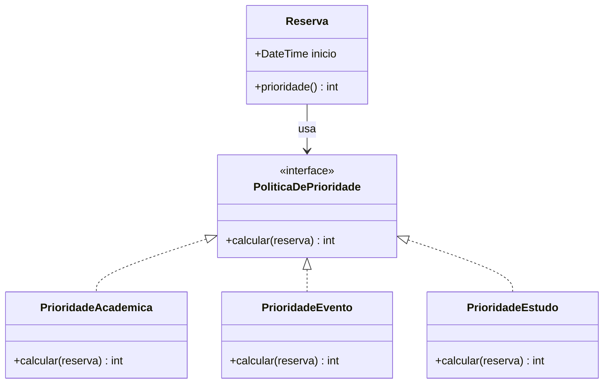
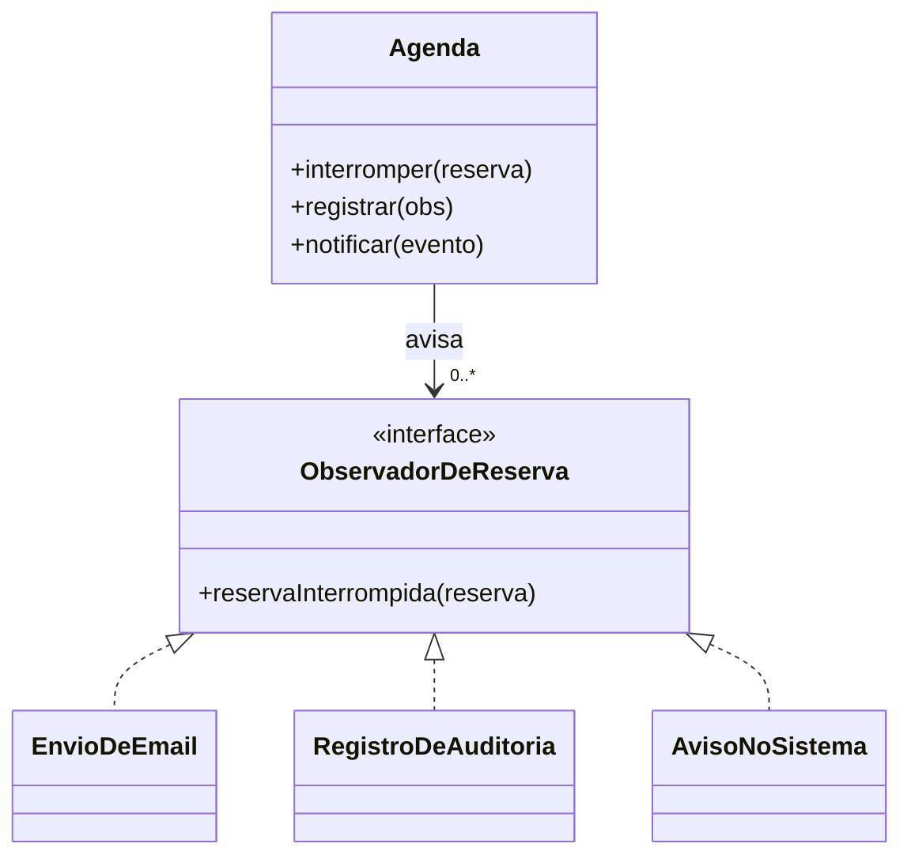

# Aula 15 — Padrões de Projeto

> 🎯 Objetivos: descrever um padrão pela tríade contexto–problema–solução, reconhecer cinco padrões clássicos em um projeto e justificar quando **não** aplicar um padrão.
> 🎬 Slides da aula: [apresentacao-15-padroes-de-projeto.pdf](apresentacao/apresentacao-15-padroes-de-projeto.pdf)

## 1. O que é um padrão

A Aula 13 terminou com um problema em aberto: a cadeia de condicionais que decide a prioridade de uma reserva cresce a cada finalidade nova, violando o OCP. Esse problema não é seu, nem do sistema-guia — ele já apareceu em milhares de sistemas, e alguém já escreveu a solução.

Um **padrão de projeto** é isso: uma solução conhecida para um problema recorrente, descrita de forma reutilizável. Ele tem sempre quatro partes, e as quatro importam:

| Parte | Pergunta |
|---|---|
| **Contexto** | em que situação isto aparece? |
| **Problema** | o que exatamente está doendo? |
| **Solução** | qual é o arranjo de classes que resolve? |
| **Consequências** | o que se paga por isso? |

Em 1994, quatro autores — a *Gangue dos Quatro* (GoF) — catalogaram 23 padrões em três famílias:

| Família | Trata de | Exemplos |
|---|---|---|
| **Criacionais** | como objetos são criados | Factory Method, Singleton, Builder |
| **Estruturais** | como objetos se compõem | Facade, Adapter, Composite, Decorator |
| **Comportamentais** | como objetos colaboram | Strategy, Observer, State, Template Method |

Você não precisa dos 23. Precisa dos cinco desta aula, e principalmente do **hábito** de reconhecer que um problema já tem solução conhecida.

> ⚠️ **Um padrão sem problema é só complexidade com nome bonito.** Se você não consegue enunciar o problema em uma frase, não aplique. E se não consegue enunciar as consequências — todo padrão cobra algo: mais classes, mais indireção, mais dificuldade de depurar —, também não.

> 📖 GAMMA, HELM, JOHNSON e VLISSIDES, *Padrões de Projeto*, é a fonte original — consulta, não leitura corrida. Bezerra apresenta os principais padrões no contexto de projeto OO.

## 2. Strategy

**Contexto.** Existe uma operação que pode ser feita de várias maneiras, e a maneira certa depende de algo que só se sabe em tempo de execução.

**Problema.** A cadeia de `se/senão` cresce a cada variação nova, e cada acréscimo obriga a reabrir e retestar código que já funcionava.

**Solução.** Cada variação vira uma classe com a mesma interface; quem usa recebe a estratégia e a executa sem saber qual é.



**Consequências.** Acrescentar uma finalidade passa a ser **criar uma classe**, sem tocar no que existe (OCP satisfeito). Em troca: mais classes, e a lógica que antes se lia num lugar só agora está espalhada — quem depura precisa saber qual estratégia foi escolhida.

> 💡 O sinal de que você precisa de Strategy: **um condicional sobre um "tipo" que se repete em mais de um lugar do código.** Se o mesmo `switch` sobre finalidade aparece no cálculo de prioridade, na validação e no relatório, cada finalidade nova exige três alterações coordenadas — e uma delas vai ser esquecida.

## 3. Observer

**Contexto.** Quando algo acontece, várias partes do sistema precisam reagir — e a lista de interessados muda com o tempo.

**Problema.** Se quem provoca o evento chamar cada interessado diretamente, ele precisa conhecer todos. Interessado novo obriga a alterar a origem, que não tem nada a ver com o assunto.

**Solução.** A origem mantém uma lista de observadores e apenas avisa; cada observador reage por conta própria.



No sistema-guia: quando uma interdição interrompe reservas, é preciso notificar o solicitante, registrar na trilha de auditoria e talvez avisar a secretaria. A `Agenda` não deveria conhecer nenhum desses três.

**Consequências.** Acrescentar reação é acrescentar observador. Em troca: o fluxo fica **menos explícito** — lendo `Agenda` você não sabe o que vai acontecer —, e a ordem em que os observadores rodam normalmente não é garantida.

> ⚠️ Cuidado com observador que **falha**. Se o envio de e-mail der erro, a interdição deveria falhar junto? Quase sempre não — mas isso é uma decisão, e precisa estar escrita. Padrão não dispensa pensar no caminho de exceção.

## 4. Facade

**Contexto.** Um subsistema tem muitas partes, e quem usa precisa de apenas algumas operações comuns.

**Problema.** Quem chama acaba conhecendo detalhes demais: cria três objetos, chama cinco métodos na ordem certa, trata o caso do meio. E fica acoplado a tudo isso.

**Solução.** Uma classe de fachada oferece uma interface simples e esconde o arranjo por trás.

No sistema-guia, `IntegracaoAcademica` é uma boa fachada: por dentro há autenticação no legado, tratamento de tempo esgotado, nova tentativa, conversão de formato e leitura da cópia local. Por fora oferece `gradeDoEspaco(espaco, periodo)`.

**Consequências.** Reduz muito o acoplamento e é o padrão mais barato desta aula. Em troca: pode virar uma classe grande, e é preciso resistir à tentação de colocar regra de negócio nela — fachada **coordena**, não decide.

> 💡 Facade é também a melhor forma de isolar um sistema legado. Todo o conhecimento sobre as esquisitices do Sistema Acadêmico fica em **um** lugar; no dia em que ele for substituído, muda uma classe.

## 5. Singleton, e por que ele é polêmico

**Contexto.** Existe um recurso do qual deve haver **uma única** instância.

**Problema.** Várias instâncias causariam inconsistência ou desperdício.

**Solução.** A classe controla a própria criação e oferece um ponto de acesso: `Configuracao.getInstance()`.

E aqui vem a polêmica, que vale entender bem: o Singleton entrega **duas** coisas, e a segunda não foi pedida.

| O que ele entrega | Avaliação |
|---|---|
| Instância única | era o requisito — legítimo |
| Acesso global de qualquer lugar | **é o efeito colateral, e é ele que estraga** |

O acesso global custa caro: esconde dependências (a assinatura do método não revela que ele depende daquilo), impede substituir o objeto em teste e acopla o sistema inteiro a um ponto só.

> 💡 A saída é separar as duas coisas: **mantenha a unicidade** se ela for mesmo requisito, mas **passe a instância adiante** por construtor ou parâmetro, em vez de deixar que qualquer classe a busque. Quem recebe a dependência declara que depende dela — e isso é metade da manutenibilidade.

> ⚠️ Se a sua justificativa para o Singleton for *"assim eu acesso de qualquer lugar"*, você está descrevendo uma variável global e chamando de padrão.

## 6. Factory Method

**Contexto.** Uma classe precisa criar objetos, mas o tipo concreto depende de contexto ou configuração.

**Problema.** Se ela usa `new TipoConcreto()`, fica acoplada àquele tipo — e cada tipo novo exige alterá-la (OCP de novo).

**Solução.** Delegar a criação a um método que pode ser especializado, isolando a decisão em um lugar só.

No sistema-guia: quem registra a reserva não deveria decidir qual `PoliticaDePrioridade` instanciar. Uma fábrica recebe a finalidade e devolve a política certa — e é o único lugar que conhece todas as políticas.

**Consequências.** Quem usa deixa de conhecer os tipos concretos; a decisão fica isolada. Em troca: mais uma classe, e uma indireção a mais para acompanhar ao ler o código.

> 💡 Factory e Strategy aparecem juntos com muita frequência, e agora dá para ver por quê: o Strategy define **as variações**, a fábrica decide **qual delas usar**. Sem a fábrica, quem usa o Strategy volta a ter o `switch` que o Strategy veio eliminar — só que mudado de lugar.

## 7. Antipadrões e o padrão pelo padrão

Classe-Deus, microsserviço para três usuários, "arquitetura" que era pilha de tecnologia: várias soluções criticadas até aqui têm a mesma assinatura — são comuns, parecem razoáveis e costumam piorar as coisas. O nome disso é **antipadrão**, e vale reunir os que já apareceram:

| Antipadrão | O que é | Onde apareceu |
|---|---|---|
| **Classe-Deus** | uma classe que faz tudo | Aula 13, seção 2 |
| **Objeto anêmico** | classes só com dados, e as regras espalhadas em serviços | Aula 13 |
| **Acoplamento por atalho** | ler o estado interno de outra classe para poupar trabalho | Aula 13, seção 3 |
| **Microsserviço para três usuários** | distribuir sem o problema que a distribuição resolve | Aula 14, seção 4 |
| **Arquitetura que era pilha de tecnologia** | listar ferramentas e chamar de arquitetura | Aula 14, seção 1 |
| **Padrão pelo padrão** | aplicar sem que exista o problema | esta seção |

O último é o mais provável agora, e é uma fase — o importante é que ela acabe antes do projeto final. O sintoma é `AbstractStrategyFactoryProvider` numa tela de cadastro com três campos.

Três perguntas antes de aplicar qualquer padrão:

1. **Qual é o problema, em uma frase?** Sem resposta, não aplique;
2. **Qual é o custo?** Mais classes, mais indireção, mais dificuldade de depurar. Vale?
3. **Quantos casos concretos eu tenho?** Um caso não justifica abstração — é a regra do "segundo caso" da Aula 13.

> 💡 E o contrário também vale como aprendizado: perceber que você **já implementou** um Observer sem saber o nome é sinal de que entendeu o padrão. O nome serve para conversar com outras pessoas, não para justificar a decisão.

> 🧩 **Ponte com POO:** os cinco padrões desta aula se apoiam em uma única capacidade que você está vendo em Programação Orientada a Objetos — **polimorfismo**: várias classes respondendo à mesma mensagem de formas diferentes. Se essa parte ainda não chegou por lá, leia os diagramas como contratos: quem usa conhece o contrato, não quem o cumpre.

## 🏋️ Exercícios da aula

Na pasta `aula-15/` do seu repositório:

1. **`ex01.md`** — identifique o padrão em cada descrição e justifique pela tríade contexto–problema–solução: (a) uma classe mantém lista de interessados e avisa todos quando algo muda; (b) uma interface com quatro implementações, e quem usa recebe uma delas pronta; (c) uma classe com construtor privado e um método estático que devolve sempre o mesmo objeto; (d) uma classe que oferece três métodos simples e por dentro coordena seis outras; (e) um método que decide qual subclasse instanciar a partir de um parâmetro;
2. **`ex02.md`** — escolha o padrão para cada problema, **justifique e diga o que ele custa**: (a) o cálculo de penalidade por não comparecimento vai mudar quando a norma mudar, e talvez existam regras diferentes por tipo de espaço; (b) três partes do sistema precisam reagir quando uma reserva é interrompida, e vai aparecer uma quarta; (c) falar com o Sistema Acadêmico exige autenticar, tratar tempo esgotado e converter formato, e cinco lugares diferentes precisam da grade; (d) o formato de exportação do relatório pode ser PDF, CSV ou planilha, escolhido pelo usuário. Para pelo menos um dos quatro, avalie a hipótese de **não usar padrão nenhum** e diga se ela venceria;
3. **`ex03.md`** — desenhe em Mermaid o **Strategy** para o cálculo de penalidade do sistema-guia (`RN-07`: duas reservas não confirmadas em 30 dias suspendem por 15 dias). Entregue: o diagrama; a interface e as implementações que você criaria; **quem decide qual estratégia usar** (e se isso pede uma fábrica); e o trecho de pseudocódigo do "antes", com condicionais, para comparação. Feche dizendo o que muda quando a coordenação criar uma regra diferente para o auditório;
4. **`ex04.md`** — abaixo está um projeto com **padrões aplicados sem necessidade**. Aponte cada excesso, explique o custo que ele impõe e entregue a versão simplificada, dizendo o que você manteve e por quê.

   > O cadastro de espaços tem: `EspacoFactory` (só cria `Espaco`, e não existe subclasse); `IEspacoRepository` com uma única implementação, `EspacoRepositoryPostgres`; `EspacoServiceSingleton.getInstance()`; `EspacoBuilder` para uma classe com três atributos; e `EspacoObserver`, sem nenhum observador registrado.

5. **Desafio 🌶️ `ex05.md`** — olhando para o sistema que você escolheu para o **projeto final**, proponha **dois padrões** — e não podem ser os dois mais óbvios. Para cada um entregue: **(a)** o problema concreto do seu sistema, em uma frase, com a evidência de que ele existe (o condicional que cresce, a lista de interessados que muda); **(b)** o diagrama da solução; **(c)** as consequências, incluindo pelo menos **duas negativas**; **(d)** a alternativa sem padrão, e por que ela perde. E então a parte mais importante: **(e)** escolha **um terceiro padrão que você cogitou e decidiu não usar**, e escreva por quê. Saber recusar um padrão é a competência que separa quem estudou o catálogo de quem sabe projetar.

## 🧠 Revisão

[8 questões de múltipla escolha](revisao/README.md) para conferir se os conceitos ficaram sólidos. Responda sem consultar a aula — depois volte e corrija.

## ✅ Entrega

```bash
git add aula-15/
git commit -m "Resolve exercícios da aula 15 (padrões de projeto)"
git push
```

---

⬅️ [Aula 14 — Arquitetura de software](../aula-14-arquitetura-de-software/README.md) | ➡️ [Aula 16 — Qualidade, evolução e próximos passos](../aula-16-qualidade-evolucao-proximos-passos/README.md)
