<!-- _class: capa -->

🧩

# Padrões de Projeto

## Aula 15 · Bloco 4 — Projeto de software

Um padrão sem problema é só complexidade com nome bonito

---

## 🎯 Nesta aula

1. O que é um **padrão**
2. **Strategy** e **Observer**
3. **Facade** e **Factory Method**
4. **Singleton** — e por que ele é polêmico
5. **Antipadrões** e o padrão pelo padrão

---

## Quatro partes, e as quatro importam

A Aula 13 deixou um problema em aberto: a cadeia de condicionais que decide a prioridade cresce a cada finalidade nova. Esse problema **não é seu** — já apareceu em milhares de sistemas.

| Parte | Pergunta |
|---|---|
| **Contexto** | em que situação isto aparece? |
| **Problema** | o que exatamente está doendo? |
| **Solução** | qual é o arranjo de classes que resolve? |
| **Consequências** | o que se paga por isso? |

---

<!-- _class: lead -->

## ⚠️ Se você não enuncia o problema, não aplique

**Um padrão sem problema
é só complexidade com nome bonito.**

E se você não consegue enunciar as **consequências** —
todo padrão cobra algo: mais classes, mais indireção,
mais dificuldade de depurar — também não aplique.

Em 1994 a *Gangue dos Quatro* catalogou 23 padrões.
Você não precisa dos 23: precisa de cinco,
e do **hábito** de reconhecer problema conhecido.

---

<!-- _class: diagrama -->

## Strategy

---

## Strategy: o que se ganha e o que se paga

**Problema.** A cadeia de `se/senão` cresce a cada variação, e cada acréscimo obriga a reabrir código que já funcionava.

**Solução.** Cada variação vira uma classe com a mesma interface; quem usa recebe a estratégia e executa sem saber qual é.

**Consequências.** Acrescentar finalidade passa a ser **criar uma classe** (OCP satisfeito). Em troca: mais classes, e a lógica que se lia num lugar só agora está espalhada.

---

<!-- _class: lead -->

## 💡 O sinal de que você precisa de Strategy

Um **condicional sobre um "tipo"
que se repete em mais de um lugar** do código.

Se o mesmo `switch` sobre finalidade aparece
no cálculo de prioridade, na validação e no relatório,
cada finalidade nova exige **três alterações
coordenadas** — e uma delas vai ser esquecida.

---

<!-- _class: diagrama -->

## Observer

---

## Observer: a origem não conhece ninguém

Quando uma interdição interrompe reservas, é preciso notificar o solicitante, registrar na auditoria e talvez avisar a secretaria. A `Agenda` **não deveria conhecer nenhum desses três**.

**Consequências.** Acrescentar reação é acrescentar observador. Em troca: o fluxo fica **menos explícito** — lendo `Agenda` você não sabe o que vai acontecer — e a ordem dos observadores normalmente não é garantida.

---

<!-- _class: lead -->

## ⚠️ E o observador que falha?

Se o envio de e-mail der erro,
a interdição deveria falhar junto?

**Quase sempre não** — mas isso é uma decisão,
e precisa estar escrita.

Padrão não dispensa pensar
no caminho de exceção.

---

## Facade e Factory Method

**Facade** — uma classe oferece interface simples e esconde o arranjo. `IntegracaoAcademica` esconde autenticação no legado, tempo esgotado, nova tentativa, conversão de formato e leitura da cópia local; por fora oferece `gradeDoEspaco(espaco, periodo)`.

**Factory Method** — quem registra a reserva não deveria decidir qual `PoliticaDePrioridade` instanciar. A fábrica recebe a finalidade e devolve a política certa.

> 💡 Fachada **coordena, não decide**. Resista a colocar regra de negócio nela.

---

<!-- _class: lead -->

## 💡 Facade e Strategy andam juntos com Factory

**Facade** é a melhor forma de isolar um legado:
todo o conhecimento sobre as esquisitices do
Sistema Acadêmico fica em **um** lugar.

E o **Strategy** define as variações;
a **fábrica** decide qual delas usar.

Sem a fábrica, quem usa o Strategy volta a ter
o `switch` que o Strategy veio eliminar —
só que **mudado de lugar**.

---

## Singleton entrega duas coisas

| O que ele entrega | Avaliação |
|---|---|
| Instância única | era o requisito — legítimo |
| Acesso global de qualquer lugar | **é o efeito colateral, e é ele que estraga** |

O acesso global esconde dependências (a assinatura não revela que o método depende daquilo), impede substituir o objeto em teste e acopla o sistema a um ponto só.

---

<!-- _class: lead -->

## 💡 Separe as duas coisas

**Mantenha a unicidade** se ela for mesmo requisito,
mas **passe a instância adiante** por construtor,
em vez de deixar que qualquer classe a busque.

Quem recebe a dependência **declara que depende dela** —
e isso é metade da manutenibilidade.

⚠️ Justificou com *"assim eu acesso de qualquer lugar"*?
Você descreveu uma **variável global**.

---

<!-- _class: tabela-densa -->

## Antipadrões que já apareceram no curso

| Antipadrão | O que é | Onde apareceu |
|---|---|---|
| **Classe-Deus** | uma classe que faz tudo | Aula 13 |
| **Objeto anêmico** | só dados, regras espalhadas em serviços | Aula 13 |
| **Acoplamento por atalho** | ler o estado interno de outra classe | Aula 13 |
| **Microsserviço para três usuários** | distribuir sem o problema | Aula 14 |
| **Arquitetura que era pilha** | listar ferramentas e chamar de arquitetura | Aula 14 |
| **Padrão pelo padrão** | aplicar sem que exista o problema | esta aula |

---

<!-- _class: lead -->

## ⚠️ O sintoma do padrão pelo padrão

`AbstractStrategyFactoryProvider`
numa tela de cadastro com **três campos**.

É uma fase — e o importante
é que ela acabe antes do projeto final.

**Três perguntas antes de aplicar qualquer padrão:**
qual é o problema, em uma frase? ·
qual é o custo? ·
quantos **casos concretos** eu tenho?

---

<!-- _class: lead -->

## 💡 O contrário também é aprendizado

Perceber que você **já implementou um Observer
sem saber o nome** é sinal de que entendeu o padrão.

O nome serve para **conversar com outras pessoas**,
não para justificar a decisão.

🧩 Os cinco padrões se apoiam numa capacidade só:
**polimorfismo**. Se essa parte ainda não chegou em POO,
leia os diagramas como contratos — quem usa conhece
o contrato, não quem o cumpre.

---

<!-- _class: checkpoint -->

## 🏋️ Exercícios da aula

Na pasta `aula-15/`:

1. **`ex01.md`** — identifique o padrão em cinco descrições, pela tríade;
2. **`ex02.md`** — o padrão para quatro problemas, **e o que ele custa** — com a hipótese de não usar nenhum;
3. **`ex03.md`** — o Strategy do cálculo de penalidade (`RN-07`), com o "antes" em condicionais;
4. **`ex04.md`** — cinco padrões aplicados sem necessidade: aponte o excesso e simplifique;
5. **Desafio 🌶️ `ex05.md`** — dois padrões para o seu projeto final — e **um terceiro que você recusou**, com o porquê.

---

<!-- _class: lead -->

## ➡️ Próxima aula

**Aula 16 — Qualidade, evolução e próximos passos**

Verificação × validação, dívida técnica,
e para onde ir depois daqui.
