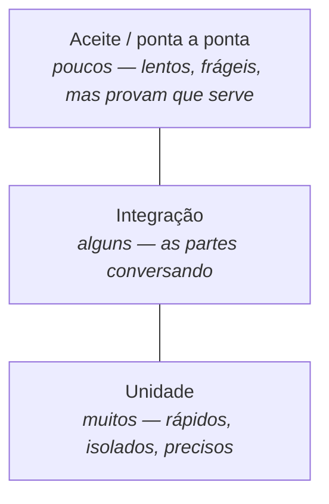

# Aula 16 — Qualidade, Evolução e Próximos Passos

> 🎯 Objetivos: distinguir verificação de validação, planejar testes de aceite a partir de critérios, identificar dívida técnica e avaliar criticamente artefatos gerados por IA.
> 🎬 Slides da aula: [apresentacao-16-qualidade-evolucao-proximos-passos.pdf](apresentacao/apresentacao-16-qualidade-evolucao-proximos-passos.pdf)

## 1. Verificação × validação

O sistema de reserva foi entregue. Todos os testes passam. Na primeira semana, a secretaria liga dizendo que ele não serve.

Como as duas coisas podem ser verdade ao mesmo tempo? Porque são **duas perguntas diferentes**, e passar em uma não diz nada sobre a outra:

| | Pergunta | Confere o quê contra o quê | Como se faz |
|---|---|---|---|
| **Verificação** | estamos construindo o produto **corretamente**? | o sistema contra a especificação | testes, revisão, análise estática |
| **Validação** | estamos construindo o **produto certo**? | a especificação contra a necessidade real | demonstração, protótipo, teste de aceite |

O caso clássico é o requisito bem implementado que ninguém queria: verificação impecável, validação inexistente.

> 💡 Repare que a validação já começou no Bloco 2 — foi o que a Aula 08 chamou de revisar requisito com o cliente. Validar cedo é barato; validar na entrega é caro; validar depois da entrega chama-se prejuízo.

> 📖 Sommerville trata de verificação e validação, técnicas de teste e revisão em capítulos dedicados a qualidade.

## 2. A pirâmide de testes

Nem todo teste custa o mesmo nem encontra as mesmas coisas. A imagem consagrada é uma pirâmide: muitos testes baratos na base, poucos caros no topo.



| Nível | Testa | Custo | Quando quebra, você sabe |
|---|---|---|---|
| **Unidade** | uma peça isolada | segundos | exatamente onde |
| **Integração** | as peças conversando | minutos | em qual junção |
| **Aceite / ponta a ponta** | o sistema inteiro pela ótica do usuário | dezenas de minutos | que algo, em algum lugar, quebrou |
| **Regressão** | que o que funcionava continua funcionando | é o conjunto acima, rodando de novo | — |

A pirâmide **invertida** — poucos testes de unidade e muitos de ponta a ponta — é um antipadrão comum: a bateria demora uma hora, falha por motivos aleatórios, e o time começa a ignorar a falha. Aí a bateria deixou de existir na prática, como a esteira vermelha da Aula 04.

> ⚠️ **Cobertura é bom indicador e péssima meta.** 100% de cobertura garante que todas as linhas foram executadas — não que alguém verificou o resultado. Dá para ter cobertura total com testes que não afirmam nada.

## 3. Revisão de código

Nem todo defeito é encontrável por teste. Nome ruim, responsabilidade no lugar errado, regra duplicada, decisão não documentada: nada disso quebra a esteira, e tudo isso cobra juros.

Revisão de código — em Pull Request, como no [trabalho em dupla](../../projetos/trabalho-em-dupla.md) — encontra essas coisas. O que faz uma boa revisão:

| Faça | Em vez de |
|---|---|
| Revisar mudanças pequenas | revisar 2.000 linhas de uma vez, o que ninguém faz de verdade |
| Perguntar em vez de afirmar: *"o que acontece se isto vier nulo?"* | *"isto está errado"* |
| Separar o obrigatório do gosto pessoal | tratar preferência como defeito |
| Apontar o que está bom | comentar só o negativo |
| Discutir a decisão, não a pessoa | *"você não entendeu o requisito"* |

> 💡 A pergunta mais produtiva de uma revisão é **"como você testaria isso?"** — a mesma da Aula 05. Ela funciona para código, para requisito e para diagrama, e quase sempre revela um caso que ninguém tinha considerado.

## 4. Refatoração e dívida técnica

**Refatorar** é mudar a estrutura interna **sem mudar o comportamento externo**. É o que permite aplicar tudo que a Aula 13 ensinou depois de o código já existir — e depende de teste automatizado, porque sem ele "não mudei o comportamento" é uma esperança, não uma afirmação.

**Dívida técnica** é uma decisão consciente de entregar antes pagando juros depois. A metáfora é financeira e funciona até o fim: você toma emprestado, ganha velocidade agora e paga mais caro depois.

E aqui há uma distinção que a maioria das pessoas não faz:

| | **Dívida técnica** | **Defeito de qualidade** |
|---|---|---|
| Houve decisão? | sim, consciente | não, foi descuido ou pressa |
| Alguém aprovou? | sim, sabendo do custo | ninguém |
| Está registrada? | deve estar, com motivo e prazo | não |
| Como se resolve | negociando com o negócio | corrigindo |

Chamar toda gambiarra de "dívida técnica" é elogiar o descuido. A dívida legítima do sistema-guia é a cópia local da grade de aulas do [ADR-001](../aula-14-arquitetura-de-software/README.md#7-adr-registrar-a-decisão): sabe-se que ela é uma solução de contorno, sabe-se o custo (dado com até uma hora de atraso), e sabe-se a condição de quitação (quando o legado oferecer notificação de mudanças).

> ⚠️ Dívida não registrada não é dívida — é surpresa. Registre-a onde se olha: um ADR, uma seção do README, uma lista de pendências técnicas com data. E aceite que **parte dela nunca será paga**, o que é uma decisão legítima desde que consciente.

## 5. Manutenção e evolução

A maior parte do dinheiro gasto em software não vai para construí-lo — vai para mantê-lo depois. Manutenção não é conserto; são três coisas diferentes:

| Tipo | O que é | Exemplo no sistema-guia |
|---|---|---|
| **Corretiva** | consertar defeito | a notificação não chegava quando havia 3 reservas atingidas |
| **Adaptativa** | acompanhar mudança externa | o Sistema Acadêmico mudou o formato da grade |
| **Evolutiva** | melhorar ou acrescentar | a norma passou a ter seis níveis de prioridade |

A **evolutiva** costuma ser a maior fatia, e é por isso que "manutenibilidade" foi um dos atributos de qualidade lá na Aula 01: o sistema vai ser mudado muito mais vezes do que foi escrito.

> 💡 Isso fecha o argumento do curso inteiro. Coesão, acoplamento, ADR, glossário, rastreabilidade — nada disso serve para o sistema funcionar hoje. Tudo serve para ele **poder mudar** amanhã, com quem chegar depois de você.

## 6. Segurança e privacidade desde o projeto

Segurança acrescentada no fim é remendo. As duas ideias que evitam a maior parte dos problemas:

**Privacidade desde a concepção.** Coletar só o necessário, guardar pelo tempo necessário, mostrar a quem tem motivo. No sistema-guia: saber quem reservou cada sala é dado pessoal. Perguntas que precisam de resposta escrita — quem pode ver o histórico de reservas de uma pessoa? Por quanto tempo se guarda? O que fica na trilha de auditoria?

**Menor privilégio.** Cada papel enxerga o mínimo necessário. A infraestrutura precisa interditar, não precisa ver quem reservou o quê nos últimos dois anos.

E três hábitos que valem desde o primeiro projeto:

- **Nunca confie na entrada** — inclusive na que vem de outro sistema seu;
- **Segredo não vai para o repositório** — nem em comentário, nem em arquivo de exemplo;
- **Registre acesso a dado sensível**, e registre de forma que ninguém consiga apagar depois.

> ⚠️ No Brasil isso tem força de lei — a **LGPD**. Mas o argumento profissional é anterior ao legal: o dado é de outra pessoa, e ela não escolheu você.

## 7. IA no ciclo de desenvolvimento

Ferramentas de IA passaram a escrever código, requisitos, testes e diagramas. Vale separar com honestidade o que muda e o que não muda.

**O que muda:**

- Produzir o primeiro rascunho de quase tudo ficou muito mais rápido;
- O custo de explorar uma alternativa caiu — dá para ver três desenhos possíveis antes de escolher;
- Tarefas repetitivas de tradução (de um formato para outro, de uma notação para outra) praticamente sumiram.

**O que não muda:**

- **A responsabilidade continua sendo de quem assina.** "A IA escreveu" não é defesa em revisão, em auditoria nem em incidente;
- **Decidir continua sendo humano.** A ferramenta não sabe que a instituição tem três pessoas na TI, nem que a semana de provas existe. O contexto que faz a decisão certa está fora do texto;
- **Requisito continua vindo de gente.** Nenhum modelo sabe o que a secretaria precisa; isso se descobre perguntando (Aula 06);
- **Verificação e validação continuam necessárias** — e mais importantes, não menos.

**O risco específico** que essa tecnologia introduz merece nome: o resultado é **plausível**. Código gerado compila e parece razoável; um documento de requisitos gerado tem a estrutura certa e as palavras certas. Plausível é exatamente o tipo de erro que engenharia de software mais sofre — foi o argumento de abertura de [erros comuns](../../recursos/erros-comuns.md): aqui nada aponta o defeito, porque tudo parece bem.

> 💡 A prática que funciona: **use como rascunho, revise como se fosse de outra pessoa** — de uma pessoa competente, apressada e que não conhece o seu contexto. É exatamente a postura da revisão de código da seção 3, e as mesmas perguntas se aplicam: quais casos de exceção faltaram? De onde veio este requisito? Como eu testaria isso?

> ⚠️ Dois cuidados práticos: o que você envia para uma ferramenta externa **sai da instituição** — não mande dado pessoal nem código sob contrato de sigilo sem autorização; e confira licença e procedência do que vier pronto.

## 🗺️ O mapa do curso

Dezesseis aulas, uma pergunta em cada uma:

| Bloco | A pergunta | Onde |
|---|---|---|
| **1 — Software e processos** | por que existe uma engenharia em volta do código, e como um time entrega? | Aulas 01–04 |
| **2 — Requisitos** | o que o sistema precisa fazer, e como se sabe disso? | Aulas 05–08 |
| **3 — Modelagem e UML** | como se representa o que ele faz, para outra pessoa entender? | Aulas 09–12 |
| **4 — Projeto** | como ele é construído por dentro, e a que custo? | Aulas 13–16 |

E uma única ideia atravessando as quatro: **projetar é escolher entre alternativas, todas com custo — e sustentar a escolha por escrito.**

**Para onde ir agora:**

- **Programação orientada a objetos** — a Aula 11 e a 13 têm continuação direta lá;
- **[Modelagem de dados](https://github.com/jreluiz/curso-modelagem-dados)** — quando o diagrama de classes precisar virar banco;
- **Testes automatizados** — a Aula 16 encostou; há um mundo depois;
- **Arquitetura** — C4, ADR e os livros de arquitetura, quando o sistema crescer;
- **[Links úteis](../../recursos/links-uteis.md)** — a lista continua servindo depois do curso.

## 🏋️ Exercícios da aula

Na pasta `aula-16/` do seu repositório:

1. **`ex01.md`** — classifique cada situação em **verificação**, **validação** ou ambas, e justifique: (a) os 240 testes automatizados passaram; (b) a secretaria usou o sistema por uma semana e aprovou; (c) uma colega revisou o Pull Request e apontou três problemas; (d) o diagrama de classes foi conferido contra o documento de requisitos; (e) o protótipo de papel foi mostrado a cinco alunos; (f) uma ferramenta apontou trechos de código nunca executados; (g) o cliente leu os critérios de aceite e discordou de dois;
2. **`ex02.md`** — monte o **plano de testes de aceite** do sistema-guia a partir dos critérios que você escreveu na Aula 07. Entregue: no mínimo 8 casos de teste com pré-condição, passos, resultado esperado e a regra (`RN-NN`) ou critério que cada um verifica; pelo menos **três** cobrindo caminho de exceção; e quem executa cada um. Feche indicando **qual regra de negócio você não conseguiu testar por aceite** e por quê;
3. **`ex03.md`** — leia o [ADR-001](../aula-14-arquitetura-de-software/README.md#7-adr-registrar-a-decisão) e mais estas três situações. Para cada uma, diga se é **dívida técnica** ou **defeito de qualidade**, e proponha o pagamento (o que fazer, quando, o que dispara a quitação): (a) a cópia local da grade, com até 1 h de atraso; (b) a regra de prioridade está duplicada em três lugares porque ninguém teve tempo de unificar; (c) a rotina de expiração roda a cada 5 minutos porque foi o mais fácil, e ninguém verificou se isso atende `RN-06`; (d) não há teste automatizado para o fluxo de interdição, e a equipe sabe disso desde o começo;
4. **`ex04.md`** — abaixo está um trecho de documento de requisitos **gerado por uma ferramenta de IA** para o sistema-guia. **Avalie-o criticamente**: aponte o que está bom, o que está errado, o que está plausível mas não verificado, e o que **falta** por a ferramenta não conhecer o contexto. Depois reescreva, e diga quanto do texto original sobreviveu.

   > **RF-01** O sistema deverá permitir que usuários autenticados realizem reservas de espaços físicos de forma intuitiva e eficiente.
   > **RF-02** O sistema deverá enviar notificações em tempo real para todos os usuários envolvidos em qualquer alteração de reserva.
   > **RNF-01** O sistema deverá garantir alta disponibilidade e escalabilidade, suportando um grande número de usuários simultâneos.
   > **RNF-02** O sistema deverá seguir as melhores práticas de segurança do mercado, incluindo criptografia de ponta a ponta.
   > **RN-01** Reservas poderão ser canceladas a qualquer momento pelo usuário responsável.

5. **Desafio 🌶️ `ex05.md`** — **autoavaliação e mapa pessoal.** Este é o exercício de fechamento, e ele é sobre você. Entregue:
   **(a)** Volte ao `ex05` da **Aula 01** — a resposta que você escreveu para quem dizia que "um estagiário faz num fim de semana". Releia sem editar e escreva o que você acrescentaria hoje, e o que diria diferente;
   **(b)** Uma tabela com os **16 temas** do curso, marcando para cada um: sei explicar a outra pessoa · sei aplicar num caso novo · reconheço mas não aplicaria sozinho · preciso rever. Seja honesto — esta tabela é sua;
   **(c)** Os **três temas** que você mais precisa reforçar, com o que exatamente vai fazer sobre cada um (o que ler, o que praticar, em que prazo);
   **(d)** Uma decisão de projeto que você tomou em algum exercício deste curso e que, **olhando agora, tomaria diferente** — com o motivo. Se não houver nenhuma, procure de novo: quem atravessa dezesseis aulas sem mudar de ideia sobre nada provavelmente não estava decidindo, estava concordando.

## 🧠 Revisão

[8 questões de múltipla escolha](revisao/README.md) para conferir se os conceitos ficaram sólidos. Responda sem consultar a aula — depois volte e corrija.

## ✅ Entrega

```bash
git add aula-16/
git commit -m "Resolve exercícios da aula 16 (qualidade, evolução e próximos passos)"
git push
```

---

⬅️ [Aula 15 — Padrões de projeto](../aula-15-padroes-de-projeto/README.md) | 🏠 [Voltar ao plano de aulas](../../README.md)
