<!-- _class: capa -->

🎓

# Qualidade, Evolução e Próximos Passos

## Aula 16 · Bloco 4 — Projeto de software

Nada disso serve para o sistema funcionar hoje — serve para ele poder mudar amanhã

---

## 🎯 Nesta aula

1. **Verificação × validação**
2. A **pirâmide de testes** e a revisão de código
3. **Refatoração** e dívida técnica
4. Manutenção, **segurança e privacidade**
5. **IA** no ciclo — e o mapa do curso

---

## Os testes passam e o cliente diz que não serve

Como as duas coisas podem ser verdade ao mesmo tempo? Porque são **duas perguntas diferentes**:

| | Pergunta | Confere |
|---|---|---|
| **Verificação** | construindo o produto **corretamente**? | o sistema contra a especificação |
| **Validação** | construindo o **produto certo**? | a especificação contra a necessidade |

O caso clássico é o requisito **bem implementado que ninguém queria**: verificação impecável, validação inexistente.

---

<!-- _class: lead -->

## 💡 A validação já começou no Bloco 2

Foi o que a Aula 08 chamou
de revisar requisito com o cliente.

**Validar cedo é barato.
Validar na entrega é caro.
Validar depois da entrega chama-se prejuízo.**

---

<!-- _class: diagrama -->

## A pirâmide de testes, deitada

---

<!-- _class: lead -->

## ⚠️ A pirâmide invertida

Poucos testes de unidade e muitos de ponta a ponta:
a bateria demora uma hora, falha por motivos aleatórios,
e o time **começa a ignorar a falha**.

Aí ela deixou de existir na prática —
como a esteira vermelha da Aula 04.

💡 **Cobertura é bom indicador e péssima meta.**
100% garante que todas as linhas foram executadas —
não que alguém **verificou o resultado**.

---

<!-- _class: tabela-densa -->

## Revisão de código pega o que teste não pega

Nome ruim, responsabilidade no lugar errado, regra duplicada, decisão não documentada: nada disso quebra a esteira, e tudo isso cobra juros.

| Faça | Em vez de |
|---|---|
| Revisar mudanças pequenas | 2.000 linhas de uma vez, que ninguém lê |
| Perguntar: *"o que acontece se isto vier nulo?"* | *"isto está errado"* |
| Separar o obrigatório do gosto pessoal | tratar preferência como defeito |
| Apontar o que está bom | comentar só o negativo |
| Discutir a decisão | discutir a pessoa |

---

<!-- _class: lead -->

## 💡 A pergunta mais produtiva de uma revisão

**"Como você testaria isso?"**

É a mesma da Aula 05.

Funciona para código, para requisito e para diagrama —
e quase sempre revela um caso
que ninguém tinha considerado.

---

## Dívida técnica × defeito de qualidade

**Refatorar** é mudar a estrutura interna **sem mudar o comportamento externo** — e depende de teste automatizado, porque sem ele *"não mudei o comportamento"* é esperança, não afirmação.

| | **Dívida técnica** | **Defeito de qualidade** |
|---|---|---|
| Houve decisão? | sim, consciente | não, descuido ou pressa |
| Alguém aprovou? | sim, sabendo do custo | ninguém |
| Está registrada? | deve estar, com motivo e prazo | não |
| Resolve-se | negociando com o negócio | corrigindo |

---

<!-- _class: lead -->

## ⚠️ Chamar toda gambiarra de "dívida técnica"

**é elogiar o descuido.**

A dívida legítima do sistema-guia é a cópia local
da grade, do `ADR-001`: sabe-se que é contorno,
sabe-se o custo, sabe-se a **condição de quitação**.

Dívida não registrada não é dívida — é **surpresa**.

E aceite que parte dela nunca será paga:
é decisão legítima, desde que consciente.

---

## Manutenção não é conserto

| Tipo | O que é | No sistema-guia |
|---|---|---|
| **Corretiva** | consertar defeito | a notificação não chegava com 3 reservas atingidas |
| **Adaptativa** | acompanhar mudança externa | o Sistema Acadêmico mudou o formato da grade |
| **Evolutiva** | melhorar ou acrescentar | a norma passou a ter seis níveis de prioridade |

A **evolutiva** costuma ser a maior fatia — e é por isso que manutenibilidade era um atributo de qualidade lá na Aula 01.

---

<!-- _class: lead -->

## 💡 Isto fecha o argumento do curso inteiro

Coesão, acoplamento, ADR, glossário, rastreabilidade —

**nada disso serve para o sistema funcionar hoje.**

Tudo serve para ele **poder mudar amanhã**,
com quem chegar depois de você.

---

<!-- _class: lista-limpa -->

## Segurança e privacidade desde o projeto

Segurança acrescentada no fim é remendo.

- 🔐 **Privacidade desde a concepção** — coletar só o necessário, guardar pelo tempo necessário, mostrar a quem tem motivo;
- 🎯 **Menor privilégio** — a infraestrutura precisa interditar; não precisa ver quem reservou o quê nos últimos dois anos;
- 🚫 **Nunca confie na entrada** — inclusive na que vem de outro sistema seu;
- 🔑 **Segredo não vai para o repositório** — nem em comentário, nem em exemplo;
- 📜 **Registre acesso a dado sensível**, de forma que ninguém apague depois.

---

<!-- _class: lead -->

## ⚠️ O argumento é anterior ao legal

No Brasil isso tem força de lei — a **LGPD**.

Mas o argumento profissional vem antes:

**o dado é de outra pessoa,
e ela não escolheu você.**

---

<!-- _class: tabela-densa -->

## IA no ciclo: o que muda e o que não muda

| Muda | Não muda |
|---|---|
| O primeiro rascunho de quase tudo ficou rápido | **A responsabilidade é de quem assina** |
| Explorar alternativas ficou barato | **Decidir continua humano** — o contexto está fora do texto |
| Tradução entre formatos praticamente sumiu | **Requisito continua vindo de gente** |
| | **V&V continuam necessárias** — e mais importantes |

---

<!-- _class: lead -->

## ⚠️ O risco específico tem nome: **plausível**

Código gerado compila e parece razoável.
Um documento gerado tem a estrutura certa
e as palavras certas.

É o tipo de erro que engenharia de software mais sofre:
**nada aponta o defeito, porque tudo parece bem.**

💡 Use como rascunho, **revise como se fosse de outra
pessoa** — competente, apressada, e que não conhece
o seu contexto.

---

<!-- _class: tabela-densa -->

## 🗺️ O mapa do curso

| Bloco | A pergunta | Onde |
|---|---|---|
| **1 — Software e processos** | por que existe uma engenharia em volta do código? | Aulas 01–04 |
| **2 — Requisitos** | o que o sistema precisa fazer, e como se sabe disso? | Aulas 05–08 |
| **3 — Modelagem e UML** | como se representa isso, para outra pessoa entender? | Aulas 09–12 |
| **4 — Projeto** | como ele é construído por dentro, e a que custo? | Aulas 13–16 |

---

<!-- _class: lead -->

## Uma ideia atravessa as dezesseis

**Projetar é escolher entre alternativas,
todas com custo —
e sustentar a escolha por escrito.**

---

<!-- _class: checkpoint -->

## 🏋️ Exercícios da aula

Na pasta `aula-16/`:

1. **`ex01.md`** — verificação, validação ou ambas, em sete situações;
2. **`ex02.md`** — o plano de testes de aceite, e **qual regra você não conseguiu testar**;
3. **`ex03.md`** — dívida técnica ou defeito de qualidade, e o plano de pagamento;
4. **`ex04.md`** — avalie criticamente um documento gerado por IA — **quanto do original sobreviveu?**;
5. **Desafio 🌶️ `ex05.md`** — autoavaliação: releia o seu `ex05` da Aula 01, e aponte **uma decisão que hoje você tomaria diferente**.

---

<!-- _class: lead -->

## 🏠 Para onde ir agora

**Programação orientada a objetos** — as Aulas 11 e 13
têm continuação direta lá;
**Modelagem de dados** — quando o diagrama de classes
precisar virar banco;
**Testes automatizados** — esta aula encostou;
há um mundo depois;
**Arquitetura** — C4, ADR e os livros, quando o sistema crescer.

Obrigado, e bom projeto. 🏗️
