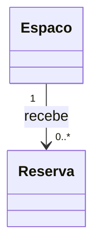

# 🛠️ Preparação do Ambiente

> 💡 **Boa notícia:** este curso não exige instalar nada. Um editor de texto, o Git que você já usa e uma conta no GitHub. Nenhum compilador, nenhum banco, nenhum servidor.

A má notícia — que é a mesma coisa dita de outro jeito: **não existe ferramenta para culpar aqui.** O que você entrega é raciocínio escrito, e ele nasce e morre no editor.

## 1. O repositório de exercícios

É onde tudo que você produzir vai morar. Uma pasta por aula, do primeiro ao último dia.

1. No GitHub, crie um repositório **público** chamado `exercicios-projeto-software`, marcando "Add a README file";
2. Clone na sua máquina:

```bash
git clone https://github.com/SEU-USUARIO/exercicios-projeto-software.git
cd exercicios-projeto-software
```

3. Teste o ciclo completo agora, sem esperar a primeira aula:

```bash
mkdir aula-00-teste
echo "# Teste" > aula-00-teste/README.md
git add .
git commit -m "Testa o ciclo de entrega"
git push
```

Se o arquivo apareceu no GitHub, seu ambiente de entrega está pronto.

> ⚠️ Repositório **público**. Se estiver privado, ninguém consegue revisar o seu trabalho — e revisão por par é metade do curso.

### Como nomear as coisas

Uma pasta por aula, um arquivo por exercício, tudo em `.md`:

```
exercicios-projeto-software/
├── aula-01-por-que-engenharia-de-software/
│   ├── ex01.md
│   ├── ex02.md
│   ├── ex03.md
│   ├── ex04.md
│   └── ex05.md          ← o desafio 🌶️
├── aula-10-casos-de-uso/
│   ├── ex01.md
│   ├── ex05-diagrama.puml
│   ├── ex05-diagrama.svg
│   └── ex05.md
└── README.md
```

Minúsculas, sem espaço, sem acento nos **nomes de arquivo** — o conteúdo pode e deve ter acento. Nome de arquivo com espaço quebra link e dá trabalho na linha de comando pelo resto da vida.

## 2. Editor de texto com preview de Markdown

Qualquer editor serve, mas você vai escrever muito Markdown com diagramas dentro. O [VS Code](https://code.visualstudio.com/) resolve os dois:

- `Cmd/Ctrl + Shift + V` abre o **preview** do Markdown, já com os diagramas Mermaid renderizados;
- Instale a extensão **Markdown Preview Mermaid Support** se o diagrama aparecer como texto cru;
- A extensão **markdownlint** avisa quando o Markdown está torto antes de o GitHub mostrar isso para todo mundo.

Alternativas sem instalar nada: escrever direto no editor web do GitHub (a aba *Preview* mostra o Mermaid renderizado) ou usar [StackEdit](https://stackedit.io/).

## 3. Mermaid — os diagramas do dia a dia

Do Bloco 3 em diante você escreve diagramas quase toda aula. Eles são **texto dentro do `.md`**, e o GitHub renderiza sozinho:

````markdown

````


Se o bloco acima aparece como um diagrama para você aqui nesta página, está tudo certo — é exatamente essa renderização que o professor e os colegas vão ver.

**Onde depurar:** [mermaid.live](https://mermaid.live). Cole o diagrama, veja o erro apontado na hora, corrija, copie de volta. É o lugar certo para brigar com a sintaxe — não no *commit*.

> 💡 Erro que todo mundo comete uma vez: esquecer a palavra `mermaid` depois das três crases. Sem ela o GitHub mostra o código-fonte do diagrama, e a página fica com cara de que você entregou pela metade.

O guia de sintaxe do curso, com um exemplo pronto de cada diagrama, está em [notações UML no repositório](notacoes-uml.md).

## 4. PlantUML (a partir da Aula 10)

Serve para **um único diagrama do curso**: o de casos de uso, que o Mermaid não desenha. Também não precisa instalar:

- **[PlantUML Web Server](https://www.plantuml.com/plantuml/uml/)** — cole o `@startuml…@enduml`, clique em `SVG` e salve o arquivo na pasta da aula;
- **Extensão [PlantUML do VS Code](https://marketplace.visualstudio.com/items?itemName=jebbs.plantuml)** — `Alt+D` abre o preview enquanto você digita; exporta pela paleta de comandos. É o caminho mais confortável se você já usa o VS Code;
- **Linha de comando**, se preferir e já tiver Java: `plantuml -tsvg diagrama.puml`.

**Commite sempre os dois arquivos**, `.puml` e `.svg`: a fonte é o que se edita e se revisa, a imagem é o que aparece na página.

> ⚠️ O `.svg` do PlantUML Web Server sai com um nome genérico. Renomeie antes de commitar, e use o mesmo nome do `.puml`.

## 5. O que você **não** precisa instalar

Vale dizer explicitamente, porque a lista costuma assustar quem chega:

| Não é necessário | Por quê |
|---|---|
| IDE pesada (IntelliJ, Eclipse) | Não escrevemos código neste curso |
| Java, Node, Python | Idem |
| Banco de dados | Idem |
| Ferramenta paga de diagrama (Lucidchart, Visio) | Tudo aqui é texto versionado |
| Astah, StarUML, Enterprise Architect | Bons programas, mas geram binário que não entra em *diff* |

Se você **quiser** rascunhar em ferramenta gráfica — [draw.io](https://app.diagrams.net/) é gratuito e tem estêncil de UML — rascunhe à vontade.

> 📏 **Regra do curso:** rascunhe onde quiser, **entregue em texto**. Imagem não faz *diff*, não recebe comentário de linha no Pull Request e envelhece mal.

## 6. Para o trabalho em dupla

O [trabalho do Bloco 2](../projetos/trabalho-em-dupla.md) acontece via Pull Requests, então vale conferir antes que você lembra do fluxo:

```bash
git checkout -b requisitos-nao-funcionais    # ninguém commita direto no main
# ... escreve ...
git add . && git commit -m "Adiciona requisitos não-funcionais"
git push -u origin requisitos-nao-funcionais
# abre o Pull Request no GitHub e pede revisão
```

Se alguma linha aí em cima causou estranheza, revisite o [Curso de Git e GitHub](https://github.com/jreluiz/curso-git-github) — especialmente branches e Pull Request. É pré-requisito por um motivo.

## ✅ Checklist final

- [ ] Repositório `exercicios-projeto-software` criado, **público** e clonado;
- [ ] Um commit de teste já apareceu no GitHub;
- [ ] Editor com preview de Markdown funcionando;
- [ ] Um diagrama Mermaid de teste renderizou **no GitHub** — copie o da seção 3 e confira na página, não só no editor;
- [ ] [mermaid.live](https://mermaid.live) salvo nos favoritos;
- [ ] [PlantUML Web Server](https://www.plantuml.com/plantuml/uml/) salvo nos favoritos (só será usado na Aula 10);
- [ ] Você consegue criar um branch, abrir um Pull Request e comentar numa linha específica.

---

🏠 [Voltar ao início](../README.md)
