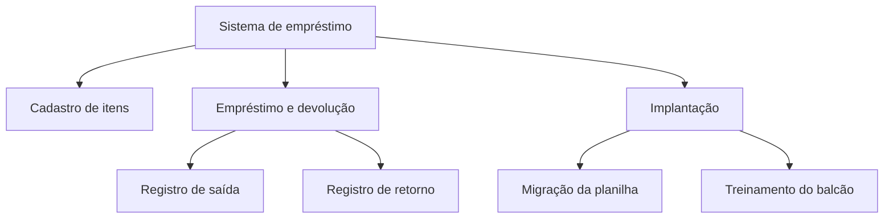
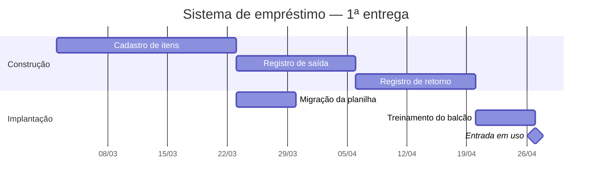
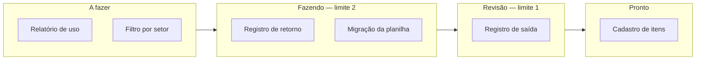

# 📐 Artefatos de Gestão

Os artefatos que o curso pede, com **como se desenha**, **como se lê** e **o erro de quem preenche sem pensar**.

Tudo aqui é tabela Markdown ou [Mermaid](https://mermaid.js.org/) — o GitHub renderiza sozinho, o arquivo versiona e faz *diff* de verdade. **Nada a instalar.**

> 📏 **A regra que vale para os sete:** o artefato é o registro de uma decisão, não a decisão. Uma matriz bem formatada com o conteúdo errado dentro passa em qualquer reunião e não protege ninguém.

---

## 1. Matriz de responsabilidades (RACI)

Cruza **decisões** com **envolvidos**. Aula 01.

| Decisão | Patrocinador | Coordenação | Gerente | Usuário-chave |
|---|:---:|:---:|:---:|:---:|
| Aprovar o orçamento | **A** | C | R | I |
| Definir o escopo da 1ª entrega | I | **A** | R | C |
| Escolher a tecnologia | I | I | **A** | — |
| Aceitar o sistema | C | **A** | R | C |

- **R** *(Responsável)* faz o trabalho — pode ser mais de um;
- **A** *(Aprovador)* responde pela decisão — **exatamente um por linha**;
- **C** *(Consultado)* opina antes, em mão dupla;
- **I** *(Informado)* fica sabendo depois, em mão única;
- **—** não participa. Traço é informação: evita a reunião de dez pessoas em que oito não têm o que fazer.

> ⚠️ **Dois A na mesma linha.** É o defeito mais comum, e parece diplomacia. Quando os dois discordam, a decisão trava — e na prática ninguém responde por ela.

---

## 2. EAP — estrutura analítica do projeto

Decompõe o **resultado** em partes cada vez menores. Aula 03.

- Decompõe-se **entregável**, não atividade: "registro de saída" é resultado, "reunir com o cliente" não;
- **A soma das partes é o todo.** O que não está na EAP não está no projeto — e é por isso que o treinamento precisa aparecer;
- Para quando o pedaço é **estimável e atribuível**. Duas ou três camadas bastam.

> ⚠️ **EAP que virou ciclo de vida.** Se o segundo nível for "levantamento, desenho, construção, testes", você desenhou o processo e não o produto — e perdeu a única pergunta que a EAP responde bem.

---

## 3. Cronograma (Gantt)

Cada folha da EAP vira tarefa com duração, dependência e responsável. Aula 12.

O que se lê num Gantt, nesta ordem: **o marco** (o losango do fim), **a cadeia mais longa** até ele, e **onde há folga**. Tarefa que atrasa fora da cadeia mais longa não move a entrega; tarefa dentro dela move.

> ⚠️ **Gantt bonito de projeto que ninguém replaneja.** Ele é fotografia de uma decisão, e envelhece. Se as barras não mudaram em dois meses, ou o projeto é perfeito ou ninguém está olhando.

---

## 4. Matriz de risco

Posiciona cada risco por **probabilidade × impacto**. Aula 09.

| | Impacto baixo | Impacto médio | Impacto alto |
|---|---|---|---|
| **Prob. alta** | 🟡 monitorar | 🔴 atacar já | 🔴 atacar já |
| **Prob. média** | 🟢 aceitar | 🟡 monitorar | 🔴 atacar já |
| **Prob. baixa** | 🟢 aceitar | 🟢 aceitar | 🟡 monitorar |

E o registro de cada risco, que é onde o trabalho acontece:

| ID | Risco (causa → evento → efeito) | P | I | Resposta | Dono | Gatilho |
|---|---|:---:|:---:|---|---|---|
| R-01 | documentação do ERP desatualizada → integração pode levar o dobro → atraso de 6 semanas | alta | alto | mitigar: mapear a integração no 1º mês | Ana | mapeamento não concluído até 30/03 |
| R-02 | único conhecedor do legado se aposenta → conhecimento se perde → retrabalho | alta | alto | transferir: 4 sessões gravadas com ele | Bruno | agenda não fechada até 15/03 |

> ⚠️ **Risco sem dono e sem gatilho é literatura.** Identificar é fácil e agradável; responsabilizar é desconfortável, e é a parte que faz diferença.

---

## 5. Quadro Kanban

Torna visível o trabalho em andamento e onde ele trava. Aula 12.

O **limite de trabalho em andamento** é o que dá valor ao quadro. Quando "Fazendo" bate o limite, ninguém puxa item novo — ajuda-se a terminar o que já está lá. O desconforto é o ponto: ele torna visível o gargalo que a fila escondia.

> ⚠️ **Quadro sem limite é cemitério.** Catorze cartões em "Fazendo" e nada saindo é o sintoma. Começar é grátis; terminar é caro.

---

## 6. Burndown

Mostra o trabalho que **falta**, contra o tempo. Aula 12.

| Dia | Restante (ideal) | Restante (real) |
|:---:|:---:|:---:|
| 1 | 40 | 40 |
| 3 | 32 | 38 |
| 5 | 24 | 30 |
| 7 | 16 | 26 |
| 9 | 8 | 22 |
| 10 | 0 | 20 |

Lê-se pela **inclinação**, não pelo valor: a linha real desce mais devagar que a ideal desde o dia 3, e no dia 5 já era possível prever que metade não sairia. O gráfico não corrige nada — ele só antecipa a conversa.

> ⚠️ **Burndown que sobe.** Não é erro de desenho: é escopo entrando no meio da iteração. Se sobe toda vez, o problema não está no time.

---

## 7. Termo de abertura e ADR

Os dois são tabelas de duas colunas, e os dois têm **uma linha que costuma faltar e é a mais útil**.

No **termo de abertura** (Aula 03), é a linha **fora do escopo** — porque é ali que nasce o pedido de outubro — e a linha **premissas**, que registra o que se assume sem ter certeza.

No **ADR** (Aula 04), é a linha **alternativas descartadas**. Sem ela, o documento diz o que qualquer um descobre lendo o código; com ela, quem chegar em dois anos sabe **sob quais premissas** aquilo foi decidido.

Os dois fecham com **revisar se**, que diz em que condição a decisão deixa de valer. Sem essa linha, a escolha de março vira dogma em outubro.

---

🏠 [Voltar ao início](../README.md)
