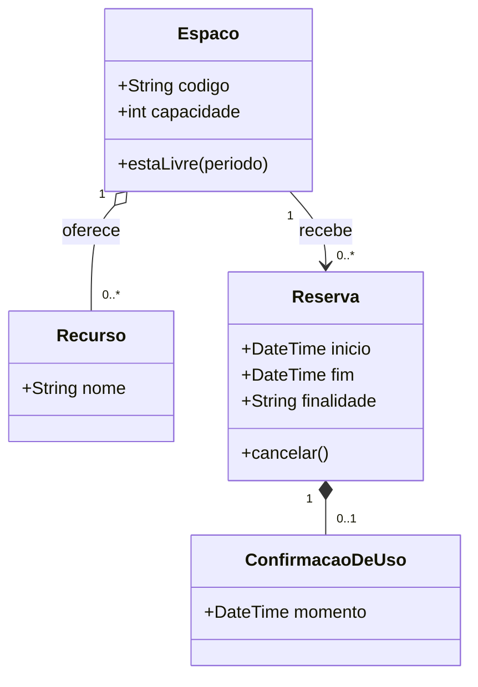
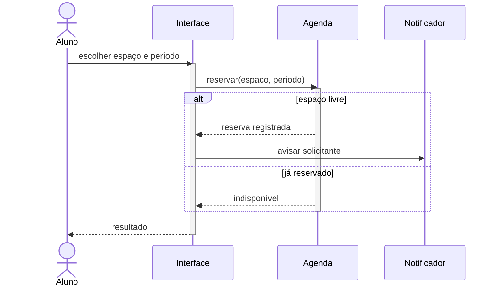
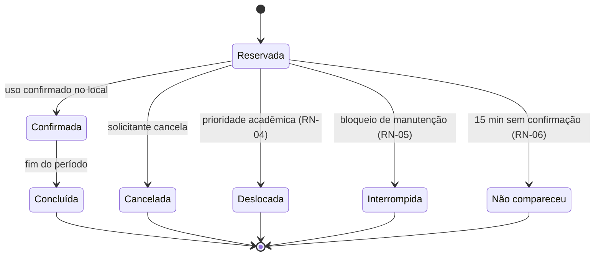
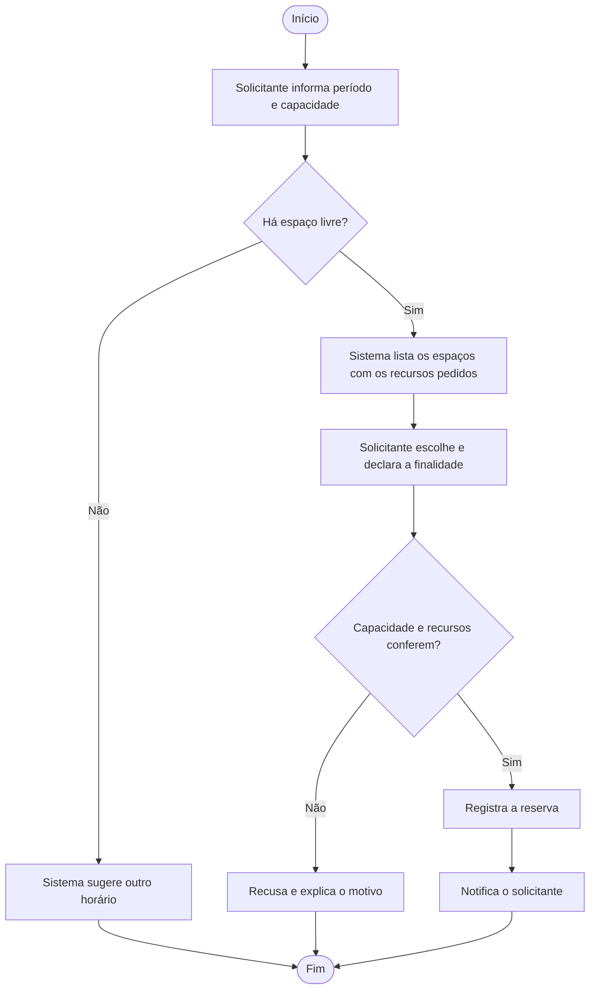
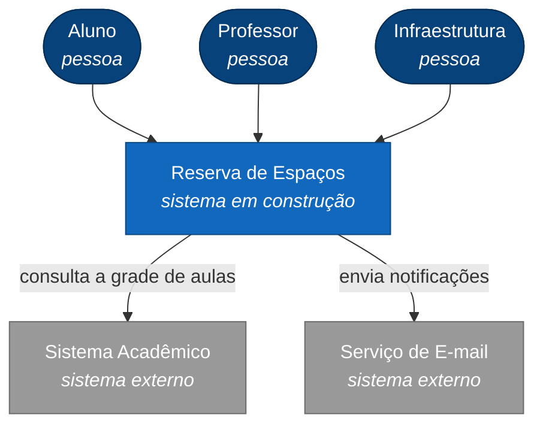
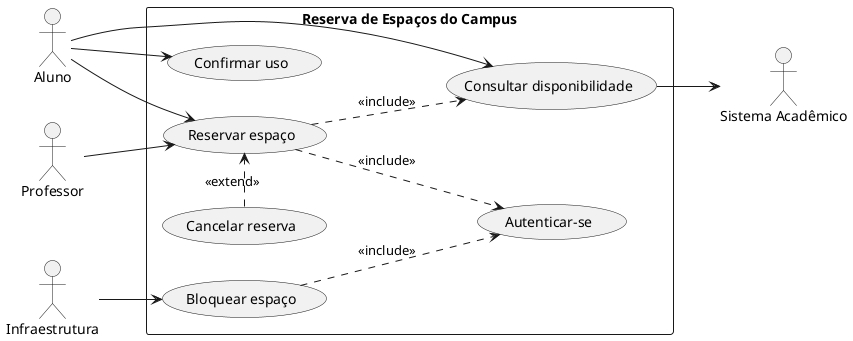
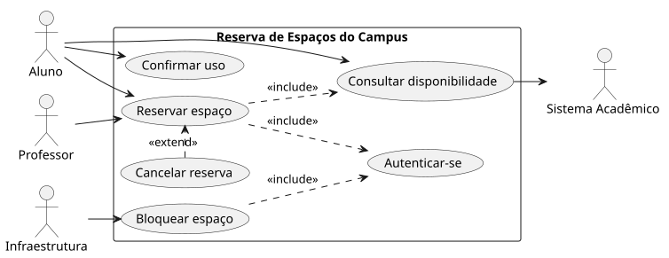

# 📐 Notações UML no repositório

O curso desenha os diagramas **em texto**, não em imagem. Texto entra em *diff*, recebe comentário de linha no Pull Request e envelhece bem; imagem colada num `.md` é um beco sem saída — quem for corrigir precisa reabrir a ferramenta que você usou, se ainda tiver.

São duas ferramentas, e a divisão de trabalho é esta:

| Diagrama | Ferramenta | Renderiza no GitHub |
|---|---|:---:|
| Casos de uso | **PlantUML** → `.svg` commitado | via `.svg` |
| Classes | Mermaid `classDiagram` | ✅ nativo |
| Sequência | Mermaid `sequenceDiagram` | ✅ nativo |
| Estados | Mermaid `stateDiagram-v2` | ✅ nativo |
| Atividades | Mermaid `flowchart` | ✅ nativo |
| Componentes / implantação | Mermaid `flowchart` | ✅ nativo |
| C4 (contexto e contêineres) | Mermaid `flowchart` estilizado | ✅ nativo |

> ⚠️ **Por que casos de uso é a exceção:** o Mermaid simplesmente não tem diagrama de casos de uso. Não é preferência — é ausência de recurso. Nesse único caso escrevemos `.puml`, geramos o `.svg` e commitamos os dois: o `.puml` é a fonte que se edita, o `.svg` é o que aparece na página.

---

## 1. Diagrama de classes

````markdown

````


### Os símbolos

| Relação | Em Mermaid | Lê-se |
|---|---|---|
| Associação | `A --> B` | A conhece B |
| Associação sem direção | `A -- B` | ambos se conhecem |
| Agregação (losango branco) | `A o-- B` | B é parte de A, mas sobrevive sem A |
| Composição (losango preto) | `A *-- B` | B é parte de A e morre com A |
| Herança / generalização | `B --\|> A` | B é um A |
| Realização (implementa interface) | `B ..\|> A` | B implementa A |
| Dependência | `A ..> B` | A usa B momentaneamente |
| Multiplicidade | `A "1" --> "0..*" B` | sempre **entre aspas**, dos dois lados |
| Rótulo da associação | `A --> B : recebe` | o verbo da relação |
| Estereótipo | `<<interface>>` dentro da classe | «interface», «entity», «control» |

Visibilidade é o primeiro caractere do membro: `+` público, `-` privado, `#` protegido, `~` pacote.

---

## 2. Diagrama de sequência

````markdown

````


| Elemento | Em Mermaid |
|---|---|
| Mensagem síncrona (seta cheia) | `A->>B: mensagem` |
| Retorno (seta tracejada) | `B-->>A: resposta` |
| Mensagem assíncrona | `A-)B: mensagem` |
| Ativação (a barra na linha de vida) | `activate B` … `deactivate B` |
| Alternativa (`alt` da UML) | `alt condição` … `else` … `end` |
| Opcional | `opt condição` … `end` |
| Repetição | `loop enquanto…` … `end` |
| Ator (boneco) | `actor Aluno` |
| Nota | `Note over A,B: texto` |

> 💡 Numere as mensagens na ordem em que elas acontecem e confira contra a **especificação do caso de uso**: o diagrama de sequência é o mesmo cenário do fluxo textual, só que dito em mensagens. Se aparecer uma mensagem que não corresponde a nenhum passo do fluxo, um dos dois está errado.

---

## 3. Diagrama de estados

````markdown

````


`[*]` é o estado inicial quando está à esquerda da seta e o final quando está à direita. Para nome de estado com espaço ou acento, dê um apelido: `state "Aguardando confirmação" as aguardando`.

> ⚠️ Diagrama de estados descreve **um objeto**, não o sistema. Se o seu diagrama tem estados de coisas diferentes (a *reserva* **e** o *espaço*), são dois diagramas.

---

## 4. Diagrama de atividades

A UML desenha atividades com losango de decisão e barra de sincronização; o Mermaid faz isso com `flowchart`:

````markdown

````


| Elemento UML | Em Mermaid `flowchart` |
|---|---|
| Nó inicial / final | `inicio([Início])` · `fim([Fim])` |
| Ação | `passo[Texto da ação]` |
| Decisão (losango) | `cond{Pergunta?}` |
| Guarda (a condição na seta) | `cond -->\|Sim\| passo` |
| Raia (*swimlane*) | `subgraph Aluno` … `end` |

> 💡 A **barra de sincronização** (paralelismo) não existe no `flowchart`. Represente com um nó curto — `par[/Em paralelo/]` — e diga em texto o que roda junto. Ferramenta não é desculpa: o que importa é que o leitor entenda o que acontece ao mesmo tempo.

---

## 5. Componentes, implantação e C4

Os três saem de `flowchart` com `subgraph`. Exemplo de **C4 nível 1 (contexto)** do sistema-guia:



> ⚠️ O Mermaid tem um modo `C4Context` experimental. **Não use no repositório** — ele muda de sintaxe entre versões e nem sempre renderiza no GitHub. `flowchart` com `classDef` dá o mesmo resultado e não quebra.

---

## 6. Casos de uso em PlantUML

Este é o único diagrama do curso que não sai em Mermaid. O arquivo fonte:



E o `.svg` gerado a partir dele, que é o que aparece na página:



> Fonte do diagrama: [`casos-de-uso-reserva.puml`](casos-de-uso-reserva.puml)

### Como gerar o `.svg`

Escolha **um** caminho — nenhum exige instalar Java:

1. **[PlantUML Web Server](https://www.plantuml.com/plantuml/uml/)** — cole o código, clique em `SVG`, salve o arquivo;
2. **Extensão PlantUML do VS Code** — `Alt+D` mostra o preview; a paleta de comandos tem `PlantUML: Export Current Diagram`;
3. **Linha de comando**, se você já tiver o PlantUML: `plantuml -tsvg casos-de-uso-reserva.puml`.

### Como commitar

Os dois arquivos, lado a lado:

```
aula-10-casos-de-uso/
├── casos-de-uso-reserva.puml   ← a fonte, é ela que você edita
└── casos-de-uso-reserva.svg    ← o que aparece na página
```

E no `.md`, referencie a imagem e ofereça a fonte:

```markdown


> Fonte do diagrama: [`casos-de-uso-reserva.puml`](casos-de-uso-reserva.puml)
```

> ⚠️ **Editou o `.puml`? Gere o `.svg` de novo.** O erro clássico é o commit em que a fonte mudou e a imagem continua a antiga — e quem revisa comenta a versão errada.

---

## 7. O que a ferramenta não desenha

Toda ferramenta tem limite. A regra do curso é a mesma nos três casos: **desenhe o que dá, escreva o resto em texto logo abaixo.** Um diagrama incompleto com uma nota honesta comunica; um diagrama que finge estar completo, não.

| O que a UML tem | Situação | O que fazer |
|---|---|---|
| Classe associativa | Mermaid não desenha | Vire classe normal com duas associações e diga em nota que ela é associativa |
| Associação n-ária | Mermaid não desenha | Idem: transforme em classe intermediária |
| Atributo derivado (`/idade`) | Mermaid não marca | Escreva `+int idade` e anote *"derivado de dataNascimento"* |
| Barra de sincronização (atividades) | `flowchart` não tem | Nó `[/Em paralelo/]` + nota |
| Raias com muitos atores | `subgraph` fica confuso acima de 3 | Quebre em diagramas menores por ator |
| Casos de uso | Mermaid não tem | PlantUML, conforme a seção 6 |

---

## 8. O livro desenha diferente da ferramenta

O Bezerra usa a notação UML canônica; as ferramentas fazem pequenas concessões. Nenhuma delas é erro — só não se assuste na hora de comparar:

| Ponto | No livro (UML canônica) | No Mermaid |
|---|---|---|
| Atributo com tipo | `nome: String` | `+String nome` — **o tipo vem antes** |
| Operação com retorno | `calcularTotal(): double` | `+calcularTotal() double` |
| Multiplicidade `*` | `*` sozinho é aceito | escreva `"0..*"`, entre aspas |
| Estereótipos de análise | «entity», «boundary», «control» | `<<entity>>` dentro do bloco da classe |
| Nome de classe abstrata | em *itálico* | use o estereótipo `<<abstract>>` |
| Ator no diagrama de sequência | boneco palito | `actor Nome` — o resto é `participant` |

> 📖 Quando o livro e a ferramenta discordarem no detalhe gráfico, **vale o livro** — a ferramenta é meio, não fonte. O que nunca muda é o significado: losango preto é composição em qualquer desenho do mundo.

---

## ✅ Antes de commitar um diagrama

- [ ] O bloco abre com ` ```mermaid ` e o diagrama **renderizou no GitHub** (confira na página, não só no editor);
- [ ] Todas as multiplicidades estão nos **dois lados** da associação;
- [ ] Cada associação foi lida em voz alta como frase, e a frase é verdade;
- [ ] Nada essencial ficou só na cabeça: o que a ferramenta não desenhou está escrito em texto;
- [ ] Se é `.puml`, o `.svg` correspondente foi regerado e commitado junto;
- [ ] O diagrama vem acompanhado da **justificativa por escrito** — o que você decidiu e o que descartou.

---

🏠 [Voltar ao início](../README.md)
