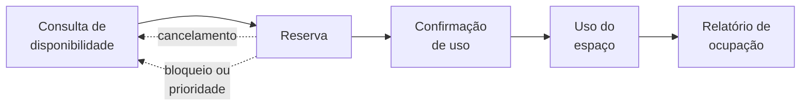

# 🧭 Sistema-guia — Reserva de Espaços do Campus

Um único sistema atravessa as 16 aulas. Toda vez que uma aula precisar de um exemplo concreto — um requisito para classificar, um caso de uso para especificar, uma classe para desenhar, uma decisão de arquitetura para registrar — ela vem daqui.

**Este é o documento que o cliente entregaria a você.** São duas páginas, e você vai voltar a elas em quase todas as aulas.

> ⚠️ **O que este documento não é.** Ele não é o documento de requisitos: não tem requisito numerado, não tem caso de uso especificado e não tem nenhum diagrama do sistema. Tudo isso é o que **você** vai produzir ao longo do curso. Aqui está o que existe antes: o contexto, as pessoas, o vocabulário, o fluxo e as regras que valem mesmo que nenhum software seja construído.

---

## 1. O problema

O campus tem laboratórios de informática, salas de estudo em grupo e um auditório. Todos são disputados, e a reserva hoje funciona assim: manda-se um e-mail para a secretaria, que confere numa planilha e responde — quando responde.

O que dá errado, e dá errado todo semestre:

- **Duas turmas na mesma sala.** Já aconteceu três vezes este ano: a planilha tinha a reserva, o e-mail de confirmação não saiu;
- **Sala vazia com fila na porta.** Alguém reservou, não usou, não avisou. Do lado de fora, um grupo sem lugar para estudar;
- **A manutenção não consegue entrar.** O conserto do projetor fica para "quando a sala estiver livre", e ela nunca está;
- **Ninguém sabe o que é usado.** A coordenação quer construir mais um laboratório e não consegue provar que precisa — nem que não precisa.

A instituição quer uma plataforma que resolva isso.

## 2. Escopo

**Está dentro:** consultar espaços e horários livres, reservar, cancelar, confirmar o uso no local, bloquear espaço para manutenção e os relatórios de ocupação.

**Está fora, e a decisão já foi tomada:**

| Fora do escopo | Por quê |
|---|---|
| Cadastro de pessoas e a grade das aulas regulares | Já existem no **Sistema Acadêmico**; a plataforma consulta, não duplica |
| Abertura física da porta (catraca, fechadura eletrônica) | É outro sistema, de outro fornecedor |
| A manutenção em si (ordem de serviço, peças) | À plataforma interessa só o **bloqueio** do espaço, não o conserto |
| Empréstimo de equipamento avulso (projetor, notebook) | É o almoxarifado, com regras próprias |

> 💡 Repare que a coluna da direita existe. Dizer *"está fora do escopo"* sem dizer por que é como não ter decidido nada: na primeira reunião tensa, alguém reabre.

## 3. Quem são os interessados

| Interessado | O que ele quer | O que ele teme |
|---|---|---|
| **Aluno** | Achar uma sala livre agora e reservar em três toques, do celular | Reservar, atravessar o campus e encontrar a sala ocupada |
| **Professor** | Garantia de espaço para aula extra e banca | Perder a sala para uma reserva de estudo feita antes da dele |
| **Secretaria** | Parar de mediar reserva por e-mail | Virar suporte de mais um sistema |
| **Infraestrutura** | Bloquear o espaço para consertar, inclusive em cima de reserva confirmada | Não conseguir entrar, e o problema piorar |

E a **coordenação**, que provavelmente nunca vai abrir a plataforma: ela quer o relatório de ocupação para decidir sobre o novo laboratório.

> ⚠️ **Nem todo interessado é usuário.** A coordenação não clica em nada e mesmo assim impõe um requisito que muda o sistema. Se você listou só quem usa, não terminou o levantamento.

## 4. Onde os interesses se chocam

É aqui que mora o trabalho. Um sistema que atende todo mundo igualmente bem normalmente é um sistema em que ninguém pensou de verdade.

| Tensão | De um lado | Do outro |
|---|---|---|
| **Prioridade × ordem de chegada** | O professor precisa da sala para uma banca marcada ontem | O grupo de alunos reservou há duas semanas e se organizou em torno disso |
| **Manutenção × reserva confirmada** | A infraestrutura precisa entrar hoje | Alguém vai chegar e encontrar a sala interditada |
| **Reservar fácil × sala vazia** | Atrito baixo é o que faz as pessoas usarem o sistema | Quanto mais fácil reservar, mais gente reserva "por garantia" e não aparece |

> 📏 Cada tensão desta tabela vira, mais adiante, **uma decisão de projeto registrada por escrito**. Nenhuma delas se resolve escolhendo um lado e esquecendo o outro.

## 5. Vocabulário do domínio

Estes termos significam exatamente isto no curso inteiro.

| Termo | Significa |
|---|---|
| **Espaço** | O lugar reservável: um laboratório, uma sala de estudo, o auditório. Tem capacidade e recursos |
| **Recurso** | O que o espaço oferece: projetor, computadores, quadro, acessibilidade |
| **Reserva** | **Uma ocorrência concreta**: um espaço, um período contínuo, um solicitante e uma finalidade |
| **Finalidade** | Para que a reserva foi feita: aula extra, banca, estudo em grupo, evento. É o que decide prioridade |
| **Bloqueio** | Indisponibilidade do espaço por manutenção ou decisão institucional. **Não é uma reserva** |
| **Confirmação de uso** | O registro, no local e na hora, de que a reserva foi mesmo usada |
| **Solicitante** | Quem pede a reserva. É papel, não pessoa: o mesmo professor é solicitante hoje e coordenador amanhã |

> ⚠️ **Reserva × Confirmação de uso** é a distinção que mais gera erro neste domínio. Reservar é uma intenção declarada com antecedência; usar é um fato que aconteceu. Tratá-las como a mesma coisa apaga o problema da sala vazia — que é justamente um dos motivos de o sistema existir.

## 6. O fluxo do negócio

1. **Consulta** — o solicitante procura um espaço livre no período que precisa, filtrando por capacidade e recursos;
2. **Reserva** — escolhe o espaço e declara a finalidade;
3. **Confirmação de uso** — no dia, no local, alguém confirma que a reserva está sendo usada;
4. **Uso** — acontece;
5. **Relatório** — a coordenação vê o que foi reservado, o que foi usado e o que ficou ocioso.

As duas setas pontilhadas são o que torna o domínio interessante: uma reserva pode **cair** antes de acontecer — por cancelamento do solicitante, por bloqueio de manutenção ou por uma reserva de prioridade maior.

> 💡 As caixas acima são o **processo de negócio**, não o sistema. Ele já existe hoje, em e-mail e planilha. Descobrir quais etapas vale a pena automatizar — e quais não — é parte do trabalho, não um pressuposto.

## 7. Regras de negócio

Regra de negócio é o que é verdade no domínio **mesmo que nenhum sistema seja construído**. Elas vêm da norma de uso dos espaços. Nenhum diagrama expressa isso sozinho: precisam estar escritas.

| ID | Regra |
|---|---|
| **RN-01** | Toda reserva é de **um espaço**, por um **período contínuo**, com **finalidade declarada** |
| **RN-02** | A antecedência é de **no mínimo 1 hora** e **no máximo 30 dias** |
| **RN-03** | Um aluno pode ter no máximo **2 reservas futuras** ao mesmo tempo. Professor e setor não têm limite |
| **RN-04** | Finalidade acadêmica (**aula extra** e **banca**) tem prioridade sobre estudo em grupo: pode tomar o horário **até 24 horas antes**, e o solicitante deslocado é notificado |
| **RN-05** | **Bloqueio de manutenção prevalece sobre qualquer reserva**, a qualquer momento. As reservas atingidas são canceladas e notificadas |
| **RN-06** | A reserva precisa ser **confirmada no local em até 15 minutos** após o início. Passado isso, o espaço é liberado para quem chegar |
| **RN-07** | **Duas reservas não confirmadas em 30 dias** suspendem o direito de reservar por 15 dias |
| **RN-08** | Não se reserva espaço para **mais pessoas que a capacidade**, nem sem os **recursos que a finalidade exige** |

> ⚠️ Leia **RN-04** e **RN-06** juntas e note o que elas fazem: as duas tratam de horário perdido, e cada uma protege uma pessoa diferente. É esse tipo de par que separa quem leu o documento de quem passou o olho.

## 8. Contexto de uso e restrições

Nada disto foi pedido pelo cliente — cliente pede funcionalidade. Tudo isto é **observado**, e é daqui que saem os requisitos que ninguém escreve e todo mundo cobra depois.

- **Sazonalidade.** O uso é morno quase o tempo todo e explode na semana de provas e na véspera das entregas de trabalho;
- **É celular, e em movimento.** A maior parte dos acessos vem de telefone, muitas vezes de alguém andando pelo campus atrás de uma sala, na rede sem fio que oscila;
- **Acessibilidade em dois sentidos.** Há espaços acessíveis, e eles precisam ser **encontráveis**; e há usuários que navegam por leitor de tela;
- **O Sistema Acadêmico é legado.** É dele que vem a grade das aulas regulares — sem isso a plataforma ofereceria salas ocupadas. Ele responde devagar e sai do ar sem avisar;
- **A TI é pequena.** Três pessoas cuidam de tudo. O que exigir operação diária especializada não se sustenta;
- **O calendário letivo manda.** Período, recesso e feriado mudam o que "livre" significa, e mudam todo ano.

## 9. O que está em aberto

Estas perguntas **não têm resposta aqui**, e isso é de propósito. Todo pedido de cliente chega assim. As aulas vão fechar algumas — e o que se espera de você não é adivinhar a resposta "certa", é **escolher uma e escrever por quê**.

1. Reserva **recorrente** ("toda terça, o semestre inteiro") existe, ou são muitas reservas separadas?
2. Quem pode declarar a finalidade **"aula extra"** — só professor, ou o aluno em nome dele?
3. Quando a manutenção derruba uma reserva, o sistema deve **sugerir outro espaço** automaticamente?
4. A reserva conta como não confirmada se o grupo chegou, usou a sala e ninguém confirmou pelo celular?
5. Um aluno pode reservar **sozinho** uma sala de estudo em grupo?

> 📏 Um documento honesto tem uma seção como esta. A alternativa — inventar a resposta e não avisar ninguém — é como a maioria dos sistemas errados começa: com uma suposição que virou verdade porque ninguém a escreveu para poder discordar.

## 10. Onde cada aula usa este documento

| Aula | O que ela tira daqui |
|:---:|---|
| 01 | O contraste entre a planilha que "funciona" e um produto que a instituição mantém por anos |
| 02 | O calendário letivo e a sazonalidade como argumento para escolher o modelo de processo |
| 03 | O que vale entregar primeiro: consultar disponibilidade antes de reservar |
| 04 | A janela de implantação — não se sobe versão nova na semana de provas |
| 05 | Interessados (seção 3), conflitos (seção 4) e o contexto da seção 8, de onde saem os não-funcionais |
| 06 | O problema (seção 1) como material de entrevista; as questões em aberto (seção 9) como roteiro |
| 07 | O vocabulário (seção 5) como glossário pronto e as regras da seção 7 como critérios de aceite |
| 08 | As tensões da seção 4 para priorizar, e as questões em aberto para praticar validação |
| 09 | A decisão de **o que** modelar deste domínio — e o que deliberadamente não modelar |
| 10 | O fluxo (seção 6) vira casos de uso; RN-04, RN-05 e RN-06 viram fluxos alternativos e de exceção |
| 11 | O vocabulário (seção 5) vira classes; **Reserva × Confirmação de uso** é o caso central |
| 12 | O ciclo de vida da reserva, a partir das seções 6 e 7 |
| 13 | Coesão e acoplamento entre o módulo de agenda e o de notificação |
| 14 | A integração com o Sistema Acadêmico legado (seção 8) como decisão de arquitetura e primeiro ADR |
| 15 | A regra de prioridade (RN-04) e a notificação de reserva deslocada como problemas de padrão |
| 16 | A dívida técnica da integração legada e o que fazer quando a norma de uso dos espaços mudar |

---

🏠 [Voltar ao início](../README.md)
